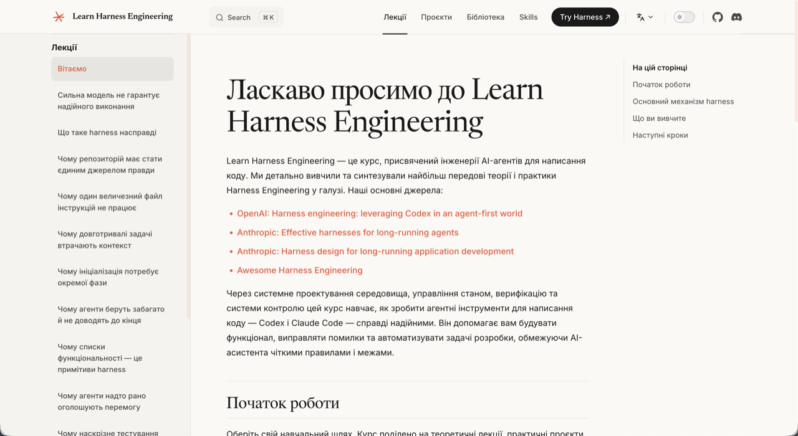
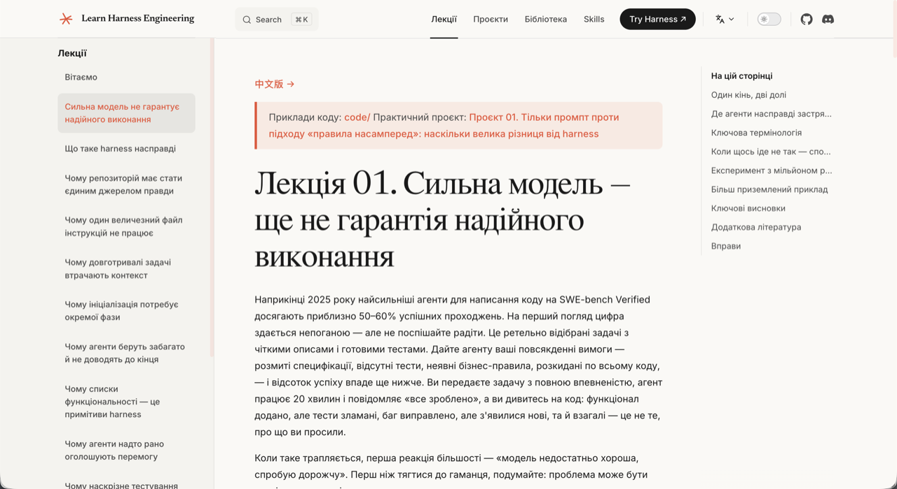
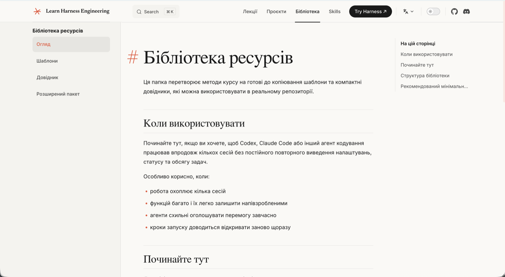

<p align="center">
  <a href="../../README.md"></a>
  <a href="../zh-CN/README.md"></a>
  <a href="../zh-TW/README.md"></a>
  <a href="../ja-JP/README.md"></a>
  <a href="../ko-KR/README.md"></a>
  <a href="../es-ES/README.md"></a>
  <a href="../fr-FR/README.md"></a>
  <a href="../ru-RU/README.md"></a>
  <a href="../de-DE/README.md"></a>
  <a href="../ar-SA/README.md"></a>
  <a href="../vi-VN/README.md"></a>
  <a href="../uz-UZ/README.md"></a>
  <a href="../tr-TR/README.md"></a>
  <a href="../pt-BR/README.md"></a>
  <a href="../uk-UA/README.md"></a>
</p>

<h1 align="center">Learn Harness Engineering</h1>

<p align="center"><strong>Практичний курс із побудови середовища, управління станом, верифікації та механізмів контролю, які забезпечують надійну роботу AI-агентів для написання коду.</strong></p>

<p align="center">
  
  
  
  
  <a href="https://discord.gg/XU7DQmpqk"></a>
</p>

> 🌍 Цей курс доступний **15 мовами**: English, 简体中文, 繁體中文, 日本語, 한국어, Español, Français, Русский, Deutsch, العربية, Tiếng Việt, Oʻzbekcha, Türkçe, Portuguese (BR), Українська. Оберіть свою мову за допомогою значків вище.

Learn Harness Engineering — курс, присвячений інженерії AI-агентів для написання коду. Ми ретельно вивчили та синтезували найбільш передові теорії та практики Harness Engineering в індустрії. Основні джерела:

- [OpenAI: Harness engineering: leveraging Codex in an agent-first world](https://openai.com/index/harness-engineering/)
- [Anthropic: Effective harnesses for long-running agents](https://www.anthropic.com/engineering/effective-harnesses-for-long-running-agents)
- [Anthropic: Harness design for long-running application development](https://www.anthropic.com/engineering/harness-design-long-running-apps)
- [Awesome Harness Engineering](https://github.com/walkinglabs/awesome-harness-engineering)

> **Швидкий старт?** Навичка [`skills/harness-creator/`](./skills/harness-creator/) допоможе вам за лічені хвилини підготувати harness виробничого рівня (AGENTS.md, списки функцій, init.sh, процеси верифікації) для вашого власного проєкту.

---

## Зміст

- [✨ Візуальний огляд](#-візуальний-огляд)
- [Що насправді означає Harness Engineering](#що-насправді-означає-harness-engineering)
- [Швидкий старт: покращте свого агента вже сьогодні](#швидкий-старт-покращте-свого-агента-вже-сьогодні)
- [Підсумковий проєкт: реальний застосунок](#підсумковий-проєкт-реальний-застосунок)
- [Навчальний маршрут](#навчальний-маршрут)
- [Навчальна програма](#навчальна-програма)
- [Навички](#навички)
- [Інші курси](#інші-курси)

---

## ✨ Візуальний огляд

### 🏠 Головна сторінка курсу
> Вичерпна структура курсу та вступ до основних концепцій із чітким шляхом для початку навчання.



### 📖 Занурювальні лекції
> Глибокий аналіз реальних проблем і практичні проєкти (наприклад, Project 01) для занурювального навчального досвіду.



### 🗂️ Готова до використання бібліотека ресурсів
> Шаблони та референсні конфігурації для вирішення поширених проблем у розробці з багатоходовими AI-агентами, таких як втрата контексту та передчасне завершення завдань.



## PDF-підручники курсу

Репозиторій тепер включає конвеєр збирання PDF для матеріалів курсу.

- Запустіть `npm run pdf:build`, щоб локально згенерувати поточно налаштовані PDF-підручники.
- Вихідні файли записуються до `artifacts/pdfs/`.
- Запустіть `npm run screenshots:readme`, якщо потрібно оновити зображення попереднього перегляду README.
- Робочий процес GitHub Actions [`release-course-pdfs.yml`](./.github/workflows/release-course-pdfs.yml) може збирати PDF та публікувати їх у GitHub Releases.

---

## Модель розумна — harness робить її надійною

Є одна сувора правда, яку більшість людей засвоює на власному досвіді: **навіть найпотужніша модель у світі провалить реальні інженерні завдання, якщо навколо неї не побудовано належне середовище.**

Ви, мабуть, і самі це спостерігали. Ви даєте Claude або GPT завдання у своєму репозиторії. Спочатку все йде добре — агент читає файли, пише код, виглядає продуктивно. Потім щось іде не так. Він пропускає крок. Ламає тест. Каже «готово», але нічого насправді не працює. Ви витрачаєте більше часу на виправлення, ніж якби зробили все самостійно.

Це не проблема моделі. Це проблема harness.

Докази очевидні. Anthropic провів контрольований експеримент: та сама модель (Opus 4.5), той самий промпт («побудуй 2D-редактор ретро-ігор»). Без harness агент витратив $9 за 20 хвилин і отримав результат, який не працював. З повноцінним harness (планувальник + генератор + оцінювач) агент витратив $200 за 6 годин і збудував гру, в яку справді можна було грати. Модель не змінилася. Змінився harness.

OpenAI повідомив про те саме з Codex: у добре оснащеному harness репозиторії та сама модель переходить від «ненадійна» до «надійна». Не маргінальне поліпшення — якісний стрибок.

**Цей курс вчить вас будувати таке середовище.**

```text
                    THE HARNESS PATTERN
                    ====================

    You --> give task --> Agent reads harness files --> Agent executes
                                                        |
                                              harness governs every step:
                                              |
                                              +--> Instructions: what to do, in what order
                                              +--> Scope:        one feature at a time, no overreach
                                              +--> State:        progress log, feature list, git history
                                              +--> Verification: tests, lint, type-check, smoke runs
                                              +--> Lifecycle:    init at start, clean state at end
                                              |
                                              v
                                         Agent stops only when
                                         verification passes
```

---

## Що насправді означає Harness Engineering

Harness Engineering — це побудова повноцінного робочого середовища навколо моделі, щоб вона давала надійні результати. Мова йде не про написання кращих промптів. Мова йде про проєктування системи, всередині якої функціонує модель.

Harness складається з п'яти підсистем:

```text
    ┌────────────────────────────────────────────────────────────────┐
    │                          THE HARNESS                           │
    │                                                                │
    │   ┌──────────────┐  ┌──────────────┐  ┌────────────────────┐   │
    │   │ Instructions │  │    State     │  │   Verification     │   │
    │   │              │  │              │  │                    │   │
    │   │ AGENTS.md    │  │ progress.md  │  │ tests + lint       │   │
    │   │ CLAUDE.md    │  │ feature_list │  │ type-check         │   │
    │   │ feature_list │  │ git log      │  │ smoke runs         │   │
    │   │ docs/        │  │ session hand │  │ e2e pipeline       │   │
    │   └──────────────┘  └──────────────┘  └────────────────────┘   │
    │                                                                │
    │   ┌──────────────┐  ┌──────────────────────────────────────┐   │
    │   │    Scope     │  │         Session Lifecycle            │   │
    │   │              │  │                                      │   │
    │   │ one feature  │  │ init.sh at start                     │   │
    │   │ at a time    │  │ clean-state checklist at end         │   │
    │   │ definition   │  │ handoff note for next session        │   │
    │   │ of done      │  │ commit only when safe to resume      │   │
    │   └──────────────┘  └──────────────────────────────────────┘   │
    │                                                                │
    └────────────────────────────────────────────────────────────────┘

    The MODEL decides what code to write.
    The HARNESS governs when, where, and how it writes it.
    The harness doesn't make the model smarter.
    It makes the model's output reliable.
```

Кожна підсистема виконує одне завдання:

- **Інструкції** — Повідомляють агенту, що робити, в якому порядку та що прочитати перед початком. Не один гігантський файл, а структура прогресивного розкриття інформації, якою агент навігує за потребою.
- **Стан** — Відстежує, що зроблено, що в процесі та що далі. Зберігається на диску, щоб наступна сесія підхоплювала роботу рівно звідти, де закінчила попередня.
- **Верифікація** — Лише успішно виконаний набір тестів є доказом. Агент не може оголосити перемогу без виконуваного підтвердження.
- **Обсяг** — Обмежує агента однією функцією за раз. Без виходу за межі. Без незакінченого виконання трьох речей одночасно. Без переписування списку функцій, щоб приховати незавершену роботу.
- **Життєвий цикл сесії** — Ініціалізувати на початку. Прибрати наприкінці. Залишити чистий шлях перезапуску для наступної сесії.

---

## Навіщо існує цей курс

Питання не в тому, «чи можуть моделі писати код?». Можуть. Питання таке: **чи можуть вони надійно виконувати реальні інженерні завдання всередині реальних репозиторіїв, протягом кількох сесій, без постійного контролю з боку людини?**

Наразі відповідь: ні, якщо немає harness.

```text
    WITHOUT HARNESS                            WITH HARNESS
    ==============                             ============

    Session 1: agent writes code               Session 1: agent reads instructions
               agent breaks tests                         agent runs init.sh
               agent says "done"                          agent works on one feature
               you fix it manually                        agent verifies before claiming done
                                                          agent updates progress log
    Session 2: agent starts fresh                         agent commits clean state
               agent has no memory
               of what happened before         Session 2: agent reads progress log
               agent re-does work                         agent picks up exactly where it left off
               or does something else entirely            agent continues the unfinished feature
               you fix it again                           you review, not rescue

    Result: you spend more time                Result: agent does the work,
            cleaning up than if you                    you verify the result
            did it yourself
```

Питання, яким насправді переймається цей курс:

- Які конструкції harness підвищують рівень виконання завдань?
- Які конструкції зменшують обсяг повторної роботи та некоректних завершень?
- Які механізми підтримують стабільний прогрес у тривалих завданнях?
- Які структури забезпечують підтримуваність системи після кількох запусків агента?

---

## Навчальна програма та документація

Повні матеріали курсу доступні на **[вебсайті документації](https://walkinglabs.github.io/learn-harness-engineering/)**.

Навчальна програма розділена на три частини:

1. **Лекції**: 12 концептуальних модулів, що пояснюють теорію Harness Engineering.
2. **Проєкти**: 6 практичних проєктів, у яких ви будуєте агентне робоче середовище з нуля.
3. **Бібліотека ресурсів**: Готові до копіювання шаблони (`AGENTS.md`, `feature_list.json`, `init.sh` тощо) для використання у ваших репозиторіях вже сьогодні.

---

## Швидкий старт: покращте свого агента вже сьогодні

Не потрібно прочитати всі 12 лекцій, перш ніж отримати користь. Якщо ви вже використовуєте агент для написання коду у реальному проєкті, ось як покращити його прямо зараз.

Ідея проста: замість того щоб просто писати промпти, надайте своєму агенту набір структурованих файлів, які визначають що робити, що вже зроблено та як верифікувати роботу. Ці файли зберігаються у вашому репозиторії, тому кожна сесія починається з одного й того самого стану.

```text
    YOUR PROJECT ROOT
    ├── AGENTS.md              <-- the agent's operating manual
    ├── CLAUDE.md              <-- (alternative, if using Claude Code)
    ├── init.sh                <-- runs install + verify + start
    ├── feature_list.json      <-- what features exist, which are done
    ├── claude-progress.md     <-- what happened each session
    └── src/                   <-- your actual code
```

Візьміть стартові шаблони з [Бібліотеки ресурсів](https://walkinglabs.github.io/learn-harness-engineering/en/resources/) та додайте їх до свого проєкту. Ось і все. Чотири файли — і ваші сесії з агентом стануть значно стабільнішими, ніж при роботі лише з промптами.

---

## Підсумковий проєкт: реальний застосунок

Усі шість проєктів курсу обертаються навколо одного продукту: **настільного застосунку персональної бази знань на основі Electron**.

```text
    ┌──────────────────────────────────────────────────────┐
    │             Knowledge Base Desktop App               │
    │                                                      │
    │  ┌──────────────┐  ┌──────────────────────────────┐  │
    │  │ Document List│  │       Q&A Panel              │  │
    │  │              │  │                              │  │
    │  │ doc-001.md   │  │  Q: What is harness eng?     │  │
    │  │ doc-002.md   │  │  A: The environment built    │  │
    │  │ doc-003.md   │  │     around an agent model... │  │
    │  │ ...          │  │     [citation: doc-002.md]   │  │
    │  └──────────────┘  └──────────────────────────────┘  │
    │                                                      │
    │  ┌─────────────────────────────────────────────────┐ │
    │  │ Status Bar: 42 docs | 38 indexed | last sync 3m │ │
    │  └─────────────────────────────────────────────────┘ │
    └──────────────────────────────────────────────────────┘

    Core features:
    ├── Import local documents
    ├── Manage a document library
    ├── Process and index documents
    ├── Run AI-powered Q&A over imported content
    └── Return grounded answers with citations
```

Цей проєкт обрано тому, що він поєднує сильну практичну цінність, достатньо реальної продуктової складності та є хорошим середовищем для спостереження покращень harness до і після.

Стартова/фінальна версія кожного проєкту курсу — це повна копія цього Electron-застосунку на відповідній стадії розвитку. Стартова точка P(N+1) похідна від рішення P(N) — застосунок еволюціонує разом із зростанням ваших навичок Harness Engineering.

---

## Навчальний маршрут

Курс спроєктовано для проходження по порядку. Кожна фаза спирається на попередню.

```text
    Phase 1: SEE THE PROBLEM              Phase 2: STRUCTURE THE REPO
    ========================              ==========================

    L01  Strong models ≠ reliable         L03  Repository as single
         execution                              source of truth
    L02  What harness actually means
                                          L04  Split instructions across
         |                                     files, not one giant file
         v
    P01  Prompt-only vs.                       |
         rules-first comparison                v
                                               P02  Agent-readable workspace


    Phase 3: CONNECT SESSIONS             Phase 4: FEEDBACK & SCOPE
    ==========================            =========================

    L05  Keep context alive               L07  Draw clear task boundaries
         across sessions
                                          L08  Feature lists as harness
    L06  Initialize before every               primitives
         agent session
                                               |
         |                                     v
         v                                     P04  Runtime feedback to
    P03  Multi-session continuity                   correct agent behavior


    Phase 5: VERIFICATION                 Phase 6: PUT IT ALL TOGETHER
    =====================                 ============================

    L09  Stop agents from                 L11  Make agent's runtime
         declaring victory early               observable

    L10  Full-pipeline run =              L12  Clean handoff at end of
         real verification                      every session

         |                                     |
         v                                     v
    P05  Agent verifies its own work      P06  Build a complete harness
                                               (capstone project)
```

Кожна фаза займає приблизно тиждень при навчанні неповний робочий день. Якщо ви хочете просуватися швидше, фази 1–3 можна пройти за довгий вихідний.

---

## Навчальна програма

### Лекції — 12 концептуальних модулів, кожен відповідає на одне ключове питання

*Повний текст кожної лекції читайте на [вебсайті документації](https://walkinglabs.github.io/learn-harness-engineering/).*

| Сесія | Питання | Основна ідея |
|-------|---------|--------------|
| [L01](./docs/en/lectures/lecture-01-why-capable-agents-still-fail/index.md) | Чому потужні моделі все одно провалюються на реальних завданнях? | Розрив між можливостями на бенчмарках і реальною інженерією |
| [L02](./docs/en/lectures/lecture-02-what-a-harness-actually-is/index.md) | Що насправді означає «harness»? | П'ять підсистем: інструкції, стан, верифікація, обсяг, життєвий цикл |
| [L03](./docs/en/lectures/lecture-03-why-the-repository-must-become-the-system-of-record/index.md) | Чому репозиторій має бути єдиним джерелом правди? | Якщо агент не може це побачити — цього не існує |
| [L04](./docs/en/lectures/lecture-04-why-one-giant-instruction-file-fails/index.md) | Чому один гігантський файл інструкцій не працює? | Прогресивне розкриття: дайте карту, а не енциклопедію |
| [L05](./docs/en/lectures/lecture-05-why-long-running-tasks-lose-continuity/index.md) | Чому тривалі завдання втрачають безперервність? | Зберігайте прогрес на диску; продовжуйте з того місця, де зупинились |
| [L06](./docs/en/lectures/lecture-06-why-initialization-needs-its-own-phase/index.md) | Чому ініціалізація потребує окремої фази? | Перевіряйте справність середовища перед початком роботи агента |
| [L07](./docs/en/lectures/lecture-07-why-agents-overreach-and-under-finish/index.md) | Чому агенти виходять за рамки та не доводять справу до кінця? | Одна функція за раз; явне визначення критерію завершення |
| [L08](./docs/en/lectures/lecture-08-why-feature-lists-are-harness-primitives/index.md) | Чому списки функцій є примітивами harness? | Машиночитабельні межі обсягу, які агент не може ігнорувати |
| [L09](./docs/en/lectures/lecture-09-why-agents-declare-victory-too-early/index.md) | Чому агенти передчасно оголошують перемогу? | Прогалини у верифікації: впевненість ≠ коректність |
| [L10](./docs/en/lectures/lecture-10-why-end-to-end-testing-changes-results/index.md) | Чому наскрізне тестування змінює результати? | Лише повний запуск конвеєру вважається реальною верифікацією |
| [L11](./docs/en/lectures/lecture-11-why-observability-belongs-inside-the-harness/index.md) | Чому спостережуваність має бути всередині harness? | Якщо ви не бачите, що зробив агент, ви не можете виправити те, що він зламав |
| [L12](./docs/en/lectures/lecture-12-why-every-session-must-leave-a-clean-state/index.md) | Чому кожна сесія має залишати чистий стан? | Успіх наступної сесії залежить від прибирання в поточній |

### Проєкти — 6 практичних проєктів із застосуванням методів лекцій на тому самому Electron-застосунку

| Проєкт | Що ви робите | Механізм harness |
|--------|-------------|-----------------|
| [P01](./docs/en/projects/project-01-baseline-vs-minimal-harness/index.md) | Виконайте одне й те саме завдання двічі: лише промпт vs. правила на першому місці | Мінімальний harness: AGENTS.md + init.sh + feature_list.json |
| [P02](./docs/en/projects/project-02-agent-readable-workspace/index.md) | Реструктуруйте репозиторій так, щоб агент міг його читати | Агентне робоче середовище + постійні файли стану |
| [P03](./docs/en/projects/project-03-multi-session-continuity/index.md) | Змусьте агента продовжувати з того місця, де він зупинився | Журнал прогресу + передача між сесіями + безперервність кількох сесій |
| [P04](./docs/en/projects/project-04-incremental-indexing/index.md) | Зупиніть агента від надмірної або недостатньої роботи | Runtime-зворотний зв'язок + контроль обсягу + інкрементальна індексація |
| [P05](./docs/en/projects/project-05-grounded-qa-verification/index.md) | Змусьте агента верифікувати власну роботу | Самоверифікація + обґрунтований Q&A + завершення на основі доказів |
| [P06](./docs/en/projects/project-06-runtime-observability-and-debugging/index.md) | Побудуйте повноцінний harness з нуля (підсумковий проєкт) | Повний harness: усі механізми + спостережуваність + дослідження абляції |

```text
    PROJECT EVOLUTION
    =================

    P01  Prompt-only vs. rules-first       You see the problem
     |
     v
    P02  Agent-readable workspace          You restructure the repo
     |
     v
    P03  Multi-session continuity          You connect sessions
     |
     v
    P04  Runtime feedback & scope          You add feedback loops
     |
     v
    P05  Self-verification                 You make the agent check itself
     |
     v
    P06  Complete harness (capstone)       You build the full system

    Each project's solution becomes the next project's starter.
    The app evolves. Your harness skills grow with it.
```

### Бібліотека ресурсів

- [English](https://walkinglabs.github.io/learn-harness-engineering/en/resources/) — templates, checklists, and method references
- [简体中文](https://walkinglabs.github.io/learn-harness-engineering/zh/resources/) — 中文模板、清单和方法参考
- [繁體中文](https://walkinglabs.github.io/learn-harness-engineering/zh-TW/resources/) — 繁體中文範本、清單和方法參考
- [日本語](https://walkinglabs.github.io/learn-harness-engineering/ja/resources/) — テンプレート、チェックリスト、方法リファレンス
- [한국어](https://walkinglabs.github.io/learn-harness-engineering/ko/resources/) — 템플릿, 체크리스트, 방법 참고 자료
- [Español](https://walkinglabs.github.io/learn-harness-engineering/es/resources/) — plantillas, listas de verificación y referencias
- [Français](https://walkinglabs.github.io/learn-harness-engineering/fr/resources/) — modèles, listes de contrôle et références
- [Русский](https://walkinglabs.github.io/learn-harness-engineering/ru/resources/) — шаблоны, чек-листы и справочники
- [Deutsch](https://walkinglabs.github.io/learn-harness-engineering/de/resources/) — Vorlagen, Checklisten und Referenzen
- [العربية](https://walkinglabs.github.io/learn-harness-engineering/ar/resources/) — قوالب، قوائم تحقق ومراجع
- [Tiếng Việt](https://walkinglabs.github.io/learn-harness-engineering/vi/resources/) — mẫu, danh sách kiểm tra và tài liệu tham khảo
- [Oʻzbekcha](https://walkinglabs.github.io/learn-harness-engineering/uz/resources/) — andozalar, tekshiruv roʻyxatlari va maʼlumotnomalar
- [Türkçe](https://walkinglabs.github.io/learn-harness-engineering/tr/resources/) — şablonlar, kontrol listeleri ve referanslar
- [Português (BR)](https://walkinglabs.github.io/learn-harness-engineering/pt-BR/resources/) — modelos, listas de verificação e referências de métodos

---

## Життєвий цикл агентної сесії

Одна з ключових ідей курсу: **сесія агента має дотримуватися структурованого життєвого циклу, а не відбуватися хаотично.** Ось як це виглядає:

```text
    AGENT SESSION LIFECYCLE
    ======================

    ┌──────────────────────────────────────────────────────────────────┐
    │  START                                                           │
    │                                                                  │
    │  1. Agent reads AGENTS.md / CLAUDE.md                            │
    │  2. Agent runs init.sh (install, verify, health check)           │
    │  3. Agent reads claude-progress.md (what happened last time)     │
    │  4. Agent reads feature_list.json (what's done, what's next)     │
    │  5. Agent checks git log (recent changes)                        │
    │                                                                  │
    │  SELECT                                                          │
    │                                                                  │
    │  6. Agent picks exactly ONE unfinished feature                   │
    │  7. Agent works only on that feature                             │
    │                                                                  │
    │  EXECUTE                                                         │
    │                                                                  │
    │  8. Agent implements the feature                                 │
    │  9. Agent runs verification (tests, lint, type-check)            │
    │  10. If verification fails: fix and re-run                       │
    │  11. If verification passes: record evidence                     │
    │                                                                  │
    │  WRAP UP                                                         │
    │                                                                  │
    │  12. Agent updates claude-progress.md                            │
    │  13. Agent updates feature_list.json                             │
    │  14. Agent records what's still broken or unverified             │
    │  15. Agent commits (only when safe to resume)                    │
    │  16. Agent leaves clean restart path for next session            │
    │                                                                  │
    └──────────────────────────────────────────────────────────────────┘

    The harness governs every transition in this lifecycle.
    The model decides what code to write at each step.
    Without the harness, step 9 becomes "agent says it looks fine."
    With the harness, step 9 is "tests pass, lint is clean, types check."
```

---

## Для кого цей курс

Цей курс призначений для:

- Інженерів, які вже використовують агенти для написання коду і хочуть отримати кращу стабільність та якість
- Дослідників або розробників, які прагнуть систематичного розуміння проєктування harness
- Технічних лідів, яким потрібно зрозуміти, як проєктування середовища впливає на продуктивність агента

Цей курс не призначений для:

- Тих, хто шукає вступ до AI без написання коду
- Тих, кого цікавлять лише промпти і хто не планує будувати реальні реалізації
- Тих, хто не готовий дозволяти агентам працювати всередині реальних репозиторіїв

---

## Вимоги

Це курс, де ви реально запускаєте агенти для написання коду.

Вам потрібен принаймні один із цих інструментів:

- Claude Code
- Codex
- Інший IDE або CLI-агент для написання коду, що підтримує редагування файлів, виконання команд і багатоетапні завдання

Курс передбачає, що ви можете:

- Відкрити локальний репозиторій
- Дозволити агенту редагувати файли
- Дозволити агенту виконувати команди
- Перевіряти результати та повторно запускати завдання

Якщо у вас немає такого інструменту, ви все одно можете читати матеріали курсу, але не зможете виконати проєкти у передбаченому форматі.

---

## Локальний перегляд

Цей репозиторій використовує VitePress як засіб перегляду документації.

```sh
npm install
npm run docs:dev        # Dev server with hot reload
npm run docs:build      # Production build
npm run docs:preview    # Preview built site
```

Потім відкрийте в браузері локальну URL-адресу, яку виведе VitePress.

---

## Передумови

Обов'язкові:

- Знайомство з терміналом, Git і локальними середовищами розробки
- Здатність читати і писати код принаймні в одному поширеному прикладному стеку
- Базовий досвід налагодження програмного забезпечення (читання логів, тестів і поведінки runtime)
- Достатньо часу для навчання, орієнтованого на реалізацію

Корисно, але не обов'язково:

- Досвід роботи з Electron, настільними застосунками або локальними інструментами
- Досвід тестування, логування або архітектури програмного забезпечення
- Попередній досвід роботи з Codex, Claude Code або подібними агентами для написання коду

---

## Основні джерела

Первинні:

- [OpenAI: Harness engineering: leveraging Codex in an agent-first world](https://openai.com/index/harness-engineering/)
- [Anthropic: Effective harnesses for long-running agents](https://www.anthropic.com/engineering/effective-harnesses-for-long-running-agents)
- [Anthropic: Harness design for long-running application development](https://www.anthropic.com/engineering/harness-design-long-running-apps)
- [OpenAI: Unrolling the Codex agent loop](https://openai.com/index/unrolling-the-codex-agent-loop/)
- [Anthropic: Demystifying evals for AI agents](https://www.anthropic.com/engineering/demystifying-evals-for-ai-agents)
- [LangChain: Improving Deep Agents with harness engineering](https://www.langchain.com/blog/improving-deep-agents-with-harness-engineering)
- [Thoughtworks / Martin Fowler: Harness engineering for coding agent users](https://martinfowler.com/articles/harness-engineering.html)
- [Cursor: Continually improving our agent harness](https://cursor.com/blog/continually-improving-agent-harness)

Повний багаторівневий список джерел дивіться у [`docs/en/resources/reference/`](./docs/en/resources/reference/index.md).

---

## Структура репозиторію

```text
learn-harness-engineering/
├── docs/                          # VitePress documentation site
│   ├── lectures/                  # 12 lectures (index.md + code/ examples)
│   │   ├── lecture-01-*/
│   │   └── ... (12 total)
│   ├── projects/                  # 6 project descriptions
│   │   ├── project-01-*/
│   │   └── ... (6 total)
│   └── resources/                 # Multilingual templates & references (14 languages)
│       ├── en/
│       └── ... (14 total)
├── projects/
│   ├── shared/                    # Shared Electron + TypeScript + React foundation
│   └── project-NN/                # Per-project starter/ and solution/ directories
├── skills/                        # Reusable AI agent skills
│   └── harness-creator/           # Harness engineering skill
├── package.json                   # VitePress + dev tooling
└── CLAUDE.md                      # Claude Code instructions for this repo
```

---

## Як організований курс

- Кожна лекція зосереджена на одному питанні
- Курс включає 6 проєктів
- Кожен проєкт вимагає від агента виконання реальної роботи
- Кожен проєкт порівнює результати слабкого та сильного harness
- Важлива вимірювана різниця, а не кількість написаної документації

---

## Навички

Цей репозиторій також включає багаторазові навички AI-агентів, які можна встановити безпосередньо у ваш IDE або агентне робоче середовище.

- [**harness-creator**](./skills/harness-creator/): Навичка, яка допомагає за лічені хвилини підготувати harness виробничого рівня для вашого власного проєкту.

---

## Інші курси

Наша команда також створила інші курси! Ознайомтеся з ними:

[](https://github.com/walkinglabs/hands-on-modern-rl)

**Hands-on Modern RL**: Відкритий практичний навчальний план, що усуває розрив між базовими концепціями RL та вирівнюванням LLM, RLVR і просунутими агентними системами.

[](https://github.com/walkinglabs/modern-llm-notebook)

**Modern LLM Notebook**: Практичний курс із побудови сучасних LLM з нуля на PyTorch, включаючи 23 запускабельних Jupyter Notebooks з темами токенізаторів, уваги, MoE, RLHF, висновку, оцінювання та дистиляції.

---

## Історія зірок

[](https://www.star-history.com/#walkinglabs/learn-harness-engineering&type=date&legend=top-left)

---

## Подяки

Цей курс натхненний та черпає ідеї з [learn-claude-code](https://github.com/shareAI-lab/learn-claude-code) — покрокового посібника з побудови агента з нуля, від простого циклу до ізольованого автономного виконання.
