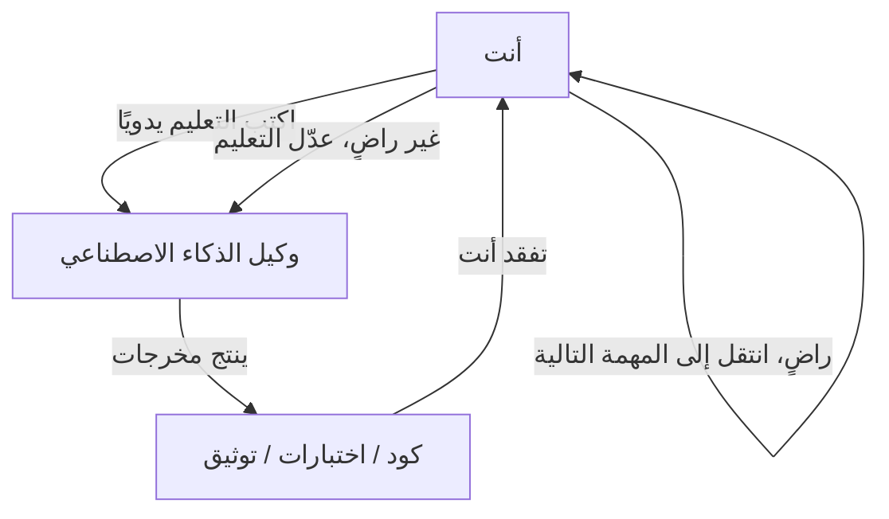
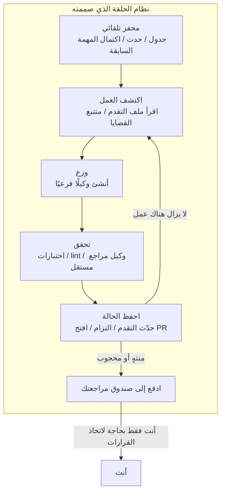
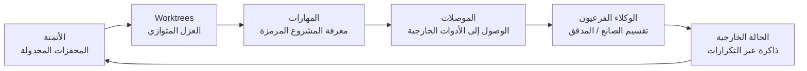
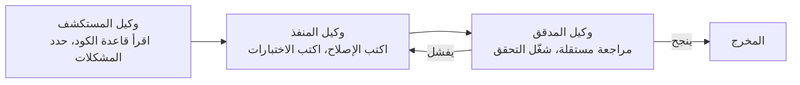
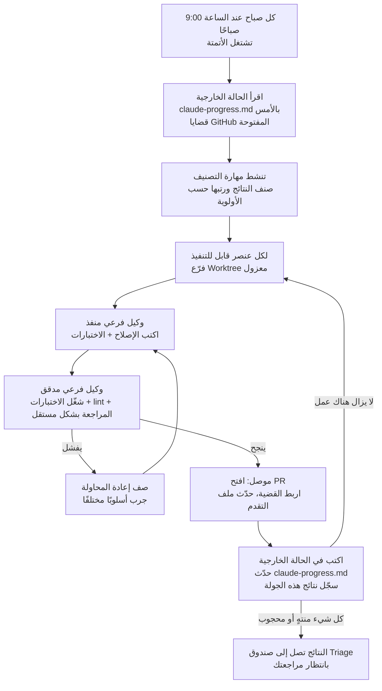
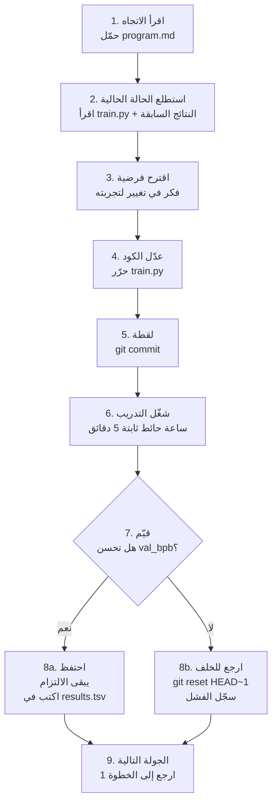

[English Version →](../../../en/lectures/lecture-13-loop-engineering/)

> أمثلة الكود: [code/](https://github.com/walkinglabs/learn-harness-engineering/blob/main/docs/ar/lectures/lecture-13-loop-engineering/code/)
> مشروع عملي: [المشروع 07. ابني أول حلقة آلية](./../../projects/project-07-loop-engineering-first-loop/index.md)

# المحاضرة 13. من المطالبة اليدوية إلى الحلقات المستقلة

كل ما تعلمته في المحاضرات الاثنتي عشرة الأولى يستند إلى افتراض واحد: **أنت تجلس أمام لوحة المفاتيح، وتكتب التعليمات واحدة تلو الأخرى.**

لقد كتبت `AGENTS.md` (المحاضرات 1-4)، وبنيت إدارة الحالة (المحاضرات 5-6)، وحددت النطاق بقوائم الميزات (المحاضرات 7-8)، وتركت تسليمات نظيفة في نهاية الجلسة (المحاضرات 9، 12)، وجعلت وقت التشغيل قابلًا للملاحظة (المحاضرات 10-11). لكن المحفز لكل ذلك كان دائمًا أنت. لم يقرر الوكيل من تلقاء نفسه متى يبدأ العمل - لأن لا أحد ضغط على زر "ابدأ".

هذه المحاضرة تدور حول تسليم زر البدء إلى النظام. ليس التخلي عن السيطرة - بل رفعها إلى الطبقة التالية.

## /goal: أبسط حلقة ممكنة

أفضل مدخل لهندسة الحلقات ليس مخططًا معماريًا معقدًا - بل أمر واحد.

في أوائل عام 2026، أطلق Claude Code و OpenAI Codex نفس الميزة بشكل مستقل: `/goal`. تكتب في الطرفية:

```
/goal "All tests pass, zero lint warnings, merge to main"
```

ثم تغلق جهاز الكمبيوتر وتذهب للنوم. بعد ثماني ساعات، يكون الوكيل قد تحليل وكتب واختبر وأصلح ودمج من تلقاء نفسه. يعيد المحاولة عند الفشل، ويغير الأساليب عندما يعثر على طريق مسدود، ويتوقف عند الانتهاء - دون أن تُنحني فوق كتفه قائلًا "حاول مرة أخرى".

الفرق الوحيد بين `/goal` والمطالبة التقليدية هو شيء واحد. لكن هذا الشيء الواحد يغير كل شيء:

| | المطالبة التقليدية | `/goal` |
|---|---|---|
| ما تقدمه | ماذا تفعل بعد ذلك | كيف تبدو الحالة النهائية |
| ما يفعله الوكيل | ينفذ مرة واحدة | يكرر حتى يتحقق الهدف |
| من يحكم على الانتهاء | أنت | شرط توقف قابل للتحقق |
| متى يمكنك المغادرة | لا يمكنك ذلك | اللحظة التي تكتب فيها `/goal` |

`/goal` هي في الأساس حلقة. لديها بالضبط ثلاثة أجزاء: **هدف، طريقة تحقق، وشرط توقف.** فقط هذه الأشياء الثلاثة تنقلك من داخل الحلقة إلى خارجها.

### كيف نشأ `/goal` بشكل عضوي

لم يقفز `/goal` من 0 إلى 1 من العدم. نما تدريجيًا من سير العمل اليومي، مرًا بأربع مراحل تقريبًا:

**المرحلة 1: المطالبة اليدوية واحدة تلو الأخرى.** كانت أبسط طرق العمل هي ذهابًا وإيابًا: "اكتب دالة"، "أضف اختبارًا"، "أصلح هذا المنطق". كان الوكيل يتوقف بعد كل خطوة وينتظر أن تقول ما هو التالي. كنت أنت مجدول جدول الأنابيب بأكمله.

**المرحلة 2: مطالبات طويلة بخطوات متعددة.** ثم بدأ الناس بكتابة مطالبات أطول تكدس الخطوات معًا: "أولاً تحليل الكود، ثم كتابة التنفيذ، ثم تشغيل الاختبارات، وإذا فشلت، أصلحها". كان الوكيل قادرًا على تشغيل عدة خطوات في مرة واحدة، لكنك لا تزال بحاجة إلى المراقبة - لأنه قد ينحرف في منتصف الطريق، أو ينتهي من خطوة ولا يعرف ماذا يفعل بعد ذلك.

**المرحلة 3: التفكير الذاتي والتوجيه الذاتي للوكيل.** بعد ذلك، اكتسب الوكلاء "التفكير الداخلي" - بعد كل خطوة ينظرون إلى النتيجة ويقررون ماذا يفعلون بعد ذلك. أعطيت هدفًا، وقاموا بتفكيكه بأنفسهم وإعادة المحاولة من تلقاء أنفسهم. لكن مشكلة ظهرت: متى يتوقفون؟ هل "لقد انتهيت" الصادرة من الوكيل نفسه تعتبر؟ ظلت الممارسة تجيب - لا. الوكلاء يعلنون النصر بسهولة كبيرة.

**المرحلة 4: حكم التوقف المستقل - `/goal`.** كانت الخطوة الأخيرة هي إخراج "الحكم على ما إذا كان قد انتهى" من يدي الوكيل الذي يقوم بالعمل، وتسليمه إلى قاضٍ مستقل. قد يكون نموذجًا مختلفًا، أو نصيبي، أو أمر اختبار - لكن القاعدة كانت نفسها: الشخص الذي يكتب الكود لا يمكنه تصحيح واجبه بنفسه. عند هذه النقطة، عمل `/goal` حقًا: أنت تعطي الهدف، وهو يكرر، ويقرر قاضٍ مستقل متى يتوقف، ويمكنك المغادرة.

هذه المراحل الأربع لم تكن خريطة طريق خططتها أي شركة. كانت المسار الذي وصل إليه كل من يكتب الكود بالوكالة، بشكل مستقل، مدفوعًا بنفس نقاط الألم. لم يكن إطلاق Claude Code و Codex لـ `/goal` في نفس الوقت تقريبًا في أوائل عام 2026 مصادفة - لقد حان الوقت.

### هناك أكثر من نوع واحد من الحلقات

`/goal` هي أسهل حلقة يمكن فهمها، لكنها ليست النوع الوحيد. تنقسم الحلقات إلى فئات بناءً على كيفية تحفيزها وكيفية توقفها:

| النوع | المحفز | شرط التوقف | Claude Code | Codex | الأفضل لـ |
|------|---------|----------------|-------------|-------|----------|
| **حلقة قائمة على الدور** | تكتب كل مطالبة يدويًا | يعتقد الوكيل أنه انتهى، أو تقاطعت أنت | الدردشة العادية | الدردشة العادية | المهام الصغيرة، العمل الاستكشافي |
| **حلقة قائمة على الهدف** | تعطي هدفًا | يؤكد المقيّم المستقل الانتهاء، أو الوصول إلى الحد الأقصى من الدورات | `/goal` | `/goal` (يتطلب التمكين اليدوي) | المهام المعقدة ذات معايير الإكمال الواضحة |
| **حلقة قائمة على الوقت** | فاصل مجدول (كل N دقائق/ساعات) | توقفها يدوياً، أو يخرج بعد إكمال العمل | `/loop` | أتمتة الموضوع | استطلاع الحالة، الفحوصات الدورية، العمل المتكرر |
| **حلقة مدفوعة بالأحداث** | حدث خارجي (فتح PR، فشل CI، قضية جديدة) | يتوقف بعد معالجة الحدث، أو يصل إلى حد إعادة المحاولة | Routines (API / GitHub Webhook) | أتمتة مستقلة + المكونات الإضافية | سير العمل التفاعلي، تكامل CI/CD |

هذه ليست متنافسة - بل هي أدوات مختلفة لوظائف مختلفة. الحلقة القائمة على الدور جيدة للأشياء الصغيرة. استخدم `/goal` عندما يكون هناك خط نهائي واضح. استخدم `/loop` عندما تحتاج إلى مراقبة شيء ما. استخدم المدفوعة بالأحداث عندما تتكامل مع أنظمة خارجية.

### لا تخلط بين `/goal` و `/loop`

كلاهما يحتوي على كلمة "حلقة" في الاسم، لكنهما يحلان مشكلتين مختلفتين تمامًا:

| | `/goal` | `/loop` |
|---|---------|---------|
| **ما هي** | مهمة كبيرة واحدة، تعمل حتى تنتهي | إجراء صغير واحد، يتكرر على فاصل زمني |
| **شرط التوقف** | الوصول إلى الهدف، أو استنفاد الميزانية | توقفها يدوياً، أو تخرج المهمة من تلقاء نفسها |
| **الملف الزمني** | تشغيل طويل واحد، قد يستغرق ساعات أو أيام | دفعات قصيرة دورية، كل تشغيل قد يستغرق بضع دقائق |
| **التقدم** | يقترب من خط النهاية في كل تكرار | كل تشغيل مستقل، لا تقدم تراكمي |
| **القياس** | جري ماراثون - يطلق بندقية البداية، وتتوقف عند خط النهاية | منبه - يرن على جدول زمني، وتطفئه |
| **الاستخدام النموذجي** | "نفّذ نظام الدفع الكامل بتغطية اختبار" | "تحقق مما إذا كان CI معطلاً كل 15 دقيقة" |

خطأ شائع: دفع شيء يجب أن يكون `/goal` إلى `/loop`. مثل كتابة `/loop 10m "استمر في تنفيذ نظام الدفع"` - هذا خطأ. `/loop` ينفذ نفس التعليم بشكل مستقل في كل مرة، ولا يتذكر أين توقف في المرة الأخيرة. ستحصل فقط على نفس نقطة البداية مرارًا وتكرارًا.

**اختبار جملة واحدة لمعرفة أيهما تستخدم: هل لهذا الشيء نهاية؟**
- له نهاية → `/goal`
- لا نهاية له، أنت فقط بحاجة إلى الاستمرار في المراقبة → `/loop`

هندسة الحلقات، موضوع هذه المحاضرة، لا تدور حول أي أمر واحد. إنها تدور حول **القدرة على تصميم أنظمة تشمل كل هذه الأنواع - بحيث يمكن لوكيلك الاستمرار في العمل حتى عندما لا تكون هناك.**

ليس عليك كتابة `/goal` في كل مرة. لكن فهم من أين جاء ولماذا يبدو كما هو - ذلك هو فهم جوهر هندسة الحلقات. الحلقات الأكثر تعقيدًا تضيف فقط أجزاء مثل الجدولة، والتوازي، والعزل، والذاكرة فوق هذه الأساسيات الثلاثة نفسها: الهدف، والتحقق، وشرط التوقف.

## يونيو 2026: ثلاثة أشخاص أشعلوا نفس الفتيلة في أسبوع واحد

في الأسبوع الأول من يونيو 2026، قال ثلاثة ممارسين يبنون بنية تحتية لوكالة البرمجة - دون مقارنة ملاحظات - نفس الشيء بكلمات مختلفة.

**بيتر شتاينبرغر** (مبتكر OpenClaw، [مقالته وصلت إلى 8 مليون مشاهدة](https://x.com/steipete/status/2063697162748260627)): "لا يجب أن تطالب وكلاء البرمجة بعد الآن. يجب أن تصمم حلقات تطلب من وكلائك."

**بوريس تشيرني** (رئيس Claude Code في Anthropic، [على بودكاست Acquired](https://x.com/rohanpaul_ai/status/2063289804708835412)): "أنا لا أطالب Claude بعد الآن. لدي حلقات تعمل تطالب Claude وتكتشف ماذا تفعل. وظيفتي هي كتابة الحلقات."

**آدي عثماني** (قائد الهندسة في Google Chrome) [سمى المفهوم](https://addyosmani.com/blog/loop-engineering/) في 7 يونيو 2026، وأعطاه تعريفًا من جملة واحدة:

> **هندسة الحلقات هي استبدال نفسك كشخص الذي يطالب الوكيل. أنت تصمم النظام الذي يفعل ذلك بدلاً منك.**

كشف تشيرني عن أرقام: على مدار 30 يومًا متتالية، تم إجراء جميع مساهمات الكود في Claude Code بشكل مستقل بواسطة الذكاء الاصطناعي - 259 PR مدمجة، وأكثر من 80٪ من كود الإنتاج كتبه Claude، ومعدل نجاح 76٪ في مهام البرمجة مفتوحة النهاية.

ثلاثة أشخاص. أسبوع واحد. نفس الاستنتاج. ليس لأنهم تناسقوا - بل لأن البنية التحتية عبرت بهدوء عتبة. أصبحت الوكلاء موثوقين بما يكفي لإنجاز المهام غير البسيطة دون إشراف. أصبحت بدائيات الجدولة (`/loop`، `/goal`، cron) مدمجة الآن في الأدوات. انخفضت تكلفة تشغيل وكيل واحد بما يكفي بحيث لم يعد تشغيله بشكل متكرر على مؤقت يبدو مُبذرًا. عندما تكون جميع الأجزاء موجودة، فإن الخطوة التي تجمعها تصبح واضحة للجميع في نفس الوقت.

> المصدر: [آدي عثماني: هندسة الحلقات](https://addyosmani.com/blog/loop-engineering/)

## داخل الحلقة مقابل خارج الحلقة

لنقارن بين سيناريوهين ملموسين.

**السيناريو أ: أنت داخل الحلقة (المحاضرات 1-12).**



لديك Harness كامل: `AGENTS.md` يخبر الوكيل بقواعد المشروع، `feature_list.json` يحد النطاق، `init.sh` يضمن بيئة متسقة، `claude-progress.md` يسجل التقدم. **لكن كل خطوة لا تزال تتطلب بدءك اليدوي.** أنهِ ميزة واحدة، اقرأ ملف التقدم، فكر في ما هو التالي، اكتب التعليم. أنت محرك سير العمل بأكمله.

**السيناريو ب: أنت خارج الحلقة (هندسة الحلقات).**



أنت لم تعد تكتب التعليمات. النظام الذي صممته يكتشف العمل، ويوزعه، ويتحقق من النتائج، ويسجل الحالة، ويقرر الخطوة التالية. تتقلص وظيفتك إلى ثلاثة أشياء: **تحديد الهدف وشرط التوقف قبل البدء، ومراجعة المخرجات بعد الانتهاء، وضبط القواعد عندما ينحرف النظام عن المسار.** ينتقل النفوذ من "كتابة المطالبة الصحيحة" إلى "تصميم الحلقة الصحيحة".

> عثماني: "قبل عام، إذا أردت حلقة كتبت كومة من bash وصرت تحافظ على تلك الكومة إلى الأبد وكانت لك وحدك. الآن الأجزاء تأتي مدمجة داخل المنتجات." ليس عليك البناء من الصفر. تحتاج إلى فهم كيف تتناسب الأجزاء مع بعضها البعض.

## المفاهيم الأساسية

- **هندسة الحلقات**: تصميم نظام يطالب وكيلك تلقائيًا، ليحل محل الإدخال البشري اليدوي خطوة بخطوة. ينتقل الإنسان من داخل الحلقة إلى خارجها، وينتقل النفوذ من "كتابة المطالبة الصحيحة" إلى "تصميم الحلقة الصحيحة".
- **وضع `/goal`**: أبسط حلقة ممكنة - قدم هدفًا، وطريقة تحقق، وشرط توقف؛ يكرر الوكيل حتى يتحقق. الجسر من المطالبة اليدوية إلى الحلقات المستقلة.
- **فصل المولد/المقيّم**: يجب فصل الوكيل الذي يكتب الكود والوكيل الذي يتحقق منه. النموذج الذي يصحح عمله نفسه غير موثوق؛ والمحقق المستقل - وأحيانًا باستخدام نموذج مختلف تمامًا - هو ضمان الموثوقية الأساسي لأي حلقة.
- **عزل Worktree**: يعمل كل وكيل متوازي في worktree git مستقل، مما يمنع تصادم الملفات فعليًا. شرط البنية التحتية للتنفيذ المتوازي متعدد الوكلاء.
- **الحالة الخارجية**: الذاكرة التي تعيش خارج محادثة واحدة - ملفات markdown، متتبعات القضايا، لوحات كانبان. النماذج تنسي كل شيء بين عمليتي التشغيل؛ يجب أن تعيش الذاكرة على القرص.
- **التكاليف الصامتة الأربعة**: أربع تكاليف خفية تزداد حدة كلما طالت مدة تشغيل الحلقة - دين التحقق، تعفن الفهم، الاستسلام المعرفي، انفجار التوكنز. الحلقات لا تسرع المخرجات فحسب، بل المخاطر أيضًا.

## البدائيات الست للحلقة

قام عثماني بتفكيك الحلقة إلى خمس لبنات بناء أساسية، بالإضافة إلى طبقة ذاكرة تمر عبر كل منها - ستة أشياء في المجموع، لكن طبقة الذاكرة تحتل مكانة خاصة: إنها ليست مكونًا على نفس المستوى مثل الآخرين؛ بل هي العمود الفقري الذي يعتمد عليه كل شيء آخر.

يرسم المخطط أدناه الستة كحلقة حتى تتمكن من رؤية الصورة الكاملة للوهلة الأولى. لكن تذكر: الحالة الخارجية ليست مجرد محطة أخرى على الحلقة - بل هي الأساس الذي تستند إليه الحلقة بأكملها.



### 1. الأتمتة — نبض القلب

بدون أتمتة، الحلقة ليست حلقة - بل هي تشغيل لمرة واحدة قمت به يدويًا.

يحتوي كل من Claude Code و Codex على أنظمة جدولة كاملة، لكنهما يستخدمان أسماء وطبقات مختلفة. الخريطة التقريبية من الأخف إلى الأثقل:

| الطبقة | Claude Code | Codex | ملاحظات |
|-------|-------------|-------|-------|
| الاستطلاع داخل الجلسة | `/loop` | أتمتة الموضوع | مرتبطة بالجلسة الحالية، وتموت عند إغلاق الجلسة |
| المهام المجدولة محليًا | مهام سطح المكتب المجدولة | أتمتة مستقلة (الوضع المحلي) | تعمل بينما الجهاز قيد التشغيل، ويمكنها الوصول إلى الملفات المحلية |
| المهام المجدولة في السحابة | Cloud Routines | — (لا يوجد مجدول سحابي أصلي) | تعمل بينما الجهاز متوقف |
| محفزات الأحداث | Routines (API / GitHub Webhook) | أتمتة مستقلة + المكونات الإضافية | تحفزها أحداث خارجية |
| مستضافة ذاتية كاملة | GitHub Actions / cron مستضاف ذاتيًا | `codex exec` + cron | تحكم كامل |

**علامة التبويب Automations في Codex** هي نقطة دخول الجدولة. اختر المشروع، والمطالبة، والإيقاع، وما إذا كان يعمل على النسخة المحلية الخاصة بك أو worktree في الخلفية. عمليات التشغيل التي تجد شيئًا تصل إلى صندوق Triage؛ عمليات التشغيل التي لا تجد شيئًا تؤرشف تلقائيًا. تستخدم OpenAIها داخليًا لتصنيف القضايا اليومي، وملخصات فشل CI، وإحاطات الالتزام، والبحث عن الأخطاء التي تم تقديمها الأسبوع الماضي.

تأتي أتمتة Codex بنكهتين:
- **أتمتة الموضوع** — مكالمات استيقاظ متكررة بنمط نبض القلب مرتبطة بموضوع، مع الحفاظ على السياق. جيدة للمتابعة المستمرة لشيء واحد، مثل مراقبة أمر طويل الأمد أو استطلاع حالة PR. المكافئ في Claude Code هو `/loop`.
- **أتمتة مستقلة** — كل تشغيل يبدأ من جديد، والنتائج تذهب إلى Triage. جيدة للمهام المستقلة اليومية/الأسبوعية مثل الإحاطات أو فحوصات التبعيات. المكافئ في Claude Code هو مهام سطح المكتب المجدولة.

نظام Claude Code طبقي بدقة أكبر:

- **`/loop`** — تكرار مجدول خفيف الوزن داخل الجلسة. يعمل بينما طرفيتك مفتوحة، ويموت عند إغلاق الجلسة، وينتهي صلاحيته تلقائيًا بعد 7 أيام. جيدة للمراقبة المؤقتة أثناء جلسة العمل الحالية.
- **مهام سطح المكتب المجدولة** — تعمل بينما جهازك قيد التشغيل، وتنجو من إعادة تشغيل الجلسة، بفواصل مستوى الدقيقة. جيدة للعمل المتكرر الذي يحتاج إلى الوصول إلى الملفات المحلية.
- **Cloud Routines** — تعمل على بنية Anthropic السحابية، وتنجو من إيقاف جهازك، بحد أدنى للساعة واحدة. تدعم ثلاثة أنواع من المحفزات: مجدول، استدعاء API، خطاف ويب GitHub. جيدة للمهام اليومية التي لا تحتاج إلى بيئتك المحلية.
- **GitHub Actions / cron مستضاف ذاتيًا** — تحت سيطرتك بالكامل، وتعمل كما تريد. جيدة للسيناريوهات ذات المتطلبات البيئية أو الأمنية الخاصة.

```bash
# Claude Code: شغّل الاختبارات كل 30 دقيقة، وأصلح الأخطاء (داخل الجلسة الحالية)
/loop 30m Run the test suite and fix any failing tests

# Claude Code: تحقق من حالة النشر كل 15 دقيقة
/loop 15m Check if the production deploy succeeded and report status
```

الأتمتة هي نبض القلب. بدونها، الحلقة هي مخطط لا يستيقظ أبدًا.

### 2. Worktrees — العزل على نطاق واسع

بمجرد تشغيل أكثر من وكيل واحد، تصبح تصادمات الملفات هي طريقة الفشل الحتمية. وكيلان يكتبان في نفس الملف هو بالضبط صداع مهندسين يلتزمان بنفس الأسطر دون تشاور.

`git worktree` يحل هذا: كل وكيل يعمل على فرعه الخاص في دليله الخاص. لا يمكنهم ماديًا لمس نسخة كل منهما.

يأتي كل من Claude Code و Codex بدعم worktree. عندما تستخدم `--worktree` أو `isolation: worktree` على وكيل فرعي، يحصل كل مساعد على نسخة نظيفة مستقلة تنظف نفسها بعد الانتهاء. تزيل Worktrees مشكلة التصادم الميكانيكي - لكن تذكر: **نطاق مراجعتك لا يزال هو السقف.** عدد الوكلاء المتوازيين الذين يمكنك الإشراف عليهم يحدد عدد worktrees التي يمكنك تشغيلها فعليًا.

### 3. المهارات — توقف عن إعادة شرح مشروعك

المهارة هي كيف تتوقف عن إعادة شرح سياق المشروع نفسه في كل جلسة. إنها مجلد يحتوي على `SKILL.md` مع تعليمات وبيانات وصفية، بالإضافة إلى نصوص برمجية ومراجع وأصول اختيارية.

يدعم كل من Codex و Claude Code نفس التنسيق. يتم استدعاء المهارات مباشرة بـ `/اسم-المهارة` (يدعم Codex أيضًا `$اسم-المهارة`)، أو يتم تشغيلها ضمنيًا عندما تتطابق المهمة مع وصف المهارة.

المهارات تدور أساسًا حول سداد دين النية الخاص بك. يبدأ الوكيل كل جلسة باردًا - يملأ أي فجوة في نيتك بتخمين واثق. المهارة هي تلك النية المكتوبة على الخارج: الأعراف، خطوات البناء، و"نحن لا نفعل ذلك بهذه الطريقة بسبب تلك الحادثة" - مكتوبة مرة واحدة، وتُقرأ في كل تشغيل.

### 4. الموصلات — حلقتك تلمس أدوات حقيقية

الحلقة التي يمكنها فقط رؤية نظام الملفات هي حلقة صغيرة. الموصلات (المبنية على بروتوكول MCP) تتيح للوكيل قراءة متتبع قضايك، والاستعلام عن قاعدة بيانات، واستدعاء API تجريبي، وإسقاط رسالة في Slack.

يتحدث كل من Codex و Claude Code لغة MCP، لذا فإن الموصل الذي كتبته لأحدهما عادة ما يعمل في الآخر. الموصلات هي الفرق بين "إليك الإصلاح" وحلقة تفتح PR، وتربط تذكرة Linear، وتنبّه القناة بمجرد أن يصبح CI أخضر - من تلقاء نفسها، داخل بيئتك الفعلية، وليس فقط في طرفية.

### 5. الوكلاء الفرعيون — ابقِ الصانع بعيدًا عن المدقق

الخيار التصميمي الأكثر قيمة هيكليًا في الحلقة هو فصل من يكتب عن من يتحقق. النموذج الذي كتب الكود يكون سخيًا جدًا في تصحيح واجبه بنفسه. وكيل ثانٍ، بتعليمات مختلفة وأحيانًا بنموذج مختلف، يلتقط ما أقنع به الوكيل الأول نفسه.

التقسيم الكلاسيكي بثلاثة أدوار:



يشغّل `/goal` في Claude Code هذا تحت الغطاء - جلسة مستقلة جديدة تحكم على ما إذا كانت الحلقة يجب أن تتوقف، وليس الجلسة التي قامت بالعمل. هذا يسمى **فصل المولد/المقيّم**، وهو أهم ضمان موثوقية واحد في تصميم الحلقة.

### 6. الحالة الخارجية — ذاكرة الحلقة

النماذج تنسي كل شيء بين عمليتي التشغيل. يجب أن تعيش الذاكرة على القرص، وليس في نافذة السياق.

هذا يبدو بسيطًا جدًا ليكون مهمًا، لكنه هي نفس الخدعة التي تعتمد عليها كل وكيل طويل الأمد. ملف markdown، لوحة Linear - أي شيء يعيش خارج محادثة واحدة ويحتفظ بما تم إنجازه، وما قيد التقدم، وما هو التالي. الوكيل ينسى. المستودع لا ينسى.

هذه البدائيات الست هي مجموعة أدوات تصميم الحلقة الخاصة بك. لا تحتاج إلى كل منها لكل حلقة. لكنك تحتاج إلى معرفة متى تصل إلى أي منها.

## حلقة كاملة، مُحلَّلة

اربط الستة معًا وإليك ما تبدو عليه حلقة تصنيف صباحية حقيقية:



هذه لم تعد تشغيل وكيل واحد. إنها نظام يعمل باستمرار يستيقظ كل صباح، وينظف الأرضية من تلقاء نفسه، ويضع الأشياء التي تحتاج إلى اهتمامك أمامك. يصبح دورك: **راجع محتويات الصندوق، واتخذ القرارات، وعندما تكتشف نمطًا لا يستطيع النظام التعامل معه، صقل المهارات والقواعد.**

استخدم تشيرني هذا النمط لدمج 259 PR في 30 يومًا دون فتح IDE مرة واحدة. استخدم مهندسو OpenAI نفس النمط لبناء منتج بيتا يبلغ حوالي مليون سطر كود يدويًا - دون كتابة سطر كود واحد بأنفسهم.

## فصل المولد/المقيّم: لماذا لا يمكنك السماح للنموذج بتصحيح عمله بنفسه

هذا هو الدرس الأصعب في هندسة الحلقات.

يكتب أذكى وكلائك قطعة كود جميلة. المنطق واضح، والتعليقات شاملة، وكل دالة لها اختبار. أنت راضٍ.

لكن إليك السؤال: **إذا سمحت للوكيل الذي كتب هذا الكود بأن يحكم على ما إذا كان قد قام بعمل جيد، ماذا سيقول؟**

لقد تم تأكيد الإجابة بالتجربة مرارًا وتكرارًا: سيعطي نفسه درجة عالية. ليس لأنه غير صادق، بل لأنه هو المؤلف - لقد أقنع نفسه بأن هذا المسار صحيح أثناء التوليد. عندما ينظر إلى الوراء، لا يرى الأخطاء؛ بل يرى عملية تفكيره الخاصة.

هذه ليست مشكلة Claude. هذه ليست مشكلة GPT. هذه خاصية جميع النماذج التوليدية. **النموذج هو أفضل محامٍ دفاع عن مخرجاته.**

الحل: لا تدع نفس الكيان (نفس النموذج، نفس المطالبة) يقوم بالعمل والمراجعة معًا.

- يستخدم `/goal` في Claude Code جلسة مشرف مستقلة لحكم على ما إذا كان الهدف قد تحقق - وليس الجلسة التي حاولت تحقيقه.
- يتيح لك نظام الوكلاء الفرعيين في Codex تحديد وكيل مدقق باستخدام نموذج مختلف بجهد تفكير مختلف.
- ممارسة المجتمع لـ "التحقق العدائي" تولد N مشككين مستقلين لكل نتيجة، كل مُطالب بالدحض - الرفض بالأغلبية يقتل النتيجة.

جملة واحدة لتتذكرها: **يجب ألا يصدقك شخص ما في فريقك.**

## autoresearch لكارباثي: النموذج المثالي للحلقة

إذا كنت تريد أن ترى كيف تبدو حلقة مصممة جيدًا وتعمل بالفعل، فإن [autoresearch لكارباثي](https://github.com/karpathy/autoresearch) هي المثال النموذجي.

في مارس 2026، أصدر كارباثي مشروع Python مكونًا من 630 سطرًا. أعطِه GPU واحدًا واتجاه بحثي، ويعمل طوال الليل - مكتملًا بمئات تجارب تدريب ML، ويحتفظ فقط بتلك التي تحسن حقًا. وصل المشروع إلى أكثر من 66,000 نجمة في غضون أيام من الإصدار.

### ثلاثة ملفات، ثلاثة أدوار

النظام بأكمله له فقط ثلاثة ملفات أساسية، لكن تقسيم العمل حاد للغاية:

| الملف | من يقوم بتحريره | ماذا يفعل |
|------|-------------|-------------|
| `prepare.py` | لا أحد (للقراءة فقط) | تحضير البيانات، المُميّز، حزام التقييم. بنية تحتية ثابتة. |
| `train.py` (~630 سطر) | **وكيل الذكاء الاصطناعي** | تعريف النموذج، المحسن، حلقة التدريب. ملعب الوكيل - غيّر أي شيء. |
| `program.md` | **أنت** | منهجية البحث مكتوبة باللغة الطبيعية. أنت فقط تقوم بتحرير هذا. أخبر الوكيل كيف يستكشف، وكيف يقيم، وما لا يلمسه. |

هذا التقسيم ثلاثي الاتجاه هو روح التصميم: **البشر لا يلمسون الكود، بل يلمسون الاتجاه؛ الوكلاء لا يلمسون الاتجاه، بل يلمسون الكود.** تتحول وظيفتك من كتابة Python إلى "كتابة ثقافة منظمة البحث."

### الإدخال: كيف يبدو program.md

`program.md` هو دماغ الحلقة. إنه ليس كودًا - بل دليل تعليمات بحثي مكتوب بـ Markdown. يحتوي تقريبًا على:

- **الهدف**: تحسين `val_bpb` (بتات التحقق لكل بايت، كلما انخفض كان أفضل)
- **القيود**: لا تلمس `prepare.py`، ابقَ ضمن ميزانية VRAM، تدريب ثابت مدته 5 دقائق
- **اتجاهات الاستكشاف**: جرب بنى مختلفة، ومحسنين، وجداول LR
- **قواعد التقييم**: ما يعتبر تحسنًا، كيف تسجل النتائج، ماذا تفعل عند الفشل
- **القاعدة الحديدية**: لا تتوقف أبدًا. بمجرد بدء الحلقة، استمر إلى الأبد

يمكن أن تكون مطالبة البدء الخاصة بك للوكيل قصيرة مثل جملة واحدة:

```
Have a look at program.md and let's kick off a new experiment!
```

الباقي متروك للوكيل الذي يقرأ المستند ويتخذ قراراته الخاصة.

### حلقة الساتب ذات التسع خطوات

في قلب autoresearch يوجد **ساتب** - يتقدم فقط إلى الأمام، ولا يتراجع أبدًا. يتبع كل تكرار تسع خطوات بدقة:



تعمل بـ 12 تجربة تقريبًا في الساعة. تشغيل ليلة واحدة (8 ساعات) حوالي 100 تجربة. قام كارباثي نفسه بتشغيلها لمدة يومين - ~700 تجربة.

ميزانية الساعة الحائط الثابتة البالغة 5 دقائق هي خيار تصميمي رئيسي - بغض النظر عما يغيره الوكيل، تستغرق كل تجربة نفس الوقت بالضبط. هذا يعني أن جميع النتائج قابلة للمقارنة مباشرة ضمن نفس الميزانية الزمنية - لا جدال حول "هذه شغلت لفترة أطول لذا فهي أفضل."

### المخرج: ما تراه عند الاستيقاظ

بعد ليلة من الحلقات، تجلس في الصباح وتجد ثلاثة أشياء:

**1. سجل Git (الساتب المتقدم للأمام)**

فقط الالتزامات التي تحسنت بالفعل تبقى على الفرع الرئيسي. كل ما فشل تم تراجعه. `git log` هو سجل بحثي موثق.

**2. results.tsv (سجل التجربة الكامل)**

كل تجربة واحدة - نجاح أو فشل - مسجلة:

```
timestamp    commit_hash    val_bpb    vram_mb    description
--------- ------------- ---------- ---------- ----------------------------
08:01:12  a1b2c3d       1.234     22100    baseline
08:06:15  d4e5f6g       1.228     22400    increased learning rate by 10%
08:11:20  (reverted)     1.241     21800    switched to GELU activation
08:16:08  h7i8j9k       1.219     23000    added weight decay 0.01
...
```

**3. سجل بحثي (ملخص الوكيل الخاص)**

يكتب الوكيل رسائل التزام واضحة حول ما جربه، وما نجح، وما لم ينجح، وما يخطط لتجربته بعد ذلك. أنت تقرأ تلك - لا يجب عليك قراءة فروق الكود.

### ما وجده بالفعل

النتائج من تشغيل كارباثي الأولي لمدة يومين، ~700 تجربة:

- من بين ~700 محاولة، تم العثور على حوالي **20 تحسنًا حقيقيًا قابلًا للتكديس**
- خفض وقت تدريب مستوى GPT-2 لـ nanochat على 8×H100 من **2.02 ساعة → 1.80 ساعة**، حوالي **أسرع بنسبة 11٪**
- شملت النتائج: تعديلات معدل التعلم، وضبط المحسن، وتبديلات التنشيط، وتحسينات نمط الانتباه، إلخ.

هل كانت جميع التحسينات اكتشافات مذهلة؟ لا. كانت معظمها تحسينات صغيرة تكدست. لكن تلك التحسينات الصالحة البالغ عددها 20 كانت ستستغرق باحثًا بشريًا أسابيع من العمل اليدوي - وفعلها الوكيل في 48 ساعة.

### التفاصيل الأكثر دلالة: الحلقة مكتوبة باللغة الإنجليزية، وليس بالكود.

`program.md` هو مستند Markdown، وليس نصيبي Python. يصف منهجية بحثية - ماذا تعدل، وماذا تترك شأنه، وكيف تقيم، وكيف تتعامل مع حالات الفشل، وقاعدة حديدية واحدة: **لا تطلب أبدًا مساعدة بشرية، فقط استمر.** وكيل برمجة يقرأ هذا المستند وينفذه إلى أجل غير مسمى.

هذا هو قالب هندسة الحلقات: لا تعطِ الوكيل مهمة. أعطِه **منهجية**. دع المنهجية هي الحلقة. ملف `program.md` واحد، و630 سطرًا من كود الغراء، وكل شيء آخر هو الوكيل يدير نفسه.

## أربعة تكاليف صامتة

عندما تبدأ الحلقة في العمل، لن ترى المشاكل فورًا. تتراكم التكاليف الأربع التالية بصمت، وبحلول الوقت الذي تلاحظه فيه، ربما تكون قد دفعت ثمنًا باهظًا بالفعل.

### 1. دين التحقق

الحلقات السريعة تميلك لتخطي التحقق. "يبدو جيدًا" ليس نفس الشيء مثل "مؤكد صحيح." كلما زاد الكود الذي تولده الحلقة دون إشراف، زادت سرعة تراكم دين التحقق. الحل: **شروط التوقف يجب أن تكون قابلة للفحص آليًا، أبدًا "يشعر أنها صحيحة تقريبًا."**

### 2. تعفن الفهم

كلما زادت سرعة شحن الحلقة للكود، زاد تباعد فهمك لقاعدة الكود الخاصة بك عن الواقع. كان لدى فريق تشيرني 80٪ من الكود مكتوبًا بواسطة الوكلاء - مما يعني أن معظم كود الفريق لم يكتبه شخص. إذا لم تقرأ وتستخدم ما تنتجه الحلقة، فإن فهمك يتحلل باستمرار. **الحلقات السريعة تتطلب قراءة سريعة.**

### 3. الاستسلام المعرفي

عندما تعمل الحلقة بسلاسة، تكون الوضع الأكثر راحة هو التوقف عن وجود آراء. خذ ما يعيدونه، لا تفكر في المخرجات. لكن هذا هو بالضبط حيث يبدأ الخطر - أنت تستخدم الحلقة لتجنب التفكير، بدلاً من تضخيم التفكير. تحذير عثماني: "يمكن لشخصين بناء نفس الحلقة بالضبط والحصول على نتائج عكسية. أحدهما يستخدمها للذهاب بشكل أسرع في العمل الذي يفهمه؛ والآخر يستخدمها لتجنب فهم العمل. الحلقة لا تعرف الفرق. أنت تعرف."

### 4. انفجار التوكنز

يتراكم كل تكرار للحلقة المزيد من السياق: الكود المكتوب، والأخطاء التي تمت مواجهتها، والقرارات المتخذة. بدون إدارة السياق، ينمو حجم المطالبة تقريبًا تربعيًا مع عدد الدورات. يعالج Codex ذلك من خلال الضغط التلقائي للسياق - API مخصص يضغط أدوار المحادثة القديمة إلى ملخصات محتوى مشفرة، مع الاحتفاظ بالمعرفة الأساسية مع التخلص من التفاصيل الزائدة. هذا هو اهتمام هندسي يجب معالجته من الحلقة الأولى، وليس إضافة لاحقة.

## بناء أول حلقة لك

ليس عليك البدء بخط أنابيب بمقياس Stripe يدمج 1,300 PR في الأسبوع. ابدأ بأصغر شيء يعمل.

### الخطوة 1: اختر مهمة متكررة واحدة

ابحث عن شيء تفعله يدويًا مرتين على الأقل في الأسبوع. أمثلة:
- افتح GitHub في الصباح، وتحقق من القضايا الجديدة، وصنفها ورد عليها
- شغّل lint والاختبارات قبل كل مراجعة PR
- حدّث مستندات التقدم في نهاية كل يوم

### الخطوة 2: اكتب هدفًا وشرط توقف

حوّل المهمة إلى شيء يمكن لـ `/goal` فهمه:

```markdown
Goal: Check the 10 most recent issues in the repo.
For each issue:
  - If it already has clear labels and an assignee, skip
  - If untagged, add appropriate labels based on content
  - If fixable in under 10 minutes, create a branch and attempt a fix
Stop when: All qualifying issues have been processed, or an issue requires human decision.
```

### الخطوة 3: افصل الصانع والمدقق

لا تدع نفس الوكيل يكتب الكود ويحكم عليه. اقسم حلقتك إلى دورين:
- المنفذ: يقرأ القضية، يكتب الإصلاح، يكتب الاختبارات
- المدقق: يشغّل الاختبارات بشكل مستقل، يراجع الفرق، يحكم على ما إذا كان الإصلاح يحل المشكلة بالفعل

### الخطوة 4: أضف ذاكرة

استخدم ملف markdown لتسجيل ما حدث في كل تشغيل للحلقة. يبدأ التشغيل التالي بقراءة هذا الملف - فيعرف ما تم إنجازه، وما هو معلق، وما كان محجوبًا. هذا يتفوق على أي قاعدة بيانات معقدة.

### الخطوة 5: اضبط مؤقتًا

استخدم `/loop` أو cron نظام التشغيل الخاص بك لتسمح للحلقة بالبدء بدونك. ابدأ بمرة واحدة في اليوم. راقب لمدة أسبوع.

### سلم النضج

ليس عليك الوصول إلى القمة في قفزة واحدة. تبني الحلقات هو سلم:

1. **المستوى 1: مشغل الهدف** — يمكنك استخدام `/goal` لإعطاء مهمة بشرط توقف؛ يكرر الوكيل حتى يتحقق.
2. **المستوى 2: مهمة واحدة مجدولة** — تقوم أتمتة واحدة بتشغيل مهمة واحدة على مؤقت (مثل فحص CI الصباحي).
3. **المستوى 3: حلقة متعددة الوكلاء** — فصل الصانع والمدقق؛ كل نتيجة تفرع worktree معزول.
4. **المستوى 4: حلقة ذاتية التغذية** — تكتشف الحلقة تلقائيًا مهمتها التالية من الحالة الخارجية؛ تقرر ماذا تفعل بعد ذلك.
5. **المستوى 5: تنظيم الأسطول** — تعمل حلقات متعددة بشكل متوازي، مستقلة لكن تشارك طبقة ذاكرة.

معظم الفرق حاليًا بين المستوى 2 والمستوى 3. المستوى 1 هو أسرع طريقة لرؤية العوائد.

## الخلاصات الرئيسية

- **هندسة الحلقات لا تحل محل هندسة الـ Harness — بل تبني طابقًا فوقها.** الـ Harness يجعل التشغيلات الفردية موثوقة. الحلقة تجعل التشغيلات المستمرة مستقلة.
- **`/goal` هي أبسط حلقة ممكنة:** هدف + تحقق + شرط توقف. هذه الأشياء الثلاثة تنقلك من داخل الحلقة إلى خارجها.
- **البدائيات الست (الأتمتة / Worktrees / المهارات / الموصلات / الوكلاء الفرعيون / الحالة الخارجية) هي لبنات بناء الحلقة.** ليست كلها في كل مرة، لكنك تحتاج إلى معرفة متى تصل إلى أي منها.
- **يجب فصل الصانع والمدقق.** النموذج الذي يصحح عمله نفسه غير موثوق. المدقق المستقل - وأحيانًا نموذج مختلف تمامًا - هو ضمان الموثوقية الأساسي لأي حلقة.
- **الحلقات تجعل التوليد مجانيًا تقريبًا وتترك الحكم كمورد نادر.** الوقت الذي توفره ليس للراحة. بل لاتخاذ المزيد من الأحكام.
- **أربعة تكاليف صامتة تزداد حدة كلما طالت مدة تشغيل الحلقات:** دين التحقق، تعفن الفهم، الاستسلام المعرفي، انفجار التوكنز. الحلقات تسرع المخرجات - والمخاطر.
- **ابدأ صغيرًا.** `/goal` واحد، و cron واحد، وملف ذاكرة markdown واحد. انظر للعائد، ثم تكدس لأعلى.

## قراءات إضافية

- [آدي عثماني: هندسة الحلقات](https://addyosmani.com/blog/loop-engineering/)
- [آدي عثماني: هندسة حزام الوكيل](https://addyosmani.com/blog/agent-harness-engineering/)
- [سايمون ويليسون: تصميم الحلقات الوكيلية (سبتمبر 2025)](https://simonw.substack.com/p/designing-agentic-loops)
- [كارباثي: autoresearch](https://github.com/karpathy/autoresearch)
- [Claude Code: سير العمل الديناميكي والتنظيم](https://kenhuangus.substack.com/p/claude-code-orchestration-dynamic)
- [مكتبة الحلقات (Forward Future)](https://signals.forwardfuture.ai/loop-library/) — مجموعة عامة من 50 حلقة حقيقية
- [The Neuron: مبتكري Claude Code حول حلقات الوكيل](https://www.theneuron.ai/explainer-articles/claude-code-creators-boris-cherny-and-cat-wu-explain-how-to-use-agent-loops/)
- المحاضرة 12: [اترك تسليمًا نظيفًا في نهاية كل جلسة](./../lecture-12-why-every-session-must-leave-a-clean-state/index.md) — الشرط الأساسي للحلقات: كل جلسة تترك حالة نظيفة حتى تتمكن الجولة التالية من البدء تلقائيًا
- المحاضرة 5: [احافظ على استمرارية المهام طويلة الأمد عبر الجلسات](./../lecture-05-why-long-running-tasks-lose-continuity/index.md) — المعرفة الأساسية للحالة الخارجية والذاكرة
- المحاضرة 11: [لماذا تنتمي إمكانية الملاحظة داخل الـ Harness](./../lecture-11-why-observability-belongs-inside-the-harness/index.md) — كلما زادت سرعة تشغيل الحلقة، زدت حاجتك إلى إمكانية الملاحظة لاكتشاف المشاكل
- المحاضرة 8: [لماذا قوائم الميزات هي بدائيات الـ Harness](./../lecture-08-why-feature-lists-are-harness-primitives/index.md) — قوائم الميزات هي مصدر البيانات الطبيعي لحلقة ذاتية التغذية لاكتشاف مهمتها التالية

## التدريبات

1. **حوّل مهمة متكررة إلى `/goal`:** ابحث عن شيء تفعله يدويًا مرتين على الأقل في الأسبوع. اكتب هدفه، وطريقة التحقق، وشرط التوقف. شغّله مرة واحدة بـ `/goal` وقارن الوقت والجودة مقابل القيام بذلك يدويًا. هذه هي خطوتك الأولى من Harness إلى Loop.

2. **افصل الصانع والمدقق:** اختر مهمة سبق أن طلبت من وكيل تنفيذها. هذه المرة، اكتب مطالبتين مختلفتين: واحدة لوكيل المنفذ وواحدة لوكيل المدقق (استخدم نماذج مختلفة - مثل Claude للتنفيذ، و GPT للتحقق، أو العكس). يجب أن يشير المدقق إلى مشكلات محددة بأدلة مستشهد بها. سجل عدد ونوع المشكلات التي تم العثور عليها في كل وضع.

3. **أعطِ حلقتك ذاكرة:** أنشئ ملف حالة markdown لحلقتك. في كل تكرار، اكتب: ما تم إنجازه في هذه الجولة، ونتائج التحقق، والحالة (نجاح/فشل/محجوب)، وماذا تفعل بعد ذلك. شغّل ثلاث جولات ولاحظ الفرق السلوكي بين وجود ملف ذاكرة وعدمه.

4. **تدقق في تكاليف حلقتك الصامتة:** بعد أن تعمل الحلقة لمدة ساعة، قيّم هذه المقاييس الأربعة:
   - كم كان التحقق "يشعر بأنه صحيح" بدلاً من "مؤكد آليًا"؟ (دين التحقق)
   - ما مدى قدرتك على شرح الكود الذي أنتجته حلقتك مؤخرًا؟ (تعفن الفهم)
   - كم مرة فكرت "سأنظر لاحقًا" ولم أنظر أبدًا؟ (الاستسلام المعرفي)
   - كيف يتجه حجم سياق الحلقة؟ هل يكرر معلومات زائدة؟ (انفجار التوكنز)
