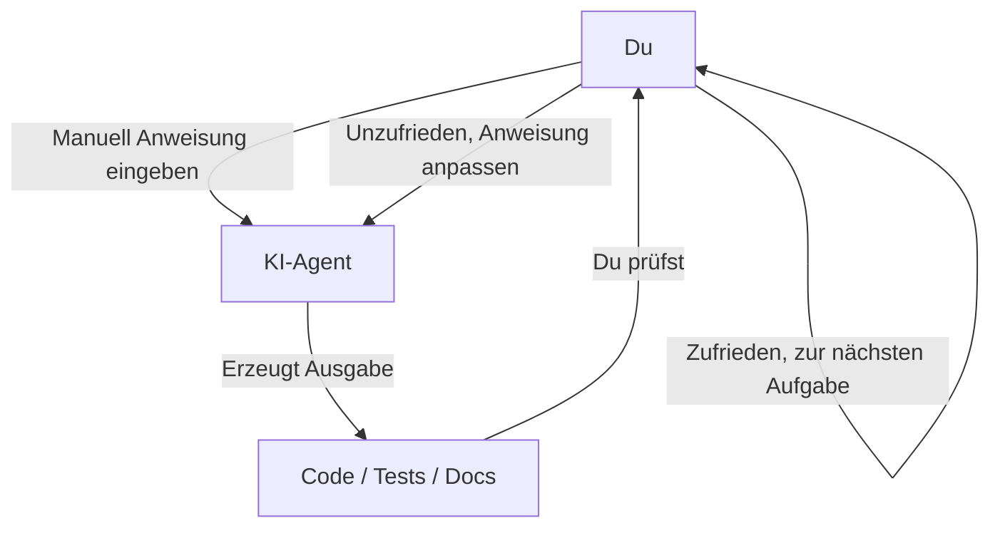
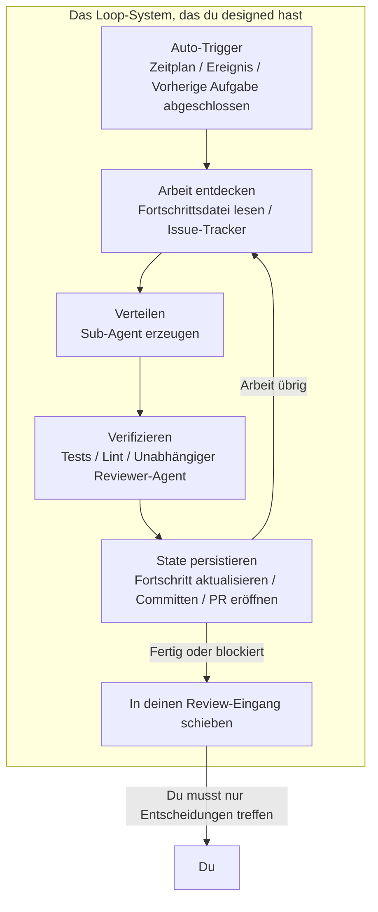
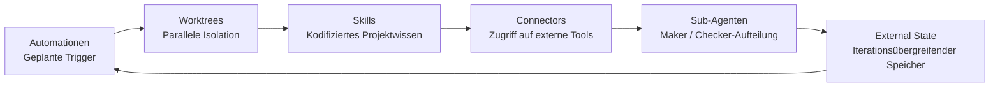
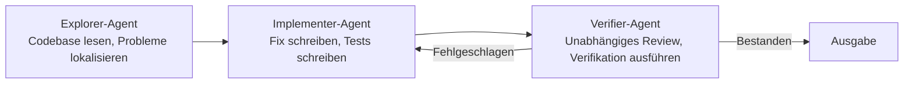
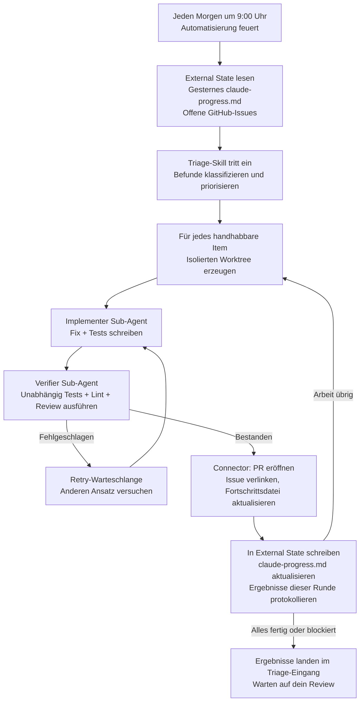
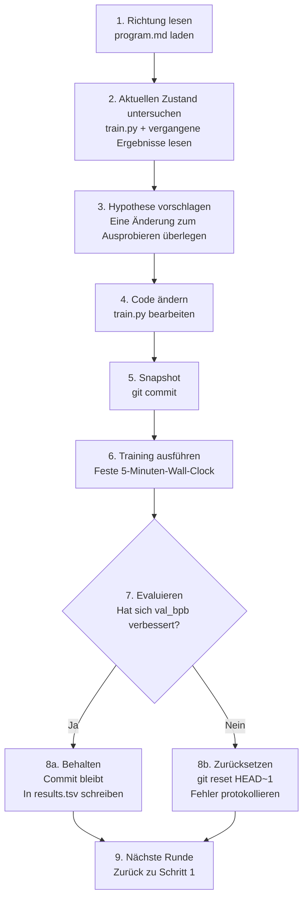

[English Version →](../../../en/lectures/lecture-13-loop-engineering/)

> Codebeispiele: [code/](https://github.com/walkinglabs/learn-harness-engineering/blob/main/docs/en/lectures/lecture-13-loop-engineering/code/)
> Praxisprojekt: [Projekt 07. Baue deinen ersten automatisierten Loop](./../../projects/project-07-loop-engineering-first-loop/index.md)

# Lektion 13. Von manuellen Prompts zu autonomen Loops

Alles, was du in den ersten zwölf Lektionen gelernt hast, beruht auf einer Annahme: **du sitzt an der Tastatur und tippst Anweisungen nacheinander ein.**

Du hast `AGENTS.md` geschrieben (Lektionen 1–4), State-Management aufgebaut (Lektionen 5–6), den Scope mit Feature-Listen begrenzt (Lektionen 7–8), saubere Übergaben am Sitzungsende hinterlassen (Lektionen 9, 12) und die Runtime beobachtbar gemacht (Lektionen 10–11). Aber der Auslöser für alles warst immer du. Der Agent hat nie selbst entschieden, wann er mit der Arbeit beginnt — weil niemand auf „Start“ gedrückt hat.

In dieser Lektion geht es darum, den Startknopf dem System zu übergeben. Nicht die Kontrolle abgeben — sie auf die nächste Ebene heben.

## /goal: Der einfachste mögliche Loop

Der beste Einstieg in Loop Engineering ist kein komplexes Architekturdiagramm — es ist ein einziger Befehl.

Anfang 2026 haben Claude Code und OpenAI Codex unabhängig voneinander dasselbe Feature veröffentlicht: `/goal`. Du tippst im Terminal:

```
/goal "All tests pass, zero lint warnings, merge to main"
```

Dann schließt du deinen Laptop und gehst schlafen. Acht Stunden später hat der Agent selbstständig analysiert, programmiert, getestet, behoben und gemergt. Er wiederholt bei Fehlern, wechselt den Ansatz bei Stockungen und hört auf, wenn er fertig ist — ohne dass du ihm über die Schulter schaust und „nochmal versuchen“ sagst.

Der einzige Unterschied zwischen `/goal` und einem traditionellen Prompt ist eine Sache. Aber diese eine Sache verändert alles:

| | Traditioneller Prompt | `/goal` |
|---|---|---|
| Was du angibst | Was als Nächstes zu tun ist | Wie der Endzustand aussieht |
| Was der Agent tut | Einmal ausführen | Loopen, bis erreicht |
| Wer beurteilt, ob es fertig ist | Du | Eine überprüfbare Stoppbedingung |
| Wann du weggehen kannst | Nie | In dem Moment, in dem du `/goal` eingibst |

`/goal` ist im Grunde ein Loop. Er hat genau drei Teile: **ein Ziel, eine Verifikationsmethode und eine Stoppbedingung.** Nur diese drei Dinge bringen dich von innerhalb des Loops nach draußen.

### Wie `/goal` organisch gewachsen ist

`/goal` ist nicht aus dem Nichts von 0 auf 1 gesprungen. Es ist allmählich aus alltäglichen Arbeitsabläufen hervorgegangen und hat grob vier Stadien durchlaufen:

**Stadium 1: Manuelle Einzel-Prompts.** Die früheste Arbeitsweise war Hin und Her: „schreibe eine Funktion“, „füge einen Test hinzu“, „repariere diese Logik“. Der Agent hielt nach jedem Schritt an und wartete darauf, dass du sagst, was als Nächstes kommt. Du warst der Scheduler der gesamten Pipeline.

**Stadium 2: Lange Prompts mit mehreren Schritten.** Dann fingen die Leute an, längere Prompts zu schreiben, die Schritte stapelten: „zuerst analysiere den Code, dann schreibe die Implementierung, dann führe Tests aus, und wenn sie fehlschlagen, repariere sie“. Der Agent konnte mehrere Schritte auf einmal ausführen, aber du musstest trotzdem zuschauen — weil er mittendrin abdriften oder einen Schritt beenden und nicht wissen könnte, was als Nächstes zu tun ist.

**Stadium 3: Agent-Selbstreflexion und Selbststeuerung.** Danach bekamen Agenten „Introspektion“ — nach jedem Schritt betrachteten sie das Ergebnis und entschieden, was als Nächstes zu tun ist. Du gabst ein Ziel, und sie zerlegten es selbst und wiederholten auf eigene Faust. Aber ein Problem tauchte auf: Wann hören sie auf? Zählt „Ich bin fertig“, das vom Agenten selbst kommt? Die Praxis hat immer wieder geantwortet — nein. Agenten erklären den Sieg viel zu leichtfertig.

**Stadium 4: Unabhängige Stoppbeurteilung — `/goal`.** Der letzte Schritt war, das „Beurteilen, ob es fertig ist“ aus den Händen des arbeitenden Agenten zu nehmen und einem unabhängigen Richter zu übergeben. Es könnte ein anderes Modell, ein Skript oder ein Testbefehl sein — aber die Regel war dieselbe: Die Person, die den Code schreibt, darf ihre eigenen Hausaufgaben nicht benoten. An diesem Punkt funktionierte `/goal` wirklich: Du gibst das Ziel, es loopt, ein unabhängiger Richter entscheidet, wann aufgehört wird, und du kannst weggehen.

Diese vier Stadien waren keine Roadmap, die irgendein Unternehmen geplant hat. Sie waren der Weg, auf den jeder, der mit Agenten programmiert, unabhängig voneinander gestoßen ist — getrieben von denselben Schmerzpunkten. Dass Claude Code und Codex `/goal` fast gleichzeitig Anfang 2026 veröffentlicht haben, war kein Zufall — die Zeit war reif.

### Es gibt mehr als eine Art von Loop

`/goal` ist der am einfachsten zu verstehende Loop, aber er ist nicht die einzige Art. Loops fallen in Kategorien, je nachdem, wie sie ausgelöst werden und wie sie stoppen:

| Typ | Auslöser | Stoppbedingung | Claude Code | Codex | Am besten für |
|------|---------|----------------|-------------|-------|----------|
| **Zugbasierter Loop** | Du tippst jeden Prompt manuell | Agent meint, er ist fertig, oder du unterbrichst | Normaler Chat | Normaler Chat | Kleine Aufgaben, explorative Arbeit |
| **Zielbasierter Loop** | Du gibst ein Ziel | Unabhängiger Evaluator bestätigt Fertigstellung, oder maximale Züge erreicht | `/goal` | `/goal` (manuelle Aktivierung erforderlich) | Komplexe Aufgaben mit klaren Abschlusskriterien |
| **Zeitbasierter Loop** | Geplantes Intervall (alle N Minuten/Stunden) | Du stoppst ihn manuell, oder er beendet sich nach abgeschlossener Arbeit | `/loop` | Thread-Automatisierung | Statusabfrage, periodische Prüfungen, wiederkehrende Arbeit |
| **Ereignisgesteuerter Loop** | Externes Ereignis (PR eröffnet, CI fehlgeschlagen, neues Issue) | Hört nach Bearbeitung des Ereignisses auf oder erreicht Retry-Limit | Routines (API / GitHub Webhook) | Standalone-Automatisierung + Plugins | Reaktive Workflows, CI/CD-Integration |

Diese konkurrieren nicht — sie sind verschiedene Werkzeuge für verschiedene Aufgaben. Zugbasiert ist für kleine Dinge in Ordnung. Nutze `/goal`, wenn es eine klare Ziellinie gibt. Nutze `/loop`, wenn du etwas beobachten musst. Nutze ereignisgesteuert, wenn du mit externen Systemen integrierst.

### Verwechsle `/goal` und `/loop` nicht

Beide haben „Loop“ im Namen, aber sie lösen völlig verschiedene Probleme:

| | `/goal` | `/loop` |
|---|---------|---------|
| **Was es ist** | Eine große Aufgabe, läuft bis sie fertig ist | Eine kleine Aktion, wiederholt sich in einem Intervall |
| **Stoppbedingung** | Ziel erreicht, oder Budget erschöpft | Du stoppst es manuell, oder die Aufgabe beendet sich von selbst |
| **Zeitprofil** | Ein langer Lauf, kann Stunden oder Tage dauern | Periodische kurze Schübe, jeder Lauf kann ein paar Minuten dauern |
| **Fortschritt** | Kommt jeder Iteration näher an die Ziellinie | Jeder Lauf ist unabhängig, kein kumulativer Fortschritt |
| **Analogie** | Einen Marathon laufen — Startschuss fällt, du stoppst an der Ziellinie | Ein Wecker — klingelt nach Plan, du schaltest ihn aus |
| **Typischer Einsatz** | „Implementiere das vollständige Zahlungssystem mit Testabdeckung“ | „Prüfe alle 15 Minuten, ob die CI kaputt ist“ |

Ein häufiger Fehler: Etwas, das ein `/goal` sein sollte, in einen `/loop` zu stopfen. Wie zum Beispiel `/loop 10m "implementiere weiter das Zahlungssystem"` — das ist falsch. `/loop` führt jedes Mal dieselbe Anweisung unabhängig aus, es erinnert sich nicht, wo es beim letzten Mal aufgehört hat. Du wirst immer wieder denselben Startpunkt bekommen.

**Ein-Satz-Test für die richtige Wahl: Hat dieses Ding ein Ende?**
- Hat ein Ende → `/goal`
- Kein Ende, du musst nur weiter zuschauen → `/loop`

Loop Engineering, das Thema dieser Lektion, geht es nicht um irgendeinen einzelnen Befehl. Es geht darum, **Systeme designen zu können, die all diese Typen umfassen — damit dein Agent weiterarbeiten kann, auch wenn du nicht da bist.**

Du musst nicht jedes Mal `/goal` eingeben. Aber zu verstehen, woher es kommt und warum es so aussieht, wie es aussieht — das ist das Verständnis des Kerns von Loop Engineering. Komplexere Loops fügen nur Teile wie Scheduling, Parallelismus, Isolation und Speicher auf diesen selben drei Grundlagen hinzu: Ziel, Verifikation, Stoppbedingung.

## Juni 2026: Drei Leute haben in einer Woche dieselbe Zündung ausgelöst

In der ersten Juniwoche 2026 haben drei Praktiker, die Infrastruktur für Coding-Agenten aufbauen — ohne sich abzusprechen — dasselbe in verschiedenen Worten gesagt.

**Peter Steinberger** (Erfinder von OpenClaw, [sein Beitrag erreichte 8 Millionen Aufrufe](https://x.com/steipete/status/2063697162748260627)): „Du solltest Coding-Agenten nicht mehr prompten. Du solltest Loops designen, die deine Agenten prompten.“

**Boris Cherny** (Leiter von Claude Code bei Anthropic, [im Acquired-Podcast](https://x.com/rohanpaul_ai/status/2063289804708835412)): „Ich prompt Claude nicht mehr. Ich habe Loops laufen, die Claude prompten und herausfinden, was zu tun ist. Mein Job ist es, Loops zu schreiben.“

**Addy Osmani** (Engineering-Lead bei Google Chrome) [hat das Konzept benannt](https://addyosmani.com/blog/loop-engineering/) am 7. Juni 2026 und ihm eine Einzeildefinition gegeben:

> **Loop Engineering bedeutet, dich selbst als die Person zu ersetzen, die den Agenten promptet. Du designst stattdessen das System, das es tut.**

Cherny hat Zahlen genannt: Über 30 aufeinanderfolgende Tage wurden alle Code-Beiträge zu Claude Code autonom von KI erstellt — 259 gemergte PRs, über 80 % des Produktionscodes von Claude verfasst, und eine Erfolgsrate von 76 % bei offenen Softwareaufgaben.

Drei Leute. Eine Woche. Dieselbe Schlussfolgerung. Nicht weil sie koordiniert haben — sondern weil die Infrastruktur leise eine Schwelle überschritten hat. Agenten waren zuverlässig genug geworden, um nicht-triviale Aufgaben unbeaufsichtigt abzuschließen. Scheduling-Primitive (`/loop`, `/goal`, cron) waren jetzt in die Werkzeuge eingebaut. Die Kosten eines einzelnen Agenten-Laufs waren so niedrig geworden, dass das wiederholte Ausführen auf einem Timer nicht mehr verschwenderisch wirkte. Wenn alle Teile vorhanden sind, wird der Schritt, sie zu kombinieren, für alle gleichzeitig offensichtlich.

> Quelle: [Addy Osmani: Loop Engineering](https://addyosmani.com/blog/loop-engineering/)

## Innerhalb des Loops vs. außerhalb des Loops

Lassen Sie uns zwei konkrete Szenarien gegenüberstellen.

**Szenario A: Du bist innerhalb des Loops (Lektionen 1–12).**



Du hast ein vollständiges Harness: `AGENTS.md` sagt dem Agenten die Projektregeln, `feature_list.json` begrenzt den Scope, `init.sh` sorgt für eine konsistente Umgebung, `claude-progress.md` protokolliert den Fortschritt. **Aber jeder Schritt erfordert noch deine manuelle Initiierung.** Ein Feature fertigstellen, die Fortschrittsdatei lesen, darüber nachdenken, was als Nächstes kommt, die Anweisung eingeben. Du bist der Motor des gesamten Workflows.

**Szenario B: Du bist außerhalb des Loops (Loop Engineering).**



Du gibst keine Anweisungen mehr ein. Das von dir designte System entdeckt die Arbeit, verteilt sie, verifiziert die Ergebnisse, protokolliert den State und entscheidet über den nächsten Schritt. Dein Job schrumpft auf drei Dinge: **definiere das Ziel und die Stoppbedingung, bevor es losgeht, überprüfe die Ausgabe, nachdem es fertig ist, und passe die Regeln an, wenn das System vom Kurs abweicht.** Die Hebelwirkung verschiebt sich von „den richtigen Prompt schreiben“ zu „den richtigen Loop designen“.

> Osmani: „Vor einem Jahr, wenn du einen Loop wolltest, hast du einen Haufen Bash geschrieben und diesen Haufen für immer gewartet, und er war deiner und nur deiner. Jetzt sind die Teile einfach in den Produkten enthalten.“ Du musst nicht von Grund auf neu bauen. Du musst verstehen, wie die Teile zusammenpassen.

## Kernkonzepte

- **Loop Engineering**: Designen eines Systems, das deinen Agenten automatisch promptet und manuelle schrittweise menschliche Eingabe ersetzt. Der Mensch bewegt sich von innerhalb des Loops nach draußen, und die Hebelwirkung verschiebt sich von „den richtigen Prompt schreiben“ zu „den richtigen Loop designen“.
- **`/goal`-Modus**: Der einfachste mögliche Loop — gib ein Ziel, eine Verifikationsmethode und eine Stoppbedingung an; der Agent loopt, bis sie erfüllt sind. Die Brücke von manuellen Prompts zu autonomen Loops.
- **Generator/Evaluator-Trennung**: Der Agent, der den Code schreibt, und der Agent, der ihn prüft, müssen getrennt sein. Ein Modell, das seine eigene Arbeit benotet, ist unvertrauenswürdig; ein unabhängiger Verifikator — manchmal mit einem völlig anderen Modell — ist die grundlegende Zuverlässigkeitsgarantie jedes Loops.
- **Worktree-Isolation**: Jeder parallele Agent arbeitet in einem unabhängigen Git-Worktree und verhindert so physisch Dateikollisionen. Die Infrastrukturvoraussetzung für parallele Ausführung mit mehreren Agenten.
- **External State**: Speicher, der außerhalb einer einzelnen Konversation lebt — Markdown-Dateien, Issue-Tracker, Kanban-Boards. Modelle vergessen alles zwischen Läufen; Speicher muss auf der Festplatte leben.
- **Vier stille Kosten**: Vier versteckte Kosten, die umso schärfer werden, je länger ein Loop läuft — Verifikationsschulden, Verständnisverfall, kognitive Kapitulation, Token-Explosion. Loops beschleunigen nicht nur die Ausgabe, sondern auch das Risiko.

## Die sechs Primitiven eines Loops

Osmani hat einen Loop in fünf Kernbausteine zerlegt, plus eine Speicherschicht, die sich durch alle zieht — insgesamt sechs Dinge, aber die Speicherschicht nimmt einen besonderen Status ein: sie ist keine Komponente auf derselben Ebene wie die anderen; sie ist das Rückgrat, von dem alles andere abhängt.

Das Diagramm unten zeichnet alle sechs als Ring, damit du das Gesamtbild auf einen Blick siehst. Aber denk dran: External State ist nicht nur eine weitere Station im Loop — es ist das Fundament, auf dem der gesamte Loop ruht.



### 1. Automationen — Der Herzschlag

Ohne Automatisierung ist ein Loop kein Loop — es ist ein einmaliger Lauf, den du manuell durchgeführt hast.

Sowohl Claude Code als auch Codex haben vollständige Scheduling-Systeme, aber sie verwenden unterschiedliche Namen und Ebenen. Grob von leicht bis schwer zugeordnet:

| Ebene | Claude Code | Codex | Hinweise |
|-------|-------------|-------|-------|
| In-Session-Polling | `/loop` | Thread-Automatisierung | Gebunden an aktuelle Session, stirbt wenn Session schließt |
| Lokale geplante Aufgaben | Desktop geplante Aufgaben | Standalone-Automatisierung (lokaler Modus) | Läuft solange Maschine an ist, kann auf lokale Dateien zugreifen |
| Cloud-geplante Aufgaben | Cloud Routines | — (kein nativer Cloud-Scheduler) | Läuft auch wenn Maschine aus ist |
| Ereignis-Trigger | Routines (API / GitHub Webhook) | Standalone-Automatisierung + Plugins | Durch externe Ereignisse ausgelöst |
| Vollständig selbst gehostet | GitHub Actions / selbst gehosteter Cron | `codex exec` + Cron | Volle Kontrolle |

**Codex's Automations-Tab** ist der Einstiegspunkt für das Scheduling. Wähle das Projekt, den Prompt, die Kadenz und ob es auf deinem lokalen Checkout oder einem Hintergrund-Worktree läuft. Läufe, die etwas finden, landen in einem Triage-Eingang; Läufe, die nichts finden, werden automatisch archiviert. OpenAI nutzt sie intern für tägliches Issue-Triage, CI-Fehlerzusammenfassungen, Commit-Briefings und die Suche nach Bugs, die letzte Woche eingeführt wurden.

Codex-Automationen gibt es in zwei Varianten:
- **Thread-Automatisierung** — Herzschlag-artige wiederkehrende Weckrufe, die an einen Thread gebunden sind und Kontext bewahren. Gut für kontinuierliche Nachverfolgung einer einzelnen Sache, wie die Überwachung eines lang andauernden Befehls oder das Abfragen des PR-Status. Das Äquivalent in Claude Code ist `/loop`.
- **Standalone-Automatisierung** — Jeder Lauf beginnt frisch, Ergebnisse gehen an Triage. Gut für tägliche/wöchentliche unabhängige Aufgaben wie Briefings oder Abhängigkeitsscans. Das Äquivalent in Claude Code sind Desktop geplante Aufgaben.

Claude Code's System ist granularer geschichtet:

- **`/loop`** — Leichtgewichtige in-Session geplante Wiederholung. Funktioniert solange dein Terminal offen ist, stirbt wenn die Session schließt, läuft nach 7 Tagen automatisch ab. Gut für temporäre Überwachung während deiner aktuellen Arbeitssession.
- **Desktop geplante Aufgaben** — Läuft solange deine Maschine an ist, überlebt Session-Neustarts, Minuten-Intervalle. Gut für wiederkehrende Arbeit, die lokalen Dateizugriff benötigt.
- **Cloud Routines** — Läuft auf Anthropic's Cloud-Infrastruktur, überlebt wenn deine Maschine aus ist, Mindestintervall von 1 Stunde. Unterstützt drei Trigger-Typen: geplant, API-Aufruf, GitHub-Webhook. Gut für tägliche Aufgaben, die deine lokale Umgebung nicht brauchen.
- **GitHub Actions / selbst gehosteter Cron** — Vollständig unter deiner Kontrolle, läuft wie du willst. Gut für Szenarien mit besonderen Umgebungs- oder Sicherheitsanforderungen.

```bash
# Claude Code: Tests alle 30 Min ausführen, Fehler beheben (innerhalb der aktuellen Session)
/loop 30m Run the test suite and fix any failing tests

# Claude Code: Deploy-Status alle 15 Minuten prüfen
/loop 15m Check if the production deploy succeeded and report status
```

Automationen sind der Herzschlag. Ohne sie ist der Loop ein Bauplan, der nie aufwacht.

### 2. Worktrees — Isolation im Maßstab

Sobald du mehr als einen Agenten ausführst, werden Dateikollisionen zum unvermeidlichen Fehlermodus. Zwei Agenten, die in dieselbe Datei schreiben, sind genau der Kopfschmerz von zwei Ingenieuren, die in dieselben Zeilen committen, ohne sich abzusprechen.

`git worktree` löst das: Jeder Agent arbeitet auf seinem eigenen Branch in seinem eigenen Verzeichnis. Sie können sich physisch nicht gegenseitig in ihren Checkout fassen.

Sowohl Claude Code als auch Codex werden mit Worktree-Unterstützung ausgeliefert. Wenn du `--worktree` oder `isolation: worktree` bei einem Sub-Agenten verwendest, bekommt jeder Helfer einen sauberen, unabhängigen Checkout, der sich selbst aufräumt. Worktrees beseitigen das mechanische Kollisionsproblem — aber denk dran: **deine Review-Bandbreite ist immer noch die Obergrenze.** Wie viele parallele Agenten du überwachen kannst, bestimmt, wie viele Worktrees du tatsächlich ausführen kannst.

### 3. Skills — Hör auf, dein Projekt immer wieder zu erklären

Ein Skill ist die Art und Weise, wie du aufhörst, jeden Session denselben Projektkontext neu zu erklären. Es ist ein Ordner mit einer `SKILL.md` mit Anweisungen und Metadaten, plus optionalen Skripten, Referenzen und Assets.

Codex und Claude Code unterstützen dasselbe Format. Skills werden direkt mit `/skill-name` aufgerufen (Codex unterstützt auch `$skill-name`), oder implizit ausgelöst, wenn die Aufgabe zur Skill-Beschreibung passt.

Bei Skills geht es grundsätzlich darum, deine Intent-Schulden zu begleichen. Ein Agent startet jede Session kalt — er füllt jede Lücke in deiner Absicht mit einer zuversichtlichen Vermutung. Ein Skill ist diese Absicht, die außen aufgeschrieben steht: die Konventionen, die Build-Schritte, das „wir machen es nicht so wegen diesem einen Vorfall“ — einmal geschrieben, bei jedem Lauf gelesen.

### 4. Connectors — Dein Loop berührt echte Werkzeuge

Ein Loop, der nur das Dateisystem sehen kann, ist ein kleiner Loop. Connectors (aufgebaut auf dem MCP-Protokoll) lassen den Agenten deinen Issue-Tracker lesen, eine Datenbank abfragen, eine Staging-API aufrufen, eine Nachricht in Slack hinterlassen.

Sowohl Codex als auch Claude Code sprechen MCP, also funktioniert der Connector, den du für das eine geschrieben hast, normalerweise auch im anderen. Connectors sind der Unterschied zwischen „hier ist der Fix“ und einem Loop, der den PR eröffnet, das Linear-Ticket verlinkt und den Channel anpingt, sobald die CI grün ist — von selbst, in deiner tatsächlichen Umgebung, nicht nur in einem Terminal.

### 5. Sub-Agenten — Halte den Maker vom Checker fern

Die strukturell wertvollste Designentscheidung in einem Loop ist die Trennung desjenigen, der schreibt, von demjenigen, der prüft. Das Modell, das den Code geschrieben hat, ist viel zu großzügig bei der Benotung seiner eigenen Hausaufgaben. Ein zweiter Agent mit anderen Anweisungen und manchmal einem anderen Modell fängt das, was der erste Agent sich selbst eingeredet hat.

Die klassische Drei-Rollen-Aufteilung:



Claude Code's `/goal` führt das unter der Haube aus — eine frische, unabhängige Session beurteilt, ob der Loop stoppen soll, nicht die Session, die die Arbeit gemacht hat. Das wird **Generator/Evaluator-Trennung** genannt, und sie ist die wichtigste Zuverlässigkeitsgarantie im Loop-Design.

### 6. External State — Der Speicher des Loops

Modelle vergessen alles zwischen Läufen. Speicher muss auf der Festplatte leben, nicht im Context Window.

Das klingt zu einfach, um wichtig zu sein, aber es ist derselbe Trick, auf den jeder lang andauernde Agent angewiesen ist. Eine Markdown-Datei, ein Linear-Board — alles, was außerhalb einer einzelnen Konversation lebt und festhält, was erledigt ist, was in Arbeit ist und was als Nächstes kommt. Der Agent vergisst. Das Repository nicht.

Diese sechs Primitiven sind dein Loop-Design-Werkzeugkasten. Du brauchst nicht alle für jeden Loop. Aber du musst wissen, wann du welches greifst.

## Ein vollständiger Loop, seziert

Verdrahte alle sechs zusammen und so sieht ein echter Morning-Triage-Loop aus:



Das ist nicht mehr ein einzelner Agent-Lauf. Es ist ein kontinuierlich arbeitendes System, das jeden Morgen aufwacht, den Boden selbst fegt und die Dinge, die deine Aufmerksamkeit brauchen, vor dich legt. Deine Rolle wird: **Überprüfe den Eingangsinhalt, triff Entscheidungen, und wenn du ein Muster erkennst, das das System nicht handhaben kann, verfeinere die Skills und Regeln.**

Cherny hat dieses Muster verwendet, um 259 PRs in 30 Tagen zu mergen, ohne jemals eine IDE zu öffnen. OpenAI-Ingenieure haben dasselbe Muster verwendet, um ein etwa eine Million Zeilen großes Beta-Produkt von Hand zu bauen — ohne selbst eine einzige Codezeile zu schreiben.

## Generator/Evaluator-Trennung: Warum du das Modell nicht seine eigene Arbeit benoten lassen kannst

Das ist die härteste Lektion im Loop Engineering.

Dein klügster Agent schreibt ein wunderschönes Stück Code. Die Logik ist klar, die Kommentare sind gründlich, und jede Funktion hat einen Test. Du bist zufrieden.

Aber hier ist die Frage: **Wenn du den Agenten, der diesen Code geschrieben hat, beurteilen lässt, ob er gute Arbeit geleistet hat — was wird er sagen?**

Die Antwort wurde immer wieder durch die Erfahrung bestätigt: Er wird sich selbst eine gute Note geben. Nicht weil er unehrlich ist, sondern weil er der Autor ist — er hat sich selbst während der Generierung davon überzeugt, dass dieser Weg richtig ist. Wenn er zurückschaut, sieht er keine Fehler; er sieht seinen eigenen Denkprozess.

Das ist kein Claude-Problem. Das ist kein GPT-Problem. Das ist eine Eigenschaft aller generativen Modelle. **Ein Modell ist der beste Verteidiger seiner eigenen Ausgabe.**

Die Lösung: Lass niemals dieselbe Entität (dasselbe Modell, derselbe Prompt) sowohl die Arbeit als auch das Review machen.

- Claude Code's `/goal` verwendet eine unabhängige Supervisor-Session, um zu beurteilen, ob das Ziel erreicht ist — nicht die Session, die es versucht hat.
- Codex's Sub-Agent-System lässt dich einen Verifier-Agent mit einem anderen Modell und anderem Reasoning-Aufwand definieren.
- Die Community-Praxis des „adversarial verify“ erzeugt N unabhängige Skeptiker pro Befund, die jeweils zum Widerlegen aufgefordert werden — Mehrheitsablehnung tötet den Befund.

Ein Satz zum Merken: **Jemand in deiner Crew muss dir nicht glauben.**

## Karpathy's autoresearch: Das Loop-Vorbild

Wenn du sehen willst, wie ein gut designter, tatsächlich laufender Loop aussieht, ist [Karpathy's autoresearch](https://github.com/karpathy/autoresearch) das Lehrbuchbeispiel.

Im März 2026 veröffentlichte Karpathy ein 630-Zeilen-Python-Projekt. Gib ihm eine GPU und eine Forschungsrichtung, und es läuft die ganze Nacht — es führt Hunderte von ML-Trainingsexperimenten durch und behält nur die, die wirklich verbessern. Das Projekt erreichte innerhalb weniger Tage nach der Veröffentlichung 66.000+ Stars.

### Drei Dateien, drei Rollen

Das gesamte System hat nur drei Kern-Dateien, aber die Arbeitsteilung ist messerscharf:

| Datei | Wer sie bearbeitet | Was sie tut |
|------|-------------|-------------|
| `prepare.py` | Niemand (nur lesen) | Datenaufbereitung, Tokenizer, Eval-Harness. Feste Infrastruktur. |
| `train.py` (~630 Zeilen) | **KI-Agent** | Modelldefinition, Optimierer, Trainingsschleife. Der Spielplatz des Agenten — ändere alles. |
| `program.md` | **Du** | Forschungsmethodik in natürlicher Sprache geschrieben. Du bearbeitest nur das. Sag dem Agenten, wie er erkunden soll, wie er evaluieren soll, was er nicht anfassen soll. |

Diese dreiteilige Aufteilung ist die Seele des Designs: **Menschen fassen keinen Code an, sie fassen Richtung an; Agenten fassen keine Richtung an, sie fassen Code an.** Dein Job wechselt davon, Python zu schreiben, dazu, „die Kultur der Forschungsorganisation zu schreiben“.

### Eingabe: Wie program.md aussieht

`program.md` ist das Gehirn des Loops. Es ist kein Code — es ist eine Forschungsanleitung, geschrieben in Markdown. Es enthält grob:

- **Ziel**: optimiere `val_bpb` (Validation Bits per Byte, niedriger ist besser)
- **Einschränkungen**: `prepare.py` nicht anfassen, innerhalb des VRAM-Budgets bleiben, festes 5-minütiges Training
- **Erkundungsrichtungen**: verschiedene Architekturen, Optimierer, LR-Pläne ausprobieren
- **Evaluationsregeln**: was als Verbesserung zählt, wie Ergebnisse zu protokollieren sind, was bei Fehlern zu tun ist
- **Eiserne Regel**: nie aufhören. Sobald der Loop startet, immer weiterlaufen

Dein Start-Prompt an den Agenten kann so kurz wie ein Satz sein:

```
Have a look at program.md and let's kick off a new experiment!
```

Der Rest liegt beim Agenten, der das Dokument liest und seine eigenen Entscheidungen trifft.

### Die Neun-Schritte-Ratsche-Loop

Im Herzen von autoresearch steckt eine **Ratsche** — sie bewegt sich nur vorwärts, nie rückwärts. Jede Iteration folgt streng neun Schritten:



Es laufen etwa 12 Experimente pro Stunde. Ein Übernacht-Lauf (8 Stunden) ergibt etwa 100 Experimente. Karpathy selbst hat es 2 Tage laufen lassen — ~700 Experimente.

Das feste 5-Minuten-Wall-Clock-Budget ist eine wichtige Designentscheidung — egal was der Agent ändert, jedes Experiment dauert genau gleich lange. Das bedeutet, alle Ergebnisse sind unter demselben Zeitbudget direkt vergleichbar — keine Diskussion darüber, dass „dieses länger gelaufen ist, also ist es besser“.

### Ausgabe: Was du siehst, wenn du aufwachst

Nach einer Nacht mit Looping setzt du dich morgens hin und findest drei Dinge:

**1. Git-Historie (die vorwärts laufende Ratsche)**

Nur Commits, die tatsächlich verbessert haben, bleiben auf dem Main-Branch. Alles, was fehlgeschlagen ist, wurde zurückgerollt. `git log` ist ein validiertes Forschungsprotokoll.

**2. results.tsv (der vollständige Experimentierdatensatz)**

Jedes einzelne Experiment — Erfolg oder Misserfolg — wird protokolliert:

```
timestamp    commit_hash    val_bpb    vram_mb    description
--------- ------------- ---------- ---------- ----------------------------
08:01:12  a1b2c3d       1.234     22100    baseline
08:06:15  d4e5f6g       1.228     22400    increased learning rate by 10%
08:11:20  (reverted)     1.241     21800    switched to GELU activation
08:16:08  h7i8j9k       1.219     23000    added weight decay 0.01
...
```

**3. Ein Forschungsprotokoll (eigene Zusammenfassung des Agenten)**

Der Agent schreibt klare Commit-Nachrichten darüber, was er ausprobiert hat, was funktioniert hat, was nicht, und was er als Nächstes ausprobieren will. Du liest die — du musst nicht die Code-Diffs lesen.

### Was er tatsächlich gefunden hat

Ergebnisse von Karpathy's anfänglichem 2-tägigen, ~700-Experimente-Lauf:

- Von ~700 Versuchen wurden etwa **20 stapelbare echte Verbesserungen** gefunden
- Reduzierte nanochat's GPT-2-level Trainingszeit auf 8×H100 von **2,02 Stunden → 1,80 Stunden**, etwa **11 % schneller**
- Funde umfassten: Lernratenanpassungen, Optimierer-Tuning, Aktivierungswechsel, Attention-Muster-Optimierungen usw.

Waren alle Verbesserungen bahnbrechende Entdeckungen? Nein. Die meisten waren kleine Optimierungen, die sich gestapelt haben. Aber diese 20 gültigen Verbesserungen hätten einem menschlichen Forscher Wochen manueller Arbeit gedauert — der Agent hat es in 48 Stunden geschafft.

### Das aussagekräftigste Detail: Der Loop ist in Englisch geschrieben, nicht in Code.

`program.md` ist ein Markdown-Dokument, kein Python-Skript. Es beschreibt eine Forschungsmethodik — was zu ändern ist, was in Ruhe zu lassen ist, wie zu evaluieren ist, wie mit Fehlfällen umzugehen ist, und eine eiserne Regel: **nie menschliche Hilfe anfordern, einfach weiterlaufen.** Ein Coding-Agent liest dieses Dokument und führt es auf unbestimmte Zeit aus.

Das ist die Vorlage für Loop Engineering: Gib dem Agenten keine Aufgabe. Gib ihm eine **Methodik**. Lass die Methodik der Loop sein. Eine `program.md`, 630 Zeilen Kleber-Code, und alles andere ist der Agent, der sich selbst ausführt.

## Vier stille Kosten

Wenn ein Loop anfängt zu laufen, wirst du die Probleme nicht sofort sehen. Die folgenden vier Kosten sammeln sich still an, und wenn du es merkst, hast du vielleicht schon schwer gezahlt.

### 1. Verifikationsschulden

Schnelle Loops verführen dich dazu, Verifikation zu überspringen. „Sieht gut aus“ ist nicht dasselbe wie „bestätigt korrekt“. Je mehr Code ein Loop unbeaufsichtigt erzeugt, desto schneller stapeln sich Verifikationsschulden. Die Lösung: **Stoppbedingungen müssen maschinenprüfbar sein, nie „fühlt sich ungefähr richtig an“.**

### 2. Verständnisverfall

Je schneller ein Loop Code ausliefert, desto weiter driftet dein Verständnis deiner eigenen Codebase von der Realität ab. Cherny's Team hatte 80 % des Codes von Agenten verfasst — das bedeutet, der meiste Code eines Teams wurde nicht von einer Person geschrieben. Wenn du nicht liest und nutzt, was der Loop erzeugt, verfällt dein Verständnis kontinuierlich. **Schnelle Loops erfordern schnelles Lesen.**

### 3. Kognitive Kapitulation

Wenn der Loop reibungslos läuft, ist die bequemste Haltung, aufzuhören, Meinungen zu haben. Nimm, was er zurückgibt, denk nicht über die Ausgabe nach. Aber genau da fängt die Gefahr an — du benutzt den Loop, um nicht nachzudenken, anstatt das Denken zu verstärken. Osmani's Warnung: „Zwei Leute können genau denselben Loop bauen und entgegengesetzte Ergebnisse bekommen. Der eine benutzt ihn, um bei Arbeit, die er versteht, schneller voranzukommen; der andere benutzt ihn, um zu vermeiden, die Arbeit zu verstehen. Der Loop weiß den Unterschied nicht. Du schon.“

### 4. Token-Explosion

Jede Iteration eines Loops sammelt mehr Kontext an: geschriebener Code, aufgetretene Fehler, getroffene Entscheidungen. Ohne Kontextmanagement wächst die Prompt-Größe grob quadratisch mit der Anzahl der Züge. Codex adressiert das mit automatischer Kontextkompaktierung — eine dedizierte API komprimiert ältere Konversationszüge in verschlüsselte Inhaltszusammenfassungen, behält wesentliches Wissen und verwirft redundante Details. Das ist eine Engineering-Angelegenheit, die du ab dem ersten Loop adressieren musst, nicht ein späterer Nachrüstding.

## Deinen ersten Loop bauen

Du musst nicht mit einer Pipeline im Stripe-Maßstab anfangen, die 1.300 PRs pro Woche merged. Fang mit dem Kleinsten an, das funktioniert.

### Schritt 1: Wähle eine wiederkehrende Aufgabe

Finde etwas, das du mindestens zweimal pro Woche manuell machst. Beispiele:
- Morgens GitHub öffnen, neue Issues prüfen, triagen und antworten
- Vor jedem PR-Review Lint und Tests ausführen
- Fortschrittsdokumente am Ende jedes Tages aktualisieren

### Schritt 2: Schreibe ein Ziel und eine Stoppbedingung

Wandle die Aufgabe in etwas um, das ein `/goal` verstehen kann:

```markdown
Ziel: Prüfe die 10 aktuellsten Issues im Repo.
Für jedes Issue:
  - Wenn es bereits klare Labels und einen Assignee hat, überspringe
  - Wenn unmarkiert, füge passende Labels basierend auf dem Inhalt hinzu
  - Wenn in unter 10 Minuten behebbar, erstelle einen Branch und versuche einen Fix
Stopp wenn: Alle qualifizierenden Issues bearbeitet wurden, oder ein Issue eine menschliche Entscheidung erfordert.
```

### Schritt 3: Trenne Maker und Checker

Lass nicht denselben Agenten sowohl den Code schreiben als auch ihn beurteilen. Teile deinen Loop in zwei Rollen auf:
- Implementer: liest das Issue, schreibt den Fix, schreibt die Tests
- Verifier: führt unabhängig Tests aus, reviewed den Diff, beurteilt, ob der Fix das Problem tatsächlich löst

### Schritt 4: Füge Speicher hinzu

Benutze eine Markdown-Datei, um zu protokollieren, was in jedem Loop-Lauf passiert ist. Der nächste Lauf beginnt damit, diese Datei zu lesen — er weiß, was erledigt war, was ansteht, was blockiert war. Das schlägt jede komplexe Datenbank.

### Schritt 5: Setze einen Timer

Benutze `/loop` oder deinen OS-Cron, damit der Loop ohne dich startet. Fang mit einmal pro Tag an. Beobachte eine Woche lang.

### Die Reifegradleiter

Du musst nicht in einem Sprung die Spitze erreichen. Loop-Adoption ist eine Leiter:

1. **Level 1: Goal Runner** — Du kannst `/goal` verwenden, um eine Aufgabe mit Stoppbedingung zu geben; der Agent loopt, bis sie erfüllt ist.
2. **Level 2: Geplante Einzelaufgabe** — Eine Automatisierung führt eine Aufgabe auf einem Timer aus (z. B. morgendliche CI-Prüfung).
3. **Level 3: Multi-Agent-Loop** — Maker und Checker aufgeteilt; jeder Befund erzeugt einen isolierten Worktree.
4. **Level 4: Selbst ernährender Loop** — Der Loop entdeckt seine nächste Aufgabe automatisch aus dem External State; er entscheidet, was als Nächstes zu tun ist.
5. **Level 5: Flottenorchestrierung** — Mehrere Loops laufen parallel, unabhängig aber teilen sich eine Speicherschicht.

Die meisten Teams befinden sich derzeit zwischen Level 2 und Level 3. Level 1 ist der schnellste Weg, Rendite zu sehen.

## Kernaussagen

- **Loop Engineering ersetzt nicht Harness Engineering — es baut ein Stockwerk darüber.** Das Harness macht einzelne Läufe zuverlässig. Der Loop macht kontinuierliche Läufe autonom.
- **`/goal` ist der einfachste mögliche Loop:** Ziel + Verifikation + Stoppbedingung. Diese drei Dinge bringen dich von innerhalb des Loops nach draußen.
- **Sechs Primitiven (Automationen / Worktrees / Skills / Connectors / Sub-Agenten / External State) sind die Bausteine des Loops.** Nicht alle jedes Mal, aber du musst wissen, wann du welches greifst.
- **Der Maker und der Checker müssen getrennt sein.** Ein Modell, das seine eigene Arbeit benotet, ist unvertrauenswürdig. Ein unabhängiger Verifikator — manchmal ein völlig anderes Modell — ist die grundlegende Zuverlässigkeitsgarantie jedes Loops.
- **Loops machen die Generierung fast kostenlos und lassen das Urteilsvermögen zur knappen Ressource werden.** Die Zeit, die du sparst, ist nicht zum Ausruhen. Sie ist dafür, mehr Urteile zu fällen.
- **Vier stille Kosten werden schärfer, je länger Loops laufen:** Verifikationsschulden, Verständnisverfall, kognitive Kapitulation, Token-Explosion. Loops beschleunigen die Ausgabe — und das Risiko.
- **Fang klein an.** Ein `/goal`, ein Cron, eine Markdown-Speicherdatei. Sieh die Rendite, dann stapel weiter nach oben.

## Weiterführende Lektüre

- [Addy Osmani: Loop Engineering](https://addyosmani.com/blog/loop-engineering/)
- [Addy Osmani: Agent Harness Engineering](https://addyosmani.com/blog/agent-harness-engineering/)
- [Simon Willison: Designing Agentic Loops (Sep 2025)](https://simonw.substack.com/p/designing-agentic-loops)
- [Karpathy: autoresearch](https://github.com/karpathy/autoresearch)
- [Claude Code: Dynamic Workflows and Orchestration](https://kenhuangus.substack.com/p/claude-code-orchestration-dynamic)
- [Loop Library (Forward Future)](https://signals.forwardfuture.ai/loop-library/) — Öffentlicher Korpus von 50 echten Loops
- [The Neuron: Claude Code Creators on Agent Loops](https://www.theneuron.ai/explainer-articles/claude-code-creators-boris-cherny-and-cat-wu-explain-how-to-use-agent-loops/)
- Lektion 12: [Hinterlasse eine saubere Übergabe am Ende jeder Session](./../lecture-12-why-every-session-must-leave-a-clean-state/index.md) — Die Voraussetzung für Loops: Jede Session hinterlässt sauberen State, damit die nächste Runde automatisch starten kann
- Lektion 5: [Halte lang andauernde Aufgaben über Sessions hinweg kontinuierlich](./../lecture-05-why-long-running-tasks-lose-continuity/index.md) — Voraussetzungswissen für External State und Speicher
- Lektion 11: [Warum Beobachtbarkeit ins Harness gehört](./../lecture-11-why-observability-belongs-inside-the-harness/index.md) — Je schneller ein Loop läuft, desto mehr brauchst du Beobachtbarkeit, um Probleme zu fangen
- Lektion 8: [Warum Feature-Listen Harness-Primitive sind](./../lecture-08-why-feature-lists-are-harness-primitives/index.md) — Feature-Listen sind die natürliche Datenquelle für einen selbst ernährenden Loop, um seine nächste Aufgabe zu entdecken

## Übungen

1. **Wandle eine wiederkehrende Aufgabe in ein `/goal` um:** Finde etwas, das du mindestens zweimal pro Woche manuell machst. Schreibe sein Ziel, seine Verifikationsmethode und seine Stoppbedingung auf. Führe es einmal mit `/goal` aus und vergleiche Zeit und Qualität mit der manuellen Ausführung. Das ist dein erster Schritt von Harness zu Loop.

2. **Trenne Maker und Checker:** Wähle eine Aufgabe, die du bereits von einem Agenten ausführen lassen hast. Diesmal schreibe zwei verschiedene Prompts: einen für den Implementer-Agenten und einen für den Verifier-Agenten (verwende verschiedene Modelle — z. B. Claude für die Implementierung, GPT für die Verifikation, oder umgekehrt). Der Verifier muss spezifische Probleme mit zitierten Belegen aufzeigen. Protokolliere Anzahl und Art der in jedem Modus gefundenen Probleme.

3. **Gib deinem Loop einen Speicher:** Erstelle eine Markdown-State-Datei für deinen Loop. Schreibe in jeder Iteration: was in dieser Runde gemacht wurde, Verifikationsergebnisse, Status (bestanden/fehlgeschlagen/blockiert) und was als Nächstes zu tun ist. Führe drei Runden aus und beobachte den Verhaltensunterschied zwischen mit und ohne Speicherdatei.

4. **Auditiere die stillen Kosten deines Loops:** Nachdem dein Loop eine Stunde gelaufen ist, bewerte diese vier Metriken:
   - Wie viel Verifikation war „fühlt sich richtig an“ statt „maschinenbestätigt“? (Verifikationsschulden)
   - Wie gut kannst du den Code erklären, den dein Loop zuletzt erzeugt hat? (Verständnisverfall)
   - Wie oft hast du gedacht „Ich schau später“ und nie hingeschaut? (Kognitive Kapitulation)
   - Wie entwickelt sich die Kontextgröße des Loops? Wiederholt er redundante Informationen? (Token-Explosion)
