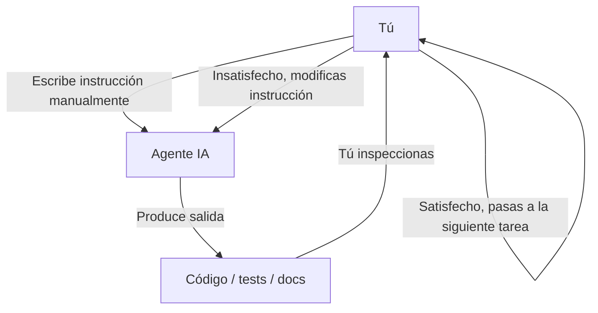
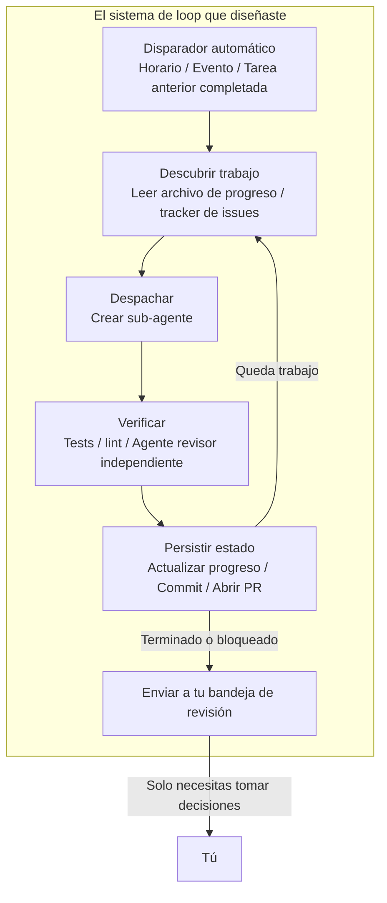
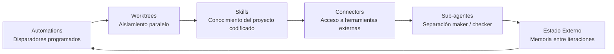
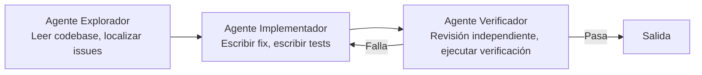
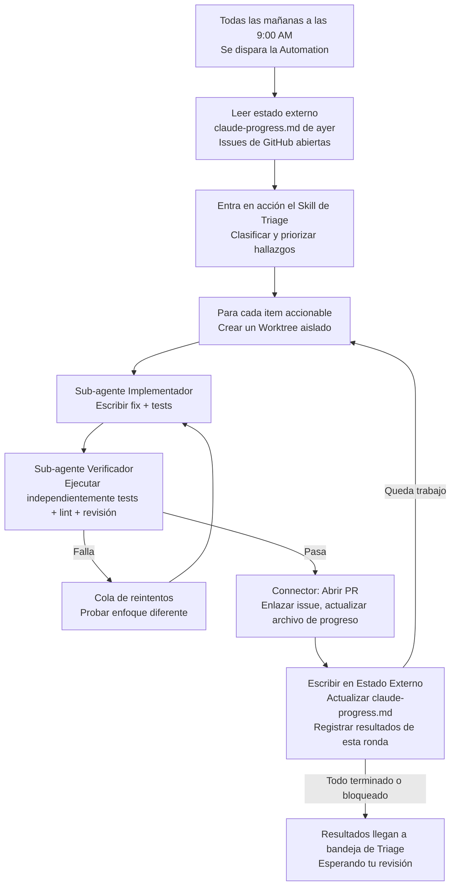
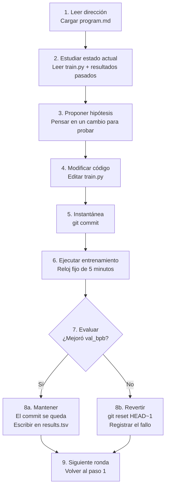

[English Version →](../../../en/lectures/lecture-13-loop-engineering/)

> Ejemplos de código: [code/](https://github.com/walkinglabs/learn-harness-engineering/blob/main/docs/en/lectures/lecture-13-loop-engineering/code/)
> Proyecto práctico: [Proyecto 07. Construye Tu Primer Loop Automatizado](./../../projects/project-07-loop-engineering-first-loop/index.md)

# Lección 13. Del Prompting Manual a los Loops Autónomos

Todo lo que aprendiste en las primeras doce lecciones se basa en un supuesto: **estás sentado frente al teclado, escribiendo instrucciones una a una.**

Escribiste `AGENTS.md` (Lecciones 1–4), construiste gestión del estado (Lecciones 5–6), limitaste el alcance con listas de características (Lecciones 7–8), dejaste handoffs limpios al final de la sesión (Lecciones 9, 12), e hiciste el runtime observable (Lecciones 10–11). Pero el disparador de todo siempre eras tú. El agente nunca decidía por sí mismo cuándo empezar a trabajar — porque nadie presionaba "inicio".

Esta lección trata sobre entregar el botón de inicio al sistema. No se trata de renunciar al control — se trata de elevarlo al siguiente nivel.

## /goal: El Loop Más Simple Posible

La mejor entrada al loop engineering no es un diagrama de arquitectura complejo — es un solo comando.

A principios de 2026, Claude Code y OpenAI Codex lanzaron independientemente la misma característica: `/goal`. Escribes en la terminal:

```
/goal "All tests pass, zero lint warnings, merge to main"
```

Luego cierras tu laptop y te vas a dormir. Ocho horas después, el agente ha analizado, codificado, probado, corregido y fusionado por sí solo. Reintenta ante fallos, cambia de enfoque cuando se atasca, y se detiene cuando termina — sin que tú estés encima diciéndole "inténtalo de nuevo".

La única diferencia entre `/goal` y un prompt tradicional es una cosa. Pero esa cosa lo cambia todo:

| | Prompt Tradicional | `/goal` |
|---|---|---|
| Lo que proporcionas | Qué hacer a continuación | Cómo se ve el estado final |
| Lo que hace el agente | Ejecuta una vez | Itera hasta lograrlo |
| Quién juzga si está terminado | Tú | Una condición de parada verificable |
| Cuándo puedes irte | No puedes | En el momento en que escribes `/goal` |

`/goal` es esencialmente un loop. Tiene exactamente tres partes: **un objetivo, un método de verificación y una condición de parada.** Solo esas tres cosas te mueven de estar dentro del loop a estar fuera.

### Cómo Creció `/goal` Orgánicamente

`/goal` no saltó de 0 a 1 de la nada. Creció gradualmente a partir de flujos de trabajo cotidianos, pasando por aproximadamente cuatro etapas:

**Etapa 1: Prompting manual uno por uno.** La forma más temprana de trabajar era de ida y vuelta: "escribe una función", "añade un test", "arregla esta lógica". El agente se detenía después de cada paso y esperaba a que dijeras qué sigue. Tú eras el planificador de todo el pipeline.

**Etapa 2: Prompts largos con múltiples pasos.** Luego la gente empezó a escribir prompts más largos que apilaban pasos juntos: "primero analiza el código, luego escribe la implementación, luego ejecuta los tests, y si fallan, arréglalos". El agente podía ejecutar varios pasos de una vez, pero aún tenías que vigilar — porque podría desviarse a mitad de camino, o terminar un paso y no saber qué hacer después.

**Etapa 3: Auto-reflexión y autodirección del agente.** Después de eso, los agentes ganaron "introspección" — después de cada paso miraban el resultado y decidían qué hacer a continuación. Tú dabas un objetivo, y ellos lo desglosaban por sí mismos y reintentaban por su cuenta. Pero surgió un problema: ¿cuándo se detienen? ¿Cuenta "ya terminé" viniendo del propio agente? La práctica seguía respondiendo — no. Los agentes declaran victoria con demasiada facilidad.

**Etapa 4: Juicio de parada independiente — `/goal`.** El paso final fue sacar "juzgar si está terminado" de las manos del agente que hace el trabajo, y entregarlo a un juez independiente. Podría ser un modelo diferente, un script, o un comando de test — pero la regla era la misma: la persona que escribe el código no puede calificar su propia tarea. En este punto, `/goal` realmente funcionó: das el objetivo, itera, un juez independiente decide cuándo detenerse, y puedes irte.

Estas cuatro etapas no fueron una hoja de ruta planificada por ninguna empresa. Fueron el camino al que llegó todo el mundo que codifica con agentes, independientemente, impulsado por los mismos puntos de dolor. Que Claude Code y Codex lanzaran `/goal` casi simultáneamente a principios de 2026 no fue una coincidencia — había llegado el momento.

### Hay Más de Un Tipo de Loop

`/goal` es el loop más fácil de entender, pero no es el único tipo. Los loops se clasifican según cómo se activan y cómo se detienen:

| Tipo | Disparador | Condición de Parada | Claude Code | Codex | Mejor Para |
|------|---------|----------------|-------------|-------|----------|
| **Loop basado en turnos** | Escribes cada prompt manualmente | El agente cree que está terminado, o tú lo interrumpes | Chat normal | Chat normal | Tareas pequeñas, trabajo exploratorio |
| **Loop basado en objetivo** | Das un objetivo | Evaluador independiente confirma terminado, o se alcanzan los turnos máximos | `/goal` | `/goal` (requiere activación manual) | Tareas complejas con criterios de finalización claros |
| **Loop basado en tiempo** | Intervalo programado (cada N minutos/horas) | Lo detienes manualmente, o sale después de completar el trabajo | `/loop` | Thread automation | Consultar estado, verificaciones periódicas, trabajo recurrente |
| **Loop impulsado por eventos** | Evento externo (PR abierto, CI fallido, nueva issue) | Se detiene después de manejar el evento, o alcanza el límite de reintentos | Routines (API / GitHub Webhook) | Standalone automation + plugins | Flujos de trabajo reactivos, integración CI/CD |

Estos no compiten — son herramientas diferentes para trabajos diferentes. El basado en turnos está bien para cosas pequeñas. Usa `/goal` cuando hay una línea de meta clara. Usa `/loop` cuando necesitas vigilar algo. Usa el impulsado por eventos cuando te integras con sistemas externos.

### No Confundas `/goal` y `/loop`

Ambos tienen "loop" en el nombre, pero resuelven problemas completamente diferentes:

| | `/goal` | `/loop` |
|---|---------|---------|
| **Qué es** | Una tarea grande, se ejecuta hasta que termina | Una acción pequeña, se repite en un intervalo |
| **Condición de parada** | Objetivo alcanzado, o presupuesto agotado | Lo detienes manualmente, o la tarea sale por sí sola |
| **Perfil temporal** | Una ejecución larga, puede tomar horas o días | Ráfagas cortas periódicas, cada ejecución puede ser de unos minutos |
| **Progreso** | Se acerca más a la línea de meta en cada iteración | Cada ejecución es independiente, no hay progreso acumulativo |
| **Analogía** | Correr un maratón — suena el pistolazo de salida, te detienes en la línea de meta | Un despertador — suena en un horario, lo apagas |
| **Uso típico** | "Implementar el sistema de pagos completo con cobertura de tests" | "Comprobar si la CI está rota cada 15 minutos" |

Un error común: meter algo que debería ser un `/goal` en un `/loop`. Como escribir `/loop 10m "sigue implementando el sistema de pagos"` — eso está mal. `/loop` ejecuta la misma instrucción independientemente cada vez, no recuerda dónde se quedó la última vez. Solo obtendrás el mismo punto de partida una y otra vez.

**Prueba de una frase para saber cuál usar: ¿esta cosa tiene un final?**
- Tiene final → `/goal`
- No tiene final, solo necesitas seguir vigilando → `/loop`

Loop Engineering, el tema de esta lección, no trata sobre ningún comando en particular. Trata sobre **ser capaz de diseñar sistemas que incluyen todos estos tipos — para que tu agente pueda seguir trabajando incluso cuando tú no estás.**

No tienes que escribir `/goal` cada vez. Pero entender de dónde vino y por qué se ve como se ve — eso es entender el núcleo del loop engineering. Los loops más complejos solo añaden partes como planificación, paralelismo, aislamiento y memoria sobre estos mismos tres fundamentos: objetivo, verificación, condición de parada.

## Junio 2026: Tres Personas Encendieron la Mecha en Una Semana

En la primera semana de junio de 2026, tres profesionales que construían infraestructura de agentes de codificación — sin comparar notas — dijeron lo mismo con palabras diferentes.

**Peter Steinberger** (creador de OpenClaw, [su publicación alcanzó 8 millones de vistas](https://x.com/steipete/status/2063697162748260627)): "Ya no deberías estar haciendo prompting a agentes de codificación. Deberías estar diseñando loops que hacen prompting a tus agentes."

**Boris Cherny** (jefe de Claude Code en Anthropic, [en el podcast Acquired](https://x.com/rohanpaul_ai/status/2063289804708835412)): "Ya no le hago prompting a Claude. Tengo loops ejecutándose que le hacen prompting a Claude y descubren qué hacer. Mi trabajo es escribir loops."

**Addy Osmani** (líder de ingeniería en Google Chrome) [nombró el concepto](https://addyosmani.com/blog/loop-engineering/) el 7 de junio de 2026, y le dio una definición de una línea:

> **Loop engineering es reemplazarte a ti mismo como la persona que hace prompting al agente. Diseñas el sistema que lo hace en su lugar.**

Cherny reveló cifras: durante más de 30 días consecutivos, todas las contribuciones de código a Claude Code fueron realizadas autónomamente por IA — 259 PRs fusionados, más del 80% del código de producción autorado por Claude, y una tasa de éxito del 76% en tareas de software de final abierto.

Tres personas. Una semana. La misma conclusión. No porque se coordinaran — sino porque la infraestructura había cruzado silenciosamente un umbral. Los agentes se habían vuelto lo suficientemente confiables como para terminar tareas no triviales sin supervisión. Las primitivas de planificación (`/loop`, `/goal`, cron) ahora estaban integradas en las herramientas. El costo de una sola ejecución de agente había bajado lo suficiente como para que ejecutar uno repetidamente en un temporizador dejara de parecer un desperdicio. Cuando todas las piezas están presentes, el movimiento que las combina se vuelve obvio para todos al mismo tiempo.

> Fuente: [Addy Osmani: Loop Engineering](https://addyosmani.com/blog/loop-engineering/)

## Dentro del Loop vs. Fuera del Loop

Comparemos dos escenarios concretos.

**Escenario A: Estás dentro del loop (Lecciones 1–12).**



Tienes un harness completo: `AGENTS.md` le dice al agente las reglas del proyecto, `feature_list.json` limita el alcance, `init.sh` asegura un entorno consistente, `claude-progress.md` registra el progreso. **Pero cada paso aún requiere tu iniciación manual.** Termina una característica, lee el archivo de progreso, piensa en qué sigue, escribe la instrucción. Tú eres el motor de todo el flujo de trabajo.

**Escenario B: Estás fuera del loop (Loop Engineering).**



Ya no escribes instrucciones. El sistema que diseñaste descubre el trabajo, lo despacha, verifica los resultados, registra el estado y decide el siguiente paso. Tu trabajo se reduce a tres cosas: **definir el objetivo y la condición de parada antes de que empiece, revisar la salida después de que termine, y ajustar las reglas cuando el sistema se desvíe del camino.** El apalancamiento pasa de "escribir el prompt correcto" a "diseñar el loop correcto".

> Osmani: "Hace un año, si querías un loop escribías un montón de bash y mantenías ese montón para siempre y era tuyo y solo tuyo. Ahora las piezas simplemente vienen dentro de los productos." No necesitas construir desde cero. Necesitas entender cómo encajan las piezas.

## Conceptos Clave

- **Loop Engineering**: Diseñar un sistema que automáticamente hace prompting a tu agente, reemplazando la entrada humana manual paso a paso. El humano pasa de estar dentro del loop a estar fuera de él, y el apalancamiento cambia de "escribir el prompt correcto" a "diseñar el loop correcto".
- **Modo `/goal`**: El loop más simple posible — proporciona un objetivo, método de verificación y condición de parada; el agente itera hasta cumplirlos. El puente del prompting manual a los loops autónomos.
- **Separación Generador/Evaluador**: El agente que escribe el código y el agente que lo verifica deben estar separados. Un modelo calificando su propio trabajo no es confiable; un verificador independiente — a veces usando un modelo completamente diferente — es la garantía de confiabilidad básica de cualquier loop.
- **Aislamiento de Worktree**: Cada agente paralelo trabaja en un git worktree independiente, previniendo físicamente colisiones de archivos. El prerrequisito de infraestructura para la ejecución paralela de múltiples agentes.
- **Estado Externo**: Memoria que vive fuera de una sola conversación — archivos markdown, trackers de issues, tableros kanban. Los modelos olvidan todo entre ejecuciones; la memoria debe vivir en el disco.
- **Cuatro Costes Silenciosos**: Cuatro costes ocultos que se vuelven más agudos cuanto más tiempo corre un loop — deuda de verificación, deterioro de la comprensión, rendición cognitiva, explosión de tokens. Los loops aceleran no solo la producción, sino también el riesgo.

## Las Seis Primitivas de un Loop

Osmani descompuso un loop en cinco bloques de construcción centrales, más una capa de memoria que atraviesa todos ellos — seis cosas en total, pero la capa de memoria ocupa un estatus especial: no es un componente al mismo nivel que los demás; es la columna vertebral de la que depende todo lo demás.

El diagrama siguiente dibuja las seis como un anillo para que puedas ver el panorama completo de un vistazo. Pero recuerda: el Estado Externo no es solo otra parada en el loop — es la base sobre la que descansa todo el loop.



### 1. Automations — El Latido

Sin automatización, un loop no es un loop — es una ejecución única que hiciste manualmente.

Tanto Claude Code como Codex tienen sistemas de planificación completos, pero usan nombres y capas diferentes. Mapeando aproximadamente de más ligero a más pesado:

| Capa | Claude Code | Codex | Notas |
|-------|-------------|-------|-------|
| Sondeo en sesión | `/loop` | Thread automation | Vinculado a la sesión actual, muere cuando la sesión se cierra |
| Tareas programadas locales | Desktop scheduled tasks | Standalone automation (modo local) | Se ejecuta mientras la máquina está encendida, puede acceder a archivos locales |
| Tareas programadas en la nube | Cloud Routines | — (sin planificador nativo en nube) | Se ejecuta mientras la máquina está apagada |
| Disparadores de eventos | Routines (API / GitHub Webhook) | Standalone automation + plugins | Activados por eventos externos |
| Totalmente auto-hospedado | GitHub Actions / cron auto-hospedado | `codex exec` + cron | Control total |

**La pestaña Automations de Codex** es el punto de entrada de la planificación. Elige el proyecto, el prompt, la cadencia, y si se ejecuta en tu checkout local o en un worktree en segundo plano. Las ejecuciones que encuentran algo llegan a una bandeja de Triage; las que no encuentran nada se archivan automáticamente. OpenAI los usa internamente para el triaje diario de issues, resúmenes de fallos de CI, informes de commits, y búsqueda de bugs introducidos la semana pasada.

Las automations de Codex vienen en dos sabores:
- **Thread automation** — Llamadas de atención recurrentes estilo latido adjuntas a un hilo, preservando el contexto. Bueno para el seguimiento continuo de una sola cosa, como monitorear un comando de larga ejecución o consultar el estado de un PR. El equivalente en Claude Code es `/loop`.
- **Standalone automation** — Cada ejecución empieza de cero, los resultados van a Triage. Bueno para tareas independientes diarias/semanales como informes o escaneos de dependencias. El equivalente en Claude Code es Desktop scheduled tasks.

El sistema de Claude Code está estratificado más granularmente:

- **`/loop`** — Repetición programada ligera en sesión. Funciona mientras tu terminal está abierta, muere cuando la sesión se cierra, expira automáticamente después de 7 días. Bueno para monitoreo temporal durante tu sesión de trabajo actual.
- **Desktop scheduled tasks** — Se ejecuta mientras tu máquina está encendida, sobrevive a reinicios de sesión, intervalos a nivel de minuto. Bueno para trabajo recurrente que necesita acceso a archivos locales.
- **Cloud Routines** — Se ejecuta en la infraestructura en la nube de Anthropic, sobrevive a que tu máquina esté apagada, intervalo mínimo de 1 hora. Soporta tres tipos de disparadores: programado, llamada API, webhook de GitHub. Bueno para tareas diarias que no necesitan tu entorno local.
- **GitHub Actions / cron auto-hospedado** — Totalmente bajo tu control, se ejecuta como quieras. Bueno para escenarios con requisitos especiales de entorno o seguridad.

```bash
# Claude Code: ejecutar tests cada 30 min, arreglar fallos (dentro de la sesión actual)
/loop 30m Run the test suite and fix any failing tests

# Claude Code: comprobar estado del deploy cada 15 minutos
/loop 15m Check if the production deploy succeeded and report status
```

Las automations son el latido. Sin ellas, el loop es un plano que nunca despierta.

### 2. Worktrees — Aislamiento a Escala

En cuanto ejecutas más de un agente, las colisiones de archivos se convierten en el modo de fallo inevitable. Dos agentes escribiendo en el mismo archivo es exactamente el dolor de cabeza de dos ingenieros haciendo commit en las mismas líneas sin consultarse.

`git worktree` resuelve esto: cada agente trabaja en su propia rama en su propio directorio. Físicamente no pueden tocar el checkout del otro.

Tanto Claude Code como Codex incluyen soporte para worktree. Cuando usas `--worktree` o `isolation: worktree` en un sub-agente, cada ayudante obtiene un checkout limpio e independiente que se limpia solo después. Los worktrees eliminan el problema mecánico de colisión — pero recuerda: **tu ancho de banda de revisión sigue siendo el techo.** Cuántos agentes paralelos puedes supervisar determina cuántos worktrees puedes realmente ejecutar.

### 3. Skills — Deja de Re-Explicar Tu Proyecto

Un skill es cómo dejas de re-explicar el mismo contexto del proyecto cada sesión. Es una carpeta que contiene un `SKILL.md` con instrucciones y metadatos, además de scripts opcionales, referencias y activos.

Codex y Claude Code soportan el mismo formato. Los skills se invocan directamente con `/skill-name` (Codex también soporta `$skill-name`), o se activan implícitamente cuando la tarea coincide con la descripción del skill.

Los skills son fundamentalmente sobre pagar tu deuda de intención. Un agente empieza cada sesión en frío — llena cualquier hueco en tu intención con una suposición segura. Un skill es esa intención escrita por fuera: las convenciones, los pasos de compilación, el "no lo hacemos así por aquel incidente" — escritos una vez, leídos en cada ejecución.

### 4. Connectors — Tu Loop Toca Herramientas Reales

Un loop que solo puede ver el sistema de archivos es un loop pequeño. Los connectors (construidos sobre el protocolo MCP) permiten al agente leer tu tracker de issues, consultar una base de datos, llamar a una API de staging, dejar un mensaje en Slack.

Tanto Codex como Claude Code hablan MCP, así que el connector que escribiste para uno usualmente funciona en el otro. Los connectors son la diferencia entre "aquí está la solución" y un loop que abre el PR, enlaza el ticket de Linear, y avisa al canal una vez que la CI está en verde — por sí solo, dentro de tu entorno real, no solo en una terminal.

### 5. Sub-agentes — Mantén al Maker Lejos del Checker

La elección de diseño con mayor valor estructural en un loop es separar a quien escribe de quien verifica. El modelo que escribió el código es demasiado generoso calificando su propia tarea. Un segundo agente, con instrucciones diferentes y a veces un modelo diferente, atrapa lo que el primer agente se convenció a sí mismo.

La clásica división de tres roles:



El `/goal` de Claude Code ejecuta esto por debajo — una sesión nueva e independiente juzga si el loop debe detenerse, no la sesión que hizo el trabajo. Esto se llama **separación generador/evaluador**, y es la garantía de confiabilidad más importante en el diseño de loops.

### 6. Estado Externo — La Memoria del Loop

Los modelos olvidan todo entre ejecuciones. La memoria debe vivir en el disco, no en la ventana de contexto.

Esto suena demasiado simple para importar, pero es el mismo truco del que depende todo agente de larga ejecución. Un archivo markdown, un tablero de Linear — cualquier cosa que viva fuera de una sola conversación y mantenga lo que está hecho, lo que está en progreso y lo que sigue. El agente olvida. El repositorio no.

Estas seis primitivas son tu kit de herramientas de diseño de loops. No las necesitas todas para cada loop. Pero necesitas saber cuándo usar cuál.

## Un Loop Completo, Anatomizado

Conecta las seis y así es como se ve un loop real de triaje matutino:



Esto ya no es una sola ejecución de agente. Es un sistema que opera continuamente que se despierta cada mañana, barre el piso por sí solo, y pone las cosas que necesitan tu atención frente a ti. Tu rol se convierte en: **revisar el contenido de la bandeja, tomar decisiones, y cuando detectes un patrón que el sistema no puede manejar, refinar los skills y las reglas.**

Cherny usó este patrón para fusionar 259 PRs en 30 días sin abrir un IDE ni una vez. Los ingenieros de OpenAI usaron el mismo patrón para construir un producto beta de aproximadamente un millón de líneas a mano — sin escribir una sola línea de código ellos mismos.

## Separación Generador/Evaluador: Por Qué No Puedes Dejar que el Modelo Califique Su Propio Trabajo

Esta es la lección más difícil en loop engineering.

Tu agente más inteligente escribe un pedazo de código hermoso. La lógica es clara, los comentarios son exhaustivos, y cada función tiene un test. Estás satisfecho.

Pero aquí está la pregunta: **si dejas que el agente que escribió ese código juzgue si hizo un buen trabajo, ¿qué dirá?**

La respuesta ha sido confirmada por la experiencia una y otra vez: se dará a sí mismo una puntuación alta. No porque sea deshonesto, sino porque es el autor — se convenció a sí mismo de que este camino era correcto durante la generación. Cuando mira atrás, no ve errores; ve su propio proceso de razonamiento.

Esto no es un problema de Claude. Esto no es un problema de GPT. Esto es una propiedad de todos los modelos generativos. **Un modelo es el mejor abogado defensor de su propia salida.**

La solución: nunca dejes que la misma entidad (mismo modelo, mismo prompt) haga tanto el trabajo como la revisión.

- El `/goal` de Claude Code usa una sesión supervisora independiente para juzgar si se cumple el objetivo — no la sesión que lo intentó.
- El sistema de sub-agentes de Codex te permite definir un agente verificador usando un modelo diferente con diferente esfuerzo de razonamiento.
- La práctica comunitaria de "adversarial verify" genera N escépticos independientes por hallazgo, cada uno con el prompt de refutar — el rechazo por mayoría mata el hallazgo.

Una frase para recordar: **alguien en tu equipo no debe creerte.**

## El autoresearch de Karpathy: El Ejemplo de Loop

Si quieres ver cómo se ve un loop bien diseñado y realmente en ejecución, [el autoresearch de Karpathy](https://github.com/karpathy/autoresearch) es el ejemplo de libro de texto.

En marzo de 2026, Karpathy lanzó un proyecto Python de 630 líneas. Dale una GPU y una dirección de investigación, y corre toda la noche — completando cientos de experimentos de entrenamiento de ML, quedándose solo con los que realmente mejoran. El proyecto alcanzó 66,000+ estrellas en pocos días después del lanzamiento.

### Tres Archivos, Tres Roles

Todo el sistema tiene solo tres archivos centrales, pero la división del trabajo es nítida:

| Archivo | Quién lo Edita | Qué Hace |
|------|-------------|-------------|
| `prepare.py` | Nadie (solo lectura) | Preparación de datos, tokenizador, harness de evaluación. Infraestructura fija. |
| `train.py` (~630 líneas) | **Agente IA** | Definición del modelo, optimizador, loop de entrenamiento. El patio de juegos del agente — cambia cualquier cosa. |
| `program.md` | **Tú** | Metodología de investigación escrita en lenguaje natural. Tú solo editas esto. Dile al agente cómo explorar, cómo evaluar, qué no tocar. |

Esta división de tres vías es el alma del diseño: **los humanos no tocan el código, tocan la dirección; los agentes no tocan la dirección, tocan el código.** Tu trabajo pasa de escribir Python a "escribir la cultura de la organización de investigación".

### Entrada: Cómo se Ve program.md

`program.md` es el cerebro del loop. No es código — es un manual de instrucciones de investigación escrito en Markdown. Contiene aproximadamente:

- **Objetivo**: optimizar `val_bpb` (bits por byte de validación, menor es mejor)
- **Restricciones**: no tocar `prepare.py`, mantenerse dentro del presupuesto de VRAM, entrenamiento fijo de 5 minutos
- **Direcciones de exploración**: probar diferentes arquitecturas, optimizadores, horarios de LR
- **Reglas de evaluación**: qué cuenta como mejora, cómo registrar resultados, qué hacer ante fallos
- **Regla de hierro**: nunca te detengas. Una vez que el loop empieza, sigue para siempre

Tu prompt de inicio al agente puede ser tan corto como una oración:

```
Have a look at program.md and let's kick off a new experiment!
```

Lo demás depende del agente leyendo el documento y tomando sus propias decisiones.

### El Loop de Ratchet de Nueve Pasos

En el corazón de autoresearch hay un **ratchet** — solo se mueve hacia adelante, nunca hacia atrás. Cada iteración sigue estrictamente nueve pasos:



Ejecuta aproximadamente 12 experimentos por hora. Una ejecución nocturna (8 horas) son unos 100 experimentos. El propio Karpathy lo ejecutó durante 2 días — ~700 experimentos.

El presupuesto fijo de 5 minutos de reloj es una elección de diseño clave — sin importar lo que cambie el agente, cada experimento toma exactamente el mismo tiempo. Esto significa que todos los resultados son directamente comparables bajo el mismo presupuesto de tiempo — sin discusiones sobre "este corrió más tiempo así que es mejor".

### Salida: Lo Que Ves Cuando Te Despiertas

Después de una noche de iteraciones, te sientas por la mañana y encuentras tres cosas:

**1. Historial de Git (el ratchet que avanza)**

Solo los commits que realmente mejoraron se quedan en la rama principal. Todo lo que falló fue revertido. `git log` es un registro de investigación validado.

**2. results.tsv (el registro completo de experimentos)**

Cada solo experimento — éxito o fracaso — está registrado:

```
timestamp    commit_hash    val_bpb    vram_mb    description
--------- ------------- ---------- ---------- ----------------------------
08:01:12  a1b2c3d       1.234     22100    baseline
08:06:15  d4e5f6g       1.228     22400    increased learning rate by 10%
08:11:20  (reverted)     1.241     21800    switched to GELU activation
08:16:08  h7i8j9k       1.219     23000    added weight decay 0.01
...
```

**3. Un registro de investigación (resumen del propio agente)**

El agente escribe mensajes de commit claros sobre lo que probó, lo que funcionó, lo que no, y lo que planea probar a continuación. Tú lees esos — no tienes que leer los diffs de código.

### Lo Que Realmente Encontró

Resultados de la ejecución inicial de 2 días y ~700 experimentos de Karpathy:

- De ~700 intentos, se encontraron aproximadamente **20 mejoras reales acumulables**
- Redujo el tiempo de entrenamiento a nivel GPT-2 de nanochat en 8×H100 de **2.02 horas → 1.80 horas**, aproximadamente **11% más rápido**
- Los hallazgos incluyeron: ajustes de tasa de aprendizaje, afinación de optimizador, cambios de activación, optimizaciones de patrón de atención, etc.

¿Fueron todas las mejoras descubrimientos trascendentales? No. La mayoría fueron pequeñas optimizaciones que se acumularon. Pero esas 20 mejoras válidas le habrían tomado a un investigador humano semanas de trabajo manual — el agente lo hizo en 48 horas.

### El Detalle Más Revelador: El Loop Está Escrito en Inglés, No en Código.

`program.md` es un documento Markdown, no un script de Python. Describe una metodología de investigación — qué modificar, qué dejar en paz, cómo evaluar, cómo manejar casos de fallo, y una regla de hierro: **nunca pidas ayuda humana, solo sigue adelante.** Un agente de codificación lee este documento y lo ejecuta indefinidamente.

Esta es la plantilla para el loop engineering: no le des al agente una tarea. Dale una **metodología**. Deja que la metodología sea el loop. Un `program.md`, 630 líneas de código de pegamento, y todo lo demás es el agente ejecutándose a sí mismo.

## Cuatro Costes Silenciosos

Cuando un loop empieza a ejecutarse, no verás los problemas inmediatamente. Los siguientes cuatro costes se acumulan silenciosamente, y para cuando te des cuenta, puede que ya hayas pagado caro.

### 1. Deuda de Verificación

Los loops rápidos te tientan a saltarte la verificación. "Se ve bien" no es lo mismo que "confirmado correcto". Cuanto más código genera un loop sin supervisión, más rápido se acumula la deuda de verificación. La solución: **las condiciones de parada deben ser comprobables por máquina, nunca "se siente más o menos bien".**

### 2. Deterioro de la Comprensión

Cuanto más rápido envía código un loop, más se aleja tu comprensión de tu propia base de código de la realidad. El equipo de Cherny tenía el 80% del código autorado por agentes — lo que significa que la mayor parte del código de un equipo no fue escrito por una persona. Si no lees y usas lo que produce el loop, tu comprensión decae continuamente. **Los loops rápidos requieren lectura rápida.**

### 3. Rendición Cognitiva

Cuando el loop corre sin problemas, la postura más cómoda es dejar de tener opiniones. Toma lo que sea que devuelva, no pienses en la salida. Pero ahí es exactamente donde empieza el peligro — estás usando el loop para evitar pensar, en lugar de amplificar el pensamiento. La advertencia de Osmani: "Dos personas pueden construir exactamente el mismo loop y obtener resultados opuestos. Uno lo usa para ir más rápido en trabajo que entiende; el otro lo usa para evitar entender el trabajo. El loop no sabe la diferencia. Tú sí."

### 4. Explosión de Tokens

Cada iteración de un loop acumula más contexto: código escrito, errores encontrados, decisiones tomadas. Sin gestión del contexto, el tamaño del prompt crece aproximadamente cuadráticamente con el número de turnos. Codex aborda esto con la compactación automática de contexto — una API dedicada comprime los turnos de conversación antiguos en resúmenes de contenido cifrados, reteniendo el conocimiento esencial mientras descarta el detalle redundante. Esto es una preocupación de ingeniería que debes abordar desde el primer loop, no un añadido posterior.

## Construyendo Tu Primer Loop

No necesitas empezar con un pipeline a escala de Stripe fusionando 1,300 PRs a la semana. Empieza con lo más pequeño que funcione.

### Paso 1: Elige Una Tarea Recurrente

Encuentra algo que hagas manualmente al menos dos veces por semana. Ejemplos:
- Abrir GitHub por la mañana, comprobar nuevas issues, triar y responder
- Ejecutar lint y tests antes de cada revisión de PR
- Actualizar docs de progreso al final de cada día

### Paso 2: Escribe un Objetivo y una Condición de Parada

Convierte la tarea en algo que un `/goal` pueda entender:

```markdown
Goal: Check the 10 most recent issues in the repo.
For each issue:
  - If it already has clear labels and an assignee, skip
  - If untagged, add appropriate labels based on content
  - If fixable in under 10 minutes, create a branch and attempt a fix
Stop when: All qualifying issues have been processed, or an issue requires human decision.
```

### Paso 3: Separa Maker y Checker

No dejes que el mismo agente escriba el código y lo juzgue. Divide tu loop en dos roles:
- Implementador: lee la issue, escribe el fix, escribe los tests
- Verificador: ejecuta tests independientemente, revisa el diff, juzga si el fix realmente resuelve el problema

### Paso 4: Añade Memoria

Usa un archivo markdown para registrar lo que pasó en cada ejecución del loop. La siguiente ejecución empieza leyendo este archivo — sabe lo que se hizo, lo que está pendiente, lo que estaba bloqueado. Esto supera a cualquier base de datos compleja.

### Paso 5: Pon un Temporizador

Usa `/loop` o el cron de tu SO para dejar que el loop empiece sin ti. Empieza con una vez al día. Observa durante una semana.

### La Escalera de Madurez

No necesitas llegar a la cima de un salto. La adopción de loops es una escalera:

1. **Nivel 1: Ejecutor de Objetivos** — Puedes usar `/goal` para dar una tarea con una condición de parada; el agente itera hasta cumplirla.
2. **Nivel 2: Tarea Única Programada** — Una automatización ejecuta una tarea en un temporizador (ej., comprobación matutina de CI).
3. **Nivel 3: Loop de Múltiples Agentes** — Separación de maker y checker; cada hallazgo crea un worktree aislado.
4. **Nivel 4: Loop Auto-Alimentado** — El loop descubre automáticamente su siguiente tarea a partir del estado externo; decide qué hacer a continuación.
5. **Nivel 5: Orquestación de Flota** — Múltiples loops se ejecutan en paralelo, independientes pero compartiendo una capa de memoria.

La mayoría de los equipos están actualmente entre el Nivel 2 y el Nivel 3. El Nivel 1 es el camino más rápido para ver retornos.

## Puntos Clave

- **Loop Engineering no reemplaza a Harness Engineering — construye un piso encima.** El harness hace que las ejecuciones individuales sean confiables. El loop hace que las ejecuciones continuas sean autónomas.
- **`/goal` es el loop más simple posible:** objetivo + verificación + condición de parada. Esas tres cosas te mueven de estar dentro del loop a estar fuera de él.
- **Seis primitivas (Automations / Worktrees / Skills / Connectors / Sub-agentes / Estado Externo) son los bloques de construcción del loop.** No todas cada vez, pero necesitas saber cuándo usar cuál.
- **El maker y el checker deben estar separados.** Un modelo calificando su propio trabajo no es confiable. Un verificador independiente — a veces un modelo completamente diferente — es la garantía de confiabilidad básica de cualquier loop.
- **Los loops hacen que la generación sea casi gratuita y dejan el juicio como el recurso escaso.** El tiempo que ahorras no es para descansar. Es para tomar más juicios.
- **Cuatro costes silenciosos se vuelven más agudos cuanto más tiempo corren los loops:** deuda de verificación, deterioro de la comprensión, rendición cognitiva, explosión de tokens. Los loops aceleran la producción — y el riesgo.
- **Empieza pequeño.** Un `/goal`, un cron, un archivo markdown de memoria. Ve el retorno, luego acumula hacia arriba.

## Lectura Adicional

- [Addy Osmani: Loop Engineering](https://addyosmani.com/blog/loop-engineering/)
- [Addy Osmani: Agent Harness Engineering](https://addyosmani.com/blog/agent-harness-engineering/)
- [Simon Willison: Designing Agentic Loops (Sep 2025)](https://simonw.substack.com/p/designing-agentic-loops)
- [Karpathy: autoresearch](https://github.com/karpathy/autoresearch)
- [Claude Code: Dynamic Workflows and Orchestration](https://kenhuangus.substack.com/p/claude-code-orchestration-dynamic)
- [Loop Library (Forward Future)](https://signals.forwardfuture.ai/loop-library/) — Corpus público de 50 loops reales
- [The Neuron: Claude Code Creators on Agent Loops](https://www.theneuron.ai/explainer-articles/claude-code-creators-boris-cherny-and-cat-wu-explain-how-to-use-agent-loops/)
- Lección 12: [Deja un Handoff Limpio al Final de Cada Sesión](./../lecture-12-why-every-session-must-leave-a-clean-state/index.md) — El prerrequisito para los loops: cada sesión deja un estado limpio para que la siguiente ronda pueda auto-iniciarse
- Lección 5: [Mantén las Tareas de Larga Ejecución Continuas Entre Sesiones](./../lecture-05-why-long-running-tasks-lose-continuity/index.md) — Conocimiento previo para estado externo y memoria
- Lección 11: [Por Qué la Observabilidad Pertenece Dentro del Harness](./../lecture-11-why-observability-belongs-inside-the-harness/index.md) — Cuanto más rápido corre un loop, más necesitas observabilidad para detectar problemas
- Lección 8: [Por Qué las Listas de Características Son Primitivas del Harness](./../lecture-08-why-feature-lists-are-harness-primitives/index.md) — Las listas de características son la fuente de datos natural para que un loop auto-alimentado descubra su siguiente tarea

## Ejercicios

1. **Convierte una tarea recurrente en un `/goal`:** Encuentra algo que hagas manualmente al menos dos veces por semana. Escribe su objetivo, método de verificación y condición de parada. Ejecútalo una vez con `/goal` y compara el tiempo y la calidad contra hacerlo manualmente. Este es tu primer paso de Harness a Loop.

2. **Separa maker y checker:** Elige una tarea que hayas tenido previamente un agente ejecutando. Esta vez, escribe dos prompts diferentes: uno para el agente implementador y otro para el agente verificador (usa modelos diferentes — ej., Claude para implementación, GPT para verificación, o viceversa). El verificador debe señalar problemas específicos con evidencia citada. Registra el número y tipo de problemas encontrados en cada modo.

3. **Dale a tu loop una memoria:** Crea un archivo de estado markdown para tu loop. En cada iteración, escribe: lo que se hizo esta ronda, resultados de verificación, estado (pass/fail/bloqueado), y qué hacer a continuación. Ejecuta tres rondas y observa la diferencia de comportamiento entre tener y no tener un archivo de memoria.

4. **Audita los costes silenciosos de tu loop:** Después de que tu loop haya estado corriendo durante una hora, evalúa estas cuatro métricas:
   - ¿Cuánta verificación fue "se siente bien" en lugar de "confirmada por máquina"? (Deuda de verificación)
   - ¿Qué tan bien puedes explicar el código que tu loop produjo más recientemente? (Deterioro de la comprensión)
   - ¿Cuántas veces pensaste "lo veré más tarde" y nunca lo viste? (Rendición cognitiva)
   - ¿Cómo está tendiendo el tamaño del contexto del loop? ¿Está repitiendo información redundante? (Explosión de tokens)
