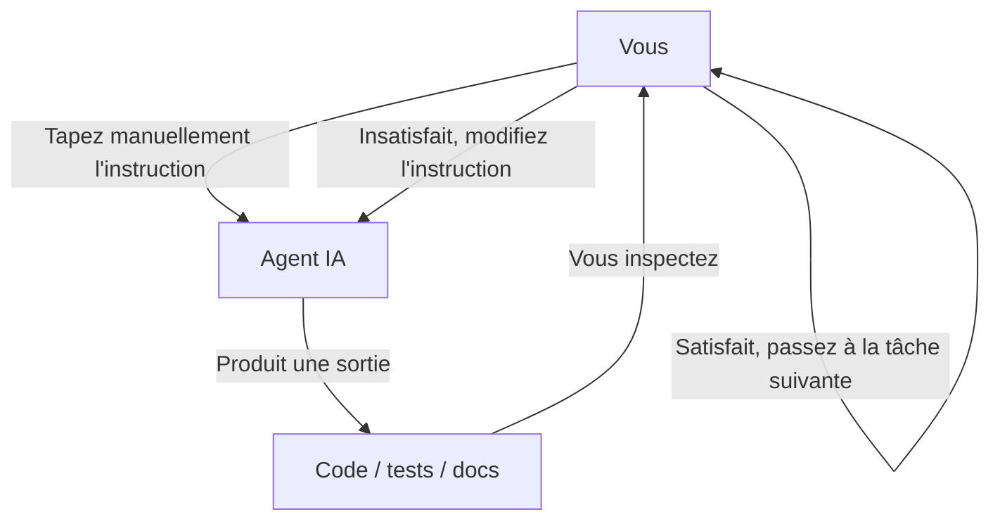
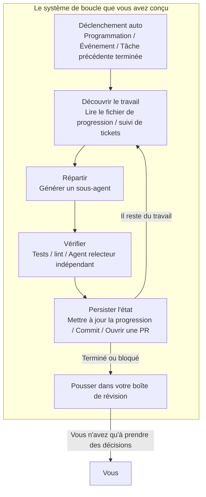
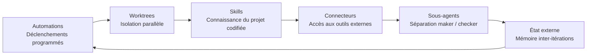
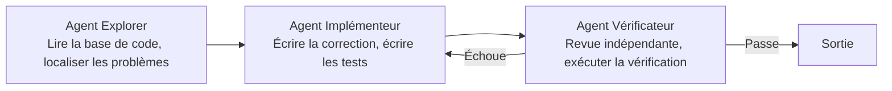
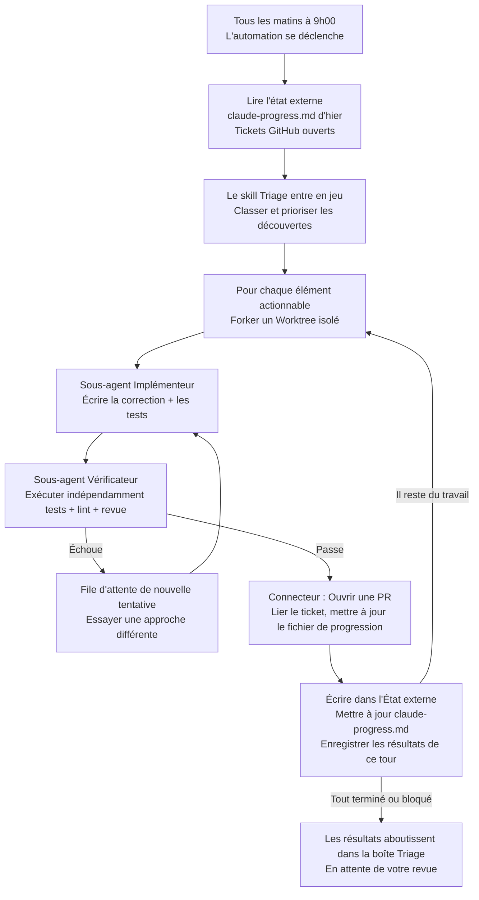
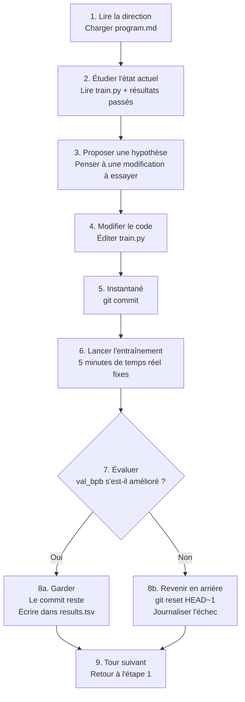

[English Version →](../../../en/lectures/lecture-13-loop-engineering/)

> Exemples de code : [code/](https://github.com/walkinglabs/learn-harness-engineering/blob/main/docs/en/lectures/lecture-13-loop-engineering/code/)
> Projet pratique : [Projet 07. Construisez votre première boucle automatisée](./../../projects/project-07-loop-engineering-first-loop/index.md)

# Cours 13. Du prompting manuel aux boucles autonomes

Tout ce que vous avez appris dans les douze premiers cours repose sur une hypothèse : **vous êtes assis devant le clavier, en tapant des instructions une par une.**

Vous avez écrit `AGENTS.md` (Cours 1–4), construit la gestion d'état (Cours 5–6), contraint le périmètre avec des listes de fonctionnalités (Cours 7–8), laissé des transferts propres à la fin de chaque session (Cours 9, 12), et rendu l'exécution observable (Cours 10–11). Mais le déclencheur de tout cela, c'était toujours vous. L'agent ne décidait jamais seul de commencer à travailler — car personne n'avait appuyé sur « démarrer ».

Ce cours porte sur la remise du bouton de démarrage au système. Pas abandonner le contrôle — l'élever au niveau suivant.

## /goal : La boucle la plus simple possible

La meilleure entrée en matière d'ingénierie des boucles n'est pas un diagramme d'architecture complexe — c'est une seule commande.

Au début de 2026, Claude Code et OpenAI Codex ont lancé indépendamment la même fonctionnalité : `/goal`. Vous tapez dans le terminal :

```
/goal "Tous les tests passent, zéro avertissement lint, fusionner dans main"
```

Puis vous fermez votre ordinateur portable et allez dormir. Huit heures plus tard, l'agent a analysé, codé, testé, corrigé et fusionné de lui-même. Il réessaie en cas d'échec, change d'approche quand il est bloqué, et s'arrête quand c'est terminé — sans que vous ne le surveilliez en lui disant « réessaie ».

La seule différence entre `/goal` et un prompt traditionnel, c'est une chose. Mais cette chose change tout :

| | Prompt traditionnel | `/goal` |
|---|---|---|
| Ce que vous fournissez | Quoi faire ensuite | À quoi ressemble l'état final |
| Ce que fait l'agent | Exécuter une fois | Boucler jusqu'à l'atteinte du but |
| Qui juge la fin | Vous | Une condition d'arrêt vérifiable |
| Quand vous pouvez vous en aller | Vous ne pouvez pas | Au moment où vous tapez `/goal` |

`/goal` est essentiellement une boucle. Elle comporte exactement trois parties : **un but, une méthode de vérification et une condition d'arrêt.** Rien que ces trois choses vous font passer de l'intérieur à l'extérieur de la boucle.

### Comment `/goal` a grandi organiquement

`/goal` n'est pas apparu de nulle part. Il a grandi progressivement à partir des flux de travail quotidiens, passant par environ quatre étapes :

**Étape 1 : Prompting manuel un par un.** La première façon de travailler était l'aller-retour : « écris une fonction », « ajoute un test », « corrige cette logique ». L'agent s'arrêtait après chaque étape et attendait que vous disiez ce qu'il faut faire ensuite. Vous étiez l'ordonnanceur de tout le pipeline.

**Étape 2 : Longs prompts avec plusieurs étapes.** Puis les gens ont commencé à écrire des prompts plus longs qui empilaient les étapes : « d'abord analyser le code, puis écrire l'implémentation, puis lancer les tests, et s'ils échouent, les corriger ». L'agent pouvait exécuter plusieurs étapes d'un coup, mais vous deviez toujours surveiller — car il pouvait dévier en cours de route, ou terminer une étape sans savoir quoi faire ensuite.

**Étape 3 : Auto-réflexion et auto-direction de l'agent.** Après cela, les agents ont acquis l'« introspection » — après chaque étape, ils regardaient le résultat et décidaient de la suite. Vous donniez un but, et ils le décomposaient eux-mêmes et réessayaient seuls. Mais un problème a émergé : quand s'arrêtent-ils ? Est-ce que « j'ai terminé » venant de l'agent lui-même compte ? La pratique a toujours répondu — non. Les agents déclarent la victoire beaucoup trop facilement.

**Étape 4 : Jugement d'arrêt indépendant — `/goal`.** L'étape finale a été de retirer « juger si c'est terminé » des mains de l'agent qui fait le travail, et de le remettre à un juge indépendant. Ça pouvait être un modèle différent, un script, ou une commande de test — mais la règle était la même : la personne qui écrit le code ne peut pas noter ses propres devoirs. À ce stade, `/goal` a vraiment fonctionné : vous donnez le but, il boucle, un juge indépendant décide quand s'arrêter, et vous pouvez vous en aller.

Ces quatre étapes n'étaient pas une feuille de route planifiée par une entreprise. C'était le chemin que tous ceux qui codaient avec des agents ont emprunté, indépendamment, poussés par les mêmes points de douleur. Ce que Claude Code et Codex aient lancé `/goal` presque simultanément au début de 2026 n'était pas une coïncidence — le temps était venu.

### Il n'y a pas qu'un seul type de boucle

`/goal` est la boucle la plus facile à comprendre, mais ce n'est pas la seule. Les boucles se classent en catégories selon la façon dont elles sont déclenchées et dont elles s'arrêtent :

| Type | Déclencheur | Condition d'arrêt | Claude Code | Codex | Idéal pour |
|------|---------|----------------|-------------|-------|----------|
| **Boucle par tour** | Vous tapez chaque prompt manuellement | L'agent pense avoir terminé, ou vous l'interrompez | Chat normal | Chat normal | Petites tâches, travail exploratoire |
| **Boucle par but** | Vous donnez un but | Un évaluateur indépendant confirme la fin, ou le nombre maximum de tours est atteint | `/goal` | `/goal` (activation manuelle requise) | Tâches complexes avec critères d'achèvement clairs |
| **Boucle temporelle** | Intervalle programmé (toutes les N minutes/heures) | Vous l'arrêtez manuellement, ou elle se termine après avoir fini le travail | `/loop` | Thread automation | Sondage d'état, vérifications périodiques, travail récurrent |
| **Boucle pilotée par événement** | Événement externe (PR ouverte, CI échouée, nouveau ticket) | S'arrête après avoir traité l'événement, ou atteint la limite de tentatives | Routines (API / GitHub Webhook) | Standalone automation + plugins | Flux de travail réactifs, intégration CI/CD |

Ce ne sont pas des concurrents — ce sont des outils différents pour des travaux différents. La boucle par tour convient pour les petites choses. Utilisez `/goal` quand il y a une ligne d'arrivée claire. Utilisez `/loop` quand vous devez surveiller quelque chose. Utilisez la boucle pilotée par événement quand vous intégrez des systèmes externes.

### Ne confondez pas `/goal` et `/loop`

Les deux ont « boucle » dans le nom, mais elles résolvent des problèmes complètement différents :

| | `/goal` | `/loop` |
|---|---------|---------|
| **Ce que c'est** | Une grande tâche, s'exécute jusqu'à ce qu'elle soit terminée | Une petite action, se répète à intervalle régulier |
| **Condition d'arrêt** | But atteint, ou budget épuisé | Vous l'arrêtez manuellement, ou la tâche se termine d'elle-même |
| **Profil temporel** | Une longue exécution, peut prendre des heures ou des jours | Courtes rafales périodiques, chaque exécution peut durer quelques minutes |
| **Progression** | Se rapproche de la ligne d'arrivée à chaque itération | Chaque exécution est indépendante, pas de progression cumulative |
| **Analogie** | Courir un marathon — le coup de feu de départ retentit, vous vous arrêtez à la ligne d'arrivée | Un réveil — sonne selon un horaire, vous l'éteignez |
| **Utilisation typique** | « Implémenter le système de paiement complet avec une couverture de test » | « Vérifier si la CI est cassée toutes les 15 minutes » |

Une erreur courante : fourrer quelque chose qui devrait être un `/goal` dans un `/loop`. Comme écrire `/loop 10m "continuez à implémenter le système de paiement"` — c'est faux. `/loop` exécute la même instruction indépendamment à chaque fois, il ne se souvient pas de là où il s'était arrêté la dernière fois. Vous obtiendrez juste le même point de départ encore et encore.

**Test en une phrase pour savoir lequel utiliser : est-ce que cette chose a une fin ?**
- A une fin → `/goal`
- Pas de fin, vous avez juste besoin de continuer à surveiller → `/loop`

L'ingénierie des boucles, sujet de ce cours, ne concerne pas une commande en particulier. Il s'agit de **pouvoir concevoir des systèmes qui incluent tous ces types — afin que votre agent puisse continuer à travailler même quand vous n'êtes pas là.**

Vous n'avez pas à taper `/goal` à chaque fois. Mais comprendre d'où il vient et pourquoi il a cette apparence — c'est comprendre le cœur de l'ingénierie des boucles. Les boucles plus complexes ajoutent simplement des éléments comme la planification, le parallélisme, l'isolation et la mémoire sur ces mêmes trois fondamentaux : but, vérification, condition d'arrêt.

## Juin 2026 : Trois personnes ont allumé la même mèche en une semaine

La première semaine de juin 2026, trois praticiens construisant une infrastructure d'agents de codage — sans se consulter — ont dit la même chose avec des mots différents.

**Peter Steinberger** (créateur d'OpenClaw, [son post a atteint 8 millions de vues](https://x.com/steipete/status/2063697162748260627)) : « Vous ne devriez plus faire de prompting à des agents de codage. Vous devriez concevoir des boucles qui font du prompting à vos agents. »

**Boris Cherny** (responsable de Claude Code chez Anthropic, [sur le podcast Acquired](https://x.com/rohanpaul_ai/status/2063289804708835412)) : « Je ne fais plus de prompting à Claude. J'ai des boucles qui tournent et qui font du prompting à Claude et trouvent quoi faire. Mon travail, c'est écrire des boucles. »

**Addy Osmani** (responsable ingénierie chez Google Chrome) [a nommé le concept](https://addyosmani.com/blog/loop-engineering/) le 7 juin 2026, et lui a donné une définition en une ligne :

> **L'ingénierie des boucles, c'est vous remplacer vous-même comme la personne qui fait du prompting à l'agent. Vous concevez le système qui le fait à votre place.**

Cherny a divulgué des chiffres : pendant plus de 30 jours consécutifs, toutes les contributions de code à Claude Code ont été faites de manière autonome par l'IA — 259 PR fusionnées, plus de 80 % du code de production écrit par Claude, et un taux de réussite de 76 % sur les tâches logicielles ouvertes.

Trois personnes. Une semaine. La même conclusion. Pas parce qu'ils se sont coordonnés — mais parce que l'infrastructure avait discrètement franchi un seuil. Les agents étaient devenus suffisamment fiables pour terminer des tâches non triviales sans surveillance. Les primitives de planification (`/loop`, `/goal`, cron) étaient désormais intégrées aux outils. Le coût d'une seule exécution d'agent avait suffisamment baissé pour que l'exécuter répétitivement sur une minuterie ne paraisse plus gaspillé. Quand toutes les pièces sont présentes, le mouvement qui les combine devient évident pour tout le monde en même temps.

> Source : [Addy Osmani : Loop Engineering](https://addyosmani.com/blog/loop-engineering/)

## À l'intérieur de la boucle vs. à l'extérieur de la boucle

Opposons deux scénarios concrets.

**Scénario A : Vous êtes à l'intérieur de la boucle (Cours 1–12).**



Vous avez un harness complet : `AGENTS.md` indique à l'agent les règles du projet, `feature_list.json` contraint le périmètre, `init.sh` assure un environnement cohérent, `claude-progress.md` enregistre la progression. **Mais chaque étape nécessite toujours votre initiation manuelle.** Terminer une fonctionnalité, lire le fichier de progression, réfléchir à la suite, taper l'instruction. Vous êtes le moteur de tout le flux de travail.

**Scénario B : Vous êtes à l'extérieur de la boucle (Ingénierie des boucles).**



Vous ne tapez plus d'instructions. Le système que vous avez conçu découvre le travail, le répartit, vérifie les résultats, enregistre l'état et décide de la prochaine étape. Votre travail se réduit à trois choses : **définir le but et la condition d'arrêt avant qu'il ne commence, revoir la sortie après qu'il a terminé, et ajuster les règles quand le système dévie.** L'effet de levier passe de « écrire le bon prompt » à « concevoir la bonne boucle ».

> Osmani : « Il y a un an, si vous vouliez une boucle, vous écriviez un tas de bash et vous mainteniez ce tas pour toujours et c'était à vous et seulement à vous. Maintenant, les pièces sont simplement livrées dans les produits. » Vous n'avez pas besoin de construire à partir de zéro. Vous avez besoin de comprendre comment les pièces s'emboîtent.

## Concepts clés

- **Ingénierie des boucles** : Concevoir un système qui fait automatiquement du prompting à votre agent, remplaçant l'entrée humaine étape par étape. L'humain passe de l'intérieur à l'extérieur de la boucle, et l'effet de levier passe de « écrire le bon prompt » à « concevoir la bonne boucle ».
- **Mode `/goal`** : La boucle la plus simple possible — fournir un but, une méthode de vérification et une condition d'arrêt ; l'agent boucle jusqu'à ce que ce soit atteint. Le pont entre le prompting manuel et les boucles autonomes.
- **Séparation générateur/évaluateur** : L'agent qui écrit le code et l'agent qui le vérifie doivent être séparés. Un modèle qui note son propre travail n'est pas fiable ; un vérificateur indépendant — utilisant parfois un modèle complètement différent — est la garantie de fiabilité de base de toute boucle.
- **Isolation des worktrees** : Chaque agent parallèle travaille dans un worktree git indépendant, empêchant physiquement les collisions de fichiers. Le prérequis d'infrastructure pour l'exécution parallèle multi-agents.
- **État externe** : Mémoire qui vit en dehors d'une seule conversation — fichiers markdown, suivis de tickets, tableaux kanban. Les modèles oublient tout entre les exécutions ; la mémoire doit vivre sur le disque.
- **Quatre coûts silencieux** : Quatre coûts cachés qui s'accentuent plus la boucle tourne longtemps — dette de vérification, pourriture de compréhension, abandon cognitif, explosion de tokens. Les boucles accélèrent non seulement la production, mais aussi le risque.

## Les six primitives d'une boucle

Osmani a décomposé une boucle en cinq blocs de construction de base, plus une couche mémoire qui traverse toutes les autres — six choses au total, mais la couche mémoire occupe un statut spécial : ce n'est pas un composant au même niveau que les autres ; c'est l'épine dorsale dont tout le reste dépend.

Le diagramme ci-dessous dessine les six comme un anneau pour que vous puissiez voir l'ensemble d'un coup d'œil. Mais rappelez-vous : l'État externe n'est pas juste une autre étape de la boucle — c'est le fondement sur lequel toute la boucle repose.



### 1. Automations — Le battement de cœur

Sans automation, une boucle n'est pas une boucle — c'est une exécution ponctuelle que vous avez faite manuellement.

Claude Code et Codex ont tous deux des systèmes de planification complets, mais ils utilisent des noms et des couches différents. Mapping approximatif du plus léger au plus lourd :

| Couche | Claude Code | Codex | Notes |
|-------|-------------|-------|-------|
| Sondage en session | `/loop` | Thread automation | Lié à la session en cours, meurt quand la session se ferme |
| Tâches programmées locales | Tâches programmées du bureau | Standalone automation (mode local) | S'exécute quand la machine est allumée, peut accéder aux fichiers locaux |
| Tâches programmées cloud | Cloud Routines | — (pas de planificateur cloud natif) | S'exécute quand la machine est éteinte |
| Déclencheurs d'événement | Routines (API / GitHub Webhook) | Standalone automation + plugins | Déclenchés par des événements externes |
| Entièrement auto-hébergé | GitHub Actions / cron auto-hébergé | `codex exec` + cron | Contrôle total |

**L'onglet Automations de Codex** est le point d'entrée de la planification. Choisissez le projet, le prompt, la cadence, et si ça s'exécute sur votre checkout local ou un worktree d'arrière-plan. Les exécutions qui trouvent quelque chose aboutissent dans une boîte de réception Triage ; celles qui ne trouvent rien s'archivent automatiquement. OpenAI les utilise en interne pour le tri quotidien des tickets, les résumés d'échec de CI, les briefings de commit, et la chasse aux bugs introduits la semaine dernière.

Les automations Codex se présentent sous deux formes :
- **Thread automation** — Appels de réveil récurrents de type battement de cœur attachés à un fil de discussion, préservant le contexte. Bon pour le suivi continu sur une seule chose, comme surveiller une commande de longue durée ou sonder l'état d'une PR. L'équivalent dans Claude Code est `/loop`.
- **Standalone automation** — Chaque exécution repart de zéro, les résultats vont dans Triage. Bon pour les tâches indépendantes quotidiennes/hebdomadaires comme les briefings ou les analyses de dépendances. L'équivalent dans Claude Code est les tâches programmées du bureau.

Le système de Claude Code est couplé plus finement :

- **`/loop`** — Répétition programmée légère en session. Fonctionne tant que votre terminal est ouvert, meurt quand la session se ferme, expire automatiquement après 7 jours. Bon pour la surveillance temporaire pendant votre session de travail actuelle.
- **Tâches programmées du bureau** — S'exécutent quand votre machine est allumée, survivent aux redémarrages de session, intervalles au niveau de la minute. Bon pour le travail récurrent qui nécessite un accès aux fichiers locaux.
- **Cloud Routines** — S'exécutent sur l'infrastructure cloud d'Anthropic, survivent à l'arrêt de votre machine, intervalle minimum d'1 heure. Prend en charge trois types de déclenchement : programmé, appel API, webhook GitHub. Bon pour les tâches quotidiennes qui n'ont pas besoin de votre environnement local.
- **GitHub Actions / cron auto-hébergé** — Entièrement sous votre contrôle, s'exécute comme vous voulez. Bon pour les scénarios avec des exigences d'environnement ou de sécurité spéciales.

```bash
# Claude Code : lancer les tests toutes les 30 min, corriger les échecs (dans la session en cours)
/loop 30m Run the test suite and fix any failing tests

# Claude Code : vérifier le statut du déploiement toutes les 15 minutes
/loop 15m Check if the production deploy succeeded and report status
```

Les automations sont le battement de cœur. Sans elles, la boucle est un plan qui ne se réveille jamais.

### 2. Worktrees — L'isolation à l'échelle

Dès que vous exécutez plus d'un agent, les collisions de fichiers deviennent le mode d'échec inévitable. Deux agents écrivant dans le même fichier, c'est exactement le casse-tête de deux ingénieurs qui committent sur les mêmes lignes sans se consulter.

`git worktree` résout ça : chaque agent travaille sur sa propre branche dans son propre répertoire. Ils ne peuvent physiquement pas toucher au checkout de l'autre.

Claude Code et Codex sont tous deux livrés avec la prise en charge des worktrees. Quand vous utilisez `--worktree` ou `isolation: worktree` sur un sous-agent, chaque assistant obtient un checkout propre et indépendant qui se nettoie après lui-même. Les worktrees éliminent le problème mécanique de collision — mais rappelez-vous : **votre bande passante de revue reste le plafond.** Le nombre d'agents parallèles que vous pouvez superviser détermine le nombre de worktrees que vous pouvez réellement exécuter.

### 3. Skills — Arrêtez de réexpliquer votre projet

Un skill, c'est comment vous arrêtez de réexpliquer le même contexte de projet à chaque session. C'est un dossier contenant un `SKILL.md` avec des instructions et des métadonnées, plus des scripts, références et actifs optionnels.

Codex et Claude Code prennent en charge le même format. Les skills sont invoqués directement avec `/skill-name` (Codex prend également en charge `$skill-name`), ou déclenchés implicitement quand la tâche correspond à la description du skill.

Les skills sont fondamentalement une question de remboursement de votre dette d'intention. Un agent démarre chaque session à froid — il comble tout écart dans votre intention par une supposition confiante. Un skill, c'est cette intention écrite à l'extérieur : les conventions, les étapes de build, le « nous ne faisons pas comme ça à cause de cet incident-là » — écrits une fois, lus à chaque exécution.

### 4. Connecteurs — Votre boucle touche de vrais outils

Une boucle qui ne peut voir que le système de fichiers est une petite boucle. Les connecteurs (construits sur le protocole MCP) laissent l'agent lire votre suivi de tickets, interroger une base de données, appeler une API de staging, déposer un message dans Slack.

Codex et Claude Code parlent tous deux MCP, donc le connecteur que vous avez écrit pour l'un fonctionne généralement dans l'autre. Les connecteurs font la différence entre « voici la correction » et une boucle qui ouvre la PR, lie le ticket Linear, et ping le canal une fois que la CI est au vert — toute seule, dans votre environnement réel, pas juste dans un terminal.

### 5. Sous-agents — Gardez le maker loin du checker

Le choix de conception structurellement le plus précieux dans une boucle, c'est de séparer celui qui écrit de celui qui vérifie. Le modèle qui a écrit le code est beaucoup trop généreux pour noter ses propres devoirs. Un second agent, avec des instructions différentes et parfois un modèle différent, attrape ce dont le premier agent s'est convaincu.

Le classique découpage en trois rôles :



`/goal` de Claude Code exécute ça sous le capot — une session indépendante et fraîche juge si la boucle doit s'arrêter, pas la session qui a fait le travail. C'est ce qu'on appelle la **séparation générateur/évaluateur**, et c'est la garantie de fiabilité la plus importante dans la conception de boucles.

### 6. État externe — La mémoire de la boucle

Les modèles oublient tout entre les exécutions. La mémoire doit vivre sur le disque, pas dans la fenêtre de contexte.

Ça sonne trop simple pour avoir de l'importance, mais c'est le même truc dont dépend tout agent de longue durée. Un fichier markdown, un tableau Linear — n'importe quoi qui vit en dehors d'une seule conversation et conserve ce qui est fait, ce qui est en cours, et ce qui vient ensuite. L'agent oublie. Le dépôt, non.

Ces six primitives sont votre boîte à outils de conception de boucles. Vous n'avez pas besoin de toutes pour chaque boucle. Mais vous avez besoin de savoir quand utiliser laquelle.

## Une boucle complète, anatomisée

Branchez les six ensemble et voici à quoi ressemble une vraie boucle de triage matinale :



Ce n'est plus une simple exécution d'agent. C'est un système en fonctionnement continu qui se réveille chaque matin, balaye le sol de lui-même, et met les choses qui nécessitent votre attention devant vous. Votre rôle devient : **revoir le contenu de la boîte de réception, prendre des décisions, et quand vous repérez un schéma que le système ne peut pas gérer, affiner les skills et les règles.**

Cherny a utilisé ce schéma pour fusionner 259 PR en 30 jours sans ouvrir un IDE une seule fois. Les ingénieurs d'OpenAI ont utilisé le même schéma pour construire un produit bêta d'environ un million de lignes à la main — sans écrire une seule ligne de code eux-mêmes.

## Séparation générateur/évaluateur : Pourquoi vous ne pouvez pas laisser le modèle noter son propre travail

C'est la leçon la plus difficile en ingénierie des boucles.

Votre agent le plus intelligent écrit un beau morceau de code. La logique est claire, les commentaires sont complets, et chaque fonction a un test. Vous êtes satisfait.

Mais voici la question : **si vous laissez l'agent qui a écrit ce code juger s'il a fait du bon travail, que dira-t-il ?**

La réponse a été confirmée par l'expérience encore et encore : il s'attribuera une note élevée. Pas parce qu'il est malhonnête, mais parce qu'il est l'auteur — il s'est convaincu que ce chemin était correct pendant la génération. Quand il regarde en arrière, il ne voit pas d'erreurs ; il voit son propre processus de raisonnement.

Ce n'est pas un problème de Claude. Ce n'est pas un problème de GPT. C'est une propriété de tous les modèles génératifs. **Un modèle est le meilleur avocat de sa propre sortie.**

La solution : ne jamais laisser la même entité (même modèle, même prompt) faire à la fois le travail et la revue.

- `/goal` de Claude Code utilise une session de supervision indépendante pour juger si le but est atteint — pas la session qui l'a tenté.
- Le système de sous-agents de Codex vous permet de définir un agent vérificateur utilisant un modèle différent avec un effort de raisonnement différent.
- La pratique communautaire de « vérification adversariale » génère N sceptiques indépendants par découverte, chacun incité à réfuter — un rejet à la majorité tue la découverte.

Une phrase à retenir : **quelqu'un dans votre équipe ne doit pas vous croire.**

## L'autoresearch de Karpathy : L'exemple de boucle

Si vous voulez voir à quoi ressemble une boucle bien conçue et qui tourne réellement, [l'autoresearch de Karpathy](https://github.com/karpathy/autoresearch) est l'exemple de manuel.

En mars 2026, Karpathy a publié un projet Python de 630 lignes. Donnez-lui un GPU et une direction de recherche, et il tourne toute la nuit — complétant des centaines d'expériences d'entraînement ML, ne gardant que celles qui s'améliorent réellement. Le projet a atteint 66 000+ étoiles en quelques jours après sa sortie.

### Trois fichiers, trois rôles

Tout le système n'a que trois fichiers principaux, mais la division du travail est d'une précision chirurgicale :

| Fichier | Qui l'édite | Ce qu'il fait |
|------|-------------|-------------|
| `prepare.py` | Personne (lecture seule) | Préparation des données, tokenizer, harness d'évaluation. Infrastructure fixe. |
| `train.py` (~630 lignes) | **Agent IA** | Définition du modèle, optimiseur, boucle d'entraînement. Le terrain de jeu de l'agent — changez n'importe quoi. |
| `program.md` | **Vous** | Méthodologie de recherche écrite en langage naturel. Vous n'éditez que ça. Dites à l'agent comment explorer, comment évaluer, quoi ne pas toucher. |

Ce découpage en trois parties est l'âme de la conception : **les humains ne touchent pas au code, ils touchent à la direction ; les agents ne touchent pas à la direction, ils touchent au code.** Votre travail passe de l'écriture de Python à « écrire la culture de l'organisation de recherche ».

### Entrée : À quoi ressemble program.md

`program.md` est le cerveau de la boucle. Ce n'est pas du code — c'est un manuel d'instructions de recherche écrit en Markdown. Il contient approximativement :

- **But** : optimiser `val_bpb` (validation bits per byte, plus bas est mieux)
- **Contraintes** : ne pas toucher à `prepare.py`, rester dans le budget VRAM, entraînement fixe de 5 minutes
- **Directions d'exploration** : essayer différentes architectures, optimiseurs, plannings LR
- **Règles d'évaluation** : ce qui compte comme amélioration, comment enregistrer les résultats, quoi faire en cas d'échec
- **Règle de fer** : ne jamais s'arrêter. Une fois que la boucle démarre, continuer pour toujours

Votre prompt de lancement à l'agent peut être aussi court qu'une phrase :

```
Have a look at program.md and let's kick off a new experiment!
```

Le reste revient à l'agent qui lit le document et prend ses propres décisions.

### La boucle à cliquet de neuf étapes

Au cœur d'autoresearch se trouve un **cliquet** — il n'avance que vers l'avant, jamais vers l'arrière. Chaque itération suit strictement neuf étapes :



Il exécute environ 12 expériences par heure. Une exécution de nuit (8 heures) représente environ 100 expériences. Karpathy lui-même l'a fait tourner pendant 2 jours — ~700 expériences.

Le budget de temps réel fixe de 5 minutes est un choix de conception clé — peu importe ce que l'agent modifie, chaque expérience prend exactement le même temps. Cela signifie que tous les résultats sont directement comparables sous le même budget temps — pas de débat sur « celui-ci a tourné plus longtemps donc c'est mieux ».

### Sortie : Ce que vous voyez quand vous vous réveillez

Après une nuit de bouclage, vous vous asseyez le matin et trouvez trois choses :

**1. Historique Git (le cliquet qui n'avance que vers l'avant)**

Seuls les commits qui se sont réellement améliorés restent sur la branche principale. Tout ce qui a échoué a été annulé. `git log` est un journal de recherche validé.

**2. results.tsv (l'enregistrement complet des expériences)**

Chaque expérience — succès ou échec — est journalisée :

```
timestamp    commit_hash    val_bpb    vram_mb    description
--------- ------------- ---------- ---------- ----------------------------
08:01:12  a1b2c3d       1.234     22100    baseline
08:06:15  d4e5f6g       1.228     22400    increased learning rate by 10%
08:11:20  (reverted)     1.241     21800    switched to GELU activation
08:16:08  h7i8j9k       1.219     23000    added weight decay 0.01
...
```

**3. Un journal de recherche (propre résumé de l'agent)**

L'agent écrit des messages de commit clairs sur ce qu'il a essayé, ce qui a fonctionné, ce qui n'a pas fonctionné, et ce qu'il prévoit d'essayer ensuite. Vous lisez ceux-ci — vous n'avez pas à lire les diffs de code.

### Ce qu'il a réellement trouvé

Résultats de la course initiale de 2 jours, ~700 expériences de Karpathy :

- Sur ~700 tentatives, environ **20 améliorations réelles empilables** ont été trouvées
- Réduit le temps d'entraînement de niveau GPT-2 de nanochat sur 8×H100 de **2,02 heures → 1,80 heure**, environ **11 % plus rapide**
- Les découvertes incluaient : ajustements du taux d'apprentissage, réglage de l'optimiseur, échanges d'activation, optimisations de schéma d'attention, etc.

Toutes les améliorations étaient-elles des découvertes bouleversantes ? Non. La plupart étaient de petites optimisations qui se sont empilées. Mais ces 20 améliorations valides auraient pris à un chercheur humain des semaines de travail manuel — l'agent l'a fait en 48 heures.

### Le détail le plus révélateur : La boucle est écrite en anglais, pas en code.

`program.md` est un document Markdown, pas un script Python. Il décrit une méthodologie de recherche — quoi modifier, quoi laisser tranquille, comment évaluer, comment gérer les cas d'échec, et une règle de fer : **ne jamais demander de l'aide humaine, juste continuer.** Un agent de codage lit ce document et l'exécute indéfiniment.

C'est le modèle de l'ingénierie des boucles : ne donnez pas à l'agent une tâche. Donnez-lui une **méthodologie**. Laissez la méthodologie être la boucle. Un `program.md`, 630 lignes de code colle, et tout le reste, c'est l'agent qui se dirige lui-même.

## Quatre coûts silencieux

Quand une boucle démarre, vous ne verrez pas les problèmes immédiatement. Les quatre coûts suivants s'accumulent en silence, et au moment où vous vous en rendez compte, vous avez peut-être déjà payé cher.

### 1. Dette de vérification

Les boucles rapides vous tentent de sauter la vérification. « Ça a l'air bien » n'est pas la même chose que « confirmé correct ». Plus une boucle génère de code sans surveillance, plus la dette de vérification s'empile vite. La solution : **les conditions d'arrêt doivent être vérifiables par machine, jamais « ça semble à peu près juste ».**

### 2. Pourriture de compréhension

Plus une boucle livre du code vite, plus votre compréhension de votre propre base de code s'éloigne de la réalité. L'équipe de Cherny avait 80 % du code écrit par des agents — ce qui signifie que la plupart du code d'une équipe n'a pas été écrit par une personne. Si vous ne lisez pas et n'utilisez pas ce que la boucle produit, votre compréhension décline continuellement. **Les boucles rapides nécessitent une lecture rapide.**

### 3. Abandon cognitif

Quand la boucle tourne bien, la posture la plus confortable est d'arrêter d'avoir des opinions. Prenez ce qu'elle rend, ne pensez pas à la sortie. Mais c'est exactement là que le danger commence — vous utilisez la boucle pour éviter de penser, plutôt que pour amplifier la pensée. L'avertissement d'Osmani : « Deux personnes peuvent construire exactement la même boucle et obtenir des résultats opposés. L'une l'utilise pour aller plus vite sur un travail qu'elle comprend ; l'autre l'utilise pour éviter de comprendre le travail. La boucle ne sait pas la différence. Vous, si. »

### 4. Explosion de tokens

Chaque itération d'une boucle accumule plus de contexte : code écrit, erreurs rencontrées, décisions prises. Sans gestion du contexte, la taille du prompt grossit approximativement quadratiquement avec le nombre de tours. Codex résout ça avec une compaction automatique du contexte — une API dédiée compresse les anciens tours de conversation en résumés de contenu chiffrés, conservant les connaissances essentielles tout en rejetant les détails redondants. C'est une préoccupation d'ingénierie que vous devez aborder dès la première boucle, pas un ajout ultérieur.

## Construire votre première boucle

Vous n'avez pas besoin de commencer par un pipeline à l'échelle Stripe fusionnant 1 300 PR par semaine. Commencez par la plus petite chose qui fonctionne.

### Étape 1 : Choisissez une tâche récurrente

Trouvez quelque chose que vous faites manuellement au moins deux fois par semaine. Exemples :
- Ouvrir GitHub le matin, vérifier les nouveaux tickets, trier et répondre
- Lancer lint et les tests avant chaque revue de PR
- Mettre à jour les docs de progression à la fin de chaque journée

### Étape 2 : Écrivez un but et une condition d'arrêt

Transformez la tâche en quelque chose qu'un `/goal` peut comprendre :

```markdown
Goal: Check the 10 most recent issues in the repo.
For each issue:
  - If it already has clear labels and an assignee, skip
  - If untagged, add appropriate labels based on content
  - If fixable in under 10 minutes, create a branch and attempt a fix
Stop when: All qualifying issues have been processed, or an issue requires human decision.
```

### Étape 3 : Séparez maker et checker

Ne laissez pas le même agent à la fois écrire le code et le juger. Divisez votre boucle en deux rôles :
- Implémenteur : lit le ticket, écrit la correction, écrit les tests
- Vérificateur : exécute indépendamment les tests, revoie le diff, juge si la correction résout réellement le problème

### Étape 4 : Ajoutez de la mémoire

Utilisez un fichier markdown pour enregistrer ce qui s'est passé à chaque exécution de boucle. La prochaine exécution commence par lire ce fichier — elle sait ce qui a été fait, ce qui est en attente, ce qui était bloqué. Ça bat n'importe quelle base de données complexe.

### Étape 5 : Réglez une minuterie

Utilisez `/loop` ou le cron de votre OS pour laisser la boucle démarrer sans vous. Commencez par une fois par jour. Observez pendant une semaine.

### L'échelle de maturité

Vous n'avez pas besoin d'atteindre le sommet en un saut. L'adoption des boucles est une échelle :

1. **Niveau 1 : Coureur de but** — Vous pouvez utiliser `/goal` pour donner une tâche avec une condition d'arrêt ; l'agent boucle jusqu'à ce que ce soit atteint.
2. **Niveau 2 : Tâche unique programmée** — Une automation exécute une tâche sur une minuterie (par ex., vérification CI matinale).
3. **Niveau 3 : Boucle multi-agents** — Séparation maker et checker ; chaque découverte forke un worktree isolé.
4. **Niveau 4 : Boucle auto-alimentée** — La boucle découvre automatiquement sa prochaine tâche à partir de l'état externe ; elle décide de quoi faire ensuite.
5. **Niveau 5 : Orchestration de flotte** — Plusieurs boucles s'exécutent en parallèle, indépendantes mais partageant une couche mémoire.

La plupart des équipes se situent actuellement entre le Niveau 2 et le Niveau 3. Le Niveau 1 est le chemin le plus rapide pour voir des retours.

## Points clés

- **L'ingénierie des boucles ne remplace pas l'ingénierie de harness — elle construit un étage au-dessus.** Le harness rend les exécutions uniques fiables. La boucle rend les exécutions continues autonomes.
- **`/goal` est la boucle la plus simple possible :** but + vérification + condition d'arrêt. Ces trois choses vous font passer de l'intérieur à l'extérieur de la boucle.
- **Six primitives (Automations / Worktrees / Skills / Connecteurs / Sous-agents / État externe) sont les blocs de construction de la boucle.** Pas toutes à chaque fois, mais vous devez savoir quand utiliser laquelle.
- **Le maker et le checker doivent être séparés.** Un modèle qui note son propre travail n'est pas fiable. Un vérificateur indépendant — parfois un modèle complètement différent — est la garantie de fiabilité de base de toute boucle.
- **Les boucles rendent la génération presque gratuite et laissent le jugement comme ressource rare.** Le temps que vous gagnez n'est pas pour vous reposer. C'est pour prendre plus de jugements.
- **Quatre coûts silencieux s'accentuent plus les boucles tournent longtemps :** dette de vérification, pourriture de compréhension, abandon cognitif, explosion de tokens. Les boucles accélèrent la production — et le risque.
- **Commencez petit.** Un `/goal`, un cron, un fichier mémoire markdown. Voyez le retour, puis empilez vers le haut.

## Pour approfondir

- [Addy Osmani : Loop Engineering](https://addyosmani.com/blog/loop-engineering/)
- [Addy Osmani : Agent Harness Engineering](https://addyosmani.com/blog/agent-harness-engineering/)
- [Simon Willison : Designing Agentic Loops (Sep 2025)](https://simonw.substack.com/p/designing-agentic-loops)
- [Karpathy : autoresearch](https://github.com/karpathy/autoresearch)
- [Claude Code : Dynamic Workflows and Orchestration](https://kenhuangus.substack.com/p/claude-code-orchestration-dynamic)
- [Loop Library (Forward Future)](https://signals.forwardfuture.ai/loop-library/) — Corpus public de 50 boucles réelles
- [The Neuron : Claude Code Creators on Agent Loops](https://www.theneuron.ai/explainer-articles/claude-code-creators-boris-cherny-and-cat-wu-explain-how-to-use-agent-loops/)
- Cours 12 : [Laisser un transfert propre à la fin de chaque session](./../lecture-12-why-every-session-must-leave-a-clean-state/index.md) — Le prérequis aux boucles : chaque session laisse un état propre pour que le tour suivant puisse démarrer automatiquement
- Cours 5 : [Garder les tâches de longue durée continues à travers les sessions](./../lecture-05-why-long-running-tasks-lose-continuity/index.md) — Connaissance préalable pour l'état externe et la mémoire
- Cours 11 : [Pourquoi l'observabilité appartient à l'intérieur du harness](./../lecture-11-why-observability-belongs-inside-the-harness/index.md) — Plus une boucle tourne vite, plus vous avez besoin d'observabilité pour attraper les problèmes
- Cours 8 : [Pourquoi les listes de fonctionnalités sont des primitives de harness](./../lecture-08-why-feature-lists-are-harness-primitives/index.md) — Les listes de fonctionnalités sont la source de données naturelle pour qu'une boucle auto-alimentée découvre sa prochaine tâche

## Exercices

1. **Transformez une tâche récurrente en `/goal` :** Trouvez quelque chose que vous faites manuellement au moins deux fois par semaine. Écrivez son but, sa méthode de vérification et sa condition d'arrêt. Exécutez-la une fois avec `/goal` et comparez le temps et la qualité par rapport à une exécution manuelle. C'est votre premier pas de Harness vers Boucle.

2. **Séparez maker et checker :** Choisissez une tâche que vous avez déjà fait exécuter par un agent. Cette fois, écrivez deux prompts différents : un pour l'agent implémenteur et un pour l'agent vérificateur (utilisez des modèles différents — par ex., Claude pour l'implémentation, GPT pour la vérification, ou inversement). Le vérificateur doit pointer des problèmes spécifiques avec des preuves citées. Enregistrez le nombre et le type de problèmes trouvés dans chaque mode.

3. **Donnez de la mémoire à votre boucle :** Créez un fichier d'état markdown pour votre boucle. À chaque itération, écrivez : ce qui a été fait ce tour, les résultats de vérification, le statut (réussi/échoué/bloqué), et quoi faire ensuite. Exécutez trois tours et observez la différence de comportement entre avoir et ne pas avoir de fichier mémoire.

4. **Auditez les coûts silencieux de votre boucle :** Après que votre boucle ait tourné pendant une heure, évaluez ces quatre métriques :
   - Combien de vérification était « ça semble juste » plutôt que « confirmé par machine » ? (Dette de vérification)
   - Dans quelle mesure pouvez-vous expliquer le code que votre boucle a produit le plus récemment ? (Pourriture de compréhension)
   - Combien de fois avez-vous pensé « je regarderai plus tard » et n'avez jamais regardé ? (Abandon cognitif)
   - Comment évolue la taille du contexte de la boucle ? Est-ce qu'elle répète des informations redondantes ? (Explosion de tokens)
