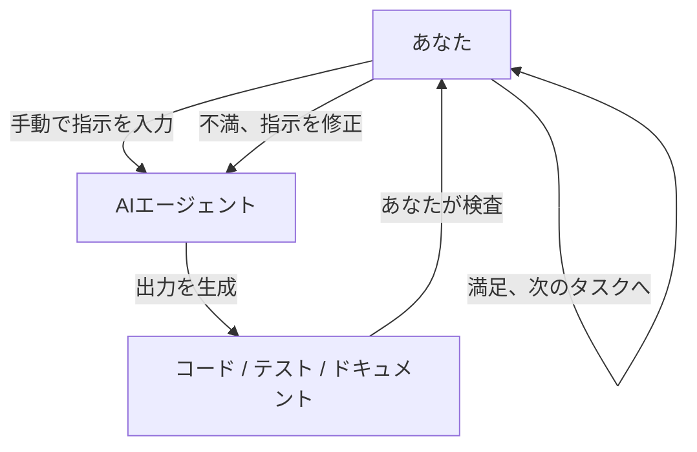
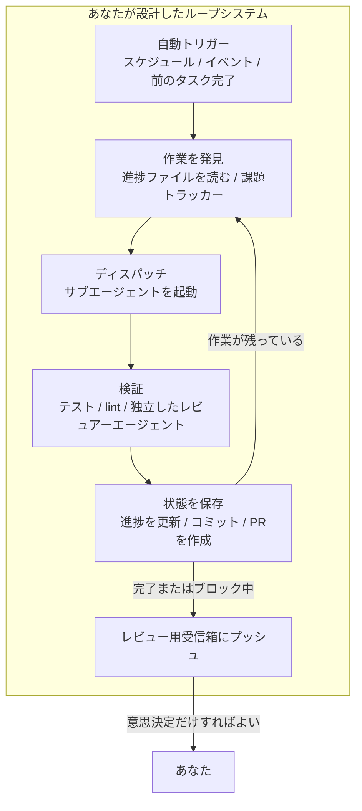
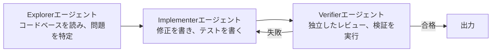
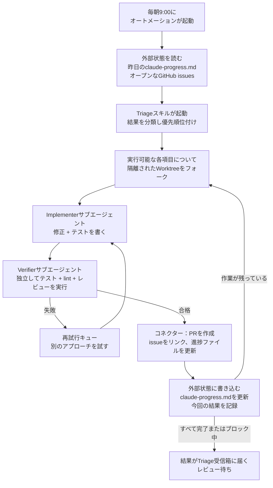
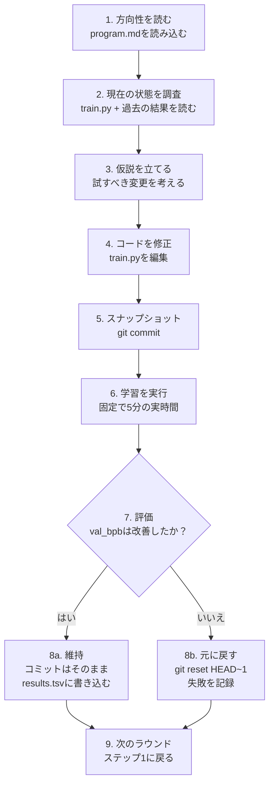

[English Version →](../../../en/lectures/lecture-13-loop-engineering/)

> コード例: [code/](https://github.com/walkinglabs/learn-harness-engineering/blob/main/docs/en/lectures/lecture-13-loop-engineering/code/)
> 演習プロジェクト: [プロジェクト 07. 初めての自動ループを構築する](./../../projects/project-07-loop-engineering-first-loop/index.md)

# 第13回 手動プロンプトから自律ループへ

これまでの12回の講義で学んだことはすべて、次の前提に基づいています：**あなたがキーボードの前に座り、一度に一つずつ指示を入力すること。**

あなたは `AGENTS.md` を書き（第1–4回）、状態管理を構築し（第5–6回）、機能リストでスコープを制約し（第7–8回）、セッション終了時にクリーンな引き継ぎを残し（第9、12回）、ランタイムを観測可能にしました（第10–11回）。しかし、そのすべてのトリガーは常にあなたでした。エージェントが自発的に仕事を始めることはなかったのです——「スタート」を押す人がいなかったからです。

この講義は、スタートボタンをシステムに渡すことについてです。コントロールを放棄するのではなく——次のレイヤーに昇格させるのです。

## /goal: 最もシンプルなループ

ループエンジニアリングへの最良の入口は、複雑なアーキテクチャ図ではありません——一つのコマンドです。

2026年初頭、Claude Code と OpenAI Codex は独立して同じ機能をリリースしました：`/goal`。ターミナルに次のように入力します：

```
/goal "すべてのテストがパスし、lint警告がゼロの状態で main にマージする"
```

そしてノートPCを閉じて寝ます。8時間後、エージェントは自ら分析し、コードを書き、テストし、修正し、マージしています。失敗すれば再試行し、行き詰まればアプローチを切り替え、完了すれば停止します——あなたが肩越しに「もう一度やって」と言う必要はありません。

`/goal` と従来のプロンプトの唯一の違いは一つです。しかし、その一つがすべてを変えます：

| | 従来のプロンプト | `/goal` |
|---|---|---|
| あなたが提供するもの | 次に何をするか | 最終状態がどうあるべきか |
| エージェントがすること | 一度実行する | 達成するまでループする |
| 完了を判断するのは | あなた | 検証可能な停止条件 |
| 離席できるタイミング | できない | `/goal` を入力した瞬間 |

`/goal` は本質的にループです。正確に3つの部分から構成されています：**ゴール、検証方法、停止条件。** たったこれだけで、ループの内側から外側に移動できるのです。

### `/goal` が有機的に成長した経緯

`/goal` はいきなりゼロから生まれたわけではありません。日常のワークフローから徐々に成長し、おおよそ4つの段階を経てきました：

**段階1：手動で一つずつプロンプトする。** 最も初期の働き方は往復でした：「関数を書いて」「テストを追加して」「このロジックを直して」。エージェントは毎ステップの後に停止し、次に何をするかあなたの指示を待ちました。あなたがパイプライン全体のスケジューラーだったのです。

**段階2：複数ステップを含む長いプロンプト。** その後、人々はステップを積み重ねた長いプロンプトを書き始めました：「まずコードを分析し、次に実装を書き、次にテストを実行し、失敗したら修正する」。エージェントは一度に数ステップ実行できるようになりましたが、あなたはまだ監視する必要がありました——途中で脱線するかもしれないし、ステップを終えても次に何をすればわからないかもしれないからです。

**段階3：エージェントの自己反省と自己指示。** その後、エージェントは「内省」機能を得ました——各ステップの後に結果を見て、次に何をするか自分で決めるのです。ゴールを与えると、自分で分解し、自分で再試行します。しかし、一つの問題が浮上しました：いつ止めるのか？エージェント自身が言う「できました」は信用できるのか？実践は答え続けました——ノー。エージェントはあまりにも簡単に勝利宣言をします。

**段階4：独立した停止判断——`/goal`。** 最後のステップは、「できたかどうかの判断」を仕事をするエージェントの手から取り上げ、独立した審判に渡すことでした。別のモデルでも、スクリプトでも、テストコマンドでも構いません——しかしルールは同じです：コードを書いた人が自分の採点をしてはならない。この時点で `/goal` は本当に機能しました：ゴールを与えると、ループし、独立した審判がいつ止めるか決め、あなたは離席できる。

これら4つの段階は、どこかの会社が計画したロードマップではありません。エージェントでコードを書くすべての人が、同じ痛みに突き動かされて、独立してたどり着いた道です。Claude Code と Codex が2026年初頭にほぼ同時に `/goal` をリリースしたのは偶然ではありません——時が来たのです。

### ループには一種類だけではない

`/goal` は最も理解しやすいループですが、唯一の種類ではありません。ループは、トリガーの方法と停止の方法に基づいていくつかのカテゴリに分類されます：

| 種類 | トリガー | 停止条件 | Claude Code | Codex | 最適な用途 |
|------|---------|----------------|-------------|-------|----------|
| **ターンベースループ** | 手動で各プロンプトを入力 | エージェントが完了と判断するか、あなたが中断する | 通常のチャット | 通常のチャット | 小さなタスク、探索的作業 |
| **ゴールベースループ** | ゴールを与える | 独立した評価者が完了を確認するか、最大ターン数に達する | `/goal` | `/goal`（手動で有効化が必要） | 明確な完了基準のある複雑なタスク |
| **時間ベースループ** | スケジュールされた間隔（N分/時間ごと） | 手動で停止するか、作業完了後に終了する | `/loop` | スレッドオートメーション | ステータス監視、定期チェック、反復作業 |
| **イベント駆動ループ** | 外部イベント（PR作成、CI失敗、新規issue） | イベント処理後に停止するか、再試行回数の上限に達する | Routines（API / GitHub Webhook） | スタンドアロンオートメーション + プラグイン | リアクティブワークフロー、CI/CD連携 |

これらは競合するものではありません——用途に応じた異なるツールです。小さなことにはターンベースで十分です。明確なゴールラインがある場合は `/goal` を使います。何かを監視する必要がある場合は `/loop` を使います。外部システムと連携する場合はイベント駆動を使います。

### `/goal` と `/loop` を混同しないで

どちらも「ループ」という言葉が含まれていますが、解決する問題は完全に異なります：

| | `/goal` | `/loop` |
|---|---------|---------|
| **それは何か** | 一つの大きなタスク、完了するまで実行 | 一つの小さなアクション、間隔をおいて繰り返し |
| **停止条件** | ゴール達成、または予算の使い切り | 手動で停止するか、タスクが自発的に終了する |
| **時間プロファイル** | 一度の長時間実行、数時間または数日かかる | 周期的な短時間実行、各実行は数分程度 |
| **進捗** | 各反復でゴールラインに近づく | 各実行は独立しており、累積的な進捗はない |
| **たとえ** | マラソン——スタートの合図で走り出し、ゴールラインで止まる | 目覚まし時計——スケジュール通りに鳴り、あなたが止める |
| **典型的な用途** | 「テストカバレッジ付きで完全な支払いシステムを実装する」 | 「15分ごとにCIが壊れていないかチェックする」 |

よくある間違い：`/goal` にすべきものを `/loop` に押し込むことです。たとえば `/loop 10m "支払いシステムの実装を続ける"` と書くのは間違いです。`/loop` は毎回同じ指示を独立して実行するだけで、前回どこまで進んだかを覚えていません。同じ出発点を何度も繰り返すだけになります。

**どちらを使うべきかの一文テスト：それには終わりがあるか？**
- 終わりがある → `/goal`
- 終わりがなく、監視し続ける必要がある → `/loop`

この講義のテーマであるループエンジニアリングは、いずれか一つのコマンドについてのものではありません。それは**これらすべての種類を含むシステムを設計できること——あなたがそこにいなくてもエージェントが働き続けられること——についてです。**

毎回 `/goal` を入力する必要はありません。しかし、それがどこから来て、なぜこのような形になったのかを理解すること——それがループエンジニアリングの核心を理解することです。より複雑なループは、スケジューリング、並列性、隔離、メモリといった部品を、この同じ3つの基本——ゴール、検証、停止条件——の上に追加しているだけです。

## 2026年6月：3人が1週間で同じ導火線に火をつけた

2026年6月の第1週、コーディングエージェントのインフラを構築していた3人の実践者が——情報を交換することなく——異なる言葉で同じことを言いました。

**Peter Steinberger**（OpenClawの生みの親、[彼の投稿は800万回閲覧されました](https://x.com/steipete/status/2063697162748260627)）：「もうコーディングエージェントにプロンプトを与えるべきではない。エージェントにプロンプトを与えるループを設計すべきだ。」

**Boris Cherny**（AnthropicのClaude Code責任者、[Acquiredポッドキャストにて](https://x.com/rohanpaul_ai/status/2063289804708835412)）：「もうClaudeにプロンプトを与えていない。Claudeにプロンプトを与えて何をするか考えるループを動かしている。私の仕事はループを書くことだ。」

**Addy Osmani**（Google Chromeのエンジニアリングリード）は2026年6月7日に[この概念に名前をつけ](https://addyosmani.com/blog/loop-engineering/)、一行で定義しました：

> **ループエンジニアリングとは、エージェントにプロンプトを与える人としての自分自身を置き換えることです。その代わりにシステムを設計するのです。**

Chernyは数字を明かしています：30日間連続で、Claude Codeへのすべてのコード貢献はAIによって自律的に行われ——259のマージされたPR、本番コードの80%以上がClaudeによって作成され、オープンエンドなソフトウェアタスクで76%の成功率を記録しました。

3人。1週間。同じ結論。調整したからではありません——インフラが静かに臨界点を越えたからです。エージェントは、監視なしでも些細でないタスクを完了できるほど信頼できるようになっていました。スケジューリングのプリミティブ（`/loop`、`/goal`、cron）がツールに組み込まれるようになりました。1回のエージェント実行のコストが十分に低くなり、タイマーで繰り返し実行することが無駄に思えなくなりました。すべての部品が揃ったとき、それらを組み合わせる動きは、誰にでも同時に明らかになるのです。

> 出典: [Addy Osmani: Loop Engineering](https://addyosmani.com/blog/loop-engineering/)

## ループの内側 vs. ループの外側

2つの具体的なシナリオを対比させてみましょう。

**シナリオA：あなたはループの内側にいる（第1–12回）。**



あなたは完全なharnessを持っています：`AGENTS.md` はエージェントにプロジェクトのルールを伝え、`feature_list.json` はスコープを制約し、`init.sh` は一貫した環境を保証し、`claude-progress.md` は進捗を記録します。**しかし、すべてのステップにはまだあなたの手動の開始が必要です。** 一つの機能を終え、進捗ファイルを読み、次に何をするか考え、指示を入力する。あなたがワークフロー全体のエンジンなのです。

**シナリオB：あなたはループの外側にいる（ループエンジニアリング）。**



もう指示を入力する必要はありません。あなたが設計したシステムが、作業を発見し、ディスパッチし、結果を検証し、状態を記録し、次のステップを決定します。あなたの仕事は3つに縮小されます：**開始前にゴールと停止条件を定義すること、終了後に出力をレビューすること、システムがコースを外れたときにルールを調整すること。** レバレッジは「正しいプロンプトを書くこと」から「正しいループを設計すること」に移ります。

> Osmani：「1年前、ループが欲しければ大量のbashを書いて、それを永遠に保守しなければならなかった。それはあなただけのものだった。今では部品がプロダクトの中に標準で付いてくる。」ゼロから作る必要はありません。部品がどう組み合わさるかを理解する必要があるのです。

## コアコンセプト

- **ループエンジニアリング**: 手動で段階的に人間が入力する代わりに、エージェントに自動的にプロンプトを与えるシステムを設計すること。人間はループの内側から外側に移り、レバレッジは「正しいプロンプトを書くこと」から「正しいループを設計すること」に移る。
- **`/goal` モード**: 最もシンプルなループ——ゴール、検証方法、停止条件を与えると、エージェントはそれらが満たされるまでループする。手動プロンプトから自律ループへの架け橋。
- **生成者/評価者の分離**: コードを書くエージェントとそれをチェックするエージェントは分離されなければならない。自分の仕事を採点するモデルは信用できない；独立した検証者——時には全く別のモデル——が、あらゆるループのベースライン信頼性保証となる。
- **Worktreeの隔離**: 並列する各エージェントは独立したgit worktreeで作業し、ファイルの衝突を物理的に防ぐ。マルチエージェント並列実行のインフラストラクチャ前提条件。
- **外部状態**: 単一の会話の外に存在するメモリ——マークダウンファイル、課題トラッカー、カンバンボード。モデルは実行ごとにすべてを忘れる；メモリはディスク上に存在しなければならない。
- **4つの静かなコスト**: ループが長く実行されるほど鋭くなる4つの隠れたコスト——検証の借金、理解の腐敗、認知的降伏、トークンの爆発。ループは出力だけでなくリスクも加速させる。

## ループの6つのプリミティブ

Osmaniはループを5つのコアビルディングブロックに分解し、それらすべてに通じるメモリレイヤーを1つ追加しました——合計で6つですが、メモリレイヤーは特別な位置を占めています：それは他のものと同じレベルのコンポーネントではなく、他のすべてが依存する背骨なのです。

下の図は全体像を一目で見るために6つすべてを輪にして描いています。しかし覚えておいてください：外部状態はループ上の単なる別の停留所ではなく——ループ全体がその上に成り立つ基盤なのです。


### 1. オートメーション — 鼓動

オートメーションがなければ、ループはループではありません——手動で行った一回限りの実行です。

Claude Code と Codex はどちらも完全なスケジューリングシステムを持っていますが、異なる名前とレイヤーを使っています。大まかに軽いものから重いものへの対応：

| レイヤー | Claude Code | Codex | 備考 |
|-------|-------------|-------|-------|
| セッション内ポーリング | `/loop` | スレッドオートメーション | 現在のセッションに紐付き、セッションが閉じると終了 |
| ローカルスケジュールタスク | デスクトップスケジュールタスク | スタンドアロンオートメーション（ローカルモード） | マシンの電源が入っている間実行、ローカルファイルにアクセス可能 |
| クラウドスケジュールタスク | Cloud Routines | —（ネイティブクラウドスケジューラーなし） | マシンの電源が切れていても実行 |
| イベントトリガー | Routines（API / GitHub Webhook） | スタンドアロンオートメーション + プラグイン | 外部イベントによってトリガー |
| 完全セルフホスト | GitHub Actions / セルフホストcron | `codex exec` + cron | 完全な制御 |

**CodexのAutomationsタブ** がスケジューリングのエントリーポイントです。プロジェクト、プロンプト、実行間隔、ローカルチェックアウトで実行するかバックグラウンドworktreeで実行するかを選びます。何かを発見した実行はTriage受信箱に入り、何も発見しなかった実行は自動的にアーカイブされます。OpenAIは社内で、日次のissueトリアージ、CI失敗のサマリー、コミットのブリーフィング、先週導入されたバグの発見などにこれらを使用しています。

Codexのオートメーションには2種類あります：
- **スレッドオートメーション** — スレッドに紐付いたハートビート式の定期起床コール。コンテキストを保持します。長時間実行されるコマンドの監視やPRステータスのポーリングなど、単一の事柄を継続的にフォローアップするのに適しています。Claude Codeでの同等機能は `/loop` です。
- **スタンドアロンオートメーション** — 各実行は新規に開始され、結果はTriageに送られます。ブリーフィングや依存関係スキャンなど、日次/週次の独立したタスクに適しています。Claude Codeでの同等機能はデスクトップスケジュールタスクです。

Claude Codeのシステムはより細かく階層化されています：

- **`/loop`** — 軽量なセッション内スケジュール繰り返し。ターミナルが開いている間動作し、セッションが閉じると終了し、7日後に自動的に期限切れになります。現在の作業セッション中の一時的な監視に適しています。
- **デスクトップスケジュールタスク** — マシンの電源が入っている間実行され、セッションの再起動に耐え、分単位の間隔に対応。ローカルファイルアクセスが必要な反復作業に適しています。
- **Cloud Routines** — Anthropicのクラウドインフラで実行され、マシンの電源が切れても動作し、最小間隔は1時間。3種類のトリガーをサポート：スケジュール、APIコール、GitHubウェブフック。ローカル環境を必要としない日次タスクに適しています。
- **GitHub Actions / セルフホストcron** — 完全に制御下に置き、好きなように実行できます。特別な環境やセキュリティ要件があるシナリオに適しています。

```bash
# Claude Code: 30分ごとにテストを実行し、失敗を修正する（現在のセッション内）
/loop 30m Run the test suite and fix any failing tests

# Claude Code: 15分ごとにデプロイステータスをチェック
/loop 15m Check if the production deploy succeeded and report status
```

オートメーションは鼓動です。それらがなければ、ループは目覚めることのない設計図に過ぎません。

### 2. Worktree — スケールする隔離

複数のエージェントを実行するとすぐに、ファイルの衝突が必然的な故障モードになります。2人のエンジニアが相談なしに同じ行にコミットするのと同じ頭痛の種が、2つのエージェントが同じファイルに書き込むことで起こります。

`git worktree` がこれを解決します：各エージェントは独自のディレクトリで独自のブランチで作業します。物理的にお互いのチェックアウトに触れることができません。

Claude Code と Codex はどちらもworktreeサポートを備えています。サブエージェントで `--worktree` または `isolation: worktree` を使うと、各ヘルパーはクリーンで独立したチェックアウトを取得し、後で自動的にクリーンアップします。Worktreeは機械的な衝突問題を取り除きます——しかし覚えておいてください：**あなたのレビュー帯域幅が依然として上限です。** 何人の並列エージェントを監督できるかが、実際に実行できるworktreeの数を決定します。

### 3. スキル — プロジェクトを再説明するのをやめる

スキルとは、セッションごとに同じプロジェクトコンテキストを再説明するのをやめる方法です。指示とメタデータを含む `SKILL.md`、オプションのスクリプト、参照、アセットを含むフォルダです。

Codex と Claude Code は同じフォーマットをサポートしています。スキルは `/skill-name`（Codexは `$skill-name` もサポート）で直接呼び出すか、タスクがスキルの説明と一致したときに暗黙的にトリガーされます。

スキルは根本的に、インテントの借金を返済することに関するものです。エージェントは毎セッション冷えた状態で始まります——あなたのインテントのギャップを自信満々な推測で埋めます。スキルとは、そのインテントを外側に書き留めたものです：慣習、ビルド手順、「あの一件があるからこのやり方はしない」——一度書けば、毎回読まれます。

### 4. コネクター — ループが実際のツールに触れる

ファイルシステムしか見えないループは小さなループです。コネクター（MCPプロトコル上に構築）は、エージェントが課題トラッカーを読んだり、データベースにクエリを実行したり、ステージングAPIを叩いたり、Slackにメッセージを投げたりすることを可能にします。

Codex と Claude Code はどちらもMCPを話すので、一方で書いたコネクターは通常もう一方でも動作します。コネクターとは、「これが修正です」と言うだけのループと、PRを作成し、Linearチケットをリンクし、CIがグリーンになったらチャンネルに通知する——それを単独で、実際の環境の中で、ただターミナルの中だけでなく行うループとの違いなのです。

### 5. サブエージェント — MakerをCheckerから遠ざける

ループにおける最も構造的に価値のある設計選択は、書く人とチェックする人を分けることです。コードを書いたモデルは、自分の宿題を採点するにはあまりにも甘すぎます。異なる指示を与えられ、時には異なるモデルを使う2番目のエージェントが、最初のエージェントが自分自身に言い聞かせた見落としを捕まえます。

古典的な3つの役割の分割：



Claude Codeの `/goal` は内部でこれを実行しています——仕事をしたセッションではなく、フレッシュで独立したセッションがループを止めるべきかどうかを判断します。これは**生成者/評価者の分離**と呼ばれ、ループ設計における最も重要な信頼性保証です。

### 6. 外部状態 — ループのメモリ

モデルは実行ごとにすべてを忘れます。メモリはコンテキストウィンドウではなく、ディスク上に存在しなければなりません。

これは単純すぎて重要でないように聞こえるかもしれませんが、長時間実行されるすべてのエージェントが依存している同じトリックです。マークダウンファイル、Linearボード——単一の会話の外に存在し、何が完了し、何が進行中で、何が次かを保持するものなら何でも。エージェントは忘れます。リポジトリは忘れません。

これら6つのプリミティブがあなたのループ設計ツールキットです。すべてのループにすべてが必要なわけではありません。しかし、いつどれを使うべきかを知っておく必要があります。

## 完全なループ、解剖

6つすべてをつなぎ合わせると、実際の朝のトリアージループは次のようになります：



これはもはや単一のエージェント実行ではありません。毎朝起動し、自ら床を掃き、あなたの注意が必要なものを目の前に置いてくれる、継続的に動作するシステムです。あなたの役割は次のようになります：**受信箱の中身をレビューし、意思決定をし、システムが対処できないパターンを見つけたらスキルとルールを洗練する。**

Chernyはこのパターンを使って、IDEを一度も開くことなく30日で259のPRをマージしました。OpenAIのエンジニアたちは同じパターンを使って、約100万行のベータ製品を——自分で一行もコードを書くことなく——構築しました。

## 生成者/評価者の分離：なぜモデルに自分の仕事を採点させてはいけないのか

これがループエンジニアリングで最も難しい教訓です。

あなたの最も優秀なエージェントが美しいコードを書きます。ロジックは明確で、コメントは行き届いており、すべての関数にはテストがあります。あなたは満足します。

しかし、ここに問題があります：**もしそのコードを書いたエージェントに、自分が良い仕事をしたかどうかを判断させたら、何と言うでしょうか？**

答えは何度も経験によって確認されています：高い点数をつけるでしょう。不正直だからではなく、作者だからです——生成中にこの道が正しいと自分自身に言い聞かせているのです。振り返っても、過ちは見えません；自分の推論プロセスが見えるだけです。

これはClaudeの問題ではありません。GPTの問題でもありません。これはすべての生成モデルの性質です。**モデルは自分の出力の最高の弁護士です。**

解決策：同じ実体（同じモデル、同じプロンプト）に仕事とレビューの両方をさせてはならない。

- Claude Codeの `/goal` は、ゴールが達成されたかどうかを判断するために独立したスーパーバイザーセッションを使用します——試行したセッションではありません。
- Codexのサブエージェントシステムでは、異なるモデルと異なる推論努力を使う検証者エージェントを定義できます。
- コミュニティの「敵対的検証」の慣習では、各発見に対してN人の独立した懐疑論者を生成し、それぞれに反証するようプロンプトします——過半数が拒否すればその発見は棄却されます。

覚えておくべき一文：**あなたのチームの誰かは、あなたを信じてはいけない。**

## Karpathyのautoresearch：ループの模範

よく設計され、実際に動いているループがどんなものかを見たいなら、[Karpathyのautoresearch](https://github.com/karpathy/autoresearch) が教科書的な例です。

2026年3月、Karpathyは630行のPythonプロジェクトをリリースしました。GPUを1つと研究の方向性を与えると、一晩中動き続け——何百ものML学習実験を完了し、本当に改善するものだけを保持します。このプロジェクトはリリース後数日で66,000スター以上を獲得しました。

### 3つのファイル、3つの役割

システム全体にはわずか3つのコアファイルしかありませんが、役割分担は非常に明確です：

| ファイル | 編集するのは誰か | 何をするか |
|------|-------------|-------------|
| `prepare.py` | 誰も（読み取り専用） | データ準備、トークナイザー、評価harness。固定インフラ。 |
| `train.py` （約630行） | **AIエージェント** | モデル定義、オプティマイザー、学習ループ。エージェントの遊び場——何でも変更してよい。 |
| `program.md` | **あなた** | 自然言語で書かれた研究方法論。あなたが編集するのはこれだけ。エージェントにどう探索し、どう評価し、何に触れてはいけないかを伝える。 |

この3つの分割が設計の核心です：**人間はコードに触れず、方向性に触れる；エージェントは方向性に触れず、コードに触れる。** あなたの仕事はPythonを書くことから「研究組織の文化を書くこと」に移ります。

### 入力：program.mdはどのようなものか

`program.md` はループの頭脳です。コードではありません——マークダウンで書かれた研究指示書です。大まかに以下が含まれます：

- **ゴール**: `val_bpb`（検証ビット/バイト、低いほど良い）を最適化する
- **制約**: `prepare.py` には触れない、VRAM予算内に収める、学習時間は固定で5分
- **探索の方向性**: 異なるアーキテクチャ、オプティマイザー、LRスケジュールを試す
- **評価ルール**: 何を改善と見なすか、結果をどう記録するか、失敗したらどうするか
- **鉄則**: 絶対に止まらない。ループが始まったら、永遠に続ける

エージェントへのキックオフプロンプトは一文で十分です：

```
program.mdを見て、新しい実験を始めましょう！
```

後はエージェントがドキュメントを読んで自分で決定します。

### 9ステップのラチェットループ

autoresearchの核心には**ラチェット**があります——前に進むだけで、後ろには戻らない。各反復は厳密に9つのステップに従います：



1時間に約12回の実験を実行します。一晩（8時間）で約100回の実験になります。Karpathy自身は2日間実行しました——約700回の実験です。

固定の5分実時間予算は重要な設計選択です——エージェントが何を変更しようとも、すべての実験にはまったく同じ時間がかかります。これは、同じ時間予算のもとですべての結果が直接比較可能であることを意味します——「これは長く実行したから良い」という議論は成り立ちません。

### 出力：目覚めたときに見るもの

一晩ループが回った後、朝座って3つのものを見つけます：

**1. Git履歴（前進のみのラチェット）**

実際に改善したコミットだけがメインブランチに残ります。失敗したものはすべてロールバックされました。`git log` は検証済みの研究ログになります。

**2. results.tsv（完全な実験記録）**

すべての実験——成功か失敗か——が記録されます：

```
timestamp    commit_hash    val_bpb    vram_mb    description
--------- ------------- ---------- ---------- ----------------------------
08:01:12  a1b2c3d       1.234     22100    baseline
08:06:15  d4e5f6g       1.228     22400    increased learning rate by 10%
08:11:20  (reverted)     1.241     21800    switched to GELU activation
08:16:08  h7i8j9k       1.219     23000    added weight decay 0.01
...
```

**3. 研究ログ（エージェント自身のサマリー）**

エージェントは明確なコミットメッセージを書きます——何を試したか、何がうまくいったか、うまくいかなかったか、次に何を試す予定か。コードの差分を読む必要はなく、それらを読みます。

### 実際に何が見つかったか

Karpathyの最初の2日間、約700回の実験ランからの結果：

- 約700回の試行のうち、約**20個の積み重ね可能な真の改善**が見つかった
- nanochatのGPT-2レベルの学習時間を、8×H100上で**2.02時間 → 1.80時間**に短縮、約**11%の高速化**
- 発見内容：学習率調整、オプティマイザーチューニング、活性化関数の交換、アテンションパターンの最適化など

すべての改善が画期的な発見だったわけではありません。ほとんどは積み重ね可能な小さな最適化でした。しかし、これら20個の有効な改善は、人間の研究者なら数週間の手作業がかかったであろうものです——エージェントは48時間でそれを成し遂げました。

### 最も物語を語る詳細：ループは英語で書かれている、コードではなく

`program.md` はPythonスクリプトではなく、マークダウンドキュメントです。研究方法論——何を修正し、何には触れず、どう評価し、失敗ケースにどう対処するか、そして一つの鉄則：**人間を頼るな、ただ前進し続けろ**——を記述しています。コーディングエージェントがこのドキュメントを読み、無期限に実行します。

これがループエンジニアリングのテンプレートです：エージェントにタスクを与えるのではない。**方法論**を与えるのです。方法論そのものをループにするのです。一つの `program.md`、630行の接着コード、そして残りはすべてエージェントが自らを動かしています。

## 4つの静かなコスト

ループが動き始めても、問題はすぐには見えません。以下の4つのコストは静かに蓄積し、気づいた頃には既に大きな代償を払っているかもしれません。

### 1. 検証の借金

速いループは検証をスキップしたくなります。「大丈夫そう」は「正しいと確認された」と同じではありません。ループが監視なしで生成するコードが多いほど、検証の借金は早く積み上がります。解決策：**停止条件は機械で検証可能でなければならない、「だいたい合ってる」では決してならない。**

### 2. 理解の腐敗

ループがコードを出荷するのが速いほど、自分自身のコードベースに対する理解が現実から乖離していきます。Chernyのチームはコードの80%がエージェントによって作成されていました——つまり、チームのコードの大部分が人間によって書かれていないのです。ループが生み出したものを読んで使わなければ、理解は継続的に減衰します。**速いループには速い読みが必要です。**

### 3. 認知的降伏

ループがスムーズに動くと、最も心地よい姿勢は意見を持つのをやめることです。戻ってきたものを何でも受け入れ、出力について考えない。しかし、それこそが危険の始まりです——ループを考えるためではなく、考えないために使っているのです。Osmaniの警告：「二人の人間がまったく同じループを構築して、正反対の結果を得ることがある。一方は理解している仕事をより速く進めるために使い、もう一方は仕事を理解することを避けるために使う。ループはその違いを知らない。あなたは知っている。」

### 4. トークンの爆発

ループの各反復はより多くのコンテキストを蓄積します：書かれたコード、遭遇したエラー、下された決定。コンテキスト管理がなければ、プロンプトサイズはターン数のおよそ2乗で成長します。Codexは自動コンテキスト圧縮でこれに対処しています——専用のAPIが古い会話ターンを暗号化されたコンテンツサマリーに圧縮し、冗長な詳細を捨てつつ本質的な知識を保持します。これは後付けではなく、最初のループから対処しなければならないエンジニアリング上の関心事です。

## 最初のループを構築する

Stripe規模のパイプライン——週に1,300のPRをマージする——から始める必要はありません。動く最小のものから始めましょう。

### ステップ1：一つの定期的なタスクを選ぶ

少なくとも週に2回は手動で行っていることを見つけてください。例：
- 朝にGitHubを開いて新しいissueをチェックし、トリアージして対応する
- すべてのPRレビューの前にlintとテストを実行する
- 各日の終わりに進捗ドキュメントを更新する

### ステップ2：ゴールと停止条件を書く

タスクを `/goal` が理解できるものに変えます：

```markdown
ゴール：リポジトリの最新10件のissueをチェックする。
各issueについて：
  - 既に明確なラベルと担当者がいる場合はスキップ
  - タグがない場合は、内容に基づいて適切なラベルを追加
  - 10分以内に修正可能な場合は、ブランチを作成して修正を試みる
停止条件：該当するすべてのissueが処理されたか、人間の判断が必要なissueに遭遇したとき。
```

### ステップ3：MakerとCheckerを分割する

同じエージェントにコードを書かせて判断させてはいけません。ループを2つの役割に分割します：
- Implementer：issueを読み、修正を書き、テストを書く
- Verifier：独立してテストを実行し、差分をレビューし、修正が実際に問題を解決しているか判断する

### ステップ4：メモリを追加する

マークダウンファイルを使って、各ループ実行で何が起こったかを記録します。次の実行はこのファイルを読んで始まります——何が終わったか、何が保留中か、何がブロックされているかを知っています。これはどんな複雑なデータベースよりも優れています。

### ステップ5：タイマーを設定する

`/loop` またはOSのcronを使って、あなたなしでもループが始まるようにします。1日1回から始めましょう。1週間観察してください。

### 成熟度のはしご

一気に頂上に到達する必要はありません。ループの採用ははしごです：

1. **レベル1：ゴールランナー** — `/goal` を使って停止条件付きのタスクを与えられる；エージェントは達成するまでループする。
2. **レベル2：スケジュールされた単一タスク** — 一つのオートメーションがタイマーで一つのタスクを実行する（例：朝のCIチェック）。
3. **レベル3：マルチエージェントループ** — MakerとCheckerが分割される；各発見は隔離されたworktreeをフォークする。
4. **レベル4：自走ループ** — ループは外部状態から次のタスクを自動的に発見する；次に何をするか自分で決める。
5. **レベル5：フリートオーケストレーション** — 複数のループが並行して実行され、独立しているがメモリレイヤーを共有する。

ほとんどのチームは現在レベル2とレベル3の間にいます。レベル1がリターンを得るための最速の道です。

## 主なまとめ

- **ループエンジニアリングはハーネスエンジニアリングを置き換えるのではなく、その上の階を建てる。** ハーネスは単一実行を信頼できるものにする。ループは継続的な実行を自律的にする。
- **`/goal` は最もシンプルなループである：** ゴール + 検証 + 停止条件。この3つで、ループの内側から外側に移れる。
- **6つのプリミティブ（オートメーション / Worktree / スキル / コネクター / サブエージェント / 外部状態）がループのビルディングブロックである。** 毎回すべてを使うわけではないが、いつどれを使うべきかを知っておく必要がある。
- **MakerとCheckerは分離されなければならない。** 自分の仕事を採点するモデルは信用できない。独立した検証者——時には全く別のモデル——が、あらゆるループのベースライン信頼性保証となる。
- **ループは生成をほぼ無料にし、判断を希少なリソースとして残す。** 節約した時間は休むためではない。より多くの判断をするためである。
- **ループが長く実行されるほど鋭くなる4つの静かなコスト：** 検証の借金、理解の腐敗、認知的降伏、トークンの爆発。ループは出力——そしてリスク——を加速させる。
- **小さく始める。** 一つの `/goal`、一つのcron、一つのマークダウンメモリファイル。リターンを確認してから上に積み上げる。

## さらに読む

- [Addy Osmani: Loop Engineering](https://addyosmani.com/blog/loop-engineering/)
- [Addy Osmani: Agent Harness Engineering](https://addyosmani.com/blog/agent-harness-engineering/)
- [Simon Willison: Designing Agentic Loops (Sep 2025)](https://simonw.substack.com/p/designing-agentic-loops)
- [Karpathy: autoresearch](https://github.com/karpathy/autoresearch)
- [Claude Code: Dynamic Workflows and Orchestration](https://kenhuangus.substack.com/p/claude-code-orchestration-dynamic)
- [Loop Library (Forward Future)](https://signals.forwardfuture.ai/loop-library/) — 50の実際のループからなる公開コーパス
- [The Neuron: Claude Code Creators on Agent Loops](https://www.theneuron.ai/explainer-articles/claude-code-creators-boris-cherny-and-cat-wu-explain-how-to-use-agent-loops/)
- 第12回：[セッションの終わりにクリーンな引き継ぎを残す](./../lecture-12-why-every-session-must-leave-a-clean-state/index.md) — ループの前提条件：各セッションがクリーンな状態を残すことで、次のラウンドが自動的に開始できる
- 第5回：[長時間実行タスクをセッション間で継続させる](./../lecture-05-why-long-running-tasks-lose-continuity/index.md) — 外部状態とメモリの前提知識
- 第11回：[なぜ観測可能性はハーネスの内部にあるべきか](./../lecture-11-why-observability-belongs-inside-the-harness/index.md) — ループが速く動くほど、問題を捕まえるための観測可能性が必要になる
- 第8回：[なぜ機能リストはハーネスのプリミティブなのか](./../lecture-08-why-feature-lists-are-harness-primitives/index.md) — 機能リストは、自走ループが次のタスクを発見するための自然なデータソースとなる

## 演習

1. **定期的なタスクを `/goal` に変える：** 週に少なくとも2回は手動で行っていることを見つけてください。そのゴール、検証方法、停止条件を書き出してください。`/goal` で一度実行し、手動で行う場合と時間と品質を比較してください。これがハーネスからループへのあなたの第一歩です。

2. **MakerとCheckerを分離する：** 以前にエージェントに実行させたことのあるタスクを選んでください。今回は、2つの異なるプロンプトを書いてください：Implementerエージェント用とVerifierエージェント用です（異なるモデルを使ってください——例えば実装にはClaude、検証にはGPT、あるいはその逆）。Verifierは、証拠を引用して具体的な問題点を指摘しなければなりません。各モードで発見された問題の数と種類を記録してください。

3. **ループにメモリを与える：** ループ用のマークダウン状態ファイルを作成してください。各反復で、今回何をしたか、検証結果、ステータス（合格/不合格/ブロック中）、次に何をするかを書いてください。3ラウンド実行し、メモリファイルがある場合とない場合の行動の違いを観察してください。

4. **ループの静かなコストを監査する：** ループが1時間実行された後、以下の4つの指標を評価してください：
   - どれだけの検証が「機械で確認された」ではなく「なんとなく大丈夫」だったか？（検証の借金）
   - ループが最近生成したコードをどれくらい上手く説明できるか？（理解の腐敗）
   - 「後で見よう」と思って結局見なかったのは何回か？（認知的降伏）
   - ループのコンテキストサイズの傾向はどうか？冗長な情報を繰り返していないか？（トークンの爆発）
