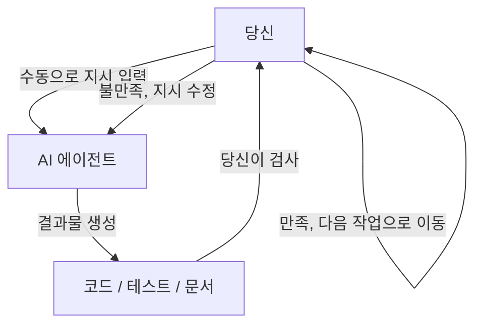
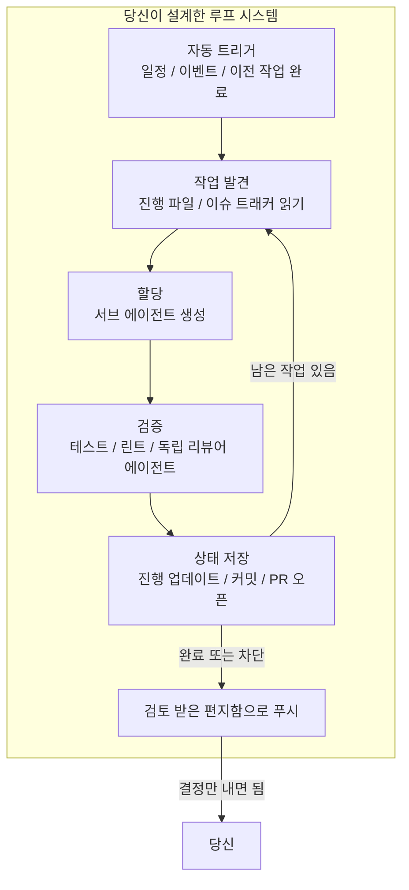
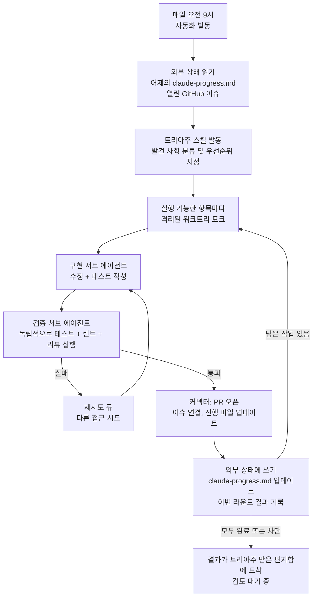
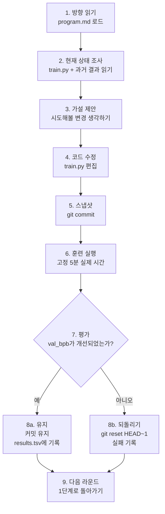

[English Version →](../../../en/lectures/lecture-13-loop-engineering/)

> 코드 예제: [code/](https://github.com/walkinglabs/learn-harness-engineering/blob/main/docs/en/lectures/lecture-13-loop-engineering/code/)
> 실습 프로젝트: [프로젝트 07. 첫 번째 자동 루프 구축하기](./../../projects/project-07-loop-engineering-first-loop/index.md)

# 13강. 수동 프롬프팅에서 자율 루프로

지난 12개 강의에서 배운 모든 것은 하나의 가정에 기반합니다: **여러분이 키보드 앞에 앉아 한 번에 하나씩 지시를 입력한다는 것.**

`AGENTS.md`를 작성했고(1-4강), 상태 관리를 구축했으며(5-6강), 기능 목록으로 범위를 제한했고(7-8강), 세션 종료 시 깔끔한 인계를 남겼으며(9, 12강), 런타임을 관찰 가능하게 만들었습니다(10-11강). 하지만 이 모든 것의 트리거는 항상 여러분이었습니다. 에이전트는 스스로 언제 작업을 시작할지 결정하지 않았습니다 — 누군가 "시작" 버튼을 누르지 않았기 때문입니다.

이 강의는 시작 버튼을 시스템에 넘기는 것에 관한 것입니다. 통제권을 포기하는 것이 아니라 — 다음 단계로 끌어올리는 것입니다.

## /goal: 가장 단순한 루프

루프 엔지니어링으로 가는 가장 좋은 입문은 복잡한 아키텍처 다이어그램이 아니라 — 단 하나의 명령어입니다.

2026년 초, Claude Code와 OpenAI Codex는 독립적으로 동일한 기능을 출시했습니다: `/goal`. 터미널에 입력합니다:

```
/goal "모든 테스트 통과, 린트 경고 제로, main에 병합"
```

그러고 나서 노트북을 닫고 잠자리에 듭니다. 8시간 후, 에이전트는 스스로 분석하고, 코딩하고, 테스트하고, 수정하고, 병합합니다. 실패하면 재시도하고, 막히면 접근 방식을 바꾸고, 완료되면 멈춥니다 — 여러분이 어깨 너머로 "다시 시도해봐"라고 말하지 않아도 됩니다.

`/goal`과 전통적인 프롬프트의 유일한 차이점은 한 가지입니다. 하지만 그 한 가지가 모든 것을 바꿉니다:

| | 전통적인 프롬프트 | `/goal` |
|---|---|---|
| 여러분이 제공하는 것 | 다음에 할 일 | 최종 상태가 어떤 모습인지 |
| 에이전트가 하는 일 | 한 번 실행 | 달성될 때까지 반복 |
| 누가 완료를 판단하는가 | 당신 | 검증 가능한 중단 조건 |
| 언제 자리를 떠날 수 있는가 | 떠날 수 없음 | `/goal`을 입력하는 순간 |

`/goal`은 본질적으로 하나의 루프입니다. 정확히 세 가지 부분으로 구성됩니다: **목표, 검증 방법, 중단 조건.** 이 세 가지만으로 여러분은 루프 내부에서 외부로 이동하게 됩니다.

### `/goal`이 어떻게 자연스럽게 성장했는가

`/goal`은 갑자기 0에서 1로 튀어나온 것이 아닙니다. 일상적인 워크플로우에서 점진적으로 성장했으며, 대략 네 단계를 거쳤습니다:

**1단계: 수동으로 하나씩 프롬프팅.** 가장 초기의 작업 방식은 주고받는 것이었습니다: "함수 작성해줘", "테스트 추가해줘", "이 로직 고쳐줘". 에이전트는 매 단계마다 멈추고 다음에 무엇을 할지 말해주길 기다렸습니다. 여러분이 전체 파이프라인의 스케줄러였습니다.

**2단계: 여러 단계가 포함된 긴 프롬프트.** 그런 사람들이 단계를 쌓아 올린 긴 프롬프트를 쓰기 시작했습니다: "먼저 코드를 분석하고, 그 다음 구현을 작성하고, 테스트를 실행하고, 실패하면 고쳐줘". 에이전트는 한 번에 여러 단계를 실행할 수 있었지만, 여전히 지켜봐야 했습니다 — 중간에 방향을 잃을 수도 있고, 단계를 마치고 다음에 무엇을 해야 할지 몰랐기 때문입니다.

**3단계: 에이전트 자기 성찰과 자기 주도.** 그 후, 에이전트는 "내성"을 갖게 되었습니다 — 매 단계 후 결과를 보고 다음에 무엇을 할지 결정했습니다. 목표를 주면 스스로 세분화하고 스스로 재시도했습니다. 하지만 문제가 생겼습니다: 언제 멈춰야 할까? 에이전트 스스로 말하는 "다 됐어"가 믿을만할까? 실천은 계속해서 답했습니다 — 아니요. 에이전트는 너무 쉽게 성공을 선언합니다.

**4단계: 독립적인 중단 판단 — `/goal`.** 마지막 단계는 "다 됐는지 판단하는 것"을 작업을 수행하는 에이전트의 손에서 빼내어 독립적인 심판에게 넘기는 것이었습니다. 다른 모델일 수도, 스크립트일 수도, 테스트 명령일 수도 있지만 — 규칙은 같았습니다: 코드를 작성한 사람이 자신의 숙제를 채점할 수 없다는 것. 이 시점에서 `/goal`은 진정으로 작동했습니다: 목표를 주면 루프를 돌고, 독립적인 심판이 멈출 때를 결정하고, 여러분은 자리를 떠날 수 있었습니다.

이 네 단계는 어느 한 회사가 계획한 로드맵이 아니었습니다. 에이전트로 코딩하는 모든 사람이 같은 고통에 밀려 독립적으로 도달한 경로였습니다. Claude Code와 Codex가 2026년 초에 거의 동시에 `/goal`을 출시한 것은 우연이 아니었습니다 — 때가 되었을 뿐입니다.

### 루프에는 한 종류만 있는 것이 아니다

`/goal`은 이해하기 가장 쉬운 루프지만, 유일한 종류는 아닙니다. 루프는 트리거 방식과 중단 방식에 따라 카테고리로 나뉩니다:

| 유형 | 트리거 | 중단 조건 | Claude Code | Codex | 적합한 용도 |
|------|---------|----------------|-------------|-------|----------|
| **턴 기반 루프** | 수동으로 각 프롬프트 입력 | 에이전트가 완료했다고 생각하거나, 사용자가 중단 | 일반 채팅 | 일반 채팅 | 작은 작업, 탐색적 작업 |
| **목표 기반 루프** | 목표를 제시 | 독립 평가자가 완료를 확인하거나, 최대 턴에 도달 | `/goal` | `/goal` (수동 활성화 필요) | 명확한 완료 기준이 있는 복잡한 작업 |
| **시간 기반 루프** | 예약된 간격 (N분/시간마다) | 수동으로 멈추거나, 작업 완료 후 종료 | `/loop` | 스레드 자동화 | 상태 폴링, 주기적 확인, 반복 작업 |
| **이벤트 기반 루프** | 외부 이벤트 (PR 오픈, CI 실패, 새 이슈) | 이벤트 처리 후 중단하거나, 재시도 한도 도달 | Routines (API / GitHub Webhook) | 독립 실행형 자동화 + 플러그인 | 반응형 워크플로우, CI/CD 통합 |

이것들은 경쟁 관계가 아닙니다 — 각기 다른 일을 위한 다른 도구일 뿐입니다. 작은 일에는 턴 기반으로 충분합니다. 명확한 결승선이 있을 때는 `/goal`을 사용하세요. 무언가를 감시해야 할 때는 `/loop`를 사용하세요. 외부 시스템과 통합할 때는 이벤트 기반을 사용하세요.

### `/goal`과 `/loop`를 혼동하지 마세요

둘 다 이름에 "루프"가 들어가지만, 완전히 다른 문제를 해결합니다:

| | `/goal` | `/loop` |
|---|---------|---------|
| **정의** | 하나의 큰 작업, 완료될 때까지 실행 | 하나의 작은 행동, 간격마다 반복 |
| **중단 조건** | 목표 달성 또는 예산 소진 | 수동으로 멈추거나, 작업이 스스로 종료 |
| **시간 프로필** | 한 번의 긴 실행, 몇 시간 또는 며칠이 걸릴 수 있음 | 주기적인 짧은 실행, 각 실행은 몇 분 정도 |
| **진행 상황** | 매 반복마다 결승선에 가까워짐 | 각 실행은 독립적, 누적 진행 없음 |
| **비유** | 마라톤 달리기 — 출발 총이 울리면 결승선에서 멈춤 | 알람 시계 — 정해진 시간에 울리면 끔 |
| **일반적인 사용** | "테스트 커버리지가 있는 완전한 결제 시스템 구현" | "15분마다 CI가 고장났는지 확인" |

흔한 실수: `/goal`이어야 할 것을 `/loop`에 욱여넣는 것. `/loop 10m "계속 결제 시스템 구현해"`라고 쓰는 것 — 그건 틀렸습니다. `/loop`는 매번 같은 지시를 독립적으로 실행하며, 지난 번에 어디까지 했는지 기억하지 못합니다. 그냥 계속 같은 시작점에서 반복될 뿐입니다.

**어떤 것을 사용해야 할지 판단하는 한 문장 테스트: 이 일에 끝이 있는가?**
- 끝이 있다 → `/goal`
- 끝이 없고 계속 지켜봐야 함 → `/loop`

이 강의의 주제인 루프 엔지니어링은 어느 한 명령어에 관한 것이 아닙니다. **이 모든 유형을 포함하는 시스템을 설계할 수 있는 것에 관한 것입니다 — 그래서 여러분이 없어도 에이전트가 계속 작업할 수 있게 하는 것입니다.**

매번 `/goal`을 입력할 필요는 없습니다. 하지만 그것이 어디서 왔고 왜 그런 모습인지 이해하는 것 — 그것이 루프 엔지니어링의 핵심을 이해하는 것입니다. 더 복잡한 루프는 스케줄링, 병렬성, 격리, 메모리 같은 부품을 이 세 가지 기본 요소 위에 얹을 뿐입니다: 목표, 검증, 중단 조건.

## 2026년 6월: 세 사람이 한 주 동안 같은 성냥을 붙였다

2026년 6월 첫째 주, 코딩 에이전트 인프라를 구축하는 세 명의 실무자가 — 서로 의견을 나누지 않고 — 다른 말로 같은 말을 했습니다.

**Peter Steinberger** (OpenClaw 창시자, [그의 글은 8백만 뷰를 돌파](https://x.com/steipete/status/2063697162748260627)): "더 이상 코딩 에이전트에게 프롬프트해서는 안 됩니다. 에이전트에게 프롬프트하는 루프를 설계해야 합니다."

**Boris Cherny** (Anthropic의 Claude Code 책임자, [Acquired 팟캐스트에서](https://x.com/rohanpaul_ai/status/2063289804708835412)): "더 이상 Claude에게 프롬프트하지 않습니다. Claude에게 프롬프트하고 무엇을 해야 할지 알아내는 루프를 돌리고 있습니다. 제 일은 루프를 쓰는 것입니다."

**Addy Osmani** (Google Chrome 엔지니어링 리드)는 2026년 6월 7일에 [이 개념에 이름을 붙이고](https://addyosmani.com/blog/loop-engineering/) 한 줄 정의를 내렸습니다:

> **루프 엔지니어링은 에이전트에게 프롬프트하는 사람으로서의 자신을 대체하는 것입니다. 대신 그 일을 하는 시스템을 설계하는 것입니다.**

Cherny는 수치를 공개했습니다: 연속 30일 이상, Claude Code에 대한 모든 코드 기여는 AI가 자율적으로 수행했습니다 — 259개의 병합된 PR, 프로덕션 코드의 80% 이상이 Claude가 작성했으며, 개방형 소프트웨어 작업에서 76%의 성공률을 보였습니다.

세 사람. 한 주. 같은 결론. 조율해서가 아니라 — 인프라가 조용히 임계점을 넘었기 때문입니다. 에이전트는 감독 없이도 사소하지 않은 작업을 완료할 만큼 충분히 신뢰할 수 있게 되었습니다. 스케줄링 프리미티브(`/loop`, `/goal`, cron)가 이제 도구에 내장되었습니다. 단일 에이전트 실행 비용은 타이머로 반복해서 실행하는 것이 낭비로 보이지 않을 만큼 충분히 낮아졌습니다. 모든 부품이 갖춰지면, 그것들을 결합하는 움직임은 모두에게 동시에 당연해집니다.

> 출처: [Addy Osmani: Loop Engineering](https://addyosmani.com/blog/loop-engineering/)

## 루프 내부 대 루프 외부

두 가지 구체적인 시나리오를 대조해 봅시다.

**시나리오 A: 여러분이 루프 내부에 있음 (1-12강).**



완전한 하네스가 있습니다: `AGENTS.md`는 에이전트에게 프로젝트 규칙을 알려주고, `feature_list.json`은 범위를 제한하며, `init.sh`는 일관된 환경을 보장하고, `claude-progress.md`는 진행 상황을 기록합니다. **하지만 모든 단계는 여전히 여러분의 수동 시작이 필요합니다.** 하나의 기능을 마치고, 진행 파일을 읽고, 다음에 무엇을 할지 생각하고, 지시를 입력합니다. 여러분이 전체 워크플로우의 엔진입니다.

**시나리오 B: 여러분이 루프 외부에 있음 (루프 엔지니어링).**



더 이상 지시를 입력하지 않습니다. 여러분이 설계한 시스템이 작업을 발견하고, 할당하고, 결과를 검증하고, 상태를 기록하고, 다음 단계를 결정합니다. 여러분의 역할은 세 가지로 줄어듭니다: **시작하기 전에 목표와 중단 조건을 정의하고, 끝난 후 결과를 검토하고, 시스템이 방향을 잃을 때 규칙을 조정하는 것.** 레버리지는 "올바른 프롬프트를 쓰는 것"에서 "올바른 루프를 설계하는 것"으로 이동합니다.

> Osmani: "1년 전만 해도 루프를 원하면 bash 더미를 쓰고 그 더미를 영원히 유지보수해야 했고 그건 당신 것이고 오직 당신의 것이었습니다. 이제 부품들이 제품 안에 그냥 탑재되어 나옵니다." 처음부터 구축할 필요가 없습니다. 부품들이 어떻게 맞춰지는지 이해하면 됩니다.

## 핵심 개념

- **루프 엔지니어링**: 수동적인 단계별 인간 입력을 대체하여, 에이전트에게 자동으로 프롬프트하는 시스템을 설계하는 것. 인간은 루프 내부에서 외부로 이동하고, 레버리지는 "올바른 프롬프트를 쓰는 것"에서 "올바른 루프를 설계하는 것"으로 이동합니다.
- **`/goal` 모드**: 가장 단순한 루프 — 목표, 검증 방법, 중단 조건을 제공하면 에이전트가 충족될 때까지 반복합니다. 수동 프롬프팅에서 자율 루프로 가는 다리입니다.
- **생성자/평가자 분리**: 코드를 작성하는 에이전트와 코드를 검사하는 에이전트는 분리되어야 합니다. 자신의 작업을 채점하는 모델은 믿을 수 없습니다; 때로는 완전히 다른 모델을 사용하는 독립적인 검증자가 모든 루프의 기본 신뢰성 보장 장치입니다.
- **워크트리 격리**: 각 병렬 에이전트는 독립적인 git 워크트리에서 작업하여 파일 충돌을 물리적으로 방지합니다. 다중 에이전트 병렬 실행을 위한 인프라 전제 조건입니다.
- **외부 상태**: 단일 대화 외부에 존재하는 메모리 — 마크다운 파일, 이슈 트래커, 칸반 보드. 모델은 실행 사이에 모든 것을 잊어버립니다; 메모리는 디스크에 존재해야 합니다.
- **네 가지 조용한 비용**: 루프가 오래 실행될수록 더 심각해지는 네 가지 숨겨진 비용 — 검증 부채, 이해 부패, 인지 항복, 토큰 폭발. 루프는 결과물만 가속하는 것이 아니라 위험도 가속합니다.

## 루프의 여섯 가지 프리미티브

Osmani는 루프를 다섯 가지 핵심 빌딩 블록으로 분해했으며, 모두를 관통하는 메모리 레이어 하나를 더했습니다 — 총 여섯 가지이지만, 메모리 레이어는 특별한 지위를 차지합니다: 다른 것들과 같은 수준의 컴포넌트가 아니라; 다른 모든 것이 의존하는 척추입니다.

아래 다이어그램은 여섯 가지를 모두 고리로 그려 한눈에 전체 그림을 볼 수 있게 합니다. 하지만 기억하세요: 외부 상태는 루프의 또 다른 정거장이 아니라 — 전체 루프가 놓여 있는 기반입니다.


### 1. 자동화 — 심장 박동

자동화가 없으면 루프는 루프가 아닙니다 — 수동으로 한 번 실행한 것에 불과합니다.

Claude Code와 Codex 모두 완전한 스케줄링 시스템을 가지고 있지만, 다른 이름과 레이어를 사용합니다. 가벼운 것부터 무거운 것까지 대략적으로 매핑하면:

| 레이어 | Claude Code | Codex | 비고 |
|-------|-------------|-------|-------|
| 세션 내 폴링 | `/loop` | 스레드 자동화 | 현재 세션에 묶여 있으며 세션이 닫히면 종료 |
| 로컬 예약 작업 | 데스크톱 예약 작업 | 독립 실행형 자동화 (로컬 모드) | 컴퓨터가 켜져 있을 때 실행, 로컬 파일 접근 가능 |
| 클라우드 예약 작업 | Cloud Routines | — (네이티브 클라우드 스케줄러 없음) | 컴퓨터가 꺼져 있어도 실행 |
| 이벤트 트리거 | Routines (API / GitHub Webhook) | 독립 실행형 자동화 + 플러그인 | 외부 이벤트에 의해 트리거 |
| 완전 자체 호스팅 | GitHub Actions / 자체 호스팅 cron | `codex exec` + cron | 완전한 통제 |

**Codex의 Automations 탭**은 스케줄링 진입점입니다. 프로젝트, 프롬프트, 주기, 로컬 체크아웃에서 실행할지 백그라운드 워크트리에서 실행할지를 선택합니다. 무언가를 발견한 실행은 트리아주 받은 편지함에 들어가고; 아무것도 발견하지 못한 실행은 자동 보관됩니다. OpenAI는 내부적으로 일일 이슈 트리아주, CI 실패 요약, 커밋 브리핑, 지난 주에 도입된 버그 찾기에 이것들을 사용합니다.

Codex 자동화는 두 가지 종류가 있습니다:
- **스레드 자동화** — 스레드에 연결된 하트비트 스타일의 반복적인 알람으로, 컨텍스트를 보존합니다. 오래 실행되는 명령을 모니터링하거나 PR 상태를 폴링하는 것처럼 한 가지 일에 대해 지속적으로 후속 조치를 취하는 데 좋습니다. Claude Code의 상응 기능은 `/loop`입니다.
- **독립 실행형 자동화** — 각 실행은 새로 시작하며, 결과는 트리아주로 갑니다. 브리핑이나 의존성 스캔처럼 일일/주간 독립적인 작업에 좋습니다. Claude Code의 상응 기능은 데스크톱 예약 작업입니다.

Claude Code의 시스템은 더 세분화된 레이어로 되어 있습니다:

- **`/loop`** — 가벼운 세션 내 예약 반복. 터미널이 열려 있을 때 작동하고 세션이 닫히면 종료되며 7일 후 자동 만료됩니다. 현재 작업 세션 중 임시 모니터링에 좋습니다.
- **데스크톱 예약 작업** — 컴퓨터가 켜져 있을 때 실행되고 세션 재시작에도 살아남으며, 분 단위 간격이 가능합니다. 로컬 파일 접근이 필요한 반복 작업에 좋습니다.
- **Cloud Routines** — Anthropic의 클라우드 인프라에서 실행되며 컴퓨터가 꺼져도 살아남고, 최소 1시간 간격입니다. 세 가지 트리거 유형을 지원합니다: 예약, API 호출, GitHub 웹훅. 로컬 환경이 필요 없는 일일 작업에 좋습니다.
- **GitHub Actions / 자체 호스팅 cron** — 완전히 사용자의 통제 하에 있으며, 원하는 대로 실행할 수 있습니다. 특별한 환경이나 보안 요구 사항이 있는 시나리오에 좋습니다.

```bash
# Claude Code: 30분마다 테스트 실행하고 실패한 테스트 수정 (현재 세션 내)
/loop 30m Run the test suite and fix any failing tests

# Claude Code: 15분마다 배포 상태 확인
/loop 15m Check if the production deploy succeeded and report status
```

자동화는 심장 박동입니다. 이것들이 없으면 루프는 깨어나지 않는 설계도에 불과합니다.

### 2. 워크트리 — 규모에 따른 격리

에이전트를 둘 이상 실행하는 순간, 파일 충돌은 피할 수 없는 실패 모드가 됩니다. 두 에이전트가 같은 파일에 쓰는 것은 두 엔지니어가 서로 상의하지 않고 같은 라인에 커밋하는 것과 똑같은 골칫거리입니다.

`git worktree`가 이것을 해결합니다: 각 에이전트는 자체 디렉토리에서 자체 브랜치로 작업합니다. 물리적으로 서로의 체크아웃을 건드릴 수 없습니다.

Claude Code와 Codex 모두 워크트리 지원을 탑재하고 있습니다. 서브 에이전트에 `--worktree`나 `isolation: worktree`를 사용하면, 각 헬퍼는 깨끗하고 독립적인 체크아웃을 받으며 작업이 끝나면 스스로 정리합니다. 워크트리는 기계적인 충돌 문제를 제거합니다 — 하지만 기억하세요: **여러분의 검토 대역폭이 여전히 상한선입니다.** 얼마나 많은 병렬 에이전트를 감독할 수 있는지가 실제로 몇 개의 워크트리를 실행할 수 있는지를 결정합니다.

### 3. 스킬 — 프로젝트 설명을 반복하지 마세요

스킬은 매 세션마다 같은 프로젝트 컨텍스트를 다시 설명하지 않게 하는 방법입니다. 지침과 메타데이터가 담긴 `SKILL.md`와 선택적인 스크립트, 참고 자료, 에셋이 포함된 폴더입니다.

Codex와 Claude Code는 동일한 형식을 지원합니다. 스킬은 `/skill-name`으로 직접 호출하거나(Codex는 `$skill-name`도 지원), 작업이 스킬 설명과 일치할 때 암시적으로 트리거됩니다.

스킬은 근본적으로 여러분의 의도 부채를 갚는 것에 관한 것입니다. 에이전트는 매 세션을 차갑게 시작합니다 — 여러분의 의도의 빈틈을 자신만의 추측으로 채웁니다. 스킬은 그 의도가 외부에 적혀 있는 것입니다: 규칙, 빌드 단계, "우리는 저번 사건 때문에 이렇게 하지 않아" 같은 것들 — 한 번 쓰고, 매 실행마다 읽습니다.

### 4. 커넥터 — 루프가 실제 도구와 닿게 하라

파일시스템만 볼 수 있는 루프는 작은 루프입니다. 커넥터(MCP 프로토콜 기반)는 에이전트가 이슈 트래커를 읽고, 데이터베이스를 쿼리하고, 스테이징 API를 호출하고, Slack에 메시지를 남길 수 있게 합니다.

Codex와 Claude Code 모두 MCP를 사용하므로, 한쪽에 작성한 커넥터는 보통 다른 쪽에서도 작동합니다. 커넥터는 "여기 수정사항이 있어"와, PR을 열고 Linear 티켓을 연결하고 CI가 초록불이 되면 채널을 알리는 루프 사이의 차이입니다 — 단말기에서만이 아니라, 여러분의 실제 환경 안에서 스스로 말이죠.

### 5. 서브 에이전트 — 메이커를 체커로부터 멀리하라

루프에서 구조적으로 가장 가치 있는 설계 선택은 작성하는 사람과 검사하는 사람을 분리하는 것입니다. 코드를 작성한 모델은 자신의 숙제를 채점할 때 너무 관대합니다. 다른 지시를 받고 때로는 다른 모델을 사용하는 두 번째 에이전트가 첫 번째 에이전트가 스스로 납득해 버린 것을 잡아냅니다.

고전적인 세 역할 분담:


Claude Code의 `/goal`은 내부적으로 이것을 실행합니다 — 작업을 수행한 세션이 아니라, 새롭고 독립적인 세션이 루프를 멈춰야 할지 판단합니다. 이것을 **생성자/평가자 분리**라고 하며, 루프 설계에서 단일로 가장 중요한 신뢰성 보장 장치입니다.

### 6. 외부 상태 — 루프의 메모리

모델은 실행 사이에 모든 것을 잊어버립니다. 메모리는 컨텍스트 창이 아니라 디스크에 존재해야 합니다.

이것은 너무 단순해서 중요하지 않게 들릴 수 있지만, 모든 오래 실행되는 에이전트가 의존하는 같은 트릭입니다. 마크다운 파일, Linear 보드 — 단일 대화 외부에 존재하며 무엇이 완료되었고 무엇이 진행 중이며 무엇이 다음인지 담고 있는 것이라면 무엇이든. 에이전트는 잊어버립니다. 리포지토리는 잊지 않습니다.

이 여섯 가지 프리미티브가 여러분의 루프 설계 도구 상자입니다. 모든 루프에 이것들이 모두 필요한 것은 아닙니다. 하지만 언제 어느 것을 꺼내 써야 할지 알아야 합니다.

## 완전한 루프, 해부하기

여섯 가지를 모두 연결하면 실제 아침 트리아주 루프가 어떤 모습인지 알 수 있습니다:



이것은 더 이상 단일 에이전트 실행이 아닙니다. 매일 아침 깨어나서 스스로 정리하고 여러분의 주의가 필요한 것들을 앞에 내놓는, 지속적으로 작동하는 시스템입니다. 여러분의 역할은 다음과 같습니다: **받은 편지함 내용을 검토하고, 결정을 내리고, 시스템이 처리할 수 없는 패턴을 발견하면 스킬과 규칙을 개선하는 것.**

Cherny는 이 패턴을 사용하여 IDE를 한 번도 열지 않고 30일 만에 259개의 PR을 병합했습니다. OpenAI 엔지니어들은 같은 패턴을 사용하여 대략 백만 줄 규모의 베타 제품을 손으로 — 직접 코드를 한 줄도 쓰지 않고 구축했습니다.

## 생성자/평가자 분리: 왜 모델이 자신의 작업을 채점하게 하면 안 되는가

이것은 루프 엔지니어링에서 가장 어려운 교훈입니다.

가장 똑똑한 에이전트가 아름다운 코드를 작성합니다. 로직은 명확하고, 주석은 철저하며, 모든 함수에는 테스트가 있습니다. 여러분은 만족합니다.

하지만 질문이 있습니다: **그 코드를 작성한 에이전트가 자기가 잘했는지 판단하게 하면, 뭐라고 할까요?**

그 답은 경험을 통해 거듭 확인되었습니다: 스스로 높은 점수를 줄 것입니다. 부정직해서가 아니라, 작성자이기 때문입니다 — 생성하는 동안 이 경로가 옳다고 스스로 납득했기 때문입니다. 뒤돌아 볼 때, 실수를 보는 것이 아니라 자신의 추론 과정을 보는 것입니다.

이것은 Claude의 문제가 아닙니다. GPT의 문제가 아닙니다. 이것은 모든 생성 모델의 속성입니다. **모델은 자신의 출력물의 최고 변호사입니다.**

해결책: 같은 존재(같은 모델, 같은 프롬프트)가 작업과 리뷰를 모두 하게 하지 마세요.

- Claude Code의 `/goal`은 목표가 달성되었는지 판단하기 위해 독립적인 감독자 세션을 사용합니다 — 시도한 세션이 아니라.
- Codex의 서브 에이전트 시스템을 사용하면 다른 모델과 다른 추론 노력으로 검증자 에이전트를 정의할 수 있습니다.
- "적대적 검증"이라는 커뮤니티 관행은 발견 사항마다 N명의 독립적인 회의론자를 생성하며, 각자는 반박하도록 프롬프트됩니다 — 다수가 거부하면 발견 사항은 폐기됩니다.

기억할 한 문장: **당신의 팀원 중 누군가는 당신을 믿지 않아야 합니다.**

## Karpathy의 autoresearch: 루프의 모범 사례

잘 설계되고 실제로 돌아가는 루프가 어떤 모습인지 보고 싶다면, [Karpathy의 autoresearch](https://github.com/karpathy/autoresearch)가 교과서적인 예시입니다.

2026년 3월, Karpathy는 630줄짜리 Python 프로젝트를 공개했습니다. GPU 하나와 연구 방향만 주면 밤새도록 실행됩니다 — 수백 개의 ML 훈련 실험을 완료하고, 진정으로 개선된 것만 남깁니다. 이 프로젝트는 공개된 지 며칠 만에 66,000개 이상의 스타를 받았습니다.

### 세 개의 파일, 세 가지 역할

전체 시스템에는 핵심 파일이 세 개뿐이지만, 역할 분담은 매우 명확합니다:

| 파일 | 누가 편집하는가 | 하는 일 |
|------|-------------|-------------|
| `prepare.py` | 아무도 (읽기 전용) | 데이터 준비, 토크나이저, 평가 하네스. 고정된 인프라. |
| `train.py` (~630줄) | **AI 에이전트** | 모델 정의, 옵티마이저, 훈련 루프. 에이전트의 놀이터 — 무엇이든 바꿀 수 있음. |
| `program.md` | **당신** | 자연어로 작성된 연구 방법론. 당신은 이것만 편집합니다. 에이전트에게 어떻게 탐색하고, 어떻게 평가하며, 무엇을 건드리지 말아야 할지 알려줍니다. |

이 삼자 분할이 설계의 핵심입니다: **인간은 코드를 건드리지 않고, 방향을 건드립니다; 에이전트는 방향을 건드리지 않고, 코드를 건드립니다.** 여러분의 일은 Python을 쓰는 것에서 "연구 조직 문화를 쓰는 것"으로 바뀝니다.

### 입력: program.md의 모습

`program.md`는 루프의 두뇌입니다. 코드가 아니라 — 마크다운으로 작성된 연구 지침서입니다. 대략 다음을 담고 있습니다:

- **목표**: `val_bpb` 최적화 (검증 바이트 당 비트, 낮을수록 좋음)
- **제약 조건**: `prepare.py`는 건드리지 말 것, VRAM 예산 내에서 유지, 고정 5분 훈련
- **탐색 방향**: 다른 아키텍처, 옵티마이저, LR 스케줄 시도
- **평가 규칙**: 무엇을 개선으로 간주하는지, 결과를 어떻게 기록하는지, 실패 시 무엇을 하는지
- **철칙**: 절대 멈추지 마라. 루프가 시작되면 영원히 계속해라

에이전트에게 주는 시작 프롬프트는 한 문장처럼 짧을 수 있습니다:

```
program.md를 한번 보고 새 실험을 시작해봅시다!
```

나머지는 에이전트가 문서를 읽고 스스로 결정하는 것입니다.

### 아홉 단계 래칫 루프

autoresearch의 핵심은 **래칫**입니다 — 앞으로만 나가고 뒤로는 절대 가지 않습니다. 각 반복은 엄격하게 아홉 단계를 따릅니다:



대략 시간당 12개의 실험을 실행합니다. 밤새 실행(8시간)하면 약 100개의 실험이 됩니다. Karpathy 본인은 2일 동안 실행했습니다 — 약 700개의 실험.

고정된 5분 실제 시간 예산은 핵심 설계 선택입니다 — 에이전트가 무엇을 바꾸든, 모든 실험은 정확히 같은 시간이 걸립니다. 이것은 모든 결과가 같은 시간 예산 하에서 직접 비교 가능하다는 것을 의미합니다 — "이건 더 오래 돌렸으니 더 좋아" 같은 논쟁이 없습니다.

### 출력: 잠에서 깼을 때 보이는 것

밤새 루프를 돌리고 나면, 아침에 앉아서 세 가지를 발견하게 됩니다:

**1. Git 히스토리 (앞으로만 나아가는 래칫)**

실제로 개선된 커밋만 메인 브랜치에 남습니다. 실패한 모든 것은 롤백되었습니다. `git log`는 검증된 연구 로그입니다.

**2. results.tsv (전체 실험 기록)**

단일 실험마다 — 성공이든 실패든 — 기록됩니다:

```
timestamp    commit_hash    val_bpb    vram_mb    description
--------- ------------- ---------- ---------- ----------------------------
08:01:12  a1b2c3d       1.234     22100    baseline
08:06:15  d4e5f6g       1.228     22400    increased learning rate by 10%
08:11:20  (reverted)     1.241     21800    switched to GELU activation
08:16:08  h7i8j9k       1.219     23000    added weight decay 0.01
...
```

**3. 연구 로그 (에이전트 자신의 요약)**

에이전트는 무엇을 시도했고, 무엇이 효과가 있었고, 무엇이 효과가 없었고, 다음에 무엇을 시도할 계획인지에 대해 명확한 커밋 메시지를 작성합니다. 여러분은 그것들을 읽습니다 — 코드 diff를 읽을 필요가 없습니다.

### 실제로 무엇을 발견했는가

Karpathy의 초기 2일, 약 700개 실험 실행 결과:

- 약 700번의 시도 중, **누적 가능한 실제 개선 사항이 약 20개** 발견되었습니다
- nanochat의 GPT-2 수준 훈련 시간을 8×H100에서 **2.02시간 → 1.80시간**으로 단축했으며, 약 **11% 더 빨라졌습니다**
- 발견 사항에는 학습률 조정, 옵티마이저 튜닝, 활성화 함수 교체, 어텐션 패턴 최적화 등이 포함되었습니다

모든 개선 사항이 충격적인 발견이었을까요? 아닙니다. 대부분은 누적되는 작은 최적화였습니다. 하지만 그 20개의 유효한 개선 사항은 인간 연구자가 몇 주 동안 수동으로 작업했을 것입니다 — 에이전트는 48시간 만에 해냈습니다.

### 가장 시사하는 디테일: 루프는 코드가 아니라 영어로 쓰여 있다

`program.md`는 Python 스크립트가 아니라 마크다운 문서입니다. 연구 방법론을 설명합니다 — 무엇을 수정하고, 무엇을 건드리지 말며, 어떻게 평가하고, 실패 사례를 어떻게 처리하는지, 그리고 하나의 철칙: **인간의 도움을 요청하지 마라, 그냥 계속해라.** 코딩 에이전트가 이 문서를 읽고 무한정 실행합니다.

이것이 루프 엔지니어링의 템플릿입니다: 에이전트에게 작업을 주지 마세요. **방법론**을 주세요. 방법론이 루프가 되게 하세요. 하나의 `program.md`, 630줄의 접착 코드, 그리고 나머지 모든 것은 에이전트가 스스로 실행하는 것입니다.

## 네 가지 조용한 비용

루프가 실행되기 시작하면, 문제를 즉시 보지 못할 것입니다. 다음 네 가지 비용이 조용히 쌓이며, 알아차릴 때쯤에는 이미 큰 대가를 치렀을 수 있습니다.

### 1. 검증 부채

빠른 루프는 검증을 건너뛰게 유혹합니다. "괜찮아 보여"는 "확인된 정답"과 같지 않습니다. 루프가 감독 없이 생성하는 코드가 많을수록 검증 부채는 더 빨리 쌓입니다. 해결책: **중단 조건은 기계로 검증 가능해야 하며, 절대 "대충 맞는 느낌"이어서는 안 됩니다.**

### 2. 이해 부패

루프가 코드를 더 빨리 배포할수록, 여러분의 자신의 코드베이스에 대한 이해는 현실에서 더 멀어집니다. Cherny의 팀은 코드의 80%를 에이전트가 작성했습니다 — 팀 코드의 대부분이 사람이 작성하지 않았다는 의미입니다. 루프가 생산하는 것을 읽고 사용하지 않으면, 여러분의 이해는 지속적으로 쇠퇴합니다. **빠른 루프는 빠른 읽기를 요구합니다.**

### 3. 인지 항복

루프가 순조롭게 돌아가면, 가장 편안한 자세는 의견을 갖지 않는 것입니다. 주는 대로 받고, 결과물에 대해 생각하지 않는 것입니다. 하지만 그것이 바로 위험이 시작되는 곳입니다 — 루프를 생각을 증폭시키는 데 쓰는 것이 아니라, 생각을 피하는 데 쓰고 있는 것입니다. Osmani의 경고: "두 사람이 똑같은 루프를 만들고도 정반대의 결과를 얻을 수 있습니다. 한 사람은 이해하는 일에서 더 빨리 가기 위해 그것을 사용하고; 다른 사람은 일을 이해하는 것을 피하기 위해 그것을 사용합니다. 루프는 그 차이를 모릅니다. 당신은 알고요."

### 4. 토큰 폭발

루프의 매 반복은 더 많은 컨텍스트를 축적합니다: 작성된 코드, 마주친 오류, 내려진 결정. 컨텍스트 관리가 없으면, 프롬프트 크기는 턴 수에 따라 대략 2차 함수적으로 증가합니다. Codex는 자동 컨텍스트 압축으로 이것을 해결합니다 — 전용 API가 이전 대화 턴을 암호화된 내용 요약으로 압축하여, 필수 지식은 유지하면서 중복된 세부 사항은 버립니다. 이것은 나중에 덧붙이는 것이 아니라, 첫 루프부터 다루어야 하는 엔지니어링 문제입니다.

## 첫 번째 루프 구축하기

Stripe 규모의 파이프라인이 주 1,300개의 PR을 병합하는 것부터 시작할 필요는 없습니다. 작동하는 가장 작은 것부터 시작하세요.

### 1단계: 반복적인 작업 하나 고르기

일주일에 적어도 두 번은 수동으로 하는 것을 찾으세요. 예시:
- 아침에 GitHub를 열고 새 이슈를 확인하고, 분류하고 응답하기
- 모든 PR 리뷰 전에 린트와 테스트 실행하기
- 매일 끝에 진행 문서 업데이트하기

### 2단계: 목표와 중단 조건 작성하기

작업을 `/goal`이 이해할 수 있는 것으로 바꾸세요:

```markdown
목표: 리포지토리에서 가장 최근 이슈 10개를 확인합니다.
각 이슈마다:
  - 이미 명확한 레이블과 담당자가 있으면 건너뛴다
  - 태그가 없으면 내용에 따라 적절한 레이블을 추가한다
  - 10분 이내에 고칠 수 있으면 브랜치를 만들고 수정을 시도한다
중단 조건: 모든 해당 이슈가 처리되었거나, 인간의 결정이 필요한 이슈가 있을 때.
```

### 3단계: 메이커와 체커 분리하기

같은 에이전트가 코드를 작성하고 판단하게 하지 마세요. 루프를 두 역할로 나누세요:
- 구현자: 이슈를 읽고, 수정을 작성하고, 테스트를 작성합니다
- 검증자: 독립적으로 테스트를 실행하고, diff를 리뷰하고, 수정이 실제로 문제를 해결하는지 판단합니다

### 4단계: 메모리 추가하기

마크다운 파일을 사용하여 각 루프 실행에서 무슨 일이 있었는지 기록하세요. 다음 실행은 이 파일을 읽고 시작합니다 — 무엇이 완료되었고, 무엇이 보류 중이며, 무엇이 차단되었는지 알 수 있습니다. 이것은 어떤 복잡한 데이터베이스보다 낫습니다.

### 5단계: 타이머 설정하기

`/loop`나 OS cron을 사용하여 루프가 여러분 없이도 시작하게 하세요. 하루에 한 번으로 시작하세요. 일주일 동안 관찰하세요.

### 성숙도 사다리

한 번에 정상에 도달할 필요는 없습니다. 루프 도입은 사다리입니다:

1. **레벨 1: 목표 실행자** — `/goal`을 사용하여 중단 조건이 있는 작업을 줄 수 있습니다; 에이전트가 충족될 때까지 반복합니다.
2. **레벨 2: 예약된 단일 작업** — 하나의 자동화가 타이머로 하나의 작업을 실행합니다 (예: 아침 CI 확인).
3. **레벨 3: 다중 에이전트 루프** — 메이커와 체커가 분리됨; 각 발견 사항마다 격리된 워크트리를 포크합니다.
4. **레벨 4: 자기 공급 루프** — 루프가 외부 상태에서 다음 작업을 스스로 발견합니다; 다음에 무엇을 할지 스스로 결정합니다.
5. **레벨 5: 함대 오케스트레이션** — 여러 루프가 병렬로 실행되며, 독립적이지만 메모리 레이어를 공유합니다.

대부분의 팀은 현재 레벨 2와 레벨 3 사이에 있습니다. 레벨 1이 성과를 보는 가장 빠른 길입니다.

## 핵심 요약

- **루프 엔지니어링은 하네스 엔지니어링을 대체하지 않습니다 — 그 위에 한 층을 더 쌓을 뿐입니다.** 하네스는 단일 실행을 신뢰할 수 있게 만듭니다. 루프는 지속적인 실행을 자율적으로 만듭니다.
- **`/goal`은 가장 단순한 루프입니다:** 목표 + 검증 + 중단 조건. 이 세 가지가 여러분을 루프 내부에서 외부로 이동시킵니다.
- **여섯 가지 프리미티브 (자동화 / 워크트리 / 스킬 / 커넥터 / 서브 에이전트 / 외부 상태)가 루프의 빌딩 블록입니다.** 매번 모두 필요한 것은 아니지만, 언제 어느 것을 꺼내 써야 할지 알아야 합니다.
- **메이커와 체커는 분리되어야 합니다.** 자신의 작업을 채점하는 모델은 믿을 수 없습니다. 때로는 완전히 다른 모델인 독립적인 검증자가 모든 루프의 기본 신뢰성 보장 장치입니다.
- **루프는 생성을 거의 공짜로 만들고 판단을 희소 자원으로 남깁니다.** 절약한 시간을 쉬는 데 쓰지 마세요. 더 많은 판단을 내리는 데 쓰세요.
- **루프가 오래 실행될수록 네 가지 조용한 비용은 더 심각해집니다:** 검증 부채, 이해 부패, 인지 항복, 토큰 폭발. 루프는 결과물을 가속합니다 — 그리고 위험도.
- **작게 시작하세요.** 하나의 `/goal`, 하나의 cron, 하나의 마크다운 메모리 파일. 성과를 확인하고, 그 다음 위로 쌓아 올리세요.

## 더 읽을거리

- [Addy Osmani: Loop Engineering](https://addyosmani.com/blog/loop-engineering/)
- [Addy Osmani: Agent Harness Engineering](https://addyosmani.com/blog/agent-harness-engineering/)
- [Simon Willison: Designing Agentic Loops (Sep 2025)](https://simonw.substack.com/p/designing-agentic-loops)
- [Karpathy: autoresearch](https://github.com/karpathy/autoresearch)
- [Claude Code: Dynamic Workflows and Orchestration](https://kenhuangus.substack.com/p/claude-code-orchestration-dynamic)
- [Loop Library (Forward Future)](https://signals.forwardfuture.ai/loop-library/) — 50개의 실제 루프로 구성된 공개 코퍼스
- [The Neuron: Claude Code Creators on Agent Loops](https://www.theneuron.ai/explainer-articles/claude-code-creators-boris-cherny-and-cat-wu-explain-how-to-use-agent-loops/)
- 12강: [모든 세션은 깨끗한 상태를 남겨야 합니다](./../lecture-12-why-every-session-must-leave-a-clean-state/index.md) — 루프의 전제 조건: 각 세션이 깨끗한 상태를 남겨야 다음 라운드가 자동으로 시작될 수 있음
- 5강: [오래 실행되는 작업을 세션 간에 연속적으로 유지하는 이유](./../lecture-05-why-long-running-tasks-lose-continuity/index.md) — 외부 상태와 메모리에 대한 선행 지식
- 11강: [왜 관찰 가능성은 하네스 내부에 속하는가](./../lecture-11-why-observability-belongs-inside-the-harness/index.md) — 루프가 빠르게 실행될수록 문제를 잡기 위해 관찰 가능성이 더 필요함
- 8강: [왜 기능 목록은 하네스 프리미티브인가](./../lecture-08-why-feature-lists-are-harness-primitives/index.md) — 기능 목록은 자기 공급 루프가 다음 작업을 발견하기 위한 자연스러운 데이터 소스임

## 연습문제

1. **반복적인 작업을 `/goal`로 바꾸기:** 일주일에 적어도 두 번은 수동으로 하는 것을 찾으세요. 목표, 검증 방법, 중단 조건을 적어보세요. `/goal`로 한 번 실행해보고 수동으로 하는 것과 시간과 품질을 비교해보세요. 이것이 하네스에서 루프로 가는 여러분의 첫걸음입니다.

2. **메이커와 체커 분리하기:** 이전에 에이전트가 실행했던 작업을 하나 고르세요. 이번에는 두 가지 다른 프롬프트를 작성하세요: 구현자 에이전트를 위한 것과 검증자 에이전트를 위한 것입니다 (다른 모델을 사용하세요 — 예: 구현에는 Claude, 검증에는 GPT, 또는 그 반대로). 검증자는 구체적인 이슈를 증거와 함께 지적해야 합니다. 각 모드에서 발견된 이슈의 수와 유형을 기록하세요.

3. **루프에 메모리 주기:** 루프를 위한 마크다운 상태 파일을 만드세요. 각 반복마다 다음을 적으세요: 이번 라운드에 한 일, 검증 결과, 상태 (통과/실패/차단), 다음에 할 일. 세 라운드를 실행하고 메모리 파일이 있을 때와 없을 때의 행동 차이를 관찰하세요.

4. **루프의 조용한 비용 감사하기:** 루프가 한 시간 동안 실행된 후, 다음 네 가지 지표를 평가하세요:
   - 얼마나 많은 검증이 "기계로 확인됨"이 아니라 "그냥 맞는 느낌"이었는가? (검증 부채)
   - 루프가 가장 최근에 생성한 코드를 얼마나 잘 설명할 수 있는가? (이해 부패)
   - "나중에 볼게"라고 생각하고 결국 보지 않은 횟수는 몇 번인가? (인지 항복)
   - 루프의 컨텍스트 크기는 어떻게 변하고 있는가? 중복된 정보를 반복하고 있는가? (토큰 폭발)
