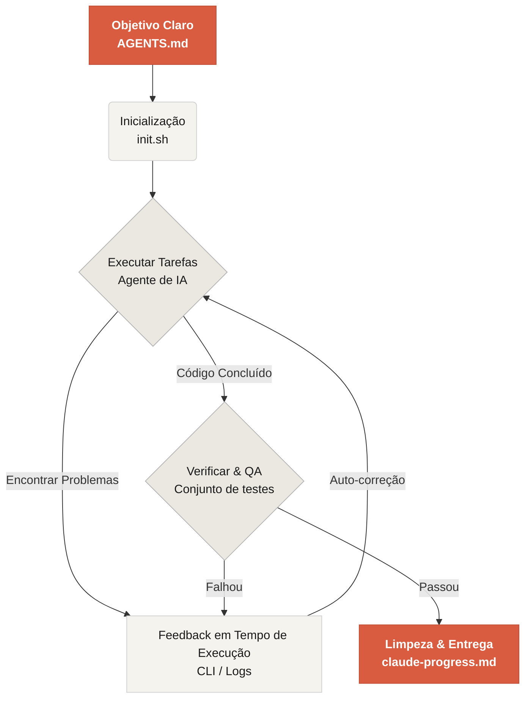

# Bem-vindo ao Learn Harness Engineering

Learn Harness Engineering é um curso dedicado à engenharia de agentes de codificação de IA. Estudamos e sintetizamos profundamente as teorias e práticas mais avançadas de Engenharia de Harness na indústria. Nossas referências principais incluem:
- [OpenAI: Engenharia de Harness: alavancando o Codex em um mundo focado em agentes](https://openai.com/index/harness-engineering/)
- [Anthropic: Harnesses eficazes para agentes de longa duração](https://www.anthropic.com/engineering/effective-harnesses-for-long-running-agents)
- [Anthropic: Design de Harness para desenvolvimento de aplicações de longa duração](https://www.anthropic.com/engineering/harness-design-long-running-apps)
- [Awesome Harness Engineering](https://github.com/walkinglabs/awesome-harness-engineering)

Através de design sistemático de ambiente, gerenciamento de estado, verificação e sistemas de controle, este curso ensina como tornar ferramentas de codificação de agentes como Codex e Claude Code verdadeiramente confiáveis. Ele ajuda você a construir recursos, corrigir bugs e automatizar tarefas de desenvolvimento, restringindo seu assistente de codificação de IA com regras e limites explícitos.

## Comece

Escolha seu caminho de aprendizado para começar. O curso é dividido em palestras teóricas, projetos práticos e uma biblioteca de recursos pronta para uso.

  <a href="./lectures/lecture-01-why-capable-agents-still-fail/" class="card">
    <h3>Palestras</h3>
    
Entenda por que modelos fortes ainda falham e aprenda a teoria por trás de harnesses eficazes.

  </a>
  <a href="./projects/" class="card">
    <h3>Projetos</h3>
    
Prática prática construindo um ambiente de agente confiável do zero.

  </a>
  <a href="./resources/" class="card">
    <h3>Biblioteca de Recursos</h3>
    
Modelos prontos para uso (AGENTS.md, feature_list.json) para usar em seus próprios repositórios.

  </a>

## O Mecanismo Central de um Harness

Um harness não "torna o modelo mais inteligente"; em vez disso, ele estabelece um **sistema de trabalho** de ciclo fechado para o modelo. Você pode entender seu fluxo de trabalho central através deste diagrama simples:

## O que você aprenderá

Aqui estão alguns dos conceitos-chave que você dominará:

<ul class="index-list">
  <li><strong>Restringir o comportamento do agente</strong> com regras e limites explícitos.</li>
  <li><strong>Manter o contexto</strong> em tarefas de longa duração e múltiplas sessões.</li>
  <li><strong>Impedir que os agentes</strong> declarem vitória muito cedo.</li>
  <li><strong>Verificar o trabalho</strong> usando testes de pipeline completo e auto-reflexão.</li>
  <li><strong>Tornar o tempo de execução observável</strong> e depurável.</li>
</ul>

## Próximos passos

Depois de entender os conceitos centrais, estes guias o ajudarão a aprofundar:

<ul class="index-list">
  <li><a href="./lectures/lecture-01-why-capable-agents-still-fail/">Palestra 01: Por que Agentes Capazes Ainda Falham</a>: Comece com a teoria por trás da engenharia de harness.</li>
  <li><a href="./projects/project-01-baseline-vs-minimal-harness/">Projeto 01: Harness Básico vs Mínimo</a>: Percorra sua primeira tarefa real.</li>
  <li><a href="./resources/templates/">Modelos</a>: Obtenha o pacote de harness mínimo (AGENTS.md, feature_list.json, claude-progress.md) para seus próprios projetos.</li>
</ul>
