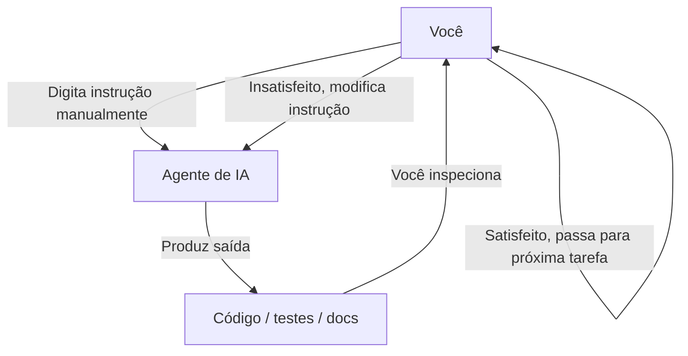
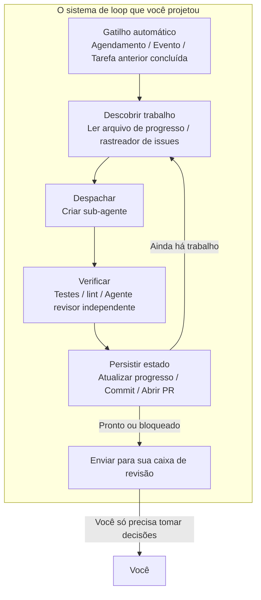
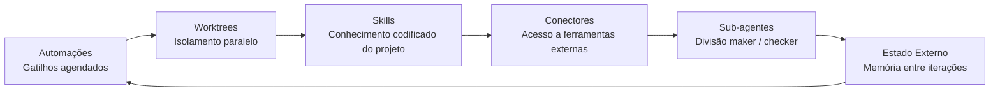
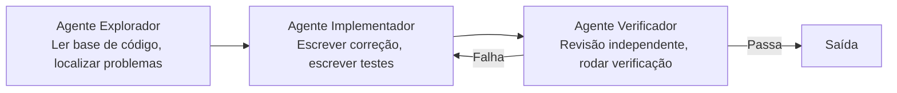
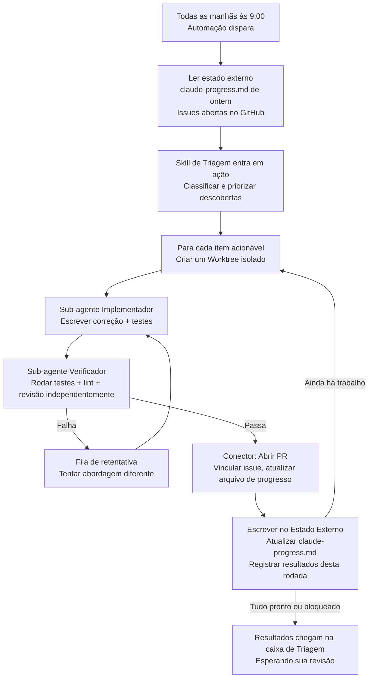
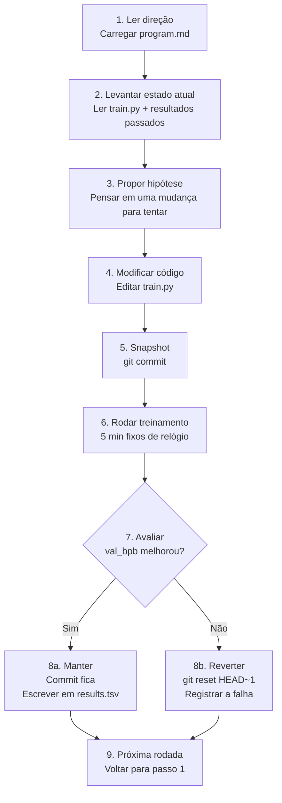

[English Version →](../../../en/lectures/lecture-13-loop-engineering/)

> Exemplos de código: [code/](https://github.com/walkinglabs/learn-harness-engineering/blob/main/docs/pt-BR/lectures/lecture-13-loop-engineering/code/)
> Projeto prático: [Projeto 07. Construa Seu Primeiro Loop Automatizado](./../../projects/project-07-loop-engineering-first-loop/index.md)

# Aula 13. Do Prompting Manual aos Loops Autônomos

Tudo o que você aprendeu nas primeiras doze aulas se baseia em uma premissa: **você está sentado ao teclado, digitando instruções uma de cada vez.**

Você escreveu o `AGENTS.md` (Aulas 1–4), construiu o gerenciamento de estado (Aulas 5–6), restringiu o escopo com listas de funcionalidades (Aulas 7–8), deixou transferências limpas ao final das sessões (Aulas 9, 12) e tornou o runtime observável (Aulas 10–11). Mas o gatilho para tudo isso sempre foi você. O agente nunca decidiu por conta própria quando começar a trabalhar — porque ninguém pressionou "iniciar".

Esta aula trata de entregar o botão de iniciar ao sistema. Não é abrir mão do controle — é elevá-lo ao próximo nível.

## /goal: O Loop Mais Simples Possível

A melhor entrada para a engenharia de loops não é um diagrama de arquitetura complexo — é um único comando.

No início de 2026, o Claude Code e o OpenAI Codex lançaram independentemente o mesmo recurso: `/goal`. Você digita no terminal:

```
/goal "Todos os testes passam, zero avisos de lint, merge na main"
```

Depois você fecha o laptop e vai dormir. Oito horas depois, o agente analisou, codificou, testou, corrigiu e mesclou por conta própria. Ele tenta novamente em caso de falha, muda de abordagem quando fica preso e para quando termina — sem você ficar de olho dizendo "tente de novo".

A única diferença entre `/goal` e um prompt tradicional é uma coisa. Mas essa coisa muda tudo:

| | Prompt Tradicional | `/goal` |
|---|---|---|
| O que você fornece | O que fazer em seguida | Como é o estado final |
| O que o agente faz | Executa uma vez | Repete até atingir |
| Quem julga se terminou | Você | Uma condição de parada verificável |
| Quando você pode ir embora | Não pode | No momento em que digita `/goal` |

`/goal` é essencialmente um loop. Ele tem exatamente três partes: **um objetivo, um método de verificação e uma condição de parada.** Apenas essas três coisas movem você de dentro do loop para fora dele.

### Como `/goal` Cresceu Organicamente

`/goal` não pulou de 0 para 1 do nada. Ele cresceu gradualmente a partir de fluxos de trabalho cotidianos, passando por aproximadamente quatro estágios:

**Estágio 1: Prompting manual um a um.** A forma mais antiga de trabalhar era de ida e volta: "escreva uma função", "adicione um teste", "conserte essa lógica". O agente parava após cada passo e esperava você dizer o que vem a seguir. Você era o agendador de todo o pipeline.

**Estágio 2: Prompts longos com múltiplos passos.** Depois as pessoas começaram a escrever prompts mais longos que empilhavam passos: "primeiro analise o código, depois escreva a implementação, depois execute os testes e, se falharem, conserte-os". O agente podia executar vários passos de uma vez, mas você ainda tinha que observar — porque ele poderia desviar no meio do caminho, ou terminar um passo e não saber o que fazer em seguida.

**Estágio 3: Auto-reflexão e autodireção do agente.** Depois disso, os agentes ganharam "introspecção" — após cada passo eles olhavam o resultado e decidiam o que fazer em seguida. Você dava um objetivo, e eles o decompunham sozinhos e tentavam novamente por conta própria. Mas um problema surgiu: quando eles param? "Estou pronto" vindo do próprio agente conta? A prática sempre respondia — não. Os agentes declaram vitória com muita facilidade.

**Estágio 4: Julgamento de parada independente — `/goal`.** O passo final foi tirar "julgar se está pronto" das mãos do agente que faz o trabalho e entregar a um juiz independente. Pode ser um modelo diferente, um script ou um comando de teste — mas a regra era a mesma: quem escreve o código não pode corrigir a própria lição de casa. Neste ponto, `/goal` realmente funcionou: você dá o objetivo, ele repete, um juiz independente decide quando parar, e você pode ir embora.

Esses quatro estágios não foram um roteiro planejado por nenhuma empresa. Eles foram o caminho que todos que codificavam com agentes chegaram, independentemente, impulsionados pelos mesmos pontos de dor. O Claude Code e o Codex lançando `/goal` quase simultaneamente no início de 2026 não foi coincidência — a hora havia chegado.

### Há Mais de um Tipo de Loop

`/goal` é o loop mais fácil de entender, mas não é o único tipo. Os loops se dividem em categorias com base em como são acionados e como param:

| Tipo | Gatilho | Condição de Parada | Claude Code | Codex | Melhor Para |
|------|---------|-------------------|-------------|-------|-------------|
| **Loop baseado em turnos** | Você digita cada prompt manualmente | O agente acha que terminou, ou você interrompe | Chat normal | Chat normal | Tarefas pequenas, trabalho exploratório |
| **Loop baseado em objetivo** | Você dá um objetivo | Avaliador independente confirma que terminou, ou máximo de turnos atingido | `/goal` | `/goal` (requer habilitação manual) | Tarefas complexas com critérios de conclusão claros |
| **Loop baseado em tempo** | Intervalo agendado (a cada N minutos/horas) | Você para manualmente, ou ele sai após concluir o trabalho | `/loop` | Thread automation | Verificar status, verificações periódicas, trabalho recorrente |
| **Loop orientado a eventos** | Evento externo (PR aberta, CI falhou, nova issue) | Para após lidar com o evento, ou atinge o limite de tentativas | Routines (API / GitHub Webhook) | Standalone automation + plugins | Fluxos de trabalho reativos, integração CI/CD |

Estes não são concorrentes — são ferramentas diferentes para trabalhos diferentes. Baseado em turnos serve para coisas pequenas. Use `/goal` quando há uma linha de chegada clara. Use `/loop` quando precisa observar algo. Use orientado a eventos quando estiver integrando com sistemas externos.

### Não Confunda `/goal` e `/loop`

Ambos têm "loop" no nome, mas resolvem problemas completamente diferentes:

| | `/goal` | `/loop` |
|---|---------|---------|
| **O que é** | Uma tarefa grande, executa até terminar | Uma ação pequena, repete em intervalo |
| **Condição de parada** | Objetivo atingido, ou orçamento esgotado | Você para manualmente, ou a tarefa sai sozinha |
| **Perfil de tempo** | Uma execução longa, pode levar horas ou dias | Pulsos curtos periódicos, cada execução pode durar alguns minutos |
| **Progresso** | Fica mais perto da linha de chegada a cada iteração | Cada execução é independente, sem progresso cumulativo |
| **Analogia** | Correr uma maratona — tiro de partida soa, você para na linha de chegada | Um despertador — toca em horário programado, você desliga |
| **Uso típico** | "Implementar o sistema de pagamento completo com cobertura de testes" | "Verificar se a CI está quebrada a cada 15 minutos" |

Um erro comum: enfiar algo que deveria ser `/goal` em um `/loop`. Como escrever `/loop 10m "continue implementando o sistema de pagamento"` — isso está errado. `/loop` executa a mesma instrução independentemente a cada vez, ele não lembra onde parou da última vez. Você apenas terá o mesmo ponto de partida repetidamente.

**Teste de uma frase para qual usar: essa coisa tem fim?**
- Tem fim → `/goal`
- Não tem fim, você só precisa continuar observando → `/loop`

Engenharia de Loops, o assunto desta aula, não é sobre nenhum comando específico. É sobre **ser capaz de projetar sistemas que incluem todos esses tipos — para que seu agente possa continuar trabalhando mesmo quando você não está lá.**

Você não precisa digitar `/goal` toda vez. Mas entender de onde ele veio e por que é como é — isso é entender o núcleo da engenharia de loops. Loops mais complexos apenas adicionam peças como agendamento, paralelismo, isolamento e memória sobre esses mesmos três fundamentos: objetivo, verificação, condição de parada.

## Junho de 2026: Três Pessoas Acenderam o Mesmo Fusível em Uma Semana

Na primeira semana de junho de 2026, três profissionais que construíam infraestrutura de agentes de codificação — sem comparar notas — disseram a mesma coisa em palavras diferentes.

**Peter Steinberger** (criador do OpenClaw, [sua postagem alcançou 8 milhões de visualizações](https://x.com/steipete/status/2063697162748260627)): "Você não deveria mais estar dando prompt em agentes de codificação. Você deveria estar projetando loops que dão prompt em seus agentes."

**Boris Cherny** (chefe do Claude Code na Anthropic, [no podcast Acquired](https://x.com/rohanpaul_ai/status/2063289804708835412)): "Eu não dou mais prompt no Claude. Tenho loops rodando que dão prompt no Claude e descobrem o que fazer. Meu trabalho é escrever loops."

**Addy Osmani** (líder de engenharia no Google Chrome) [batizou o conceito](https://addyosmani.com/blog/loop-engineering/) em 7 de junho de 2026, e deu uma definição em uma linha:

> **Loop engineering é substituir você mesmo como a pessoa que dá prompt ao agente. Você projeta o sistema que faz isso em vez de você.**

Cherny divulgou números: por mais de 30 dias consecutivos, todas as contribuições de código para o Claude Code foram feitas autonomamente por IA — 259 PRs mescladas, mais de 80% do código de produção autoriado pelo Claude, e uma taxa de sucesso de 76% em tarefas de software abertas.

Três pessoas. Uma semana. A mesma conclusão. Não porque coordenaram — mas porque a infraestrutura havia silenciosamente cruzado um limiar. Os agentes haviam se tornado confiáveis o suficiente para terminar tarefas não triviais sem supervisão. Primitivas de agendamento (`/loop`, `/goal`, cron) agora estavam embutidas nas ferramentas. O custo de uma única execução de agente havia caído o suficiente para que rodar uma repetidamente em um temporizador parasse de parecer desperdício. Quando todas as peças estão presentes, o movimento que as combina se torna óbvio para todos ao mesmo tempo.

> Fonte: [Addy Osmani: Loop Engineering](https://addyosmani.com/blog/loop-engineering/)

## Dentro do Loop vs. Fora do Loop

Vamos contrastar dois cenários concretos.

**Cenário A: Você está dentro do loop (Aulas 1–12).**



Você tem um harness completo: `AGENTS.md` diz ao agente as regras do projeto, `feature_list.json` restringe o escopo, `init.sh` garante ambiente consistente, `claude-progress.md` registra o progresso. **Mas cada passo ainda requer sua iniciação manual.** Termine uma funcionalidade, leia o arquivo de progresso, pense no que vem a seguir, digite a instrução. Você é o motor de todo o fluxo de trabalho.

**Cenário B: Você está fora do loop (Engenharia de Loops).**



Você não digita mais instruções. O sistema que você projetou descobre o trabalho, o despacha, verifica os resultados, registra o estado e decide o próximo passo. Seu trabalho se reduz a três coisas: **definir o objetivo e a condição de parada antes de começar, revisar a saída depois que terminar, e ajustar as regras quando o sistema desviar do curso.** A alavanca passa de "escrever o prompt certo" para "projetar o loop certo".

> Osmani: "Um ano atrás, se você quisesse um loop, escrevia uma pilha de bash e mantinha aquela pilha para sempre e era sua e só sua. Agora as peças simplesmente vêm dentro dos produtos." Você não precisa construir do zero. Precisa entender como as peças se encaixam.

## Conceitos Fundamentais

- **Engenharia de Loops (Loop Engineering)**: Projetar um sistema que automaticamente dá prompt ao seu agente, substituindo a entrada humana passo a passo manual. O humano se move de dentro do loop para fora dele, e a alavanca muda de "escrever o prompt certo" para "projetar o loop certo".
- **Modo `/goal`**: O loop mais simples possível — forneça um objetivo, método de verificação e condição de parada; o agente repete até atingir. A ponte do prompting manual para loops autônomos.
- **Separação Gerador/Avaliador**: O agente que escreve o código e o agente que o verifica devem estar separados. Um modelo corrigindo o próprio trabalho não é confiável; um verificador independente — às vezes usando um modelo completamente diferente — é a garantia básica de confiabilidade de qualquer loop.
- **Isolamento por Worktree (Worktree Isolation)**: Cada agente paralelo trabalha em um git worktree independente, prevenindo fisicamente colisões de arquivos. O pré-requisito de infraestrutura para execução paralela multi-agente.
- **Estado Externo (External State)**: Memória que vive fora de uma única conversa — arquivos markdown, rastreadores de issues, quadros kanban. Os modelos esquecem tudo entre as execuções; a memória deve viver no disco.
- **Quatro Custos Silenciosos**: Quatro custos ocultos que se tornam mais agudos quanto mais tempo um loop roda — dívida de verificação, deterioração da compreensão, rendição cognitiva, explosão de tokens. Os loops aceleram não apenas a saída, mas o risco.

## As Seis Primitivas de um Loop

Osmani decompôs um loop em cinco blocos de construção centrais, mais uma camada de memória que atravessa todos eles — seis coisas no total, mas a camada de memória ocupa um status especial: não é um componente no mesmo nível dos outros; é a espinha dorsal de que tudo depende.

O diagrama abaixo desenha todas as seis como um anel para que você possa ver o quadro completo de relance. Mas lembre-se: Estado Externo não é apenas outra parada no loop — é a base em que todo o loop descansa.



### 1. Automações — O Batimento Cardíaco

Sem automação, um loop não é um loop — é uma execução única que você fez manualmente.

Tanto o Claude Code quanto o Codex têm sistemas completos de agendamento, mas usam nomes e camadas diferentes. Mapeamento grosso do mais leve ao mais pesado:

| Camada | Claude Code | Codex | Observações |
|--------|-------------|-------|-------------|
| Polling na sessão | `/loop` | Thread automation | Vinculado à sessão atual, morre quando a sessão fecha |
| Tarefas agendadas locais | Desktop scheduled tasks | Standalone automation (modo local) | Roda enquanto a máquina está ligada, pode acessar arquivos locais |
| Tarefas agendadas na nuvem | Cloud Routines | — (sem agendador nativo na nuvem) | Roda enquanto a máquina está desligada |
| Gatilhos de eventos | Routines (API / GitHub Webhook) | Standalone automation + plugins | Acionados por eventos externos |
| Totalmente auto-hospedado | GitHub Actions / cron auto-hospedado | `codex exec` + cron | Controle total |

**A aba Automations do Codex** é o ponto de entrada para agendamento. Escolha o projeto, o prompt, a cadência e se roda no seu checkout local ou em um worktree em segundo plano. Execuções que encontram algo vão para uma caixa de entrada de Triagem; execuções que não encontram nada são arquivadas automaticamente. A OpenAI os usa internamente para triagem diária de issues, resumos de falha de CI, briefings de commit e caça a bugs introduzidos na semana passada.

As automações do Codex vêm em dois sabores:
- **Thread automation** — Chamadas de despertar recorrentes no estilo batimento cardíaco vinculadas a uma thread, preservando o contexto. Bom para acompanhamento contínuo em uma única coisa, como monitorar um comando de longa duração ou verificar o status de um PR. O equivalente no Claude Code é `/loop`.
- **Standalone automation** — Cada execução começa do zero, os resultados vão para a Triagem. Bom para tarefas diárias/semanais independentes como briefings ou varreduras de dependências. O equivalente no Claude Code é Desktop scheduled tasks.

O sistema do Claude Code é camadas mais granularmente:

- **`/loop`** — Repetição agendada leve na sessão. Funciona enquanto seu terminal está aberto, morre quando a sessão fecha, expira automaticamente após 7 dias. Bom para monitoramento temporário durante sua sessão de trabalho atual.
- **Desktop scheduled tasks** — Roda enquanto sua máquina está ligada, sobrevive a reinícios de sessão, intervalos em nível de minuto. Bom para trabalho recorrente que precisa de acesso a arquivos locais.
- **Cloud Routines** — Roda na infraestrutura de nuvem da Anthropic, sobrevive a sua máquina desligada, intervalo mínimo de 1 hora. Suporta três tipos de gatilho: agendado, chamada de API, webhook do GitHub. Bom para tarefas diárias que não precisam do seu ambiente local.
- **GitHub Actions / cron auto-hospedado** — Totalmente sob seu controle, roda como você quiser. Bom para cenários com requisitos especiais de ambiente ou segurança.

```bash
# Claude Code: rodar testes a cada 30 min, corrigir falhas (dentro da sessão atual)
/loop 30m Run the test suite and fix any failing tests

# Claude Code: verificar status do deploy a cada 15 minutos
/loop 15m Check if the production deploy succeeded and report status
```

Automações são o batimento cardíaco. Sem elas, o loop é uma planta que nunca acorda.

### 2. Worktrees — Isolamento em Escala

Assim que você roda mais de um agente, colisões de arquivos se tornam o modo de falha inevitável. Dois agentes escrevendo no mesmo arquivo é exatamente a dor de cabeça de dois engenheiros fazendo commit nas mesmas linhas sem se consultar.

`git worktree` resolve isso: cada agente trabalha em seu próprio branch em seu próprio diretório. Eles fisicamente não podem tocar no checkout um do outro.

Tanto o Claude Code quanto o Codex vêm com suporte a worktree. Quando você usa `--worktree` ou `isolation: worktree` em um sub-agente, cada auxiliar recebe um checkout limpo e independente que se limpa sozinho. Worktrees removem o problema mecânico de colisão — mas lembre-se: **sua banda de revisão ainda é o teto.** Quantos agentes paralelos você consegue supervisionar determina quantos worktrees você consegue realmente rodar.

### 3. Skills — Pare de Reexplicar Seu Projeto

Uma skill é como você para de reexplicar o mesmo contexto do projeto toda sessão. É uma pasta contendo um `SKILL.md` com instruções e metadados, além de scripts opcionais, referências e ativos.

O Codex e o Claude Code suportam o mesmo formato. Skills são invocadas diretamente com `/skill-name` (o Codex também suporta `$skill-name`), ou acionadas implicitamente quando a tarefa corresponde à descrição da skill.

Skills são fundamentalmente sobre pagar sua dívida de intenção. Um agente começa toda sessão frio — ele preenche qualquer lacuna na sua intenção com um palpite confiante. Uma skill é essa intenção escrita do lado de fora: as convenções, os passos de build, o "nós não fazemos assim por causa daquele incidente" — escrito uma vez, lido toda execução.

### 4. Conectores — Seu Loop Toca Ferramentas Reais

Um loop que só consegue ver o sistema de arquivos é um loop pequeno. Conectores (construídos sobre o protocolo MCP) permitem que o agente leia seu rastreador de issues, consulte um banco de dados, acesse uma API de staging, envie uma mensagem no Slack.

Tanto o Codex quanto o Claude Code falam MCP, então o conector que você escreveu para um geralmente funciona no outro. Conectores são a diferença entre "aqui está a correção" e um loop que abre o PR, vincula o ticket do Linear e avisa o canal quando a CI ficar verde — sozinho, dentro do seu ambiente real, não apenas em um terminal.

### 5. Sub-agentes — Mantenha o Maker Longe do Checker

A escolha de design estruturalmente mais valiosa em um loop é separar quem escreve de quem verifica. O modelo que escreveu o código é generoso demais corrigindo a própria lição de casa. Um segundo agente, com instruções diferentes e às vezes um modelo diferente, pega o que o primeiro agente se convenceu.

A divisão clássica de três papéis:



O `/goal` do Claude Code roda isso por baixo dos panos — uma sessão nova e independente julga se o loop deve parar, não a sessão que fez o trabalho. Isso se chama **separação gerador/avaliador**, e é a garantia de confiabilidade mais importante no design de loops.

### 6. Estado Externo — A Memória do Loop

Os modelos esquecem tudo entre as execuções. A memória deve viver no disco, não na janela de contexto.

Isso parece simples demais para importar, mas é o mesmo truque do qual todo agente de longa duração depende. Um arquivo markdown, um quadro do Linear — qualquer coisa que viva fora de uma única conversa e guarde o que está feito, o que está em andamento e o que vem a seguir. O agente esquece. O repositório não esquece.

Essas seis primitivas são seu kit de ferramentas de design de loops. Você não precisa de todas elas para todo loop. Mas precisa saber quando pegar qual.

## Um Loop Completo, Anatomizado

Conecte todas as seis e é assim que um loop de triagem matinal real se parece:



Isso não é mais uma única execução de agente. É um sistema operacional continuamente que acorda todas as manhãs, varre o chão sozinho e coloca as coisas que precisam da sua atenção na sua frente. Seu papel se torna: **revisar o conteúdo da caixa de entrada, tomar decisões e, quando identificar um padrão que o sistema não consegue lidar, refinar as skills e regras.**

Cherny usou esse padrão para mesclar 259 PRs em 30 dias sem abrir uma IDE uma única vez. Engenheiros da OpenAI usaram o mesmo padrão para construir um produto beta de aproximadamente um milhão de linhas — sem escrever uma única linha de código eles mesmos.

## Separação Gerador/Avaliador: Por Que Você Não Pode Deixar o Modelo Corrigir o Próprio Trabalho

Esta é a lição mais difícil da engenharia de loops.

Seu agente mais inteligente escreve um pedaço de código bonito. A lógica é clara, os comentários são completos, e cada função tem um teste. Você está satisfeito.

Mas aqui está a pergunta: **se você deixar o agente que escreveu aquele código julgar se fez um bom trabalho, o que ele dirá?**

A resposta foi confirmada pela experiência repetidamente: ele dará a si mesmo uma nota alta. Não porque seja desonesto, mas porque é o autor — ele se convenceu de que esse caminho estava correto durante a geração. Quando olha para trás, não vê erros; vê seu próprio processo de raciocínio.

Isso não é um problema do Claude. Isso não é um problema do GPT. Isso é uma propriedade de todos os modelos generativos. **Um modelo é o melhor advogado de defesa da sua própria saída.**

A correção: nunca deixe a mesma entidade (mesmo modelo, mesmo prompt) fazer tanto o trabalho quanto a revisão.

- O `/goal` do Claude Code usa uma sessão de supervisão independente para julgar se o objetivo foi atingido — não a sessão que o tentou.
- O sistema de sub-agentes do Codex permite definir um agente verificador usando um modelo diferente com esforço de raciocínio diferente.
- A prática comunitária de "adversarial verify" cria N céticos independentes por descoberta, cada um com prompt para refutar — rejeição majoritária mata a descoberta.

Uma frase para lembrar: **alguém na sua equipe não deve acreditar em você.**

## autoresearch do Karpathy: O Exemplar de Loop

Se você quer ver como é um loop bem projetado e realmente rodando, o [autoresearch do Karpathy](https://github.com/karpathy/autoresearch) é o exemplo didático.

Em março de 2026, Karpathy lançou um projeto Python de 630 linhas. Dê a ele uma GPU e uma direção de pesquisa, e ele roda a noite toda — completando centenas de experimentos de treinamento de ML, mantendo apenas aqueles que realmente melhoram. O projeto atingiu 66.000+ estrelas em poucos dias do lançamento.

### Três Arquivos, Três Papéis

Todo o sistema tem apenas três arquivos centrais, mas a divisão de trabalho é afiada como navalha:

| Arquivo | Quem Edita | O Que Faz |
|---------|-----------|-----------|
| `prepare.py` | Ninguém (somente leitura) | Preparação de dados, tokenizador, avaliação. Infraestrutura fixa. |
| `train.py` (~630 linhas) | **Agente de IA** | Definição do modelo, otimizador, loop de treinamento. O playground do agente — mude qualquer coisa. |
| `program.md` | **Você** | Metodologia de pesquisa escrita em linguagem natural. Você só edita isso. Diga ao agente como explorar, como avaliar, o que não tocar. |

Essa divisão em três vias é a alma do design: **humanos não tocam código, tocam direção; agentes não tocam direção, tocam código.** Seu trabalho muda de escrever Python para "escrever a cultura da organização de pesquisa".

### Entrada: Como é program.md

`program.md` é o cérebro do loop. Não é código — é um manual de instruções de pesquisa escrito em Markdown. Ele contém aproximadamente:

- **Objetivo**: otimizar `val_bpb` (bits por byte de validação, menor é melhor)
- **Restrições**: não tocar em `prepare.py`, ficar dentro do orçamento de VRAM, treinamento fixo de 5 minutos
- **Direções de exploração**: tentar diferentes arquiteturas, otimizadores, agendas de LR
- **Regras de avaliação**: o que conta como melhoria, como registrar resultados, o que fazer em caso de falha
- **Regra de ferro**: nunca pare. Uma vez que o loop comece, continue para sempre

Seu prompt de inicialização para o agente pode ser tão curto quanto uma frase:

```
Have a look at program.md and let's kick off a new experiment!
```

O resto fica por conta do agente lendo o documento e tomando suas próprias decisões.

### O Loop de Catraca de Nove Passos

No coração do autoresearch está uma **catraca** — ela só se move para frente, nunca para trás. Cada iteração segue estritamente nove passos:



Ele roda aproximadamente 12 experimentos por hora. Uma execução noturna (8 horas) são cerca de 100 experimentos. O próprio Karpathy o rodou por 2 dias — ~700 experimentos.

O orçamento fixo de 5 minutos de relógio é uma escolha chave de design — não importa o que o agente mude, cada experimento leva exatamente o mesmo tempo. Isso significa que todos os resultados são diretamente comparáveis sob o mesmo orçamento de tempo — sem discussão sobre "esse rodou mais tempo então é melhor".

### Saída: O Que Você Vê Quando Acorda

Depois de uma noite de loops, você se senta de manhã e encontra três coisas:

**1. Histórico do git (a catraca que só anda para frente)**

Apenas commits que realmente melhoraram ficam na branch principal. Tudo que falhou foi revertido. `git log` é um log de pesquisa validado.

**2. results.tsv (o registro completo de experimentos)**

Cada experimento — sucesso ou falha — é registrado:

```
timestamp    commit_hash    val_bpb    vram_mb    description
--------- ------------- ---------- ---------- ----------------------------
08:01:12  a1b2c3d       1.234     22100    baseline
08:06:15  d4e5f6g       1.228     22400    increased learning rate by 10%
08:11:20  (reverted)     1.241     21800    switched to GELU activation
08:16:08  h7i8j9k       1.219     23000    added weight decay 0.01
...
```

**3. Um log de pesquisa (resumo do próprio agente)**

O agente escreve mensagens de commit claras sobre o que tentou, o que funcionou, o que não funcionou e o que planeja tentar em seguida. Você lê essas — não precisa ler os diffs de código.

### O Que Ele Realmente Encontrou

Resultados da execução inicial de 2 dias, ~700 experimentos de Karpathy:

- De ~700 tentativas, cerca de **20 melhorias reais empilháveis** foram encontradas
- Reduziu o tempo de treinamento em nível GPT-2 do nanochat em 8×H100 de **2,02 horas → 1,80 horas**, cerca de **11% mais rápido**
- Descobertas incluíram: ajustes de taxa de aprendizado, ajuste de otimizador, trocas de ativação, otimizações de padrão de atenção, etc.

Todas as melhorias foram descobertas revolucionárias? Não. A maioria eram pequenas otimizações que se empilharam. Mas essas 20 melhorias válidas teriam levado semanas de trabalho manual a um pesquisador humano — o agente fez em 48 horas.

### O Detalhe Mais Revelador: O Loop Está Escrito em Inglês, Não em Código.

`program.md` é um documento Markdown, não um script Python. Ele descreve uma metodologia de pesquisa — o que modificar, o que deixar em paz, como avaliar, como lidar com casos de falha e uma regra de ferro: **nunca peça ajuda humana, apenas continue.** Um agente de codificação lê este documento e o executa indefinidamente.

Este é o modelo para engenharia de loops: não dê ao agente uma tarefa. Dê a ele uma **metodologia**. Deixe a metodologia ser o loop. Um `program.md`, 630 linhas de código cola, e tudo o mais é o agente rodando a si mesmo.

## Quatro Custos Silenciosos

Quando um loop começa a rodar, você não verá os problemas imediatamente. Os quatro custos a seguir se acumulam silenciosamente, e quando você perceber, pode já ter pago caro.

### 1. Dívida de Verificação

Loops rápidos tentam você a pular a verificação. "Parece bom" não é a mesma coisa que "confirmado correto". Quanto mais código um loop gera sem supervisão, mais rápido a dívida de verificação se acumula. A correção: **condições de parada devem ser verificáveis por máquina, nunca "parece mais ou menos certo".**

### 2. Deterioração da Compreensão

Quanto mais rápido um loop entrega código, mais a sua compreensão da sua própria base de código se afasta da realidade. A equipe de Cherny tinha 80% do código autoriado por agentes — o que significa que a maior parte do código de uma equipe não foi escrita por uma pessoa. Se você não ler e usar o que o loop produz, sua compreensão decai continuamente. **Loops rápidos exigem leitura rápida.**

### 3. Rendição Cognitiva

Quando o loop roda suavemente, a postura mais confortável é parar de ter opiniões. Pegue o que ele devolver, não pense sobre a saída. Mas é exatamente aí que o perigo começa — você está usando o loop para evitar pensar, em vez de ampliar o pensamento. O aviso de Osmani: "Duas pessoas podem construir o mesmo loop exato e obter resultados opostos. Uma usa para ir mais rápido em trabalho que entende; a outra usa para evitar entender o trabalho. O loop não sabe a diferença. Você sabe."

### 4. Explosão de Tokens

Cada iteração de um loop acumula mais contexto: código escrito, erros encontrados, decisões tomadas. Sem gerenciamento de contexto, o tamanho do prompt cresce aproximadamente quadraticamente com o número de turnos. O Codex resolve isso com compactação automática de contexto — uma API dedicada comprime turnos mais antigos de conversa em resumos criptografados de conteúdo, retendo conhecimento essencial enquanto descarta detalhes redundantes. Esta é uma preocupação de engenharia que você deve abordar desde o primeiro loop, não um complemento posterior.

## Construindo Seu Primeiro Loop

Você não precisa começar com um pipeline em escala Stripe mesclando 1.300 PRs por semana. Comece com a menor coisa que funciona.

### Passo 1: Escolha Uma Tarefa Recorrente

Encontre algo que você faz manualmente pelo menos duas vezes por semana. Exemplos:
- Abrir o GitHub de manhã, verificar novas issues, triar e responder
- Rodar lint e testes antes de cada revisão de PR
- Atualizar docs de progresso ao final de cada dia

### Passo 2: Escreva um Objetivo e Condição de Parada

Transforme a tarefa em algo que um `/goal` consegue entender:

```markdown
Goal: Check the 10 most recent issues in the repo.
For each issue:
  - If it already has clear labels and an assignee, skip
  - If untagged, add appropriate labels based on content
  - If fixable in under 10 minutes, create a branch and attempt a fix
Stop when: All qualifying issues have been processed, or an issue requires human decision.
```

### Passo 3: Separe Maker e Checker

Não deixe o mesmo agente tanto escrever o código quanto julgá-lo. Divida seu loop em dois papéis:
- Implementador: lê a issue, escreve a correção, escreve os testes
- Verificador: roda testes independentemente, revisa o diff, julga se a correção realmente resolve o problema

### Passo 4: Adicione Memória

Use um arquivo markdown para registrar o que aconteceu em cada execução do loop. A próxima execução começa lendo este arquivo — ela sabe o que foi feito, o que está pendente, o que estava bloqueado. Isso supera qualquer banco de dados complexo.

### Passo 5: Defina um Temporizador

Use `/loop` ou o cron do seu SO para deixar o loop começar sem você. Comece com uma vez por dia. Observe por uma semana.

### A Escada de Maturidade

Você não precisa chegar ao topo de um salto. A adoção de loops é uma escada:

1. **Nível 1: Executor de Objetivo** — Você consegue usar `/goal` para dar uma tarefa com condição de parada; o agente repete até atingir.
2. **Nível 2: Tarefa Única Agendada** — Uma automação roda uma tarefa em um temporizador (ex: verificação matinal de CI).
3. **Nível 3: Loop Multi-Agente** — Divisão entre maker e checker; cada descoberta cria um worktree isolado.
4. **Nível 4: Loop Auto-Alimentado** — O loop descobre automaticamente sua próxima tarefa a partir do estado externo; ele decide o que fazer em seguida.
5. **Nível 5: Orquestração de Frota** — Múltiplos loops rodam em paralelo, independentes mas compartilhando uma camada de memória.

A maioria das equipes está atualmente entre o Nível 2 e o Nível 3. O Nível 1 é o caminho mais rápido para ver retornos.

## Principais Conclusões

- **Engenharia de Loops não substitui Engenharia de Harness — ela constrói um andar acima dela.** O harness torna execuções únicas confiáveis. O loop torna execuções contínuas autônomas.
- **`/goal` é o loop mais simples possível:** objetivo + verificação + condição de parada. Essas três coisas movem você de dentro do loop para fora dele.
- **Seis primitivas (Automações / Worktrees / Skills / Conectores / Sub-agentes / Estado Externo) são os blocos de construção do loop.** Nem todas todas as vezes, mas você precisa saber quando pegar qual.
- **O maker e o checker devem estar separados.** Um modelo corrigindo o próprio trabalho não é confiável. Um verificador independente — às vezes um modelo completamente diferente — é a garantia básica de confiabilidade de qualquer loop.
- **Loops tornam a geração quase gratuita e deixam o julgamento como o recurso escasso.** O tempo que você economiza não é para descansar. É para fazer mais julgamentos.
- **Quatro custos silenciosos se tornam mais agudos quanto mais os loops rodam:** dívida de verificação, deterioração da compreensão, rendição cognitiva, explosão de tokens. Loops aceleram a saída — e o risco.
- **Comece pequeno.** Um `/goal`, um cron, um arquivo de memória markdown. Veja o retorno, depois empilhe para cima.

## Leitura Adicional

- [Addy Osmani: Loop Engineering](https://addyosmani.com/blog/loop-engineering/)
- [Addy Osmani: Agent Harness Engineering](https://addyosmani.com/blog/agent-harness-engineering/)
- [Simon Willison: Designing Agentic Loops (Sep 2025)](https://simonw.substack.com/p/designing-agentic-loops)
- [Karpathy: autoresearch](https://github.com/karpathy/autoresearch)
- [Claude Code: Dynamic Workflows and Orchestration](https://kenhuangus.substack.com/p/claude-code-orchestration-dynamic)
- [Loop Library (Forward Future)](https://signals.forwardfuture.ai/loop-library/) — Corpus público de 50 loops reais
- [The Neuron: Claude Code Creators on Agent Loops](https://www.theneuron.ai/explainer-articles/claude-code-creators-boris-cherny-and-cat-wu-explain-how-to-use-agent-loops/)
- Aula 12: [Deixe uma Transferência Limpa ao Final de Cada Sessão](./../lecture-12-why-every-session-must-leave-a-clean-state/index.md) — O pré-requisito para loops: cada sessão deixa estado limpo para que a próxima rodada possa começar automaticamente
- Aula 5: [Mantenha Tarefas de Longa Duração Contínuas Entre Sessões](./../lecture-05-why-long-running-tasks-lose-continuity/index.md) — Conhecimento pré-requisito para estado externo e memória
- Aula 11: [Por Que a Observabilidade Pertence ao Harness](./../lecture-11-why-observability-belongs-inside-the-harness/index.md) — Quanto mais rápido um loop roda, mais você precisa de observabilidade para pegar problemas
- Aula 8: [Por Que Listas de Funcionalidades São Primitivas do Harness](./../lecture-08-why-feature-lists-are-harness-primitives/index.md) — Listas de funcionalidades são a fonte de dados natural para um loop auto-alimentado descobrir sua próxima tarefa

## Exercícios

1. **Transforme uma tarefa recorrente em um `/goal`:** Encontre algo que você faz manualmente pelo menos duas vezes por semana. Escreva seu objetivo, método de verificação e condição de parada. Rode uma vez com `/goal` e compare o tempo e a qualidade contra fazer manualmente. Este é seu primeiro passo do Harness para o Loop.

2. **Separe maker e checker:** Escolha uma tarefa que você já fez um agente executar. Desta vez, escreva dois prompts diferentes: um para o agente implementador e um para o agente verificador (use modelos diferentes — ex: Claude para implementação, GPT para verificação, ou vice-versa). O verificador deve apontar problemas específicos com evidência citada. Registre o número e o tipo de problemas encontrados em cada modo.

3. **Dê memória ao seu loop:** Crie um arquivo de estado markdown para seu loop. Em cada iteração, escreva: o que foi feito nesta rodada, resultados da verificação, status (passou/falhou/bloqueado) e o que fazer em seguida. Rode três rodadas e observe a diferença comportamental entre ter e não ter um arquivo de memória.

4. **Audite os custos silenciosos do seu loop:** Depois que seu loop rodou por uma hora, avalie estas quatro métricas:
   - Quanta verificação foi "parece certo" em vez de "confirmada por máquina"? (Dívida de verificação)
   - Quão bem você consegue explicar o código que seu loop produziu mais recentemente? (Deterioração da compreensão)
   - Quantas vezes você pensou "vou olhar depois" e nunca olhou? (Rendição cognitiva)
   - Como está a tendência do tamanho do contexto do loop? Ele está repetindo informações redundantes? (Explosão de tokens)
