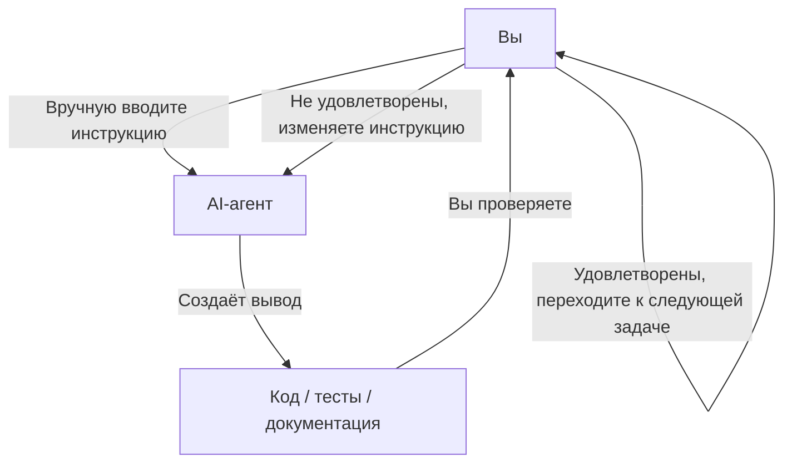
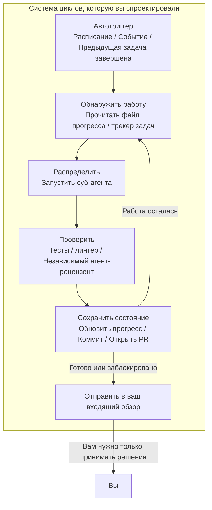
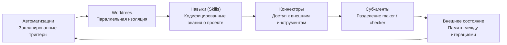
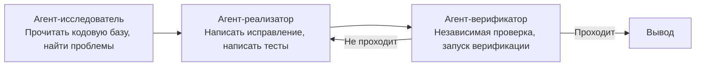
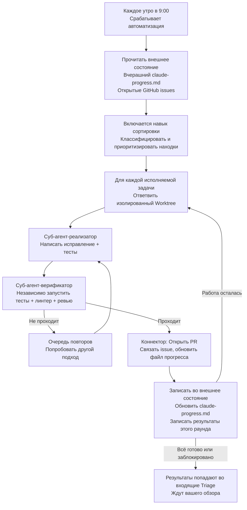
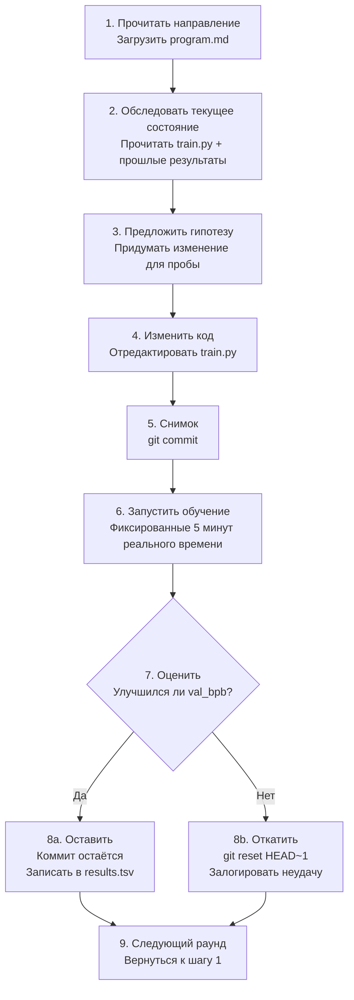

[English Version →](../../../en/lectures/lecture-13-loop-engineering/)

> Примеры кода: [code/](https://github.com/walkinglabs/learn-harness-engineering/blob/main/docs/en/lectures/lecture-13-loop-engineering/code/)
> Практический проект: [Project 07. Build Your First Automated Loop](./../../projects/project-07-loop-engineering-first-loop/index.md)

# Лекция 13. От ручных запросов к автономным циклам

Всё, что вы изучили в первых двенадцати лекциях, основано на одном предположении: **вы сидите за клавиатурой и вводите инструкции одну за другой.**

Вы написали `AGENTS.md` (лекции 1–4), построили управление состоянием (лекции 5–6), ограничили область применения списками функций (лекции 7–8), оставляли чистые передачи в конце сессии (лекции 9, 12) и сделали среду выполнения наблюдаемой (лекции 10–11). Но триггером для всего этого всегда были вы. Агент никогда не решал сам, когда начинать работать — потому что никто не нажимал «старт».

Эта лекция о том, как передать кнопку «старт» системе. Не отказаться от контроля — а поднять его на следующий уровень.

## /goal: Простейший возможный цикл

Лучший вход в loop engineering — это не сложная архитектурная диаграмма, а одна команда.

В начале 2026 года Claude Code и OpenAI Codex независимо друг от друга выпустили одну и ту же функцию: `/goal`. Вы вводите в терминале:

```
/goal "All tests pass, zero lint warnings, merge to main"
```

Затем вы закрываете ноутбук и идёте спать. Восемь часов спустя агент самостоятельно проанализировал, написал код, протестировал, исправил и выполнил слияние. Он повторяет попытки при неудаче, меняет подход, когда заходит в тупик, и останавливается, когда готов — без того, чтобы вы стояли у него за спиной и говорили «попробуй ещё раз».

Единственная разница между `/goal` и традиционным запросом — одна вещь. Но эта вещь меняет всё:

| | Традиционный запрос | `/goal` |
|---|---|---|
| Что вы предоставляете | Что делать дальше | Как выглядит конечное состояние |
| Что делает агент | Выполняет один раз | Циклически повторяет до достижения |
| Кто оценивает готовность | Вы | Проверяемое условие остановки |
| Когда можно уйти | Нельзя | В тот момент, когда вы вводите `/goal` |

`/goal` — это по сути цикл. У него есть ровно три части: **цель, метод верификации и условие остановки.** Только эти три вещи переносят вас изнутри цикла наружу.

### Как `/goal` рос органически

`/goal` не появился из ниоткуда. Он постепенно вырос из повседневных рабочих процессов, пройдя примерно четыре этапа:

**Этап 1: Ручные запросы один за другим.** Самый ранний способ работы — это диалог: «напиши функцию», «добавь тест», «исправь эту логику». Агент останавливался после каждого шага и ждал, что вы скажете, что дальше. Вы были планировщиком всего конвейера.

**Этап 2: Длинные запросы с несколькими шагами.** Затем люди стали писать более длинные запросы, в которых шаги складывались вместе: «сначала проанализируй код, затем напиши реализацию, затем запусти тесты, и если они упадут — исправь». Агент мог выполнить несколько шагов за один раз, но вам всё равно приходилось следить — потому что он мог сбиться с пути на полпути, или закончить шаг и не знать, что делать дальше.

**Этап 3: Саморефлексия и самоуправление агента.** После этого агенты получили «интроспекцию» — после каждого шага они смотрели на результат и решали, что делать дальше. Вы давали цель, а они сами её разбивали и самостоятельно повторяли попытки. Но возникла проблема: когда им останавливаться? Считается ли «я закончил», исходящее от самого агента? Практика постоянно отвечала — нет. Агенты слишком легко заявляют о победе.

**Этап 4: Независимая оценка остановки — `/goal`.** Последним шагом было изъятие «оценки готовности» из рук агента, выполняющего работу, и передача её независимому судье. Это может быть другая модель, скрипт или тестовая команда — но правило было одинаковым: человек, пишущий код, не может проверять свою домашнюю работу. В этот момент `/goal` по-настоящему заработал: вы даёте цель, он циклически повторяет, независимый судья решает, когда остановиться, и вы можете уйти.

Эти четыре этапа не были дорожной картой, спланированной какой-либо одной компанией. Это был путь, к которому независимо пришли все, кто программирует с агентами, под давлением одних и тех же болевых точек. Тот факт, что Claude Code и Codex выпустили `/goal` почти одновременно в начале 2026 года, не был совпадением — время пришло.

### Существует не один вид цикла

`/goal` — самый простой для понимания цикл, но не единственный. Циклы делятся на категории в зависимости от того, как они запускаются и как останавливаются:

| Тип | Триггер | Условие остановки | Claude Code | Codex | Лучше всего подходит для |
|------|---------|----------------|-------------|-------|----------|
| **Пошаговый цикл** | Вы вводите каждый запрос вручную | Агент считает, что закончил, или вы прерываете | Обычный чат | Обычный чат | Небольшие задачи, исследовательская работа |
| **Цикл на основе цели** | Вы даёте цель | Независимый оценщик подтверждает готовность, или достигнуто максимальное количество шагов | `/goal` | `/goal` (требуется ручное включение) | Сложные задачи с чёткими критериями завершения |
| **Цикл на основе времени** | Запланированный интервал (каждые N минут/часов) | Вы останавливаете вручную, или он завершает работу после выполнения | `/loop` | Thread automation | Опрос статуса, периодические проверки, повторяющаяся работа |
| **Событийно-ориентированный цикл** | Внешнее событие (открыт PR, CI упал, новый issue) | Останавливается после обработки события или достигает предела повторов | Routines (API / GitHub Webhook) | Standalone automation + plugins | Реактивные рабочие процессы, интеграция CI/CD |

Они не конкурируют — это разные инструменты для разных задач. Пошаговый подходит для мелочей. Используйте `/goal`, когда есть чёткая финишная черта. Используйте `/loop`, когда нужно за чем-то следить. Используйте событийно-ориентированный, когда вы интегрируетесь с внешними системами.

### Не путайте `/goal` и `/loop`

Оба имеют в названии «loop», но решают совершенно разные задачи:

| | `/goal` | `/loop` |
|---|---------|---------|
| **Что это** | Одна большая задача, выполняется до завершения | Одно небольшое действие, повторяется с интервалом |
| **Условие остановки** | Цель достигнута, или бюджет исчерпан | Вы останавливаете вручную, или задача завершается сама |
| **Профиль времени** | Один долгий запуск, может занимать часы или дни | Периодические короткие вспышки, каждый запуск может длиться несколько минут |
| **Прогресс** | С каждым повторением приближается к финишу | Каждый запуск независим, совокупного прогресса нет |
| **Аналогия** | Бег марафона — выстрел стартового пистолета, вы останавливаетесь на финише | Будильник — звонит по расписанию, вы его выключаете |
| **Типичное использование** | «Внедри полную платёжную систему с покрытием тестами» | «Проверяй, сломался ли CI, каждые 15 минут» |

Распространённая ошибка: запихивать то, что должно быть `/goal`, в `/loop`. Например, написать `/loop 10m "продолжай внедрять платёжную систему"` — это неправильно. `/loop` каждый раз выполняет одну и ту же инструкцию независимо, он не запоминает, где остановился в прошлый раз. Вы просто получите одну и ту же начальную точку снова и снова.

**Одно предложение для проверки, что использовать: у этой вещи есть конец?**
- Есть конец → `/goal`
- Нет конца, нужно просто продолжать следить → `/loop`

Loop Engineering, тема этой лекции — не о какой-то одной команде. Это о **возможности проектировать системы, включающие все эти типы — чтобы ваш агент мог продолжать работать, даже когда вас нет рядом.**

Вам не нужно каждый раз вводить `/goal`. Но понимание того, откуда она взялась и почему выглядит именно так — это понимание ядра loop engineering. Более сложные циклы просто добавляют такие части, как планирование, параллелизм, изоляция и память, поверх этих же трёх основ: цель, верификация, условие остановки.

## Июнь 2026: Три человека зажгли один и тот же фитиль за одну неделю

В первую неделю июня 2026 года три практика, строящих инфраструктуру для кодовых агентов — не обмениваясь заметками — сказали одно и то же разными словами.

**Питер Стайнбергер** (создатель OpenClaw, [его пост набрал 8 миллионов просмотров](https://x.com/steipete/status/2063697162748260627)): «Вы больше не должны делать запросы к кодовым агентам. Вы должны проектировать циклы, которые делают запросы к вашим агентам.»

**Борис Черный** (руководитель Claude Code в Anthropic, [на подкасте Acquired](https://x.com/rohanpaul_ai/status/2063289804708835412)): «Я больше не делаю запросы к Claude. У меня запущены циклы, которые делают запросы к Claude и решают, что делать. Моя работа — писать циклы.»

**Эдди Османи** (инженерный руководитель в Google Chrome) [назвал концепцию](https://addyosmani.com/blog/loop-engineering/) 7 июня 2026 года и дал ей однострочное определение:

> **Loop engineering — это замена себя как человека, который делает запросы к агенту. Вы проектируете систему, которая делает это вместо вас.**

Черный сообщил цифры: более 30 дней подряд все вклад кода в Claude Code вносились автономно ИИ — 259 слитых PR, более 80% производственного кода, написанного Claude, и 76% успеха в открытых программных задачах.

Три человека. Одна неделя. Один и тот же вывод. Не потому, что они скоординировались — а потому, что инфраструктура тихо пересекла порог. Агенты стали достаточно надёжными, чтобы завершать нетривиальные задачи без присмотра. Примитивы планирования (`/loop`, `/goal`, cron) теперь встроены в инструменты. Стоимость одного запуска агента упала достаточно низко, чтобы запускать его повторно по таймеру перестало выглядеть расточительным. Когда все части на месте, шаг, который их объединяет, становится очевидным для всех сразу.

> Источник: [Addy Osmani: Loop Engineering](https://addyosmani.com/blog/loop-engineering/)

## Внутри цикла vs. снаружи цикла

Давайте сопоставим два конкретных сценария.

**Сценарий А: Вы внутри цикла (лекции 1–12).**



У вас есть полный комплект harness: `AGENTS.md` говорит агенту правила проекта, `feature_list.json` ограничивает область применения, `init.sh` обеспечивает согласованность окружения, `claude-progress.md` записывает прогресс. **Но каждый шаг всё ещё требует вашего ручного запуска.** Закончили одну функцию, прочитали файл прогресса, подумали, что дальше, ввели инструкцию. Вы — двигатель всего рабочего процесса.

**Сценарий Б: Вы снаружи цикла (Loop Engineering).**



Вы больше не вводите инструкции. Система, которую вы спроектировали, обнаруживает работу, распределяет её, проверяет результаты, записывает состояние и решает следующий шаг. Ваша работа сводится к трём вещам: **определить цель и условие остановки до запуска, проверить вывод после завершения и корректировать правила, когда система сбивается с курса.** Рычаг смещается с «написания правильного запроса» на «проектирования правильного цикла».

> Османи: «Год назад, если вам нужен был цикл, вы писали кучу bash и поддерживали эту кучу вечно, и она была ваша и только ваша. Теперь эти части просто поставляются внутри продуктов.» Вам не нужно строить с нуля. Вам нужно понять, как части сочетаются друг с другом.

## Основные понятия

- **Loop Engineering**: Проектирование системы, которая автоматически делает запросы к вашему агенту, заменяя ручной пошаговый ввод человеком. Человек перемещается изнутри цикла наружу, а рычаг смещается с «написания правильного запроса» на «проектирования правильного цикла».
- **Режим `/goal`**: Простейший возможный цикл — предоставьте цель, метод верификации и условие остановки; агент циклически повторяет до достижения. Мост от ручных запросов к автономным циклам.
- **Разделение генератора и оценщика**: Агент, который пишет код, и агент, который его проверяет, должны быть разделены. Модель, оценивающая свою собственную работу, ненадёжна; независимый верификатор — иногда использующий совершенно другую модель — это базовая гарантия надёжности любого цикла.
- **Изоляция worktree**: Каждый параллельный агент работает в независимом git worktree, физически предотвращая конфликты файлов. Инфраструктурная предпосылка для параллельного выполнения множества агентов.
- **Внешнее состояние**: Память, существующая вне одного разговора — markdown-файлы, трекеры задач, канбан-доски. Модели всё забывают между запусками; память должна жить на диске.
- **Четыре тихих издержки**: Четыре скрытые издержки, которые становятся острее, чем дольше работает цикл — долг верификации, деградация понимания, когнитивная капитуляция, раздувание токенов. Циклы ускоряют не только вывод, но и риск.

## Шесть примитивов цикла

Османи разложил цикл на пять основных строительных блоков плюс один слой памяти, который пронизывает их все — всего шесть вещей, но слой памяти занимает особое положение: это не компонент на том же уровне, что и остальные; это позвоночник, от которого зависит всё остальное.

На диаграмме ниже все шесть нарисованы в виде кольца, чтобы вы могли видеть полную картину с одного взгляда. Но помните: внешнее состояние — это не просто ещё одна остановка на цикле — это фундамент, на котором покоится весь цикл.



### 1. Автоматизации — Сердцебиение

Без автоматизации цикл — не цикл; это разовый запуск, который вы сделали вручную.

И Claude Code, и Codex имеют полные системы планирования, но используют разные названия и слои. Примерно соответствие от самого лёгкого к самому тяжёлому:

| Слой | Claude Code | Codex | Примечания |
|-------|-------------|-------|-------|
| Опрос внутри сессии | `/loop` | Thread automation | Привязан к текущей сессии, умирает при закрытии сессии |
| Локальные запланированные задачи | Desktop scheduled tasks | Standalone automation (local mode) | Работает, пока машина включена, может обращаться к локальным файлам |
| Облачные запланированные задачи | Cloud Routines | — (нет собственного облачного планировщика) | Работает, пока машина выключена |
| Событийные триггеры | Routines (API / GitHub Webhook) | Standalone automation + plugins | Запускаются внешними событиями |
| Полностью самохостные | GitHub Actions / самохостный cron | `codex exec` + cron | Полный контроль |

**Вкладка Automations в Codex** — это точка входа для планирования. Выберите проект, запрос, частоту и то, будет ли он запускаться на вашей локальной копии или в фоновом worktree. Запуски, которые что-то находят, попадают во входящие Triage; запуски, которые ничего не находят, автоматически архивируются. OpenAI использует их внутри для ежедневной сортировки issues, сводок сбоев CI, брифингов по коммитам и поиска багов, введённых на прошлой неделе.

Автоматизации Codex бывают двух видов:
- **Thread automation** — повторяющиеся пробуждения в стиле heartbeat, привязанные к треду, с сохранением контекста. Хорошо для непрерывного сопровождения одной вещи, например мониторинга долго выполняющейся команды или опроса статуса PR. Аналог в Claude Code — `/loop`.
- **Standalone automation** — каждый запуск начинается заново, результаты идут в Triage. Хорошо для ежедневных/еженедельных независимых задач, таких как брифинги или сканирование зависимостей. Аналог в Claude Code — Desktop scheduled tasks.

Система Claude Code слоиста более детально:

- **`/loop`** — лёгкое запланированное повторение внутри сессии. Работает, пока открыт ваш терминал, умирает при закрытии сессии, автоматически истекает через 7 дней. Хорошо для временного мониторинга во время вашей текущей рабочей сессии.
- **Desktop scheduled tasks** — работает, пока ваша машина включена, переживает перезапуск сессии, интервалы на уровне минут. Хорошо для повторяющейся работы, требующей доступа к локальным файлам.
- **Cloud Routines** — работает на облачной инфраструктуре Anthropic, переживает выключение вашей машины, минимальный интервал 1 час. Поддерживает три типа триггеров: запланированный, вызов API, GitHub webhook. Хорошо для ежедневных задач, не требующих вашего локального окружения.
- **GitHub Actions / самохостный cron** — полностью под вашим контролем, работает как угодно. Хорошо для сценариев со специальными требованиями к окружению или безопасности.

```bash
# Claude Code: запускать тесты каждые 30 мин, исправлять падения (в текущей сессии)
/goal 30m Run the test suite and fix any failing tests

# Claude Code: проверять статус деплоя каждые 15 минут
/loop 15m Check if the production deploy succeeded and report status
```

Автоматизации — это сердцебиение. Без них цикл — это чертёж, который никогда не просыпается.

### 2. Worktrees — Изоляция в масштабе

Как только вы запускаете более одного агента, конфликты файлов становятся неизбежным режимом отказа. Два агента, пишущие в один и тот же файл — это та же головная боль, что и два инженера, коммитящих в одни и те же строки без согласования друг с другом.

`git worktree` решает это: каждый агент работает в своей собственной ветке в своей собственной директории. Они физически не могут затронуть рабочую копию друг друга.

И Claude Code, и Codex поставляются с поддержкой worktree. Когда вы используете `--worktree` или `isolation: worktree` на суб-агенте, каждый помощник получает чистую независимую рабочую копию, которая сама себя очищает. Worktrees убирают механическую проблему коллизий — но помните: **ваша пропускная способность на рецензирование всё ещё является потолком.** Сколько параллельных агентов вы можете курировать, определяет, сколько worktree вы можете реально запустить.

### 3. Навыки (Skills) — Перестаньте заново объяснять ваш проект

Навык — это то, как вы перестаёте заново объяснять один и тот же контекст проекта каждую сессию. Это папка, содержащая `SKILL.md` с инструкциями и метаданными, а также опциональные скрипты, ссылки и активы.

Codex и Claude Code поддерживают один и тот же формат. Навыки вызываются напрямую через `/skill-name` (Codex также поддерживает `$skill-name`), или запускаются неявно, когда задача соответствует описанию навыка.

Навыки в фундаменте — это оплата вашего долга намерения. Агент начинает каждую сессию холодным — он заполняет любой пробел в вашем намерении уверенным предположением. Навык — это это намерение, записанное снаружи: соглашения, шаги сборки, «мы не делаем это так из-за того одного инцидента» — записано один раз, читается каждый запуск.

### 4. Коннекторы — Ваш цикл касается настоящих инструментов

Цикл, который может видеть только файловую систему — это маленький цикл. Коннекторы (построенные на протоколе MCP) позволяют агенту читать ваш трекер задач, запрашивать базу данных, обращаться к staging API, оставлять сообщение в Slack.

И Codex, и Claude Code работают с MCP, поэтому коннектор, который вы написали для одного, обычно работает и в другом. Коннекторы — это разница между «вот исправление» и циклом, который открывает PR, связывает тикет Linear и пингует канал, как только CI позеленеет — сам, внутри вашей реальной среды, а не просто в терминале.

### 5. Суб-агенты — Держите maker подальше от checker

Самая структурно ценная дизайнерская опция в цикле — это разделение того, кто пишет, от того, кто проверяет. Модель, которая написала код, слишком щедро оценивает свою домашнюю работу. Второй агент, с другими инструкциями и иногда другой моделью, ловит то, во что первый агент сам себя убедил.

Классическое разделение на три роли:



`/goal` в Claude Code запускает это под капотом — новая независимая сессия оценивает, должен ли цикл остановиться, а не сессия, которая выполняла работу. Это называется **разделением генератора и оценщика**, и это единственная самая важная гарантия надёжности в дизайне циклов.

### 6. Внешнее состояние — Память цикла

Модели всё забывают между запусками. Память должна жить на диске, а не в окне контекста.

Это звучит слишком просто, чтобы иметь значение, но это тот же трюк, на котором зависит каждый долго работающий агент. Markdown-файл, доска Linear — что угодно, что живёт вне одного разговора и хранит, что сделано, что в работе и что дальше. Агент забывает. Репозиторий — нет.

Эти шесть примитивов — ваш набор инструментов для дизайна циклов. Вам не нужны все они для каждого цикла. Но вам нужно знать, когда доставать какой.

## Полный цикл, анатомированный

Соедините все шесть вместе, и вот как выглядит реальный утренний цикл сортировки:



Это уже не один запуск агента. Это непрерывно работающая система, которая просыпается каждое утро, сама убирает пол и ставит то, что требует вашего внимания, перед вами. Ваша роль становится такой: **проверять содержимое входящих, принимать решения и, когда вы замечаете закономерность, с которой система не может справиться, уточнять навыки и правила.**

Черный использовал этот паттерн, чтобы слить 259 PR за 30 дней, ни разу не открыв IDE. Инженеры OpenAI использовали тот же паттерн, чтобы построить бета-продукт примерно на миллион строк — без написания ни одной строки кода самими.

## Разделение генератора и оценщика: Почему нельзя позволять модели проверять свою собственную работу

Это самый трудный урок в loop engineering.

Ваш самый умный агент пишет прекрасный кусок кода. Логика ясная, комментарии подробные, и у каждой функции есть тест. Вы удовлетворены.

Но вот вопрос: **если вы позволите агенту, который написал этот код, оценить, хорошо ли он справился, что он скажет?**

Ответ снова и снова подтверждается опытом: он поставит себе высокую оценку. Не потому, что он нечестный, а потому, что он — автор; он убедил себя в правильности этого пути во время генерации. Когда он оглядывается назад, он не видит ошибок; он видит свой собственный процесс рассуждения.

Это не проблема Claude. Это не проблема GPT. Это свойство всех генеративных моделей. **Модель — лучший адвокат по защите своего собственного вывода.**

Исправление: никогда не позволяйте одной и той же сущности (одной и той же модели, одному и тому же запросу) делать и работу, и ревью.

- `/goal` в Claude Code использует независимую супервайзорскую сессию для оценки, достигнута ли цель — а не сессия, которая её пыталась достичь.
- Система суб-агентов в Codex позволяет вам определить агента-верификатора, использующего другую модель с другими усилиями рассуждения.
- Общественная практика «adversarial verify» порождает N независимых скептиков на каждую находку, каждый из которых настроен опровергать — большинство отклонений убивает находку.

Одно предложение для запоминания: **кто-то в вашей команде не должен вам верить.**

## autoresearch Карпати: Образцовый цикл

Если вы хотите увидеть, как выглядит хорошо спроектированный, реально работающий цикл — [autoresearch Карпати](https://github.com/karpathy/autoresearch) это учебный пример.

В марте 2026 года Карпати выпустил 630-строчный Python-проект. Дайте ему один GPU и направление исследований, и он работает всю ночь — выполняя сотни экспериментов ML-обучения, сохраняя только те, которые действительно улучшают результат. Проект набрал 66 000+ звёзд в течение дней после релиза.

### Три файла, три роли

Во всей системе всего три основных файла, но разделение труда бритвенно-острое:

| Файл | Кто редактирует | Что он делает |
|------|-------------|-------------|
| `prepare.py` | Никто (только чтение) | Подготовка данных, токенизатор, оценочный harness. Фиксированная инфраструктура. |
| `train.py` (~630 строк) | **AI-агент** | Определение модели, оптимизатор, цикл обучения. Площадка для агента — можно менять что угодно. |
| `program.md` | **Вы** | Методология исследований, написанная на естественном языке. Вы редактируете только это. Скажите агенту, как исследовать, как оценивать, чего не трогать. |

Это трёхстороннее разделение — душа дизайна: **люди не трогают код, они трогают направление; агенты не трогают направление, они трогают код.** Ваша работа смещается с написания Python на «написание культуры исследовательской организации».

### Вход: Как выглядит program.md

`program.md` — это мозг цикла. Это не код — это руководство по исследованию, написанное на Markdown. Примерно содержит:

- **Цель**: оптимизировать `val_bpb` (валидационные биты на байт, чем ниже, тем лучше)
- **Ограничения**: не трогать `prepare.py`, оставаться в бюджете VRAM, фиксированное 5-минутное обучение
- **Направления поиска**: попробовать разные архитектуры, оптимизаторы, расписания LR
- **Правила оценки**: что считается улучшением, как логировать результаты, что делать при неудаче
- **Железное правило**: никогда не останавливаться. Как только цикл запустился — продолжать вечно

Ваш стартовый запрос к агенту может быть коротким, как одно предложение:

```
Have a look at program.md and let's kick off a new experiment!
```

Остальное — на усмотрение агента, читающего документ и принимающего собственные решения.

### Девятишаговый цикл-рассчёска

В центре autoresearch — **рассчёска** (ratchet): она движется только вперёд, никогда назад. Каждая итерация строго следует девяти шагам:



Он выполняет примерно 12 экспериментов в час. Ночная сессия (8 часов) — это около 100 экспериментов. Сам Карпати запускал его 2 дня — ~700 экспериментов.

Фиксированный 5-минутный бюджет реального времени — ключевой дизайнерский выбор: независимо от того, что агент меняет, каждый эксперимент занимает ровно столько же времени. Это означает, что все результаты напрямую сравнимы при одинаковом бюджете времени — без споров о «этот запускался дольше, поэтому он лучше».

### Вывод: Что вы видите, когда просыпаетесь

После ночи циклической работы вы утром садитесь и находите три вещи:

**1. История Git (движущаяся вперёд рассчёска)**

На основной ветке остаются только коммиты, которые действительно улучшили результат. Всё, что не сработало, было откачено. `git log` — это проверенный исследовательский журнал.

**2. results.tsv (полная запись экспериментов)**

Каждый отдельный эксперимент — успех или неудача — логируется:

```
timestamp    commit_hash    val_bpb    vram_mb    description
--------- ------------- ---------- ---------- ----------------------------
08:01:12  a1b2c3d       1.234     22100    baseline
08:06:15  d4e5f6g       1.228     22400    increased learning rate by 10%
08:11:20  (reverted)     1.241     21800    switched to GELU activation
08:16:08  h7i8j9k       1.219     23000    added weight decay 0.01
...
```

**3. Исследовательский журнал (собственное резюме агента)**

Агент пишет понятные комментарии к коммитам о том, что он пробовал, что сработало, что нет и что он планирует попробовать дальше. Вы их читаете — вам не нужно читать диффы кода.

### Что он реально нашёл

Результаты начального 2-дневного запуска Карпати с ~700 экспериментами:

- Из ~700 попыток было найдено примерно **20 складывающихся реальных улучшений**
- Время обучения nanochat на уровне GPT-2 на 8×H100 сократилось с **2,02 часа → 1,80 часа**, примерно **на 11% быстрее**
- Находки включали: корректировки скорости обучения, тюнинг оптимизатора, замены активации, оптимизации паттернов внимания и т.д.

Все ли улучшения были потрясающими открытиями? Нет. Большинство были небольшими оптимизациями, которые складывались вместе. Но эти 20 действительных улучшений заняли бы у человеческого исследователя недели ручной работы — агент сделал это за 48 часов.

### Самый говорящий деталь: Цикл написан на английском, а не на коде.

`program.md` — это документ Markdown, а не скрипт Python. Он описывает методологию исследования — что изменять, что оставлять в покое, как оценивать, как обрабатывать случаи неудачи и одно железное правило: **никогда не просить человеческой помощи, просто продолжать.** Кодовый агент читает этот документ и выполняет его бесконечно.

Это шаблон для loop engineering: не давайте агенту задачу. Дайте ему **методологию**. Пусть методология будет циклом. Один `program.md`, 630 строк клеевого кода, и всё остальное — агент, запускающий сам себя.

## Четыре тихих издержки

Когда цикл начинает работать, вы не увидите проблем сразу. Следующие четыре издержки накапливаются тихо, и к тому времени, как вы заметите, вы, возможно, уже заплатили дорого.

### 1. Долг верификации

Быстрые циклы соблазняют вас пропустить верификацию. «Выглядит нормально» — это не то же самое, что «подтверждено правильным». Чем больше кода генерирует цикл без присмотра, тем быстрее накапливается долг верификации. Исправление: **условия остановки должны быть машинно-проверяемыми, никогда «кажется примерно правильным».**

### 2. Деградация понимания

Чем быстрее цикл поставляет код, тем дальше ваше понимание собственной кодовой базы уходит от реальности. У команды Черного 80% кода было написано агентами — что означает, что большая часть кода команды не была написана человеком. Если вы не читаете и не используете то, что производит цикл, ваше понимание непрерывно деградирует. **Быстрые циклы требуют быстрого чтения.**

### 3. Когнитивная капитуляция

Когда цикл работает гладко, самая комфортная поза — перестать иметь мнение. Берите то, что он возвращает, не думайте о выводе. Но именно здесь начинается опасность — вы используете цикл, чтобы избежать мышления, а не чтобы усилить мышление. Предупреждение Османи: «Два человека могут построить абсолютно одинаковый цикл и получить противоположные результаты. Один использует его, чтобы быстрее идти в работе, которую он понимает; другой использует его, чтобы избежать понимания работы. Цикл не знает разницы. Вы знаете.»

### 4. Раздувание токенов

Каждая итерация цикла накапливает больше контекста: написанный код, встреченные ошибки, принятые решения. Без управления контекстом размер запроса растёт примерно квадратично с количеством шагов. Codex решает это с помощью автоматического уплотнения контекста — специальное API сжимает старые повороты разговора в зашифрованные сводки содержания, сохраняя существенные знания при отбрасывании избыточных деталей. Это инженерный вопрос, который вы должны решить с самого первого цикла, а не прикручивать позже.

## Построение вашего первого цикла

Вам не нужно начинать с конвейера масштаба Stripe, сливающего 1300 PR в неделю. Начните с самой маленькой вещи, которая работает.

### Шаг 1: Выберите одну повторяющуюся задачу

Найдите то, что вы делаете вручную как минимум два раза в неделю. Примеры:
- Открывать GitHub утром, проверять новые issues, сортировать и отвечать
- Запускать линтер и тесты перед каждым ревью PR
- Обновлять документацию по прогрессу в конце каждого дня

### Шаг 2: Напишите цель и условие остановки

Превратите задачу в то, что может понять `/goal`:

```markdown
Goal: Check the 10 most recent issues in the repo.
For each issue:
  - If it already has clear labels and an assignee, skip
  - If untagged, add appropriate labels based on content
  - If fixable in under 10 minutes, create a branch and attempt a fix
Stop when: All qualifying issues have been processed, or an issue requires human decision.
```

### Шаг 3: Разделите maker и checker

Не позволяйте одному и тому же агенту и писать код, и оценивать его. Разделите ваш цикл на две роли:
- Реализатор: читает issue, пишет исправление, пишет тесты
- Верификатор: независимо запускает тесты, проверяет дифф, оценивает, действительно ли исправление решает проблему

### Шаг 4: Добавьте память

Используйте markdown-файл, чтобы записывать, что случилось в каждом запуске цикла. Следующий запуск начинается с чтения этого файла — он знает, что было сделано, что в ожидании, что было заблокировано. Это лучше любой сложной базы данных.

### Шаг 5: Установите таймер

Используйте `/loop` или cron вашей ОС, чтобы цикл запускался без вас. Начните с одного раза в день. Наблюдайте неделю.

### Лестница зрелости

Вам не нужно достигать вершины одним прыжком. Внедрение циклов — это лестница:

1. **Уровень 1: Исполнитель целей** — Вы можете использовать `/goal`, чтобы дать задачу с условием остановки; агент циклически повторяет до достижения.
2. **Уровень 2: Запланированная одна задача** — Одна автоматизация выполняет одну задачу по таймеру (например, утренняя проверка CI).
3. **Уровень 3: Мульти-агентный цикл** — Разделение maker и checker; каждая находка ответвляет изолированный worktree.
4. **Уровень 4: Самоподдерживающийся цикл** — Цикл автоматически обнаруживает следующую задачу из внешнего состояния; он решает, что делать дальше.
5. **Уровень 5: Оркестрация флота** — Несколько циклов работают параллельно, независимо, но разделяют слой памяти.

Большинство команд сейчас находятся между Уровнем 2 и Уровнем 3. Уровень 1 — самый быстрый путь к получению отдачи.

## Ключевые выводы

- **Loop Engineering не заменяет Harness Engineering — он строит этаж выше.** Harness делает одиночные запуски надёжными. Цикл делает непрерывные запуски автономными.
- **`/goal` — это простейший возможный цикл:** цель + верификация + условие остановки. Эти три вещи переносят вас изнутри цикла наружу.
- **Шесть примитивов (Автоматизации / Worktrees / Навыки / Коннекторы / Суб-агенты / Внешнее состояние) — это строительные блоки цикла.** Не все они каждый раз, но вам нужно знать, когда доставать какой.
- **Maker и checker должны быть разделены.** Модель, оценивающая свою собственную работу, ненадёжна. Независимый верификатор — иногда совершенно другая модель — это базовая гарантия надёжности любого цикла.
- **Циклы делают генерацию почти бесплатной и оставляют суждение как дефицитный ресурс.** Время, которое вы сэкономили, — не для отдыха. Оно для принятия большего количества суждений.
- **Четыре тихих издержки становятся острее, чем дольше работают циклы:** долг верификации, деградация понимания, когнитивная капитуляция, раздувание токенов. Циклы ускоряют вывод — и риск.
- **Начинайте с малого.** Один `/goal`, один cron, один markdown-файл памяти. Увидьте отдачу, затем стройте вверх.

## Дополнительная литература

- [Addy Osmani: Loop Engineering](https://addyosmani.com/blog/loop-engineering/)
- [Addy Osmani: Agent Harness Engineering](https://addyosmani.com/blog/agent-harness-engineering/)
- [Simon Willison: Designing Agentic Loops (Sep 2025)](https://simonw.substack.com/p/designing-agentic-loops)
- [Karpathy: autoresearch](https://github.com/karpathy/autoresearch)
- [Claude Code: Dynamic Workflows and Orchestration](https://kenhuangus.substack.com/p/claude-code-orchestration-dynamic)
- [Loop Library (Forward Future)](https://signals.forwardfuture.ai/loop-library/) — общедоступный корпус из 50 реальных циклов
- [The Neuron: Claude Code Creators on Agent Loops](https://www.theneuron.ai/explainer-articles/claude-code-creators-boris-cherny-and-cat-wu-explain-how-to-use-agent-loops/)
- Лекция 12: [Leave a Clean Handoff at the End of Every Session](./../lecture-12-why-every-session-must-leave-a-clean-state/index.md) — Предпосылка для циклов: каждая сессия оставляет чистое состояние, чтобы следующий раунд мог запуститься автоматически
- Лекция 5: [Keep Long-Running Tasks Continuous Across Sessions](./../lecture-05-why-long-running-tasks-lose-continuity/index.md) — Предварительные знания о внешнем состоянии и памяти
- Лекция 11: [Why Observability Belongs Inside the Harness](./../lecture-11-why-observability-belongs-inside-the-harness/index.md) — Чем быстрее работает цикл, тем больше вам нужна наблюдаемость, чтобы ловить проблемы
- Лекция 8: [Why Feature Lists Are Harness Primitives](./../lecture-08-why-feature-lists-are-harness-primitives/index.md) — Списки функций — естественный источник данных для самоподдерживающегося цикла, чтобы обнаруживать следующую задачу

## Упражнения

1. **Превратите повторяющуюся задачу в `/goal`:** Найдите то, что вы вручную делаете как минимум дважды в неделю. Запишите её цель, метод верификации и условие остановки. Запустите один раз с `/goal` и сравните время и качество с ручным выполнением. Это ваш первый шаг от Harness к Loop.

2. **Разделите maker и checker:** Выберите задачу, которую вы ранее поручали агенту выполнить. На этот раз напишите два разных запроса: один для агента-реализатора и один для агента-верификатора (используйте разные модели — например, Claude для реализации, GPT для верификации, или наоборот). Верификатор должен указывать на конкретные проблемы с цитируемыми доказательствами. Запишите количество и тип проблем, найденных в каждом режиме.

3. **Дайте вашему циклу память:** Создайте markdown-файл состояния для вашего цикла. В каждой итерации записывайте: что было сделано в этом раунде, результаты верификации, статус (прошло/не прошло/заблокировано) и что делать дальше. Запустите три раунда и наблюдайте разницу в поведении между наличием и отсутствием файла памяти.

4. **Аудитируйте тихие издержки вашего цикла:** После того как цикл проработал час, оцените эти четыре метрики:
   - Сколько верификации было «кажется правильным» вместо «машинно подтверждено»? (Долг верификации)
   - Насколько хорошо вы можете объяснить код, который ваш цикл создал совсем недавно? (Деградация понимания)
   - Сколько раз вы подумали «я посмотрю позже» и так и не посмотрели? (Когнитивная капитуляция)
   - Как меняется размер контекста цикла? Повторяет ли он избыточную информацию? (Раздувание токенов)
