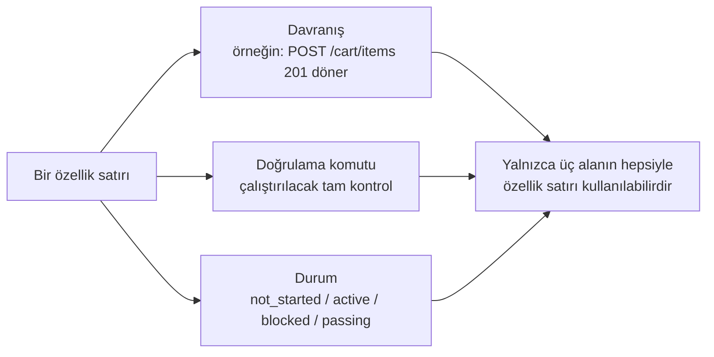
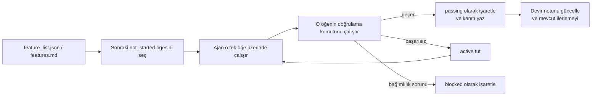

[中文版本 →](../../../zh/lectures/lecture-08-why-feature-lists-are-harness-primitives/)

> Kod örnekleri: [code/](https://github.com/walkinglabs/learn-harness-engineering/blob/main/docs/en/lectures/lecture-08-why-feature-lists-are-harness-primitives/code/)
> Uygulama projesi: [Proje 04. Çalışma zamanı geri bildirimi ve kapsam kontrolü](./../../projects/project-04-incremental-indexing/index.md)

# Ders 08. Özellik listeleri neden harness'ın temel yapı taşı

Bir ajandan bir e-ticaret sitesi inşa etmesini istiyorsunuz. Bitirdikten sonra size "tamam" diyor. Koda bakıyorsunuz — kullanıcı kimlik doğrulaması çalışıyor ama alışveriş sepetindeki ödeme düğmesi hiçbir şey yapmıyor ve ödeme akışı hiç bağlanmamış. Sorun: ona "tamam"ın ne anlama geldiğini söylemediniz, bu yüzden kendi standardını kullandı — "çok kod yazdım ve oldukça eksiksiz görünüyor."

Özellik listeleri, birçok insanın gözünde sadece bir not — unutmamak için bir şeyleri yazıp sonra bir kenara atın. Ancak harness dünyasında bir özellik listesi insanlar için bir not değildir — tüm harness'ın omurgasıdır. Zamanlayıcı görevleri seçmek için ona güvenir, doğrulayıcı tamamlanmaya karar vermek için ona güvenir, devir raportörü özetleri oluşturmak için ona güvenir. Omurgayı kırın, tüm beden felç olur.

Hem Anthropic hem de OpenAI vurgular: **artefaktlar dışsallaştırılmalıdır.** Özellik durumu yapılandırılmamış konuşma metninde değil, depoda makine tarafından okunabilir bir dosyada yaşamalıdır.

## Ajanlar "tamam"ın ne anlama geldiğini bilmez

Ne Claude Code ne de Codex sizin "tamam" derken ne demek istediğinizi otomatik olarak bilir. "Bir alışveriş sepeti özelliği ekle" diyorsunuz ve modelin yorumu "bir Cart bileşeni ve bir addToCart metodu yaz" olabilir. Ama siz "kullanıcı ürünleri inceleyebilir, sepete ekleyebilir ve uçtan uca ödemeyi tamamlayabilir" demek istediniz. Bu anlayış farkı bir özellik listesi olmadan devam eder. Ajan kendi örtük standardını kullanır — genellikle "kodda belirgin sözdizimi hatası yok." İhtiyacınız olan şey uçtan uca davranışsal doğrulamadır. Bir arkadaşınızdan size meyve almasını istemek gibi — "biraz meyve al" diyorsunuz ve limonla geri geliyorlar. Onların meyvesi ve sizin meyveniz aynı meyve değildir.

Bu yaygın ilerleme notuna bakın:

```
Kullanıcı kimlik doğrulamasını yaptım, alışveriş sepeti çoğunlukla tamam, hâlâ ödemelere ihtiyaç var
```
Yeni bir ajan oturumu bu nottan şu sorulara cevap verebilir mi? "Çoğunlukla tamam" ne demek? Sepet hangi testleri geçti? Ödemeleri ne engelliyor? Hepsinin cevabı "kimse bilmiyor." Doktorunuza "midem ağrıyor, son zamanlarda iyiydi" demek gibi — hangi ilacı yazabilirler?

Sonuç: yeni oturum proje durumunu çıkarmak için 20 dakika harcar ve tamamlanmış özellikleri yeniden uygulayabilir. Anthropic'in mühendislik verileri iyi ilerleme kayıtlarının oturum başlatma tanı süresini %60-80 azalttığını gösteriyor.

## Özellik durum makinesi





## Temel kavramlar

- **Özellik listeleri harness temel yapı taşıdır**: "İsteğe bağlı planlama araçları" değil, diğer tüm harness bileşenlerinin bağlı olduğu temel veri yapılarıdır. Veritabanı tablo yapıları gibi — "birincil anahtarları atlayalım" diyemezsiniz.
- **Üçlü yapı**: Her özellik öğesi bir `(davranış tanımı, doğrulama komutu, mevcut durum)` üçlüsüdür. Herhangi bir öğenin eksikliği öğeyi eksik yapar.
- **Durum makinesi modeli**: Her özellik öğesinin dört durumu vardır — `not_started`, `active`, `blocked`, `passing`. Durum geçişleri harness tarafından kontrol edilir, ajan tarafından serbestçe değiştirilmez.
- **Geçer-durum kapısı**: Bir özelliğin `active`'ten `passing`'e geçmesinin tek yolu doğrulama komutunun başarıyla yürütülmesidir. Bu geri alınamaz — bir kez `passing` olduğunda geri dönemez. Sınavı geçmek, geçtiğiniz anlamına gelir, notu geriye dönük değiştiremezsiniz.
- **Tek doğruluk kaynağı**: "Yapılması gerekenler" hakkındaki tüm bilgi tek bir özellik listesinden türetilmelidir. Özellik listesi ile konuşma geçmişi arasında çelişkiler olmamalıdır.
- **Geri basınç (Back-pressure)**: Henüz geçmemiş özelliklerin sayısı harness'ın ajana uyguladığı basınçtır. Sıfır basınç = proje tamamlandı.

## Özellik listeleri neden "temel yapı taşı" olmalı

Belgeler insanların okuması içindir; temel yapı taşları sistemlerin yürütmesi içindir. Belgeler göz ardı edilebilir; temel yapı taşları atlanamaz.

Bunu veritabanı tetikleyici kısıtlamalarına karşı uygulama katmanı kontrolleri gibi düşünün: birincisi veritabanı motoru tarafından zorlanır, hiçbir SQL onu atlayamaz; ikincisi uygulama kodu doğruluğuna bağlıdır ve yanlışlıkla atlatılabilir. Harness temel yapı taşı olarak özellik listeleri Spesifik olarak özellik listesi dört harness bileşenine hizmet eder:

1. **Zamanlayıcı**: Durumları okur, sonraki `not_started` özelliği seçer. Bir fabrika üretim planlama sistemi gibi.
2. **Doğrulayıcı**: Doğrulama komutlarını yürütür, durum geçişlerine izin verip vermeyeceğine karar verir. Kalite denetimi gibi.
3. **Devir raportörü**: Özellik listesinden otomatik olarak oturum devir özetleri oluşturur. Otomatik bir vardiya değişim raporu gibi.
4. **İlerleme takipçisi**: Durum dağılımını sayar, proje sağlık metrikleri sağlar. Bir gösterge paneli gibi.

## Doğru nasıl yapılır

### 1. Minimal özellik listesi formatı tanımlayın

Karmaşık bir sisteme ihtiyacınız yok — yapılandırılmış bir Markdown veya JSON dosyası işe yarar. Kilit nokta her girişin üçlüye sahip olması gerektiğidir:

```json
{
  "id": "F03",
  "behavior": "POST /cart/items {product_id, quantity} ile 201 döner",
  "verification": "curl -X POST http://localhost:3000/api/cart/items -H 'Content-Type: application/json' -d '{\"product_id\":1,\"quantity\":2}' | jq .status == 201",
  "state": "passing",
  "evidence": "commit abc123, test çıktı günlüğü"
}
```

### 2. Harness'ın durum geçişlerini kontrol etmesine izin verin

Ajan bir özelliğin durumunu doğrudan `passing` olarak değiştiremez. Yalnızca bir doğrulama isteği gönderebilir; harness doğrulama komutunu yürütür ve geçişe izin verip vermeyeceğine karar verir. Bu "geçer-durum kapısı"dır.

### 3. Kuralları CLAUDE.md'ye yazın

```
## Özellik Listesi Kuralları
- Özellik listesi dosyası: /docs/features.md
- Aynı anda sadece bir özellik aktif
- passing olarak işaretlenmeden önce doğrulama komutu geçmeli
- Özellik listesi durumlarını kendiniz değiştirmeyin — doğrulama betiği bunları otomatik olarak günceller
```

### 4. Ayrıntı düzeyini kalibre edin

Her özellik öğesi "bir oturumda tamamlanabilir" olacak şekilde kapsamlandırılmalıdır. Çok geniş olursa bitmez; çok dar olursa yönetim yükü büyür. "Kullanıcı sepete öğe ekleyebilir" iyi bir ayrıntı düzeyidir. "Alışveriş sepetini uygula" çok geniştir. "Cart modelinde isim alanını oluştur" çok dardır. Bir bifteği kesmek gibi — bütün parça değil, kıyma da değil.

## Gerçek dünya örneği

10 özellikli bir e-ticaret platformu. İki takip yaklaşımı karşılaştırıldı:

**Not modu**: Ajan yapılandırılmamış notlar kullanır. 3 oturumdan sonra notlar "kullanıcı kimlik doğrulaması ve ürün listesini yaptım, alışveriş sepeti çoğunlukla tamam ama hataları var, ödemeler başlamadı" hâline gelir. Yeni oturumun durumu çıkarması için 20 dakika gerekir, sonunda tamamlanmış özellikleri yeniden uygular. Alışveriş listenizin "süt, ekmek ve o şey" demesi gibi — markette ne alacağınızı hâlâ bilmezsiniz.

**Omurga modu**: Her özelliğin net bir durumu ve doğrulama komutu vardır. Yeni oturum özellik listesini okur ve 3 dakika içinde bilir: F01-F05 `passing`, F06 `active`, F07-F10 `not_started`. Doğrudan F06'dan devam eder, sıfır yeniden çalışma.

Nicel sonuç: yapılandırılmış özellik listeleri kullanan projeler serbest formatlı takipten %45 daha yüksek özellik tamamlanma oranı gösterir, sıfır mükerrer uygulama ile.

## Önemli çıkarımlar

- **Özellik listeleri harness'ın omurgasıdır**, insanlar için not değildir. Zamanlayıcı, doğrulayıcı ve devir raportörü hepsi onlara bağlıdır.
- **Her özellik öğesi üçlüye sahip olmalıdır**: davranış tanımı + doğrulama komutu + mevcut durum. Bir öğenin eksikliği onu eksik yapar — bir bacağı eksik üç ayaklı tabure gibi.
- **Durum geçişleri harness tarafından kontrol edilir** — ajan durumları kendi başına değiştiremez. Doğrulamayı geçmek = tek yükseltme yolu.
- **Özellik listesi projenin tek doğruluk kaynağıdır** — tüm "ne yapılacak" bilgisi tek listeden türetilir.
- **Ayrıntı düzeyini "bir oturumda tamamlanabilir" olarak kalibre edin.**

## Daha fazla okuma

- [Building Effective Agents - Anthropic](https://www.anthropic.com/research/building-effective-agents) — Özellik listesini ajan kapsamını kontrol etmek için "temel veri yapısı" olarak açıkça tanımlar
- [Harness Engineering - OpenAI](https://openai.com/index/harness-engineering/) — "Artefaktları dışsallaştırma" ilkesini vurgular
- [Design by Contract - Bertrand Meyer](https://www.goodreads.com/book/show/130439.Object_Oriented_Software_Construction) — Sözleşme tasarım ilkeleri, özellik listelerinin teorik temeli
- [How Google Tests Software](https://books.google.dk/books/about/How_Google_Tests_Software.html?id=VrAx1ATf-RoC&redir_esc=y) — Test piramidi ve davranışsal spesifikasyon mühendislik uygulamaları

## Alıştırmalar

1. **Özellik listesi tasarımı**: Minimal bir özellik listesi JSON şeması tanımlayın. Şunları içerin: id, davranış tanımı, doğrulama komutu, mevcut durum, kanıt referansı. 5 özelliğe sahip gerçek bir projeyi tanımlamak için kullanın.

2. **Doğrulama katılığı karşılaştırması**: 3 özellik seçin ve hem "gevşek" bir doğrulama (örneğin "kodun sözdizimi hataları yok") hem de "katı" bir doğrulama (örneğin "uçtan uca test geçiyor") tasarlayın. Her yaklaşım altında yanlış pozitif oranını karşılaştırın.

3. **Tek kaynak ilkesi denetimi**: Mevcut bir ajan projesini inceleyin ve özellik listesiyle çelişen kapsam bilgisini (konuşmalardaki örtük gereksinimler, koddaki TODO yorumları vb.) kontrol edin. Tüm bilgileri özellik listesinde birleştirmek için bir plan tasarlayın.
