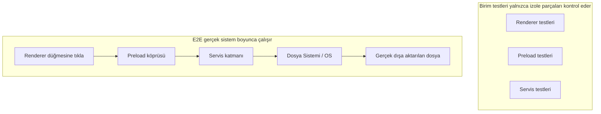
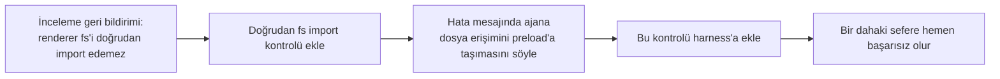

[中文版本 →](../../../zh/lectures/lecture-10-why-end-to-end-testing-changes-results/)

> Bu ders için kod örnekleri: [code/](https://github.com/walkinglabs/learn-harness-engineering/blob/main/docs/en/lectures/lecture-10-why-end-to-end-testing-changes-results/code/)
> Uygulamalı pratik: [Proje 05. Ajanın kendi işini doğrulamasına izin verin](./../../projects/project-05-grounded-qa-verification/index.md)

# Ders 10. Uçtan uca test sonuçları neden değiştirir

Bir Electron uygulamasına dosya dışa aktarma özelliği eklemesini ajandan istiyorsunuz. Render süreci bileşenini, preload betiğini ve servis katmanı mantığını yazıyor. Her bileşenin birim testleri mükemmel şekilde geçiyor. Ajan "tamam" diyor. Aslında dışa aktarma düğmesine tıkladığınızda — dosya yolu formatı yanlış, ilerleme çubuğu güncellenmiyor ve büyük dosyaları dışa aktarmak bellek sızıntısına neden oluyor. Beş bileşen sınır kusuru ve birim testleri bir tane bile yakalamadı.

Bu bir koro provası gibi — her ses parçası tek başına söylendiğinde mükemmel duyulur ama birlikte söylediklerinde, sopranolar baslardan yarım vuruş daha hızlı ve eşlik ana melodiyle yarım ton uzakta. Her parça kendi başına "doğru" ama bütün akortsuz.

Google'ın Test Piramidi bize şunu söylüyor: çok sayıda birim testi temeldir ama orada durursanız, bileşen etkileşim sorunlarını sistematik olarak kaçırırsınız. AI kod yazma ajanları için bu sorun daha da şiddetlidir — ajanlar yalnızca en hızlı testleri çalıştırma ve tamamlanmayı ilan etme eğilimindedir. **Yalnızca uçtan uca test sistem düzeyindeki kusurların var olmadığını kanıtlayabilir.**

## Birim testin kör noktaları

Birim testinin tasarım felsefesi izolasyondur — bağımlılıkları mocklamak ve yalnızca test edilen birime odaklanmak. Bu felsefe birim testini hızlı ve hassas yapar ama sistematik kör noktalar da yaratır. Bir koro provası sırasında her ses parçasının kulaklıkla pratik yapması gibi — onlara iyi geliyor ama sorunlar yalnızca bir araya geldiklerinde ortaya çıkıyor:

**Arayüz uyumsuzluğu**: Render sürecinin preload betiğine ilettiği dosya yolu göreli bir yoldur, ancak preload betiği mutlak bir yol bekler. Kendi birim testleri mock kullandı ve geçti. Sorun yalnızca uçtan uca akış yürütüldüğünde keşfedilir — iki ses parçasının bağımsız olarak pratik yapması ve iyi hissetmesi, sonra ansamblde birinin 4/4 zamanda diğerinin 3/4 zamanda söylediğini fark etmesi gibi.

**Durum yayma hataları**: Bir veritabanı geçişi tablo şemasını değiştirir, ancak ORM önbellekleme katmanı eski şema için önbellek girişlerini hâlâ tutar. Birim testleri her seferinde tamamen yeni bir mock ortam sağlar, bu da bu katmanlar arası durum tutarsızlığını ortaya çıkarmaz. Bir şarkının sözlerini değiştirmek gibi ama biri hâlâ eski sürümü söylüyor.

**Kaynak yaşam döngüsü sorunları**: Dosya tutamaçlarının, veritabanı bağlantılarının ve ağ soketlerinin edinilmesi ve serbest bırakılması birden fazla bileşene yayılır. Birim testleri her test için bağımsız kaynaklar oluşturur ve yok eder, kaynak çatışması veya sızıntıları ortaya çıkarmaz. Her ses parçasının prova sırasında mikrofonları sırayla kullanması gibi, ancak herkes birlikte sahneye çıktığında yeterince mikrofon yok.

**Ortam bağımlılığı**: Kod test ortamında (her şeyin mocklandığı yerde) doğru davranır ancak yapılandırma farklılıkları, ağ gecikmesi veya servis kullanılamazlığı nedeniyle gerçek ortamda başarısız olur. Prova odasında mükemmel söylemek gibi ama açık hava festivalinde ses geri bildirimi ve rüzgar müdahalesiyle karşılaşmak.

## Uçtan uca test yalnızca sonuçları değil davranışı da değiştirir

Bu birçok insanın fark etmediği bir şeydir: bir ajan işinin uçtan uca teste tabi tutulacağını bildiğinde, kodlama davranışı değişir.

1. **Bileşen etkileşimlerini düşünmek**: Kod yazarken "bu arayüzün yukarı akışla nasıl bağlandığını" düşünür, tek bir fonksiyona odaklanmak yerine. Sonunda birlikte söyleyeceğinizi bilmek gibi, pratik sırasında diğer ses parçalarına dikkat edersiniz.
2. **Mimari sınırlara saygı duymak**: Mimari kısıtlamaları olan sistemlerde, uçtan uca test ajanı sınır kurallarına uymaya zorlar. "Burada crescendo" işaretli müzik notası gibi, ona uymak zorundasınız.
3. **Hata yollarını ele almak**: Uçtan uca testler genellikle başarısızlık senaryolarını içerir, ajanı istisna işlemeyi düşünmeye zorlar. Prova sırasında "ya mik aniden ölürse" simüle etmek gibi, ne yapacağınızı bilirsiniz.

## Test piramidi ve inceleme geri bildirimi yükseltmesi





Codex mühendislik uygulamalarında OpenAI şunu vurgular: **ajanlar için yazılan hata mesajları düzeltme talimatlarını içermelidir.** Sadece `"Direct filesystem access in renderer"` yazmayın; `"Direct filesystem access in renderer. All file operations must go through the preload bridge. Move this call to preload/file-ops.ts and invoke it via window.api."` yazın. Bu mimari kuralları otomatik düzeltme döngüsüne dönüştürür. Sadece "yanlış söyledin" demeyen, bunun yerine "burada yarım vuruş hızlıydın, altoların ritmini dinle ve 32. ölçüde gir" diyen bir koro şefi gibi.

## Temel kavramlar

- **Bileşen sınır kusurları**: A ve B bileşenlerinin her ikisi de birim testlerini geçer, ancak etkileşimleri yanlış davranış üretir. Bu, uçtan uca testin yakalamada en iyi olduğu sorun türüdür — bireysel olarak doğru olan ama birlikte akortsuz olan koro parçaları gibi.
- **Test yeterliliği gradyanı**: Birim testleri tarafından yakalanan kusurlar <= entegrasyon testleri tarafından yakalanan kusurlar <= uçtan uca testler tarafından yakalanan kusurlar. Her bir katman yukarı çıkmak tespit yeteneğini artırır.
- **Mimari sınır zorlama kuralları**: Mimari belgelerinden kuralları ("render süreci dosya sistemine doğrudan erişemez" gibi) yürütülebilir, otomatik kontrollere dönüştürmek. "Kağıtta yazılı"dan "CI'de çalışan"a.
- **İnceleme geri bildirimi yükseltmesi**: Tekrarlanan kod inceleme yorumlarını otomatik testlere dönüştürmek. Tekrar eden bir sorun her bulunduğunda bir kural ekleyin ve harness otomatik olarak güçlenir. Bir şefin yaygın prova hatalarını ısınma alıştırmalarına dönüştürmesi gibi — bir dahaki sefere aynı hata yapıldığında alıştırmanın kendisi şefin tek kelime söylemesine gerek kalmadan onu ortaya çıkarır.
- **Ajan odaklı hata mesajları**: Başarısızlık mesajları sadece "ne yanlış gittiğini" söylememeli, aynı zamanda ajana tam olarak nasıl düzeltileceğini de söylemelidir. Bu test başarısızlıklarını kendini düzelten geri bildirim döngülerine dönüştürür.

## Nasıl yapılır

### 0. Önce mimari sınırları tanımlayın, sonra E2E testleri yazın

Uçtan uca test için ön koşul net sistem sınırlarıdır. Mimari bir spagetti tabağıysa, uçtan uca test yalnızca "bu spagetti tabağı çalışıyor" kanıtlar, tasarım niyetlerinin nerede ihlal edildiğini söylemez. Ses parçalarına bile bölünmemiş bir koro gibi — hiçbir miktarda prova onu iyi sesle dinletmez.

OpenAI'nin tecrübesi: **ajanlar tarafından üretilen kod tabanları için, mimari kısıtlamalar ilk gün kurulan erken ön koşullar olmalıdır, takım büyüdüğünde düşünülecek bir şey değil.** Sebep basit — ajanlar depodaki mevcut kalıpları kopyalayacaklar, hatta o kalıplar düzensiz veya alt-optimal olsa bile. Mimari kısıtlamalar olmadan ajan her oturumda daha fazla sapma getirecektir.

OpenAI bir "Katmanlı Alan Mimarisi" benimsedi — her iş alanı sabit katmanlara bölünmüştür: Types → Config → Repo → Service → Runtime → UI. Bağımlılıklar kesinlikle ileri akar ve alan dışı endişeler açık Providers arayüzleri aracılığıyla girer. Diğer bağımlılıklar yasaktır ve özel lint ile mekanik olarak zorlanır.

Kilit ilke: **Değişmezleri zorla, uygulamayı mikromanaje etme.** Örneğin, "verinin sınırda ayrıştırılmasını" gerektir, ancak hangi kütüphanenin kullanılacağını dikte etme. Hata mesajları düzeltme talimatlarını içermeli — sadece "ihlal" demek değil, ajana tam olarak nasıl değiştireceğini söylemek.

> Kaynak: [OpenAI: Harness engineering: leveraging Codex in an agent-first world](https://openai.com/index/harness-engineering/)

### 1. Harness uçtan uca bir katman içermelidir

Doğrulama akışınızda açık hâle getirin: bileşenler arası değişiklikleri içeren görevler için, uçtan uca testleri geçmek tamamlanma için bir ön koşuldur:

```
## Doğrulama Hiyerarşisi
- Seviye 1: Birim testleri (Geçmeli)
- Seviye 2: Entegrasyon testleri (Geçmeli)
- Seviye 3: Uçtan uca testler (Bileşenler arası değişiklikler söz konusu olduğunda geçmeli)
- Gerekli herhangi bir seviyenin atlanması = Tamam Değil
```

### 2. Mimari kuralları yürütülebilir kontrollere dönüştürün

Her mimari kısıtlamanın karşılık gelen bir testi veya lint kuralı olmalıdır:

```bash
# Render sürecinin Node.js API'lerini doğrudan çağırıp çağırmadığını kontrol et
grep -r "require('fs')" src/renderer/ && exit 1 || echo "OK: renderer'da doğrudan fs erişimi yok"
```

### 3. Ajan odaklı hata mesajları tasarlayın

Başarısızlık mesajları üç unsur içermelidir: ne yanlış gitti, neden ve nasıl düzeltilir:

```
ERROR: src/renderer/App.tsx:12'de 'fs' doğrudan içe aktarımı bulundu
WHY: Renderer süreci güvenlik nedeniyle Node.js API'lerine erişemez
FIX: Dosya işlemlerini src/preload/file-ops.ts'e taşıyın ve window.api.readFile() aracılığıyla çağırın
```

### 4. İnceleme geri bildirimi yükseltme süreci kurun

Kod incelemesi sırasında yeni bir ajan hatası türü bulunduğunda, onu otomatik bir kontrole dönüştürün. Bir ay sonra harness'ınız ayın başındakinden önemli ölçüde daha güçlü olacaktır. Bir koro için prova notları gibi — her provada bulunan sorunları kaydederek bir sonrakinden önce kontrol edilebilirler. Zamanla yaygın hatalar azalır ve müzik daha uyumlu hâle gelir.

## Gerçek dünya örneği

**Görev**: Bir Electron uygulamasında dosya dışa aktarma özelliği uygulayın. Render süreci UI'sini, preload betiği dosya sistemi proxy'sini ve servis katmanı veri dönüşümünü içerir.

**Parçaları tek tek söylemek (Birim testleri geçti)**: Render bileşeni testleri (geçti, dosya işlemleri mocklandı), preload betiği testleri (geçti, dosya sistemi mocklandı), servis katmanı testleri (geçti, veri kaynağı mocklandı). Ajan tamamlanmayı ilan eder.

**Birlikte söylemek (Uçtan uca testlerle ortaya çıkan kusurlar)**:

| Kusur | Açıklama | Birim Testi | E2E |
|--------|-------------|-----------|-----|
| Arayüz uyumsuzluğu | Tutarsız dosya yolu formatı | Kaçırıldı | Yakalandı |
| Durum yayma | Dışa aktarma ilerlemesi IPC aracılığıyla UI'ye geri gönderilmedi | Kaçırıldı | Yakalandı |
| Kaynak sızıntısı | Büyük dosya dışa aktarma tutamaçları serbest bırakılmadı | Kaçırıldı | Yakalandı |
| İzin sorunu | Paketlenmiş ortamda farklı izinler | Kaçırıldı | Yakalandı |
| Hata yayma | Servis katmanı istisnaları UI katmanına ulaşmadı | Kaçırıldı | Yakalandı |

5 kusurun hepsi uçtan uca testlerle yakalandı, birim testleri hiçbirini yakalamadı. Maliyet test süresinin 2 saniyeden 15 saniyeye çıkmasıydı — ajan iş akışında tamamen kabul edilebilir. Her parçanın bireysel olarak ne kadar iyi söylediği önemli değil, tam bir ansambl provasını yenemez.

## Önemli çıkarımlar

- **Birim testleri bileşen sınır kusurlarına sistematik olarak kördür** — izolasyon tasarımları tam olarak etkileşim sorunlarını tespit etmesini engelleyen şeydir. Herkesin doğru söylemesi koronun akortsuz olmadığı anlamına gelmez.
- **Uçtan uca test yalnızca kusurları tespit etmez, ajan kodlama davranışını da değiştirir** — entegrasyona ve sınırlara daha fazla odaklanmasını sağlar.
- **Mimari kurallar yürütülebilir olmalıdır** — okunmayı bekleyen bir belgeye yazılmamış, her commit'te otomatik olarak kontrol edilmelidir.
- **Hata mesajları ajanlar için tasarlanmalıdır** — kendi kendini düzelten bir döngü oluşturmak için "nasıl düzeltileceğine" ilişkin spesifik adımları içermelidir.
- **İnceleme geri bildirimi yükseltmesi harness'ı otomatik olarak güçlendirir** — yakalanan her kusur kategorisi kalıcı bir savunma hattı hâline gelir.

## Daha fazla okuma

- [How Google Tests Software - Whittaker et al.](https://books.google.dk/books/about/How_Google_Tests_Software.html?id=VrAx1ATf-RoC&redir_esc=y) — Test Piramidi modelinin klasik kaynağı
- [Harness Engineering - OpenAI](https://openai.com/index/harness-engineering/) — Mimari kısıtlamaların otomatik yürütülmesi için mühendislik uygulamaları
- [Chaos Engineering - Netflix (Basiri et al.)](https://ieeexplore.ieee.org/document/7466237) — Sistem dayanıklılığını doğrulamak için proaktif olarak başarısızlık enjekte etmek
- [QuickCheck - Claessen & Hughes](https://www.cs.tufts.edu/~nr/cs257/archive/john-hughes/quick.pdf) — Özellik testi metodolojisi, örnek testi ile resmi doğrulama arasında

## Alıştırmalar

1. **Bileşenler arası kusur tespiti**: En az üç bileşeni içeren bir değişiklik görevi seçin. Önce yalnızca birim testleri çalıştırın ve sonuçları kaydedin, sonra uçtan uca testleri çalıştırın. Her ek bulunan kusurun hangi tür katmanlar arası etkileşim sorununa ait olduğunu analiz edin.

2. **Mimari kural otomasyonu**: Projenizden bir mimari kısıtlama seçin ve onu yürütülebilir bir kontrole dönüştürün (ajan odaklı hata mesajıyla). Onu harness'a entegre edin ve etkinliğini bir temel görevle doğrulayın.

3. **İnceleme geri bildirimi yükseltmesi**: Kod inceleme geçmişinizden tekrar eden bir yorum türü bulun ve beş adımlı süreci kullanarak otomatik bir kontrole dönüştürün. Yükseltmeden önce ve sonra sorunun sıklığını karşılaştırın.
