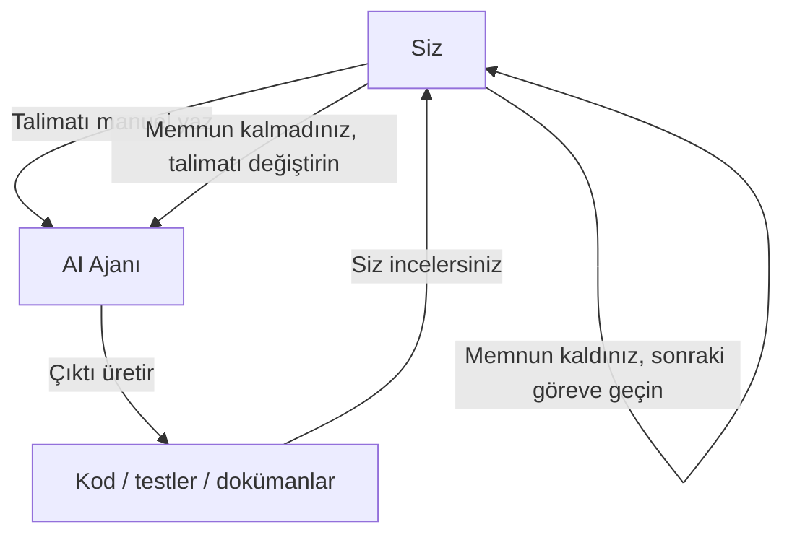
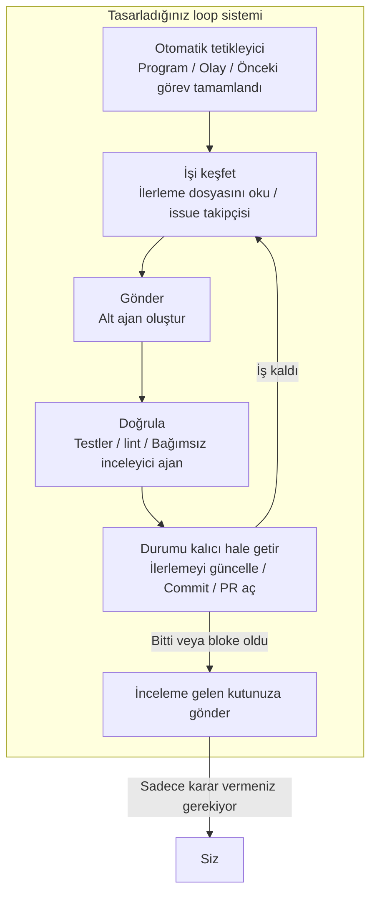
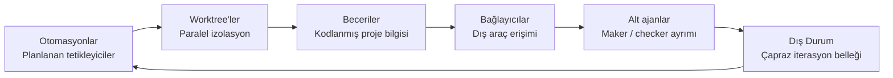
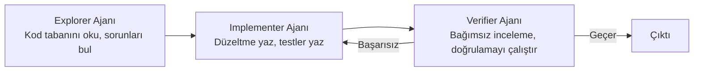
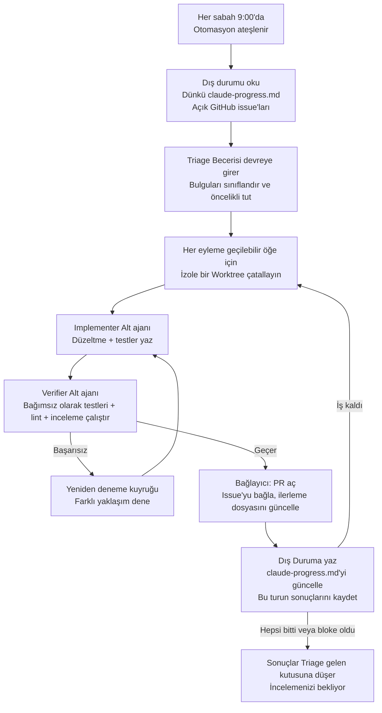
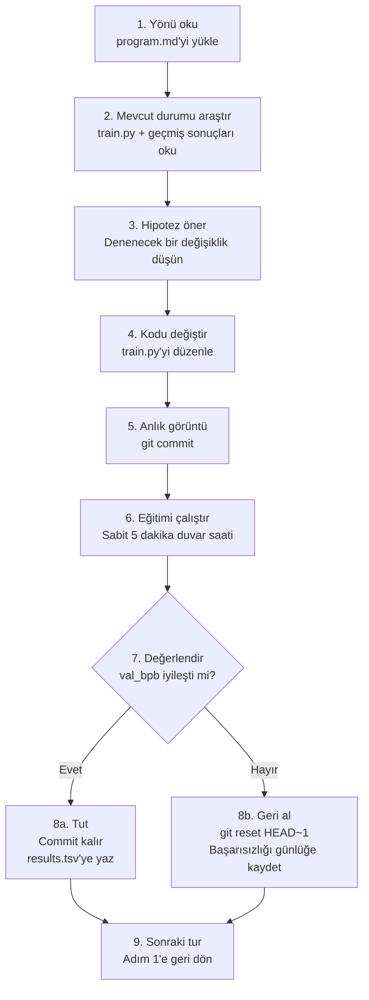

[English Version →](../../../en/lectures/lecture-13-loop-engineering/)

> Kod örnekleri: [code/](https://github.com/walkinglabs/learn-harness-engineering/blob/main/docs/en/lectures/lecture-13-loop-engineering/code/)
> Uygulama projesi: [Proje 07. İlk otomatik loop'unuzu oluşturun](./../../projects/project-07-loop-engineering-first-loop/index.md)

# Ders 13. Manuel Prompting'den Otonom Loop'lara

İlk on iki derste öğrendiklerinizin hepsi tek bir varsayıma dayanıyor: **klavyenin başında oturup teker teker talimatlar yazıyorsunuz.**

`AGENTS.md` yazdınız (Ders 1–4), durum yönetimi oluşturdunuz (Ders 5–6), özellik listeleriyle kapsamı kısıtladınız (Ders 7–8), oturum sonunda temiz devirler bıraktınız (Ders 9, 12) ve runtime'ı gözlemlenebilir kıldınız (Ders 10–11). Ama tüm bunların tetikleyicisi her zaman siz oldunuz. Ajan ne zaman çalışmaya başlayacağına kendi kendine karar vermedi — çünkü kimse "başlat" tuşuna basmadı.

Bu ders, başlat düğmesini sisteme teslim etmekle ilgili. Kontrolü bırakmak değil — bir sonraki katmana yükseltmek.

## /goal: Mümkün olan en basit loop

Loop mühendisliğine en iyi giriş, karmaşık bir mimari diyagramı değil — tek bir komuttur.

2026 başlarında Claude Code ve OpenAI Codex bağımsız olarak aynı özelliği yayınladı: `/goal`. Terminal'e şunu yazarsınız:

```
/goal "Tüm testler geçsin, sıfır lint uyarısı olsun, main'e merge edilsin"
```

Sonra dizüstü bilgisayarınızı kapatıp uyumaya gidersiniz. Sekiz saat sonra ajan analiz etmiş, kodlamış, test etmiş, düzeltmiş ve kendi kendine merge etmiştir. Başarısızlıkta yeniden dener, takıldığında yaklaşımı değiştirir ve bittiğinde durur — omzunda durup "tekrar dene" demenize gerek kalmadan.

`/goal` ile geleneksel bir prompt arasındaki tek fark bir şeydir. Ama o bir şey her şeyi değiştirir:

| | Geleneksel Prompt | `/goal` |
|---|---|---|
| Ne sağlarsınız | Sırada ne yapılacağı | Son durumun neye benzeyeceği |
| Ajan ne yapar | Bir kez yürütür | Ulaşılana kadar döner |
| Biten kim tarafından yargılanır | Siz | Doğrulanabilir bir durdurma koşulu |
| Ne zaman uzaklaşabilirsiniz | Uzaklaşamazsınız | `/goal` yazdığınız anda |

`/goal` aslında bir loop'tur. Tam olarak üç parçası vardır: **bir hedef, bir doğrulama yöntemi ve bir durdurma koşulu.** Sadece bu üç şey sizi loop'un içinden dışına taşır.

### `/goal` organik olarak nasıl büyüdü

`/goal` sıfırdan bir anda ortaya çıkmadı. Gündelik iş akışlarından kademeli olarak büyüdü ve kabaca dört aşamadan geçti:

**Aşama 1: Manuel teker teker prompting.** En erken çalışma yöntemi ileri geriydi: "bir fonksiyon yaz", "test ekle", "bu mantığı düzelt." Ajan her adımdan sonra durur ve sırada ne olduğunu söylemenizi beklerdi. Tüm pipeline'ın zamanlayıcısı sizdiniz.

**Aşama 2: Birden fazla adım içeren uzun prompt'lar.** Sonra insanlar adımları üst üste koyan daha uzun prompt'lar yazmaya başladı: "önce kodu analiz et, sonra uygulamayı yaz, sonra testleri çalıştır, eğer başarısız olursa düzelt." Ajan tek seferde birkaç adım çalıştırabiliyordu, ama yine de izlemeniz gerekiyordu — çünkü yolun ortasında sapabilir veya bir adımı bitirip sırada ne yapacağını bilemeyebilirdi.

**Aşama 3: Ajan öz-yansıtma ve öz-yönlendirme.** Ondan sonra ajanlar "iç gözlem" kazandı — her adımdan sonra sonuca bakıp sırada ne yapacaklarına karar verirlerdi. Bir hedef verirdiniz, kendileri parçalara ayırır ve kendi kendilerine yeniden denerlerdi. Ama bir sorun ortaya çıktı: ne zaman dururlar? Ajanın kendisinden gelen "bitti" sayılır mı? Pratik sürekli aynı cevabı verdi — hayır. Ajanlar zaferi çok kolay ilan eder.

**Aşama 4: Bağımsız durdurma yargısı — `/goal`.** Son adım, "bitip bitmediğini yargılamayı" işi yapan ajanın elinden alıp bağımsız bir yargıcı teslim etmekti. Farklı bir model, bir betik veya bir test komutu olabilirdi — ama kural aynıydı: kodu yazan kişi ödevini kendi notlandıramaz. Bu noktada `/goal` gerçekten çalıştı: hedefi verirsiniz, döner, bağımsız bir yargıcı ne zaman duracağına karar verir ve siz uzaklaşabilirsiniz.

Bu dört aşama hiçbir şirketin planladığı bir yol haritası değildi. Ajanlarla kod yazan herkesin aynı acı noktaları tarafından iterek bağımsız olarak vardığı yoldur. Claude Code ve Codex'in `/goal`'ı 2026 başlarında neredeyse eş zamanlı olarak yayınlaması tesadüf değildi — zamanı gelmişti.

### Birden fazla loop türü var

`/goal` anlaşılması en kolay loop'tur, ama tek tür değildir. Loop'lar nasıl tetiklendiklerine ve nasıl durduklarına göre kategorilere ayrılır:

| Tür | Tetikleyici | Durdurma Koşulu | Claude Code | Codex | En İyi Kullanım |
|------|---------|----------------|-------------|-------|----------|
| **Sıra tabanlı loop** | Her prompt'u manuel olarak yazarsınız | Ajan bittiğini düşünür veya siz müdahale edersiniz | Normal sohbet | Normal sohbet | Küçük görevler, keşif çalışması |
| **Hedef tabanlı loop** | Bir hedef verirsiniz | Bağımsız değerlendirici bittiğini onaylar veya maksimum tur sayısına ulaşılır | `/goal` | `/goal` (manuel etkinleştirme gerekli) | Net tamamlama kriterleri olan karmaşık görevler |
| **Zaman tabanlı loop** | Planlanan aralık (her N dakika/saat) | Manuel olarak durdurursunuz veya işi tamamladıktan sonra çıkar | `/loop` | Thread otomasyonu | Durum yoklama, periyodik kontroller, tekrarlayan işler |
| **Olay odaklı loop** | Dış olay (PR açıldı, CI başarısız oldu, yeni issue) | Olayı işledikten sonra durur veya yeniden deneme sınırına ulaşır | Routines (API / GitHub Webhook) | Standalone otomasyon + eklentiler | Reaktif iş akışları, CI/CD entegrasyonu |

Bunlar birbiriyle yarışan şeyler değil — farklı işler için farklı araçlar. Sıra tabanlı küçük şeyler için iyidir. Net bir bitiş çizgisi olduğunda `/goal` kullanın. Bir şeyi izlemeniz gerektiğinde `/loop` kullanın. Dış sistemlerle entegre olduğunuzda olay odaklı kullanın.

### `/goal` ve `/loop`'u karıştırmayın

İkisinin de adında "loop" var ama tamamen farklı sorunları çözerler:

| | `/goal` | `/loop` |
|---|---------|---------|
| **Ne olduğu** | Büyük bir görev, bitene kadar çalışır | Küçük bir eylem, aralıkla tekrarlar |
| **Durdurma koşulu** | Hedefe ulaşılır veya bütçe tükenir | Manuel olarak durdurursunuz veya görev kendi kendine çıkar |
| **Zaman profili** | Bir uzun çalışma, saatler veya günler sürebilir | Periyodik kısa patlamalar, her çalışma birkaç dakika olabilir |
| **İlerleme** | Her iterasyonda bitiş çizgisine yaklaşır | Her çalışma bağımsızdır, kümülatif ilerleme yoktur |
| **Benzetme** | Maraton koşmak — başlangıç silahı ateşlenir, bitiş çizgisinde durursunuz | Çalar saat — programa göre çalar, kapatırsınız |
| **Tipik kullanım** | "Ödeme sistemini test kapsamıyla tam olarak uygula" | "Her 15 dakikada bir CI bozuldu mu kontrol et" |

Yaygın bir hata: `/goal` olması gereken bir şeyi `/loop`'a sokmak. `/loop 10m "ödeme sistemini uygulamaya devam et"` yazmak gibi — bu yanlıştır. `/loop` aynı talimatı her seferinde bağımsız olarak çalıştırır, kaldığı yerden devam etmez. Sadece aynı başlangıç noktasını tekrar tekrar alırsınız.

**Hangisini kullanacağınıza dair tek cümlelik test: bu şeyin sonu var mı?**
- Sonu var → `/goal`
- Sonu yok, sadece izlemeniz gerekiyor → `/loop`

Bu dersin konusu olan Loop Mühendisliği, tek bir komutla ilgili değildir. **Tüm bu türleri içeren sistemler tasarlayabilmekle ilgilidir — böylece ajanınız orada olmasanız bile çalışmaya devam edebilir.**

Her seferinde `/goal` yazmak zorunda değilsiniz. Ama nereden geldiğini ve neden göründüğü gibi olduğunu anlamak — loop mühendisliğinin özünü anlamaktır. Daha karmaşık loop'lar sadece zamanlama, paralellik, izolasyon ve bellek gibi parçaları aynı üç temel üzerine ekler: hedef, doğrulama, durdurma koşulu.

## Haziran 2026: Üç kişi aynı haftada aynı sigortayı yaktı

2026 Haziran'ın ilk haftasında, kodlama ajan altyapısı inşa eden üç pratisyen — notlar karşılaştırmadan — farklı kelimelerle aynı şeyi söyledi.

**Peter Steinberger** (OpenClaw yaratıcısı, [yazısı 8 milyon görüntüleme ulaştı](https://x.com/steipete/status/2063697162748260627)): "Artık kodlama ajanlarını prompt etmemelisiniz. Ajanlarınızı prompt eden loop'lar tasarlamalısınız."

**Boris Cherny** (Anthropic'te Claude Code başkanı, [Acquired podcast'te](https://x.com/rohanpaul_ai/status/2063289804708835412)): "Artık Claude'ı prompt etmiyorum. Claude'ı prompt eden ve ne yapacağını çözen loop'larım var. Benim işim loop yazmak."

**Addy Osmani** (Google Chrome mühendislik lideri) [7 Haziran 2026'da kavramı adlandırdı](https://addyosmani.com/blog/loop-engineering/) ve tek satırlık bir tanım verdi:

> **Loop mühendisliği, ajanı prompt eden kişi olarak kendinizi değiştirmektir. Onun yerine bunu yapan sistemi tasarlarsınız.**

Cherny sayıları açıkladı: art arda 30 günden fazla, Claude Code'a tüm kod katkıları AI tarafından özerk olarak yapıldı — 259 merge edilmiş PR, üretim kodunun %80'inden fazlası Claude tarafından yazıldı ve açık uçlu yazılım görevlerinde %76 başarı oranı.

Üç kişi. Bir hafta. Aynı sonuç. Koordine oldukları için değil — altyapı sessizce bir eşiği aştığı için. Ajanlar önemsiz olmayan görevleri denetimsiz bitirecek kadar güvenilir hale gelmişti. Zamanlama ilkelleri (`/loop`, `/goal`, cron) artık araçlara yerleşmişti. Tek bir ajan çalıştırmanın maliyeti, bir zamanlayıcıda tekrar tekrar çalıştırmanın israfçı görünmemesini sağlayacak kadar düşmüştü. Tüm parçalar mevcut olduğunda, onları birleştiren hareket herkes için aynı anda açık hale gelir.

> Kaynak: [Addy Osmani: Loop Engineering](https://addyosmani.com/blog/loop-engineering/)

## Loop'un içi vs. dışı

İki somut senaryoyu karşılaştıralım.

**Senaryo A: Loop'un içindesiniz (Ders 1–12).**



Tam bir harness'ınız var: `AGENTS.md` ajana proje kurallarını söyler, `feature_list.json` kapsamı kısıtlar, `init.sh` tutarlı ortam sağlar, `claude-progress.md` ilerlemeyi kaydeder. **Ama her adım hala sizin manuel başlatmanızı gerektirir.** Bir özelliği bitirin, ilerleme dosyasını okuyun, sırada ne olduğunu düşünün, talimatı yazın. Tüm iş akışının motoru sizsiniz.

**Senaryo B: Loop'un dışındasınız (Loop Mühendisliği).**



Artık talimat yazmıyorsunuz. Tasarladığınız sistemi işi keşfeder, gönderir, sonuçları doğrular, durumu kaydeder ve bir sonraki adıma karar verir. İşiniz üç şeye küçülür: **başlamadan önce hedefi ve durdurma koşulunu tanımlamak, bittikten sonra çıktıyı gözden geçirmek ve sistem yoldan çıktığında kuralları ayarlamak.** Kaldıraç "doğru prompt yazmaktan" "doğru loop tasarlamaya" kayar.

> Osmani: "Bir yıl önce bir loop istiyorsanız bir yığın bash yazarsınız ve o yığını sonsuza kadar bakımını yapardınız ve size aitti ve sadece size aitti. Şimdi parçalar doğrudan ürünlerin içinde geliyor." Sıfırdan inşa etmenize gerek yok. Parçaların nasıl bir araya geldiğini anlamanız gerekiyor.

## Çekirdek Kavramlar

- **Loop Mühendisliği**: Ajanınızı otomatik olarak prompt eden bir sistem tasarlamak, manuel adım adım insan girdisinin yerini almak. İnsan loop'un içinden dışına çıkar ve kaldıraç "doğru prompt yazmaktan" "doğru loop tasarlamaya" kayar.
- **`/goal` modu**: Mümkün olan en basit loop — bir hedef, doğrulama yöntemi ve durdurma koşulu sağlayın; ajan ulaşılana kadar döner. Manuel prompting'den otonom loop'lara köprü.
- **Üretici/Değerlendirici Ayrımı**: Kodu yazan ajan ile kontrol eden ajan ayrılmalıdır. Kendi çalışmasını notlandıran bir model güvenilmezdir; bazen tamamen farklı bir model kullanan bağımsız bir doğrulayıcı, herhangi bir loop'un temel güvenilirlik garantisidir.
- **Worktree İzolasyonu**: Her paralel ajan bağımsız bir git worktree'de çalışır ve dosya çarpışmalarını fiziksel olarak önler. Çoklu ajan paralel yürütme için altyapı ön koşulu.
- **Dış Durum**: Tek bir konuşmanın dışında yaşayan bellek — markdown dosyaları, issue takipçileri, kanban tahtaları. Modeller çalıştırmalar arasında her şeyi unutur; bellek diskte yaşamalıdır.
- **Dört Sessiz Maliyet**: Bir loop ne kadar uzun süre çalışırsa o kadar belirginleşen dört gizli maliyet — doğrulama borcu, anlama çürümesi, bilişsel teslimiyet, token patlaması. Loop'lar sadece çıktıyı değil, riski de hızlandırır.

## Loop'un Altı İlkeli

Osmani bir loop'u beş çekirdek yapı taşına ayırdı, ayrıca hepsinden geçen bir bellek katmanı — toplam altı şey, ama bellek katmanı özel bir statüye sahiptir: diğerleriyle aynı seviyede bir bileşen değil; diğer her şeyin bağlı olduğu omurgadır.

Aşağıdaki diyagram tüm altısını bir halka olarak çizer, böylece tam resmi bir bakışta görebilirsiniz. Ama unutmayın: Dış Durum sadece loop'daki bir durak değil — tüm loop'un dayandığı temeldir.



### 1. Otomasyonlar — Kalp Atışı

Otomasyon olmadan bir loop loop değildir — manuel olarak yaptığınız tek seferlik bir çalışmadır.

Hem Claude Code hem de Codex tam zamanlama sistemlerine sahiptir, ama farklı isimler ve katmanlar kullanırlar. Kabaca en hafiften en ağıra doğru eşleme:

| Katman | Claude Code | Codex | Notlar |
|-------|-------------|-------|-------|
| Oturum içi yoklama | `/loop` | Thread otomasyonu | Mevcut oturuma bağlı, oturum kapandığında ölür |
| Yerel planlanan görevler | Masaüstü planlanan görevleri | Standalone otomasyon (yerel mod) | Makine açıkken çalışır, yerel dosyalara erişebilir |
| Bulut planlanan görevler | Cloud Routines | — (yerel bulut zamanlayıcısı yok) | Makine kapalıyken çalışır |
| Olay tetikleyicileri | Routines (API / GitHub Webhook) | Standalone otomasyon + eklentiler | Dış olaylar tarafından tetiklenir |
| Tamamen kendi kendine barındırılan | GitHub Actions / kendi kendine barındırılan cron | `codex exec` + cron | Tam kontrol |

**Codex'in Otomasyonlar sekmesi** zamanlama giriş noktasıdır. Projeyi, prompt'u, temposu ve yerel ödemeinizde mi yoksa arka plan worktree'sinde mi çalışacağını seçin. Bir şey bulan çalışmalar Triage gelen kutusuna düşer; hiçbir şey bulamayan çalışmalar otomatik olarak arşivlenir. OpenAI bunları dahili olarak günlük issue triajı, CI başarısızlık özetleri, commit brifingleri ve geçen hafta tanıtılan hataları avlamak için kullanır.

Codex otomasyonları iki çeşittir:
- **Thread otomasyonu** — Bir threade bağlı, bağlamı koruyan, kalp atışı tarzı tekrarlayan uyandırma çağrıları. Uzun süren bir komutu izlemek veya PR durumunu yoklamak gibi tek bir şey üzerinde sürekli takip için iyidir. Claude Code'daki karşılığı `/loop`.
- **Standalone otomasyon** — Her çalışma taze başlar, sonuçlar Triage'a gider. Brifingler veya bağımlılık taramaları gibi günlük/haftalık bağımsız görevler için iyidir. Claude Code'daki karşılığı Masaüstü planlanan görevleri.

Claude Code'un sistemi daha ayrıntılı katmanlıdır:

- **`/loop`** — Hafif oturum içi planlanan tekrar. Terminaliniz açıkken çalışır, oturum kapandığında ölür, 7 gün sonra otomatik olarak sona erer. Mevcut çalışma oturumunuz sırasında geçici izleme için iyidir.
- **Masaüstü planlanan görevler** — Makineniz açıkken çalışır, oturum yeniden başlatmalardan sağ çıkar, dakika seviyesi aralıklar. Yerel dosya erişimi gerektiren tekrarlayan işler için iyidir.
- **Cloud Routines** — Anthropic'in bulut altyapısında çalışır, makinenizin kapalı olmasından sağ çıkar, 1 saat minimum aralık. Üç tetikleyici türünü destekler: planlanan, API çağrısı, GitHub webhook. Yerel ortamınıza ihtiyaç duymayan günlük görevler için iyidir.
- **GitHub Actions / kendi kendine barındırılan cron** — Tamamen sizin kontrolünüzde, istediğiniz gibi çalışır. Özel ortam veya güvenlik gereksinimleri olan senaryolar için iyidir.

```bash
# Claude Code: her 30 dakikada bir testleri çalıştır, başarısız olanları düzelt (mevcut oturum içinde)
/loop 30m Run the test suite and fix any failing tests

# Claude Code: her 15 dakikada bir deploy durumunu kontrol et
/loop 15m Check if the production deploy succeeded and report status
```

Otomasyonlar kalp atışıdır. Onlar olmadan loop, asla uyanan bir plandır.

### 2. Worktree'ler — Ölçekte İzolasyon

Birden fazla ajan çalıştırır çalıştırmaz, dosya çarpışmaları kaçınılmaz hata modu haline gelir. Aynı dosyaya yazan iki ajan, birbirine danışmadan aynı satırlara commit eden iki mühendisin baş ağrısıyla tamamen aynıdır.

`git worktree` bunu çözer: her ajan kendi şubesinde kendi dizininde çalışır. Birbirlerinin ödemeine fiziksel olarak dokunamazlar.

Claude Code ve Codex ikisi de worktree desteğiyle birlikte gelir. Bir alt ajan üzerinde `--worktree` veya `isolation: worktree` kullandığınızda, her yardımcı temiz, bağımsız bir ödeme alır ve kendinden sonra temizlik yapar. Worktree'ler mekanik çarpışma sorununu ortadan kaldırır — ama unutmayın: **gözden geçirme bant genişliğiniz hala tavandır.** Kaç tane paralel ajanı denetleyebildiğiniz, gerçekten kaç tane worktree çalıştırabileceğinizi belirler.

### 3. Beceriler — Projenizi yeniden açıklamayı bırakın

Bir beceri, her oturum aynı proje bağlamını yeniden açıklamayı nasıl bırakacağınızdır. Talimatlar ve meta veriler içeren bir `SKILL.md`, artı isteğe bağlı betikler, referanslar ve varlıklar içeren bir klasördür.

Codex ve Claude Code aynı formatı destekler. Beceriler doğrudan `/skill-name` ile çağrılır (Codex ayrıca `$skill-name` destekler) veya görev beceri açıklamasıyla eşleştiğinde örtük olarak tetiklenir.

Beceriler temelde niyet borcunuzu ödemekle ilgilidir. Bir ajan her oturuma soğuk başlar — niyetinizdeki her boşluğu kendinden emin bir tahminle doldurur. Bir beceri, dışarıya yazılmış o niyettir: kurallar, derleme adımları, "bunu yapmayız çünkü şu olay oldu" — bir kez yazılır, her çalışmada okunur.

### 4. Bağlayıcılar — Loop'unuz gerçek araçlara dokunur

Sadece dosya sistemini görebilen bir loop küçük bir loop'dur. Bağlayıcılar (MCP protokolü üzerine kurulu) ajanın issue takipçinizi okumasını, bir veritabanı sorgulamasını, bir staging API'sine istek atmasını, Slack'e mesaj bırakmasını sağlar.

Codex ve Claude Code ikisi de MCP konuşur, bu yüzden biri için yazdığınız bağlayıcı genellikle diğerinde de çalışır. Bağlayıcılar "düzeltme burada" ile PR açan, Linear biletini bağlayan ve CI yeşil olunca kanalı pingleyen bir loop arasındaki farktır — kendi kendine, gerçek ortamınızda, sadece terminalde değil.

### 5. Alt ajanlar — Maker'ı checker'dan uzak tutun

Bir loop'ta yapısal olarak en değerli tasarım seçimi, yazanı kontrol edenden ayırmaktır. Kodu yazan model kendi ödevini notlandırmak konusunda çok fazla cömerttir. Farklı talimatları ve bazen farklı bir modeli olan ikinci bir ajan, ilk ajanın kendini ikna ettiği şeyleri yakalar.

Klasik üç rol ayrımı:



Claude Code'un `/goal`'u bunu kapalı olarak çalıştırır — taze, bağımsız bir oturum loop'un durup durmayacağını yargılar, işi yapan oturum değil. Buna **üretici/değerlendirici ayrımı** denir ve loop tasarımındaki en önemli tek güvenilirlik garantisidir.

### 6. Dış Durum — Loop'un belleği

Modeller çalıştırmalar arasında her şeyi unutur. Bellek bağlam penceresinde değil, diskte yaşamalıdır.

Bu çok basit görünebilir, ama her uzun süreli ajanın güvendiği aynı hiledir. Bir markdown dosyası, bir Linear panosu — tek bir konuşmanın dışında yaşayan ve neyin yapıldığını, neyin devam ettiğini ve neyin sırada olduğunu tutan herhangi bir şey. Ajan unutur. Depo unutmaz.

Bu altı ilke sizin loop tasarım araç setinizdir. Her loop için hepsine ihtiyacınız yok. Ama hangisine ne zaman ulaşacağınızı bilmeniz gerekir.

## Tam Bir Loop, Anatomize Edilmiş

Altısını da birbirine bağlayın ve gerçek bir sabah triaj loop'unun nasıl göründüğü işte:



Bu artık tek bir ajan çalışması değil. Her sabah uyanan, kendi kendine yeri süpüren ve dikkatinizi gerektiren şeyleri önünüze koyan sürekli çalışan bir sistemdir. Rolünüz şu hale gelir: **gelen kutusu içeriğini gözden geçirin, kararlar verin ve sistemin kaldıramayacağı bir desen gördüğünüzde becerileri ve kuralları iyileştirin.**

Cherny bu deseni kullanarak 30 günde 259 PR'ı tek bir IDE açmadan merge etti. OpenAI mühendisleri aynı deseni kullanarak kabaca bir milyon satırlık bir beta ürünü elle — tek bir satır kod kendileri yazmadan — inşa ettiler.

## Üretici/Değerlendirici Ayrımı: Neden Modelin Kendi Çalışmasını Notlandırmasına İzin Veremezsiniz

Bu loop mühendisliğindeki en zor derstir.

En akıllı ajanınız güzel bir kod parçası yazar. Mantık net, yorumlar kapsamlı ve her fonksiyonun bir testi var. Memnunsunuz.

Ama şu soru var: **o kodu yazan ajana iyi bir iş yapıp yapmadığını yargılamasına izin verirseniz, ne diyecektir?**

Cevap defalarca deneyimle doğrulandı: kendine yüksek bir not verecektir. Dürüst olmadığı için değil, yazarı olduğu için — üretim sırasında bu yolun doğru olduğuna kendini ikna etmiştir. Geriye baktığında hatalar görmez; kendi muhakeme sürecini görür.

Bu bir Claude sorunu değil. Bu bir GPT sorunu değil. Bu tüm üretken modellerin bir özelliğidir. **Bir model kendi çıktısının en iyi savunma avukatıdır.**

Düzeltme: aynı varlığın (aynı model, aynı prompt) hem işi hem de incelemeyi yapmasına asla izin vermeyin.

- Claude Code'un `/goal`'u hedefin karşılanıp karşılanmadığını yargılamak için bağımsız bir denetçi oturumu kullanır — deneyen oturumu değil.
- Codex'in alt ajan sistemi, farklı bir modelle farklı bir muhakeme çabası kullanan bir doğrulayıcı ajan tanımlamanıza olanak tanır.
- "Düşmanca doğrulama" topluluk pratiği, her bulgu için N bağımsız şüpheci oluşturur, her biri çürütmek için prompt edilir — çoğunluk reddi bulguyu öldürür.

Hatırlanacak tek cümle: **ekibinizdeki biri size inanmamalıdır.**

## Karpathy'nin autoresearch'ı: Loop örneği

İyi tasarlanmış, gerçekten çalışan bir loop'un neye benzediğini görmek istiyorsanız, [Karpathy'nin autoresearch'ı](https://github.com/karpathy/autoresearch) ders kitabı örneğidir.

Mart 2026'da Karpathy 630 satırlık bir Python projesi yayınladı. Ona bir GPU ve bir araştırma yönü verin ve bütün gece çalışır — yüzlerce ML eğitim deneyi tamamlar, sadece gerçekten iyileştirenleri tutar. Proje yayınlanmasından birkaç gün içinde 66.000+ yıldıza ulaştı.

### Üç Dosya, Üç Rol

Tüm sistemin sadece üç çekirdek dosyası var, ama iş bölümü son derece keskindir:

| Dosya | Kim Düzenler | Ne Yapar |
|------|-------------|-------------|
| `prepare.py` | Hiç kimse (salt okunur) | Veri hazırlığı, tokenizer, eval harness. Sabit altyapı. |
| `train.py` (~630 satır) | **AI Ajanı** | Model tanımı, optimize edici, eğitim döngüsü. Ajanın oyun alanı — her şeyi değiştirebilir. |
| `program.md` | **Siz** | Doğal dilde yazılmış araştırma metodolojisi. Sadece bunu düzenlersiniz. Ajana nasıl keşfedeceğini, nasıl değerlendireceğini, neye dokunmayacağını söyleyin. |

Bu üç yönlü ayrım tasarımın ruhudur: **insanlar koda dokunmaz, yöne dokunur; ajanlar yöne dokunmaz, koda dokunur.** İşiniz Python yazmaktan "araştırma kurumu kültürünü yazmaya" kayar.

### Girdi: program.md nasıl görünür

`program.md` loop'un beynidir. Kod değil — Markdown'da yazılmış bir araştırma talimat kılavuzudur. Kabaca şunları içerir:

- **Hedef**: `val_bpb`'yi optimize et (bayt başına doğrulama bitleri, daha düşük daha iyidir)
- **Kısıtlamalar**: `prepare.py`'ye dokunma, VRAM bütçesi içinde kal, sabit 5 dakikalık eğitim
- **Keşif yönleri**: farklı mimariler, optimize ediciler, LR programları dene
- **Değerlendirme kuralları**: iyileştirme ne sayılır, sonuçlar nasıl günlüklenir, başarısızlıkta ne yapılır
- **Demir kural**: asla durma. Loop başladığında, sonsuza kadar devam et

Ajana başlangıç prompt'unuz tek bir cümle kadar kısa olabilir:

```
Have a look at program.md and let's kick off a new experiment!
```

Geri kalanı, belgeyi okuyan ve kendi kararlarını veren ajana kalmış.

### Dokuz Adımlı Mıknatıs Loop (Ratchet)

autoresearch'ın kalbinde bir **mıknatıs** (ratchet) vardır — sadece ileri gider, asla geri gitmez. Her iterasyon kesinlikle dokuz adımı izler:



Saatte kabaca 12 deney çalıştırır. Bir gecelik çalışma (8 saat) yaklaşık 100 deneydir. Karpathy kendisi 2 gün çalıştırdı — ~700 deney.

Sabit 5 dakikalık duvar saati bütçesi önemli bir tasarım seçimidir — ajan ne değiştirirse değiştirsin, her deney tam olarak aynı zamanı alır. Bu, tüm sonuçların aynı zaman bütçesi altında doğrudan karşılaştırılabilir olduğu anlamına gelir — "bunun daha uzun süre çalıştığı için daha iyi" tartışması yok.

### Çıktı: Uyandığınızda ne görürsünüz

Bir gece döngüden sonra sabah oturur ve üç şey bulursunuz:

**1. Git geçmişi (ileri hareket eden mıknatıs)**

Sadece gerçekten iyileştiren commit'ler ana dalda kalır. Başarısız olan her şey geri alındı. `git log` doğrulanmış bir araştırma günlüğüdür.

**2. results.tsv (tam deney kaydı)**

Her tek deney — başarılı veya başarısız — günlüğe kaydedilir:

```
timestamp    commit_hash    val_bpb    vram_mb    description
--------- ------------- ---------- ---------- ----------------------------
08:01:12  a1b2c3d       1.234     22100    baseline
08:06:15  d4e5f6g       1.228     22400    increased learning rate by 10%
08:11:20  (reverted)     1.241     21800    switched to GELU activation
08:16:08  h7i8j9k       1.219     23000    added weight decay 0.01
...
```

**3. Bir araştırma günlüğü (ajanın kendi özeti)**

Ajan ne denediğini, neyin işe yaradığını, neyin yaramadığını ve sırada neyi denemeyi planladığını açık commit mesajları yazar. Bunları okursunuz — kod farklarını okumak zorunda değilsiniz.

### Gerçekte ne buldu

Karpathy'nin ilk 2 günlük ~700 deney çalışmasının sonuçları:

- ~700 denemeden yaklaşık **20 yığılabilir gerçek iyileştirme** bulundu
- nanochat'ın GPT-2 seviyesi eğitim süresini 8×H100'de **2,02 saat → 1,80 saat** olarak azalttı, yaklaşık **%11 daha hızlı**
- Bulgular şunları içeriyordu: öğrenme oranı ayarlamaları, optimize edici ayarı, aktivasyon değişimleri, dikkat deseni optimizasyonları vb.

Tüm iyileştirmeler yer sarsıcı keşifler miydi? Hayır. Çoğu yığılan küçük optimizasyonlardı. Ama bu 20 geçerli iyileştirme bir insan araştırmacının haftalarca manuel çalışmasını alırdı — ajan 48 saatte yaptı.

### En anlatıcı detay: Loop İngilizce yazılır, kodla değil.

`program.md` bir Python betiği değil, bir Markdown belgesidir. Bir araştırma metodolojisini tanımlar — neyi değiştirmek, neyi olduğu gibi bırakmak, nasıl değerlendirmek, başarısızlık durumlarını nasıl ele almak ve bir demir kural: **asla insan yardım isteme, sadece devam et.** Bir kodlama ajanı bu belgeyi okur ve süresiz olarak yürütür.

Bu loop mühendisliğinin şablonudur: ajana bir görev verme. Ona bir **metodoloji** ver. Metodolojinin loop olmasına izin ver. Bir `program.md`, 630 satır tutkal kod ve geriye kalan her şey kendi kendini çalıştıran ajandır.

## Dört Sessiz Maliyet

Bir loop çalışmaya başladığında, sorunları hemen görmezsiniz. Aşağıdaki dört maliyet sessizce birikir ve fark ettiğinizde, zaten ağır bir şekilde ödeme yapmış olabilirsiniz.

### 1. Doğrulama Borcu

Hızlı loop'lar sizi doğrulamayı atlamaya kışkırtır. "Güzel görünüyor" ile "doğru olduğu onaylandı" aynı şey değildir. Bir loop denetimsiz ne kadar çok kod üretirse, doğrulama borcu o kadar hızlı yığılır. Düzeltme: **durdurma koşulları makine tarafından kontrol edilebilir olmalı, asla "doğru hissettiriyor" olmamalıdır.**

### 2. Anlama Çürümesi

Bir loop kod o kadar hızlı gönderir ki, kendi kod tabanınıza dair anlayışınız gerçeklikten o kadar uzaklaşır. Cherny'nin ekibinin kodunun %80'i ajanlar tarafından yazıldı — yani bir ekibin kodunun çoğu bir kişi tarafından yazılmadı. Loop'un ürettiğini okumaz ve kullanmazsanız, anlayışınız sürekli olarak çürür. **Hızlı loop'lar hızlı okuma gerektirir.**

### 3. Bilişsel Teslimiyet

Loop sorunsuz çalıştığında, en rahat duruş fikir sahibi olmayı bırakmaktır. Geri verdiği her şeyi alın, çıktı hakkında düşünmeyin. Ama tehlike tam olarak orada başlar — loop'u düşünmeyi güçlendirmek yerine düşünmekten kaçınmak için kullanıyorsunuz. Osmani'nin uyarısı: "İki kişi aynı loop'u kurabilir ve zıt sonuçlar alabilir. Biri anladığı işte daha hızlı gitmek için kullanır; diğeri işi anlamaktan kaçınmak için kullanır. Loop farkı bilmez. Siz bilirsiniz."

### 4. Token Patlaması

Bir loop'un her iterasyonu daha fazla bağlam biriktirir: yazılan kod, karşılaşılan hatalar, verilen kararlar. Bağlam yönetimi olmadan, prompt boyutu tur sayısıyla kabaca ikinci dereceden büyür. Codex bunu otomatik bağlam sıkıştırmasıyla ele alır — özel bir API eski konuşma turlarını şifreli içerik özetlerine sıkıştırır, temel bilgiyi korurken gereksiz detayı atar. Bu, ilk loop'tan ele almanız gereken bir mühendislik endişesidir, sonradan takılan bir ek değil.

## İlk Loop'unuzu Oluşturmak

Haftada 1.300 PR merge eden Stripe ölçeğinde bir pipeline ile başlamak zorunda değilsiniz. Çalışan en küçük şeyle başlayın.

### Adım 1: Tekrarlayan Bir Görev Seçin

Haftada en az iki kez manuel olarak yaptığınız bir şey bulun. Örnekler:
- Sabah GitHub'ı aç, yeni issue'ları kontrol et, triaj yap ve yanıt ver
- Her PR incelemesinden önce lint ve testleri çalıştır
- Her günün sonunda ilerleme dokümanlarını güncelle

### Adım 2: Bir Hedef ve Durdurma Koşulu Yazın

Görevi `/goal`'un anlayabileceği bir şeye dönüştürün:

```markdown
Hedef: Depodaki en yeni 10 issue'yu kontrol et.
Her issue için:
  - Zaten net etiketleri ve atanmış bir kişisi varsa, atla
  - Etiketlenmemişse, içeriğe göre uygun etiketleri ekle
  - 10 dakikadan kısa sürede düzeltilebilirse, bir dal oluştur ve düzeltmeyi dene
Ne zaman dur: Uygun tüm issue'lar işlendiğinde veya bir issue insan kararı gerektirdiğinde.
```

### Adım 3: Maker ve Checker'ı Ayırın

Aynı ajana hem kodu yazıp hem de yargılamasına izin vermeyin. Loop'unuzu iki role ayırın:
- Implementer: issue'yu okur, düzeltmeyi yazar, testleri yazar
- Verifier: bağımsız olarak testleri çalıştırır, farkı inceler, düzeltmenin sorunu gerçekten çözüp çözmediğini yargılar

### Adım 4: Bellek Ekleyin

Her loop çalışmasında ne olduğunu kaydetmek için bir markdown dosyası kullanın. Bir sonraki çalışma bu dosyayı okuyarak başlar — neyin yapıldığını, neyin beklemede olduğunu, neyin bloke olduğunu bilir. Bu herhangi bir karmaşık veritabanından daha iyidir.

### Adım 5: Bir Zamanlayıcı Ayarlayın

Loop'un siz olmadan başlamasına izin vermek için `/loop` veya işletim sistemi cron'unuzu kullanın. Günde bir kez ile başlayın. Bir hafta boyunca gözlemleyin.

### Olgunluk Merdiveni

En üste bir sıçrayışta ulaşmak zorunda değilsiniz. Loop benimsemesi bir merdivendir:

1. **Seviye 1: Hedef Çalıştırıcı** — Durdurma koşulu olan bir görev vermek için `/goal` kullanabilirsiniz; ajan ulaşılana kadar döner.
2. **Seviye 2: Planlanan Tek Görev** — Bir otomasyon bir zamanlayıcı üzerinde bir görev çalıştırır (örneğin sabah CI kontrolü).
3. **Seviye 3: Çoklu Ajan Loop'u** — Maker ve checker ayrımı; her bulgu izole bir worktree çatalları.
4. **Seviye 4: Kendini Besleyen Loop** — Loop bir sonraki görevini dış durumdan otomatik olarak keşfeder; sırada ne yapacağına kendi karar verir.
5. **Seviye 5: Filo Orkestrasyonu** — Birden fazla loop paralel olarak çalışır, bağımsız ama bir bellek katmanını paylaşır.

Çoğu ekip şu anda Seviye 2 ile Seviye 3 arasındadır. Seviye 1, getiri görmek için en hızlı yoldur.

## Ana Çıkarımlar

- **Loop Mühendisliği Harness Mühendisliği'nin yerini almaz — onun üzerine bir kat inşa eder.** Harness tek çalışmaları güvenilir kılar. Loop sürekli çalışmaları özerk kılar.
- **`/goal` mümkün olan en basit loop'tur:** hedef + doğrulama + durdurma koşulu. Bu üç şey sizi loop'un içinden dışına taşır.
- **Altı ilke (Otomasyonlar / Worktree'ler / Beceriler / Bağlayıcılar / Alt ajanlar / Dış Durum) loop'un yapı taşlarıdır.** Her seferinde hepsine ihtiyacınız yok, ama hangisine ne zaman ulaşacağınızı bilmeniz gerekir.
- **Maker ve checker ayrılmalıdır.** Kendi çalışmasını notlandıran bir model güvenilmezdir. Bazen tamamen farklı bir model olan bağımsız bir doğrulayıcı, herhangi bir loop'un temel güvenilirlik garantisidir.
- **Loop'lar üretimi neredeyse ücretsiz kılar ve yargıyı kıt kaynak olarak bırakır.** Kazandığınız zaman dinlenmek için değildir. Daha fazla yargı yapmak içindir.
- **Dört sessiz maliyet loop'lar daha uzun süre çalıştıkça belirginleşir:** doğrulama borcu, anlama çürümesi, bilişsel teslimiyet, token patlaması. Loop'lar çıktıyı — ve riski — hızlandırır.
- **Küçük başlayın.** Bir `/goal`, bir cron, bir markdown bellek dosyası. Getiriyi görün, sonra yukarı doğru yığın.

## Daha Fazla Okuma

- [Addy Osmani: Loop Engineering](https://addyosmani.com/blog/loop-engineering/)
- [Addy Osmani: Agent Harness Engineering](https://addyosmani.com/blog/agent-harness-engineering/)
- [Simon Willison: Designing Agentic Loops (Sep 2025)](https://simonw.substack.com/p/designing-agentic-loops)
- [Karpathy: autoresearch](https://github.com/karpathy/autoresearch)
- [Claude Code: Dynamic Workflows and Orchestration](https://kenhuangus.substack.com/p/claude-code-orchestration-dynamic)
- [Loop Library (Forward Future)](https://signals.forwardfuture.ai/loop-library/) — 50 gerçek loop'un kamu korpusu
- [The Neuron: Claude Code Creators on Agent Loops](https://www.theneuron.ai/explainer-articles/claude-code-creators-boris-cherny-and-cat-wu-explain-how-to-use-agent-loops/)
- Ders 12: [Her oturumun sonunda temiz devir](./../lecture-12-why-every-session-must-leave-a-clean-state/index.md) — Loop'lar için ön koşul: her oturum temiz durum bırakır ki bir sonraki tur otomatik başlayabilsin
- Ders 5: [Uzun süreli görevleri oturumlar arasında sürekli tutun](./../lecture-05-why-long-running-tasks-lose-continuity/index.md) — Dış durum ve bellek için ön bilgi
- Ders 11: [Gözlemlenebilirlik neden harness'ın içinde olmalı](./../lecture-11-why-observability-belongs-inside-the-harness/index.md) — Bir loop ne kadar hızlı çalışırsa, sorunları yakalamak için o kadar fazla gözlemlenebilirliğe ihtiyacınız olur
- Ders 8: [Özellik listeleri neden harness ilkelleridir](./../lecture-08-why-feature-lists-are-harness-primitives/index.md) — Özellik listeleri, kendini besleyen bir loop'un bir sonraki görevini keşfetmesi için doğal veri kaynağıdır

## Alıştırmalar

1. **Tekrarlayan bir görevi `/goal`'a dönüştürün:** Haftada en az iki kez manuel olarak yaptığınız bir şey bulun. Hedefini, doğrulama yöntemini ve durdurma koşulunu yazın. `/goal` ile bir kez çalıştırın ve zamanını ve kalitesini manuel yapmakla karşılaştırın. Bu, Harness'ten Loop'a ilk adımınız.

2. **Maker ve checker'ı ayırın:** Daha önce bir ajanın yürüttüğü bir görev seçin. Bu sefer iki farklı prompt yazın: biri implementer ajanı için, diğeri verifier ajanı için (farklı modeller kullanın — örneğin uygulama için Claude, doğrulama için GPT veya tam tersi). Doğrulayıcı, kanıtlanmış belirli sorunları işaret etmelidir. Her modda bulunan sorun sayısını ve türünü kaydedin.

3. **Loop'unuza bir bellek verin:** Loop'unuz için bir markdown durum dosyası oluşturun. Her iterasyonda şunları yazın: bu tur ne yapıldı, doğrulama sonuçları, durum (geçti/başarısız/bloke) ve sırada ne yapılacak. Üç tur çalıştırın ve bir bellek dosyası olması ile olmaması arasındaki davranışsal farkı gözlemleyin.

4. **Loop'unuzun sessiz maliyetlerini denetleyin:** Loop'unuz bir saat çalıştıktan sonra, bu dört metriği değerlendirin:
   - Ne kadar doğrulama "makine tarafından onaylandı" yerine "doğru hissettiriyordu"? (Doğrulama borcu)
   - Loop'unuzun en son ürettiği kodu ne kadar iyi açıklayabilirsiniz? (Anlama çürümesi)
   - Kaç kez "sonra bakarım" düşünüp hiç bakmadınız? (Bilişsel teslimiyet)
   - Loop'un bağlam boyutu nasıl ilerliyor? Gereksiz bilgileri tekrar ediyor mu? (Token patlaması)
