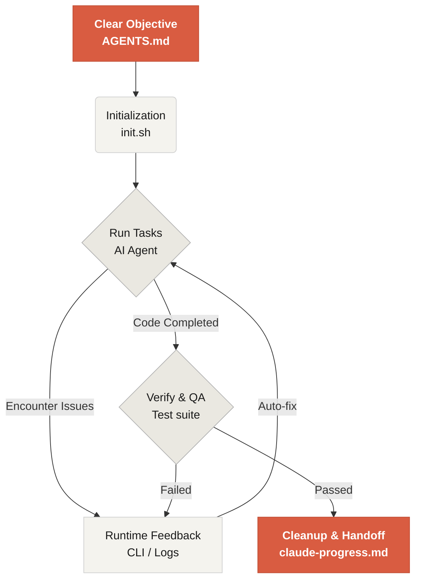

# Ласкаво просимо до Learn Harness Engineering

Learn Harness Engineering — це курс, присвячений інженерії AI-агентів для написання коду. Ми детально вивчили та синтезували найбільш передові теорії і практики Harness Engineering у галузі. Наші основні джерела:
- [OpenAI: Harness engineering: leveraging Codex in an agent-first world](https://openai.com/index/harness-engineering/)
- [Anthropic: Effective harnesses for long-running agents](https://www.anthropic.com/engineering/effective-harnesses-for-long-running-agents)
- [Anthropic: Harness design for long-running application development](https://www.anthropic.com/engineering/harness-design-long-running-apps)
- [Awesome Harness Engineering](https://github.com/walkinglabs/awesome-harness-engineering)

Через системне проектування середовища, управління станом, верифікацію та системи контролю цей курс навчає, як зробити агентні інструменти для написання коду — Codex і Claude Code — справді надійними. Він допомагає вам будувати функціонал, виправляти помилки та автоматизувати задачі розробки, обмежуючи AI-асистента чіткими правилами і межами.

## Початок роботи

Оберіть свій навчальний шлях. Курс поділено на теоретичні лекції, практичні проєкти та бібліотеку готових до використання ресурсів.

  <a href="./lectures/lecture-01-why-capable-agents-still-fail/" class="card">
    <h3>Лекції</h3>
    
Зрозумійте, чому сильні моделі все одно помиляються, і вивчіть теорію ефективних harness.

  </a>
  <a href="./projects/" class="card">
    <h3>Проєкти</h3>
    
Практика: побудуйте надійне агентне середовище з нуля.

  </a>
  <a href="./resources/" class="card">
    <h3>Бібліотека ресурсів</h3>
    
Готові шаблони (AGENTS.md, feature_list.json) для використання у власних репозиторіях.

  </a>

## Основний механізм harness

Harness не «робить модель розумнішою» — він встановлює для моделі замкнуту **робочу систему**. Основний робочий процес можна зрозуміти з цієї простої діаграми:

## Що ви вивчите

Ось деякі з ключових концепцій, якими ви оволодієте:

<ul class="index-list">
  <li><strong>Обмежуйте поведінку агента</strong> чіткими правилами і межами.</li>
  <li><strong>Підтримуйте контекст</strong> впродовж тривалих багатосесійних задач.</li>
  <li><strong>Зупиняйте агентів</strong>, що занадто рано оголошують про завершення.</li>
  <li><strong>Верифікуйте роботу</strong> за допомогою наскрізних тестів і самоаналізу.</li>
  <li><strong>Робіть runtime спостережуваним</strong> і зручним для налагодження.</li>
</ul>

## Наступні кроки

Після того як ви засвоїте базові концепції, ці матеріали допоможуть поглибити знання:

<ul class="index-list">
  <li><a href="./lectures/lecture-01-why-capable-agents-still-fail/">Лекція 01: Чому здатні агенти все одно зазнають збоїв</a>: Починайте з теорії harness engineering.</li>
  <li><a href="./projects/project-01-baseline-vs-minimal-harness/">Проєкт 01: Baseline vs Minimal Harness</a>: Виконайте свою першу реальну задачу.</li>
  <li><a href="./resources/templates/">Шаблони</a>: Візьміть мінімальний harness-пакет (AGENTS.md, feature_list.json, claude-progress.md) для власних проєктів.</li>
</ul>
