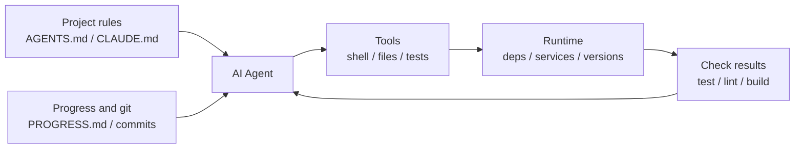

[中文版 →](../../../zh/lectures/lecture-02-what-a-harness-actually-is/)

> Приклади коду: [code/](https://github.com/walkinglabs/learn-harness-engineering/blob/main/docs/uk/lectures/lecture-02-what-a-harness-actually-is/code/)
> Практичний проєкт: [Проєкт 01. Тільки промпт проти підходу «правила перш за все»](./../../projects/project-01-baseline-vs-minimal-harness/index.md)

# Лекція 02. Що таке harness насправді

Слово "harness" часто вживається у спільноті AI-агентів для написання коду, але здебільшого, коли люди кажуть "harness", вони мають на увазі просто файл-промпт. Файл-промпт — це не harness.

У цій лекції ми дамо harness точне, прикладне визначення — не академічну абстракцію, а фреймворк, який можна застосувати вже сьогодні. Harness складається з п'яти підсистем: інструкції, інструменти, середовище, стан і зворотний зв'язок. Кожна підсистема має чіткі обов'язки та критерії оцінки.

## Почнемо з аналогії

Уявіть, що ви — новий інженер, якого кинули в проєкт без жодної документації. Нема README, нема коментарів у коді, ніхто не пояснює, як запускати тести, а конфігурація CI захована десь у глибині. Чи зможете ви писати якісний код? Можливо — якщо ви достатньо розумні й терплячі. Але ви витратите колосальну кількість часу на «розбирання, що це взагалі за проєкт», а не на «вирішення задачі».

AI-агент стикається рівно з тією ж проблемою, і навіть у гіршому становищі. Ви принаймні можете запитати колегу. Агент бачить лише ті файли, що ви поклали перед ним, і команди, які він може виконати.

OpenAI формулює ключовий принцип Harness Engineering так: «репозиторій — це специфікація». Весь необхідний контекст повинен зберігатися в репозиторії: через структуровані файли інструкцій, явні команди верифікації та чітку організацію директорій. У документації Anthropic щодо агентів для тривалих завдань наголошується на збереженні стану, явних шляхах відновлення та структурованому відстеженні прогресу. Обидві компанії акцентують на різних аспектах, але говорять про одне: **все в інженерній інфраструктурі поза вагами моделі визначає, наскільки реально реалізуються можливості моделі.**

Подивіться на кілька знайомих інструментів:

**Claude Code** уособлює підхід harness. Він читає `CLAUDE.md` з вашого репозиторію, може виконувати shell-команди, працює у вашому локальному середовищі, зберігає історію сесії й може запускати тести для перевірки результатів. Але якщо ви не скажете йому, як запускати тести, у нього не буде способу перевірити правильність зроблених змін.

**Cursor** дотримується схожої логіки. Його файл `.cursorrules` є джерелом інструкцій, термінал — інструментом, і він може читати структуру проєкту та конфігурацію лінтера. Однак управління станом у Cursor відносно слабке — закрийте IDE й відкрийте знову, і попередній контекст зникне.

**Codex** (агент OpenAI для написання коду) використовує git worktrees для ізоляції runtime-середовища кожного завдання в поєднанні з локальним стеком спостережуваності (логи, метрики, трейси), завдяки чому кожна зміна верифікується в незалежному середовищі. Він значно краще справляється в репозиторіях з `AGENTS.md` і чіткими командами верифікації, ніж у «порожніх» репозиторіях.

**AutoGPT** — це застережний приклад. Відсутність структурованого управління станом призводить до нескінченного накопичення контексту під час тривалих завдань, а відсутність точних механізмів зворотного зв'язку змушує агента зациклюватись. Багато хто каже, що AutoGPT «не працює», але насправді не працює harness.

## Ключові концепції

- **Що таке harness**: все в інженерній інфраструктурі поза вагами моделі. OpenAI зводить основну роботу інженера до трьох речей: проєктування середовищ, вираження намірів і побудова циклів зворотного зв'язку. Anthropic прямо називає свій Claude Agent SDK «harness загального призначення».
- **Репозиторій — єдине джерело правди**: все, чого агент не може побачити, для нього практично не існує. OpenAI трактує репозиторій як «систему обліку» — весь необхідний контекст повинен зберігатися там, у вигляді структурованих файлів і чіткої організації директорій.
- **Дайте карту, а не підручник**: за досвідом OpenAI, `AGENTS.md` має бути сторінкою-довідником, а не енциклопедією. Близько 100 рядків — достатньо. Якщо не вміщається — розбийте на директорію `docs/` і дозвольте агенту читати за потребою.
- **Обмежуйте, а не мікроменеджьте**: хороший harness використовує виконувані правила для обмеження агента, а не перераховує інструкції по одній. OpenAI каже: «дотримуйтесь інваріантів, не мікроменеджьте реалізацію»; Anthropic виявив, що агенти впевнено хвалять власну роботу, і рішення — розділити «того, хто виконує роботу» і «того, хто перевіряє роботу».
- **Вилучайте по одному та спостерігайте**: щоб кількісно оцінити граничний внесок кожного компонента harness, вилучайте їх по одному та дивіться, яке вилучення спричиняє найбільше падіння продуктивності. Це показує, які компоненти зараз найцінніші, і водночас виявляє ті, що поки не дають реального внеску. Anthropic використав цей метод і виявив: в міру посилення моделей деякі компоненти перестають бути критичними, але завжди виникають нові критичні компоненти.

## П'ятикомпонентна модель harness

Повернімося до аналогії. Harness має п'ять підсистем:



**Підсистема інструкцій**: створіть `AGENTS.md` (або `CLAUDE.md`), що містить огляд і мету проєкту, технологічний стек і версії, команди для першого запуску, жорсткі обмеження, які не підлягають обговоренню, і посилання на детальнішу документацію.

**Підсистема інструментів**: забезпечте агенту достатній доступ до інструментів. Не вимикайте shell «з міркувань безпеки» — якщо агент не може навіть виконати `pip install`, як він взагалі щось зробить? Але й не відкривайте все підряд — дотримуйтесь принципу найменших привілеїв.

**Підсистема середовища**: зробіть стан середовища самоописовим. Використовуйте `pyproject.toml` або `package.json` для фіксації залежностей, `.nvmrc` або `.python-version` — для вказівки версій runtime, Docker або devcontainers — для відтворюваності середовища.

**Підсистема стану**: тривалі завдання мають відстежувати прогрес. Використовуйте простий файл `PROGRESS.md`, де записано: що зроблено, що в процесі, що заблоковано. Оновлюйте перед завершенням кожної сесії; читайте на початку наступної.

**Підсистема зворотного зв'язку**: це підсистема з найвищим ROI. Явно перелічіть команди верифікації в `AGENTS.md`:
```
Verification commands:
- Tests: pytest tests/ -x
- Type check: mypy src/ --strict
- Lint: ruff check src/
- Full verification: make check (includes all above)
```

Відсутність будь-якої з п'яти підсистем означає неповний harness, і агент завжди буде «незручним» у використанні.

**Кількісна оцінка цінності компонентів harness**: використовуйте «тест контрольованого вилучення змінних». Тримайте модель незмінною, вилучайте п'ять підсистем по одній і дивіться, яке вилучення спричиняє найбільше падіння продуктивності. Компонент із найбільшим падінням має найвищий граничний внесок для поточного завдання і заслуговує на пріоритетну увагу. Чи варто його посилювати — залежить від атрибуції відмов, а не лише від розміру падіння. Компоненти з майже нульовим впливом не слід відкидати одразу: вони можуть бути надлишковими, погано спроєктованими або просто незадіяними в поточному завданні. Цей експеримент відповідає на питання «який компонент зараз найцінніший» — але не може сам по собі довести «де знаходиться вузьке місце». Щоб справді локалізувати вузьке місце, потрібно спочатку проаналізувати записи відмов і їхню атрибуцію: задача була незрозумілою, контексту не вистачало, середовище не відтворювалося, зворотний зв'язок верифікації був відсутній чи управління станом не працювало? Результати абляції компонентів можуть слугувати лише підтверджуючими доказами.

## Реальна історія команди

Команда використовувала GPT-4o для розробки TypeScript + React фронтенд-застосунку (~20 000 рядків коду). Вони пройшли чотири етапи, які по суті були послідовним додаванням компонентів harness:

**Етап 1**: лише базовий опис проєкту в README. 1 з 5 запусків завершувався успіхом (20%). Основні відмови: неправильний менеджер пакетів (npm vs yarn), недотримання конвенцій іменування компонентів, неможливість запустити тести.

**Етап 2**: додали `AGENTS.md` із версіями технологічного стеку, конвенціями іменування та ключовими архітектурними рішеннями. Відсоток успіху зріс до 60%. Відмови, що залишилися, були переважно пов'язані з проблемами середовища та відсутністю верифікації.

**Етап 3**: перелічили команди верифікації в `AGENTS.md`: `yarn test && yarn lint && yarn build`. Відсоток успіху зріс до 80%.

**Етап 4**: запровадили шаблони файлів прогресу, де агент записував виконану та невиконану роботу в кожному запуску. Відсоток успіху стабілізувався на рівні 80–100%.

Чотири ітерації, модель жодного разу не змінювалась, а відсоток успіху зріс з 20% до майже 100%. Ви не перейшли на кращу модель — змінився harness.

## Ключові висновки

- Harness = Інструкції + Інструменти + Середовище + Стан + Зворотний зв'язок. Усі п'ять підсистем обов'язкові.
- Якщо це не ваги моделі — це harness. Ваш harness визначає, наскільки реально реалізуються можливості моделі.
- Серед п'яти підсистем підсистема зворотного зв'язку зазвичай потребує найменших вкладень і дає найбільшу віддачу. Насамперед налаштуйте команди верифікації.
- Використовуйте «тест контрольованого вилучення змінних» для кількісної оцінки граничного внеску кожної підсистеми; для локалізації реального вузького місця спирайтеся на записи відмов і атрибуцію, а не лише на абляцію.
- Harness застаріває, як і код. Регулярно проводьте аудит і виплачуйте «технічний борг harness» так само, як виплачуєте технічний борг.

## Додаткове читання

- [OpenAI: Harness Engineering](https://openai.com/index/harness-engineering/)
- [Anthropic: Effective Harnesses for Long-Running Agents](https://www.anthropic.com/engineering/effective-harnesses-for-long-running-agents)
- [HumanLayer: Harness Engineering for Coding Agents](https://www.humanlayer.dev/blog/skill-issue-harness-engineering-for-coding-agents)
- [SWE-agent: Agent-Computer Interfaces](https://github.com/princeton-nlp/SWE-agent)
- [Thoughtworks: Harness Engineering on Technology Radar](https://www.thoughtworks.com/radar)

## Вправи

1. **Аудит harness за п'ятьма компонентами**: візьміть проєкт, де ви зараз використовуєте AI-агента, і проведіть повний аудит за п'ятикомпонентним фреймворком. Оцініть кожну підсистему від 1 до 5. Знайдіть підсистему з найнижчою оцінкою, витратьте 30 хвилин на її покращення, а потім спостерігайте за зміною продуктивності агента.

2. **Тест контрольованого вилучення змінних**: виберіть одну модель і одне складне завдання. Послідовно вилучайте: інструкції (видаліть AGENTS.md), зворотний зв'язок (не надавайте команди верифікації), стан (ніяких файлів прогресу) — вилучаючи лише по одному за раз і вимірюючи падіння продуктивності. Використайте результати для ранжування граничної цінності кожної підсистеми для поточного завдання. Якщо хочете знайти вузьке місце, під час абляції також записуйте логи відмов і проводьте атрибуцію першопричин.

3. **Аналіз можливостей**: знайдіть у вашому проєкті сценарій, де агент «хоче щось зробити, але не може» (наприклад, знає, що треба використовувати параметризовані запити, але не знає патернів вашого ORM). Проаналізуйте, чи це «прогалина виконання» (не знає, як діяти) чи «прогалина оцінки» (не знає, чи зробив правильно), а потім спроєктуйте покращення harness для усунення цієї прогалини.
