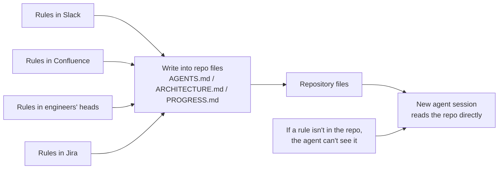
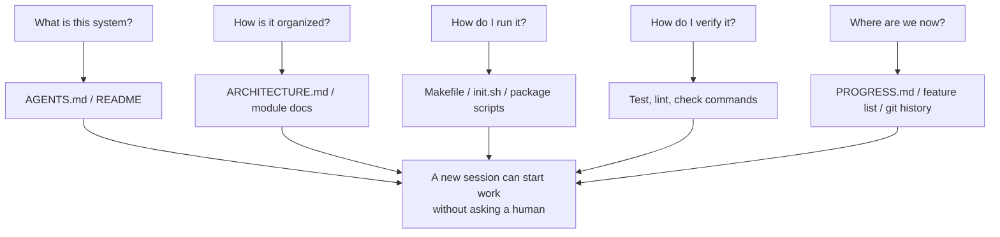

[中文版 →](../../../zh/lectures/lecture-03-why-the-repository-must-become-the-system-of-record/)

> Приклади коду: [code/](https://github.com/walkinglabs/learn-harness-engineering/blob/main/docs/uk/lectures/lecture-03-why-the-repository-must-become-the-system-of-record/code/)
> Практичний проєкт: [Проєкт 02. Зробити так, щоб агент читав проєкт і продовжував з того місця, де зупинився](./../../projects/project-02-agent-readable-workspace/index.md)

# Лекція 03. Чому репозиторій має стати єдиним джерелом правди

Архітектурні рішення вашої команди розкидані між Confluence, Slack, Jira і кількома головами старших інженерів. Для людей це якось працює — можна запитати колегу, знайти щось у логах чату, покопатися в документації, а якщо нічого не допомогло — зловити когось у перерві. Але для AI-агента інформація, якої немає в репозиторії, просто не існує.

Це не перебільшення. Агент має лише три джерела вхідних даних: системні промпти і описи завдань, вміст файлів з репозиторію та результати виконання інструментів. Ваша історія Slack, тікети Jira, сторінки Confluence і архітектурне рішення, яке ви обговорили з колегою в п'ятницю після обіду, — агент нічого з цього не бачить. Він не може «піти запитати когось» чи «знайти в логах чату». Весь його робочий світ — це сам репозиторій. Про все, що за його межами, він не знає нічого.

Тож справжнє питання звучить так: ви збираєтесь дати йому достатньо хорошу карту?

## Що має бути на карті

OpenAI прямо формулює це у своїй статті про Harness Engineering: **інформація, якої немає в репозиторії, для агента не існує.** Вони називають це принципом «репозиторій як специфікація» — репозиторій є документом-специфікацією найвищого авторитету.

Документація Anthropic щодо агентів для тривалих завдань перегукується з цим: збереження стану — необхідна умова безперервності довгих завдань, а можливість відновлення знань між сесіями безпосередньо визначає відсоток успішного виконання завдань. І цей стан повинен знаходитись у репозиторії — адже це єдине стабільне, надійно доступне сховище, яке має агент.

Ви можете подумати: «Наша команда невелика, знання живуть у головах у всіх, і це нормально працює». Цілком вірно — для людей. Але якщо ви хочете використовувати агента, доведеться прийняти один факт: агент не може запитати людей. Все, що йому потрібно знати, має бути записано і покладено туди, де він це знайде.

Це не проблема «писати більше документації» — це проблема «покласти інформацію про рішення в правильне місце». `ARCHITECTURE.md` на 50 рядків у директорії `src/api/` набагато кориснішій, ніж 500-сторінковий проєктний документ у Confluence, який ніхто не підтримує. Близькість важливіша за обсяг, адже інформація по-справжньому корисна лише тоді, коли вона під рукою саме в той момент, коли потрібна.

## Видимість знань



Як перевірити, чи достатньо хороша ваша карта? Проведіть «тест нової сесії»: відкрийте абсолютно нову сесію агента, надайте йому лише вміст репозиторію і подивіться, чи зможе він відповісти на п'ять базових питань.



Якщо не може — на карті є білі плями. Де карта порожня, агент змушений вгадувати — неправильні здогадки стають помилками, надмірне вгадування витрачає контекст. І кожна нова сесія мусить вгадувати знову й знову. Ціна вгадування завжди набагато вища, ніж ціна правильного складання карти від початку.

## Ключові концепції

- **Прогалина видимості знань**: частка загальних знань про проєкт, яка НЕ знаходиться в репозиторії. Чим більша прогалина, тим вищий відсоток відмов агента. Оцінити її можна так: порахуйте всі неявні знання про проєкт, що живуть у головах людей, а потім подивіться, яка їх частина справді потрапила до репозиторію. Різниця і є вашою прогалиною видимості.
- **Система обліку**: репозиторій коду як авторитетне джерело для рішень проєкту, архітектурних обмежень, стану виконання та стандартів верифікації. Репозиторій має останнє слово — більше нічого не рахується. Якщо інформація «ця дорога закрита» живе лише в голові в Іваненка, то кожного разу доведеться питати Іваненка. Запишіть у репозиторій — і питати більше нікому не доведеться.
- **Тест нової сесії**: п'ять питань із попереднього розділу. Скільки з них агент може відповісти — настільки повна ваша карта.
- **Вартість виявлення**: скільки бюджету контексту агент витрачає на пошук одного ключового фрагмента інформації в репозиторії. Чим прихованіша інформація, тим вища вартість виявлення і тим менше бюджету залишається на саме завдання. Критичну інформацію слід розміщувати там, де агент побачить її першою — а не ховати на десять рівнів директорій углиб.
- **Швидкість застарівання знань**: частка записів знань у репозиторії, що втрачають актуальність за одиницю часу. Документація, що розходиться з кодом, — найбільший ворог: застаріла документація гірша, ніж жодна документація взагалі.
- **Аналогія ACID**: застосування принципів транзакцій бази даних (атомарність, узгодженість, ізольованість, стійкість) до управління станом агента. Розкриємо це нижче.

## Як намалювати хорошу карту

**Принцип 1: Знання живуть поряд з кодом.** Правило про автентифікацію API-ендпоінтів належить поруч з кодом API, а не захованим у величезному глобальному документі. Розмістіть короткий документ у кожній директорії модуля, що пояснює відповідальність, інтерфейси та особливі обмеження цього модуля. Сама директорія модуля є природним індексом — коли агент дістається до коду, він одразу дістається й до обмежень, без жодного пошуку.

**Принцип 2: Використовуйте стандартизований вхідний файл.** `AGENTS.md` (або `CLAUDE.md`) — це «посадкова сторінка» агента. Він не зобов'язаний містити всю інформацію, але повинен дозволяти агенту швидко відповісти на три питання: «Що це за проєкт», «Як його запустити» і «Як його верифікувати». 50–100 рядків — достатньо.

**Принцип 3: Мінімально, але повно.** Кожен фрагмент знань повинен мати чіткий сценарій використання. Якщо вилучення правила не впливає на якість рішень агента, цього правила не повинно існувати. Але на кожне питання з тесту нової сесії має бути відповідь. Це постійний баланс, який треба підтримувати — не занадто багато, не занадто мало, рівно стільки, скільки потрібно.

**Принцип 4: Оновлюйте разом з кодом.** Прив'яжіть оновлення знань до змін коду. Найпростіший підхід: розміщуйте документацію по архітектурі у відповідній директорії модуля. Коли ви змінюєте код, ви природно помічаєте документ. Після змін коду CI може нагадати вам перевірити, чи потрібно оновлювати документи.

**Конкретна структура репозиторію**:

```
project/
├── AGENTS.md              # Entry: project overview, run commands, hard constraints
├── src/
│   ├── api/
│   │   ├── ARCHITECTURE.md  # API layer architecture decisions
│   │   └── ...
│   ├── db/
│   │   ├── CONSTRAINTS.md   # Database operation hard constraints
│   │   └── ...
│   └── ...
├── PROGRESS.md             # Current progress: done, in-progress, blocked
└── Makefile                # Standardized commands: setup, test, lint, check
```

## Управління станом агента за принципами ACID

Ця аналогія походить з управління транзакціями баз даних. Може здатися, що це надмірне ускладнення, але насправді вона дає дуже практичний фреймворк:

- **Атомарність**: кожна «логічна операція» (наприклад, «додати новий ендпоінт і оновити тести») отримує один git-коміт. Якщо щось пішло не так посередині — `git stash` для відкату. Або все, або нічого — ніяких «наполовину зроблено».
- **Узгодженість**: визначте предикати верифікації «узгодженого стану» — всі тести проходять, лінтер не повідомляє про помилки. Агент запускає верифікацію після кожної операції; неузгоджені проміжні стани не повинні комітитися. Після операції система має перебувати у верифіковано правильному стані.
- **Ізольованість**: коли кілька агентів працюють паралельно, проєктуйте файли стану так, щоб уникнути конфліктів. Простий підхід: кожен агент використовує власний файл прогресу, або використовуйте git-гілки для ізоляції. Паралельний запис у один і той самий файл — типове джерело проблем.
- **Стійкість**: критичні знання проєкту зберігаються у відстежуваних git-файлах. Тимчасовий стан може залишатися в пам'яті сесії, але знання, що мають переживати між сесіями, необхідно записувати у файли. Те, що у вас в голові, не рахується — рахується лише те, що записано.

## Реальна історія перетворення

Команда підтримувала платформу електронної комерції приблизно з 30 мікросервісами. Архітектурні рішення — протоколи міжсервісної комунікації, стратегії узгодженості даних, правила версіонування API — були розкидані по: Confluence (частково застарілий), Slack (важко шукати), кільком головам старших інженерів (не масштабується) та уривчастим коментарям у коді (несистемно).

Після впровадження AI-агентів 70% завдань вимагали втручання людини. Майже кожна відмова була пов'язана з тим, що агент порушував якесь неявне обмеження — те, що «всі знають, але ніхто ніколи не записав». Агент не міг знати, чого він не знає — він міг лише діяти за власним розумінням і потрапляти в пастку.

Команда провела перетворення:
1. Створили `AGENTS.md` у корені репозиторію з оглядом проєкту, версіями технологічного стеку та глобальними жорсткими обмеженнями
2. Додали `ARCHITECTURE.md` у директорію кожного мікросервісу, що описує відповідальність, інтерфейси та залежності цього сервісу
3. Створили централізований `CONSTRAINTS.md`, використовуючи явні формулювання «MUST / MUST NOT» для жорстких обмежень
4. Додали `PROGRESS.md` у директорію кожного сервісу для відстеження поточного робочого статусу

Після перетворення: той самий агент у новій сесії міг відповісти на всі ключові питання проєкту, а якість виконання завдань суттєво покращилася.

## Ключові висновки

- Знання, яких немає в репозиторії, для агента не існує. Перенесення критичної інформації про рішення до репозиторію — найфундаментальніша інвестиція в harness: намалюйте хорошу карту, щоб не заблукати.
- Використовуйте «тест нової сесії» для оцінки якості репозиторію: чи може абсолютно нова сесія відповісти на п'ять базових питань, використовуючи лише вміст репозиторію?
- Знання повинні бути поряд з кодом, мінімальними але повними, і оновлюватися разом з кодом. Справа не в написанні більше документів — а в розміщенні інформації в правильному місці.
- Застосовуйте принципи ACID до стану агента: атомарні коміти, верифікація узгодженості, ізоляція паралелізму та стійкість критичних знань.
- Застарівання знань — найбільший ворог. Застаріла документація небезпечніша, ніж жодна документація — вона веде агента в хибному напрямку, поки агент думає, що на правильному шляху.

## Додаткове читання

- [OpenAI: Harness Engineering](https://openai.com/index/harness-engineering/)
- [Anthropic: Effective Harnesses for Long-Running Agents](https://www.anthropic.com/engineering/effective-harnesses-for-long-running-agents)
- [Infrastructure as Code — Martin Fowler](https://martinfowler.com/bliki/InfrastructureAsCode.html)
- [ADR: Architecture Decision Records](https://adr.github.io/)
- [The Twelve-Factor App](https://12factor.net/)

## Вправи

1. **Тест нової сесії**: відкрийте абсолютно нову сесію агента у вашому проєкті (не надавайте жодного усного контексту), дозвольте бачити лише вміст репозиторію, а потім поставте п'ять питань: Що це за система? Як вона організована? Як її запустити? Як її верифікувати? Який поточний прогрес? Запишіть, на що не може відповісти, а потім покращуйте репозиторій, поки він не відповість на всі питання.

2. **Кількісна оцінка екстерналізації знань**: перелічіть всі рішення та обмеження, важливі для розробки вашого проєкту. Позначте кожен пункт як «в репозиторії» або «поза репозиторієм». Порахуйте прогалину видимості знань (частку пунктів поза репозиторієм). Складіть план для зменшення прогалини нижче 10%.

3. **Оцінка за ACID**: оцініть управління станом вашого проєкту за допомогою аналогії ACID з цієї лекції. Атомарність — чи можна чисто відкотити операції агента? Узгодженість — чи є у репозиторії верифікація «узгодженого стану»? Ізольованість — чи заважають одне одному кілька паралельних агентів? Стійкість — чи правильно збережені всі міжсесійні знання?
