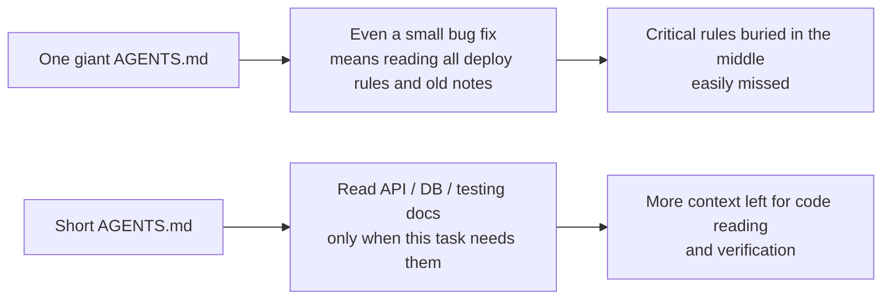
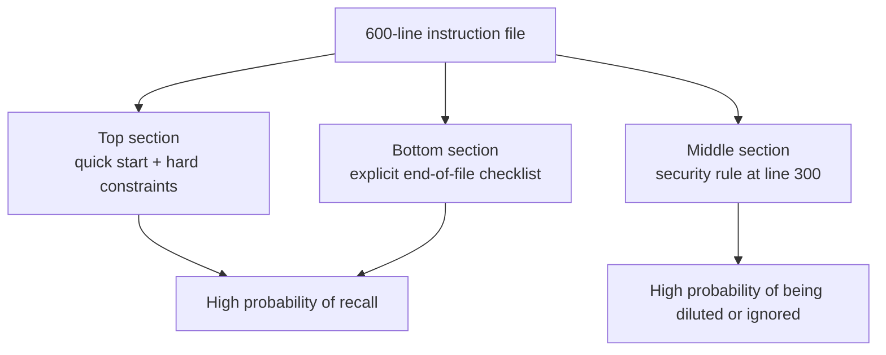

[中文版 →](../../../zh/lectures/lecture-04-why-one-giant-instruction-file-fails/)

> Приклади коду: [code/](https://github.com/walkinglabs/learn-harness-engineering/blob/main/docs/uk/lectures/lecture-04-why-one-giant-instruction-file-fails/code/)
> Практичний проєкт: [Проєкт 02. Робочий простір, зручний для агента](./../../projects/project-02-agent-readable-workspace/index.md)

# Лекція 04. Розподіліть інструкції між файлами

Ви почали серйозно займатися harness engineering — чудово. Ви створили `AGENTS.md` і вклали туди кожне правило, обмеження та засвоєний урок, про який тільки могли подумати. Через місяць файл розрісся до 300 рядків, через два — до 450, через три — до 600. І тут ви помічаєте, що продуктивність агента насправді погіршується: під час простого виправлення помилки агент витрачає величезну кількість контексту на обробку інструкцій щодо розгортання, які не мають жодного відношення до задачі; критичне обмеження безпеки, заховане на рядку 300, ігнорується взагалі; три суперечливі правила стилю коду змушують агента щоразу вибирати одне навмання.

Це пастка «гігантського файлу інструкцій». Все здається корисним, тому ви все туди запихаєте, а знайти конкретне правило означає перегортати весь файл. Ви написали 600 рядків, але лише третина з них стосується поточної задачі.

## Порочне коло в основі проблеми

Найпоширеніше порочне коло виглядає так: агент робить помилку, ви кажете «додай правило, щоб це не повторювалось», додаєте його до AGENTS.md, і це спрацьовує — тимчасово. Потім агент робить іншу помилку, і ви додаєте ще одне правило. Повторюйте, поки файл не вийде з-під контролю.

Це цілком природна реакція. «Додати правило» щоразу, коли щось іде не так, здається розумним. Але кумулятивний ефект катастрофічний. Розгляньмо детально, що саме йде не так.

**Контекстний бюджет з'їдається живцем.** Контекстне вікно агента обмежене. Припустимо, ваш агент має вікно на 200K токенів (стандарт Claude). Роздутий файл інструкцій може споживати 10–20K токенів. Здається, запасу ще достатньо? Але складна задача може потребувати читання десятків вихідних файлів, результати виконання інструментів також займають контекст, а історія розмови постійно накопичується. До того часу, коли агент справді мусить розуміти код, бюджет вже вичерпано.

**Загублений у середині.** Стаття «Lost in the Middle» (Liu et al., 2023) чітко продемонструвала, що LLM значно гірше використовують інформацію в середині довгих текстів, ніж на початку або в кінці. Ваш AGENTS.md налічує 600 рядків, і на рядку 300 написано «всі запити до бази даних мають використовувати параметризовані запити» — це жорстке обмеження безпеки. Але воно заховане в середині, і агент майже напевно його проігнорує.

**Конфлікти пріоритетів.** Файл змішує безперечні жорсткі обмеження («ніколи не використовуй eval()»), важливі проєктні настанови («перевагу надавай функціональному стилю») та конкретний histórico урок («минулого тижня виправили витік пам'яті у WebSocket, стеж за подібними патернами»). Ці три правила мають абсолютно різний рівень важливості, але у файлі вони виглядають однаково. Агент не має надійного сигналу, щоб відрізнити червону лінію від простої рекомендації.

**Деградація підтримки.** Великі файли за своєю природою важко підтримувати. Застарілі інструкції рідко видаляють, бо наслідки видалення невизначені («може, щось інше залежить від цього правила?»), але додавати нові інструкції здається безкоштовним. Результат: файл лише росте, ніколи не зменшується, і відношення сигналу до шуму неухильно падає. Це та сама проблема, що й накопичення технічного боргу в програмному забезпеченні.

**Накопичення суперечностей.** Інструкції, додані в різний час, починають суперечити одна одній — одна каже «використовуй TypeScript strict mode», інша — «деякі legacy-файли можуть використовувати `any`». Агент щоразу вибирає щось одне навмання.

## Ключові концепції

- **Роздуття інструкцій (Instruction Bloat)**: коли файл інструкцій займає 10–15% контекстного вікна, він починає витісняти бюджет для читання коду та міркування над задачею. `AGENTS.md` на 600 рядків може споживати 10 000–20 000 токенів — це 8–15% вікна на 128K.
- **Загублений у середині (Lost in the Middle)**: інформація в середині довгих текстів легко залишається непоміченою. Дослідження Liu et al. 2023 року показало, що LLM значно гірше використовують інформацію в середині довгих текстів, ніж на початку або в кінці. Критичне обмеження, заховане на рядку 300 з 600, має дуже високу ймовірність бути проігнорованим.
- **Відношення сигналу до шуму в інструкціях (SNR)**: частка інструкцій у файлі, що стосуються поточної задачі. Бути змушеним читати 50 рядків інструкцій щодо розгортання під час виправлення помилки — це низький SNR.
- **Вхідний файл (Entry File)**: короткий файл, призначення якого — направляти агента до детальнішої документації, а не містити все самому. 50–200 рядків достатньо.
- **Розкриття на вимогу (Reveal on Demand)**: спочатку загальна інформація, детальна — коли потрібна. Хороший дизайн harness — як хороший UI-дизайн: не вивалюй всі опції на користувача одразу.
- **Неможливість визначити важливість (Can't Tell What Matters)**: коли всі інструкції представлені в однаковому форматі та в одному місці, агент не може відрізнити обов'язкові жорсткі обмеження від рекомендаційних м'яких настанов.

## Архітектура інструкцій





## Як розбити файл

Основний принцип: тримайте часто потрібну інформацію під рукою, прибирайте інколи потрібну і не носіть те, що ніколи не знадобиться.

Вхідний файл `AGENTS.md` залишається в межах 50–200 рядків і містить лише найважливіше: огляд проєкту (одне-два речення, що одразу дають зрозуміти, що це таке), команди першого запуску (`make setup && make test`), глобальні жорсткі обмеження (не більше 15 безперечних правил) і посилання на тематичні документи (однорядковий опис та умова застосування).

```markdown
# AGENTS.md

## Project Overview
Python 3.11 FastAPI backend, PostgreSQL 15 database.

## Quick Start
- Install: `make setup`
- Test: `make test`
- Full verification: `make check`

## Hard Constraints
- All APIs must use OAuth 2.0 authentication
- All database queries must use SQLAlchemy 2.0 syntax
- All PRs must pass pytest + mypy --strict + ruff check

## Topic Docs
- API Design Patterns (`docs/api-patterns.md`) — Required reading when adding endpoints
- Database Rules (`docs/database-rules.md`) — Required when modifying database operations
- Testing Standards (`docs/testing-standards.md`) — Reference when writing tests
```

Кожен тематичний документ — 50–150 рядків, організований за темою в директорії `docs/` або поруч із відповідним модулем. Агент читає їх лише тоді, коли потрібно. Думайте про це як про органайзери для валізи: спідня білизна в одному відсіку, засоби гігієни в іншому, зарядні пристрої в третьому. Знайти потрібне не означає висипати всю валізу.

Деяку інформацію краще розмістити безпосередньо в коді — визначення типів, коментарі до інтерфейсів, пояснення в конфігураційних файлах. Агент природно бачить їх при читанні коду, тому дублювати їх в інструкціях не потрібно.

Кожна інструкція повинна документувати своє джерело («чому це правило було додано?»), умову застосування («коли це правило потрібне?») і умову вилучення («за яких обставин це правило можна видалити?»). Регулярно проводьте аудит і видаляйте застарілі, надлишкові або суперечливі записи. Керуйте своїми інструкціями так, як ви керуєте залежностями коду — невикористані залежності слід видаляти, інакше вони лише сповільнюють систему.

Якщо інструкцію абсолютно необхідно залишити у вхідному файлі, розмістіть її на початку або в кінці, але ніколи — в середині. Ефект «загубленого в середині» говорить нам, що LLM значно краще використовують інформацію на краях довгого тексту, ніж у центрі. Але кращий підхід — перенести інструкції в тематичні документи для завантаження на вимогу.

Як OpenAI, так і Anthropic неявно підтримують цей підхід із розбиттям. OpenAI каже, що вхідні файли мають бути «короткими і орієнтованими на маршрутизацію», тоді як Anthropic каже, що керуюча інформація для агентів із тривалим виконанням має бути «стислою та пріоритетною». Обидві компанії кажуть одне й те саме: не запихайте все в один файл.

## Приклад із реального проєкту

`AGENTS.md` команди SaaS-продукту розрісся з 50 рядків до 600. Вміст перемішував версії технологічного стеку, стандарти кодування, нотатки про виправлення минулих помилок, посібники з використання API, процедури розгортання та особисті переваги членів команди — все було там, але знайти частину, що стосується поточної задачі, було важко.

Продуктивність агента почала помітно знижуватись: під час простих виправлень помилок агент витрачав значний контекст на обробку не пов'язаних із задачею інструкцій щодо розгортання; обмеження безпеки «всі запити до бази даних мають використовувати параметризовані запити» було заховане на рядку 300 і часто ігнорувалось; три суперечливі правила стилю коду змушували агента вибирати одне навмання.

Команда провела рефакторинг із розбиттям:
1. `AGENTS.md` скорочено до 80 рядків: лише огляд проєкту, команди запуску та 15 глобальних жорстких обмежень
2. Створено тематичні документи: `docs/api-patterns.md` (120 рядків), `docs/database-rules.md` (60 рядків), `docs/testing-standards.md` (80 рядків)
3. У вхідному файлі додано посилання на тематичні документи
4. Історичні нотатки або перетворено на тест-кейси, або видалено повністю

Після рефакторингу: відсоток успіху на тому самому наборі задач зріс із 45% до 72%. Дотримання обмежень безпеки підвищилось із 60% до 95%, оскільки правило перемістилося з середини файлу на початок вхідного файлу — більше не «загублене в середині».

## Головне

- «Додати правило» — короткострокове полегшення і довгострокова отрута. Перед додаванням будь-якого правила подумайте, чи не краще воно вписується в тематичний документ.
- Вхідний файл — це маршрутизатор, а не енциклопедія. 50–200 рядків — лише огляд, жорсткі обмеження та посилання.
- Використовуйте ефект «загубленого в середині»: розміщуйте важливу інформацію на початку або в кінці, а менш критичні пункти переносьте в тематичні документи.
- Керуйте роздуттям інструкцій так само, як технічним боргом. Регулярний аудит, і кожна інструкція повинна мати джерело, умову застосування та умову вилучення.
- Після розбиття SNR покращується, і агент витрачає більше контекстного бюджету на реальну задачу, а не на обробку нерелевантних інструкцій.

## Додаткові матеріали

- [OpenAI: Harness Engineering](https://openai.com/index/harness-engineering/)
- [Anthropic: Effective Harnesses for Long-Running Agents](https://www.anthropic.com/engineering/effective-harnesses-for-long-running-agents)
- [Lost in the Middle: How Language Models Use Long Contexts](https://arxiv.org/abs/2307.03172)
- [HumanLayer: Harness Engineering for Coding Agents](https://humanlayer.dev/articles/harness-engineering-for-coding-agents/)
- [Nielsen Norman Group: Progressive Disclosure](https://www.nngroup.com/articles/progressive-disclosure/)

## Вправи

1. **Аудит SNR**: Візьміть свій поточний вхідний файл інструкцій і перелічіть усі записи. Виберіть 5 різних поширених типів задач і позначте, чи є кожна інструкція релевантною для цієї задачі. Обчисліть SNR для кожного типу задач. Інструкції, що є шумом для більшості задач, слід перенести до тематичних документів.

2. **Рефакторинг «розкриття на вимогу»**: Якщо у вас є файл інструкцій понад 300 рядків, розбийте його на: (а) вхідний файл до 100 рядків, (б) 3–5 тематичних документів. Запустіть той самий набір задач (не менше 5) до і після рефакторингу та порівняйте відсоток успіху.

3. **Перевірка «загубленого в середині»**: У довгому файлі інструкцій розмістіть критичне обмеження відповідно на початку, в середині та в кінці, щоразу запускаючи той самий набір задач (не менше 5 запусків на позицію). Подивіться, чи є різниця у відсотку дотримання. Ефект позиції може вас здивувати.
