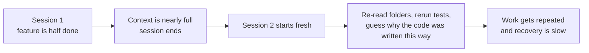
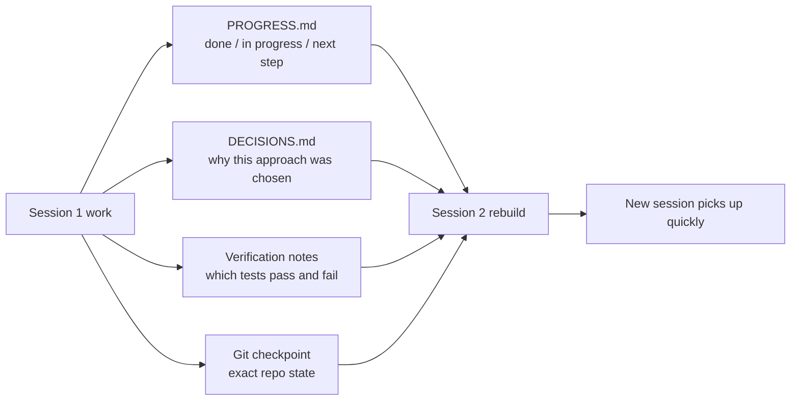

[中文版 →](../../../zh/lectures/lecture-05-why-long-running-tasks-lose-continuity/)

> Приклади коду: [code/](https://github.com/walkinglabs/learn-harness-engineering/blob/main/docs/uk/lectures/lecture-05-why-long-running-tasks-lose-continuity/code/)
> Практичний проєкт: [Проєкт 03. Наступність між сесіями](./../../projects/project-03-multi-session-continuity/index.md)

# Лекція 05. Збереження контексту між сесіями

Ви просите Claude Code реалізувати повноцінну функцію. Він працює 30 хвилин, виконує більшу частину роботи, але контекст добігає кінця. Ви починаєте нову сесію, щоб продовжити — і виявляєте, що він не пам'ятає, які рішення були прийняті минулого разу, чому варіант А був відхилений на користь варіанта Б, які файли вже були змінені та в якому стані перебувають тести. Він витрачає 15 хвилин на повторне дослідження проєкту і може обрати підхід, несумісний із попереднім.

Це реальна дилема, з якою стикаються AI-агенти для написання коду при міжсесійних задачах. У цій лекції пояснюється, чому агенти «втрачають нитку» під час тривалих задач і як структуроване збереження стану дозволяє новій сесії швидко продовжити роботу з того місця, де зупинилась попередня.

## Контекстні вікна: не нескінченні

Контекстні вікна обмежені. Це не та проблема, яку вирішать оновлення моделей — навіть якщо розміри вікон виростуть до 1M токенів, складні задачі все одно їх вичерпуватимуть. Агенти не просто генерують код: вони розуміють кодові бази, відстежують власну історію рішень, обробляють вивід інструментів і підтримують контекст розмови. Вся ця інформація зростає швидше, ніж розширюється вікно.

Глибша проблема: інформація, яку продукують агенти, не є рівномірно важливою. Проміжні кроки міркування містять «чому» рішень — чому обрано варіант А замість Б, чому ця бібліотека, а не та, чому певна оптимізація була пропущена. Кінцевий результат містить лише «що» — сам код. Стратегії компресії зазвичай зберігають останнє, але втрачають перше. Наступна сесія бачить код, але не знає, чому він написаний саме так, і може «оптимізувати» навмисне проєктне рішення.

Anthropic помітила щось цікаве у своїх дослідженнях агентів із тривалим виконанням: коли агенти відчувають, що контекст закінчується, вони виявляють поведінку «поспішного завершення» — намагаються завершити поточну роботу, пропускаючи кроки верифікації або обираючи просте рішення замість оптимального. Anthropic називає це «контекстною тривогою» (context anxiety).

## Потік збереження наступності між сесіями

Без файлів збереження стану кожна нова сесія змушена починати з нуля:



З файлами збереження стану нові сесії можуть швидко продовжити роботу:



## Ключові концепції

- **Контекстні вікна обмежені**: незалежно від заявленого розміру вікна (128K, 200K, 1M), тривалі задачі врешті-решт їх вичерпають. Після вичерпання потрібна або компресія (втрата інформації), або скидання контексту (початок нової сесії) — обидва варіанти щось втрачають.
- **Файли збереження стану (State persistence files)**: файли зі збереженим станом, що дозволяють новій сесії однозначно продовжити роботу з того місця, де зупинилась попередня. Найпростіша форма включає журнали прогресу, записи верифікації та наступні дії.
- **Вартість відновлення (Rebuild cost)**: час, необхідний новій сесії для досягнення виконуваного стану. Хороший harness може скоротити вартість відновлення з 15 хвилин до 3 хвилин.
- **Дрейф (Drift)**: розрив між розумінням агента та реальним станом репозиторію коду. Кожна межа між сесіями вносить дрейф; без контролю він накопичується від сесії до сесії.
- **Контекстна тривога (Context anxiety)**: явище, зафіксоване Anthropic, — агенти виявляють поведінку поспішного завершення, коли наближаються до меж контексту, дочасно завершуючи задачі, щоб уникнути втрати інформації. По суті, це ірраціональна тривога через ресурси.
- **Компресія проти скидання (Compaction vs. reset)**: компресія підсумовує контекст у межах тієї самої сесії (зберігає «що», може втратити «чому»); скидання відкриває нову сесію, відбудовуючись із збережених артефактів (чистий стан, але залежить від повноти артефактів).

## Що відбувається, коли наступність переривається

Попередня сесія витратила значний контекстний бюджет на аналіз трьох підходів і вибір варіанта Б. Агент у цій сесії нічого не знає про той аналіз і може переприйняти рішення на основі неповної інформації — потенційно обравши варіант А. Та сама інформація, різний висновок, тому що контекст прийняття рішення зник.

Ще гірше — дублювання роботи. Агент не впевнений, чи певна робота вже була виконана, і робить її знову. Або, що гірше, виконує половину, виявляє конфлікт із наявною реалізацією і змушений переробляти. Без записів прогресу нова сесія не знає, що вже зроблено.

Протягом кількох сесій напрямок реалізації може непомітно відхилитися від початкових вимог. Кожна нова сесія має дещо інше розуміння цілей проєкту. Кожне відхилення накладається на попереднє, і кінцевий результат може бути далеким від початкового задуму.

Є також прогалина верифікації. Результати верифікації попередньої сесії (які тести проходять, які ні, чому вони не проходять) не були записані. Нова сесія змушена повторно запускати всю верифікацію, щоб зрозуміти поточний стан. Кожна сесія діагностує з нуля, щоразу витрачаючи цінний контекст.

Як OpenAI, так і Anthropic підкреслюють важливість структурованого збереження стану у своїй документації. Стаття OpenAI про harness engineering розглядає репозиторій як «операційний журнал» — результати кожної операції повинні залишати відстежувані сліди в репозиторії. Документація Anthropic щодо агентів із тривалим виконанням спеціально рекомендує «handoff files» — структуровані документи, що містять поточний стан, відомі проблеми та наступні дії.

## Практичні підходи до збереження стану

Основний підхід: **Ставтеся до агента як до інженера, чия короткострокова пам'ять стирається наприкінці кожної сесії.** Перед «виходом з зміни» він повинен записати критичну інформацію, щоб агент наступної «зміни» міг швидко включитися.

**Інструмент 1: Файл прогресу (PROGRESS.md).** Найпростіший файл збереження стану:

```markdown
# Project Progress

## Current State
- Latest commit: abc1234 (feat: add user preferences endpoint)
- Test status: 42/43 passing (test_pagination_edge_case failing)
- Lint: passing

## Completed
- [x] User model and database migration
- [x] Basic CRUD endpoints
- [x] Auth middleware integration

## In Progress
- [ ] Pagination feature (90% - edge case test failing)

## Known Issues
- test_pagination_edge_case returns 500 on empty result sets
- Need to confirm whether deleted users should appear in listings

## Next Steps
1. Fix pagination edge case bug
2. Add "include deleted users" query parameter
3. Update API documentation
```

**Інструмент 2: Журнал рішень (DECISIONS.md).** Записуйте важливі проєктні рішення та причини. Детальні проєктні документи не потрібні — лише «яке рішення, чому, коли»:

```markdown
# Design Decisions

## 2024-01-15: Use Redis for user preferences caching
- Reason: High read frequency (every API call), small data size
- Rejected alternative: PostgreSQL materialized view (high change frequency makes maintenance cost not worthwhile)
- Constraint: Cache TTL of 5 minutes, active invalidation on write
```

**Інструмент 3: Git-коміти як контрольні точки.** Робіть коміт після завершення кожної атомарної одиниці роботи. Повідомлення комітів повинні пояснювати, що було зроблено і чому. Це безкоштовні, автоматично версіоновані знімки стану.

**Інструмент 4: init.sh або процес ініціалізації harness.** Вкажіть в `AGENTS.md` процедури «входу на зміну» і «виходу з зміни»:

```markdown
## At session start (clock in)
1. Read PROGRESS.md for current state
2. Read DECISIONS.md for important decisions
3. Run make check to confirm repo is in consistent state
4. Continue from PROGRESS.md "Next Steps" section

## Before session end (clock out)
1. Update PROGRESS.md
2. Run make check to confirm consistent state
3. Commit all completed work
```

**Змішана стратегія**: не кожна задача потребує скидання контексту. Короткі задачі (до 30 хвилин) можна завершити в межах однієї сесії. Тривалі задачі (що охоплюють кілька сесій) обов'язково використовують файли прогресу та журнали рішень для забезпечення наступності. Критерій вибору: якщо задача потребує більше 60% вікна, починайте готувати handoff.

### Детальніше про контекстну тривогу

Дослідження Anthropic у березні 2026 року детально розкрило конкретні прояви контекстної тривоги: на Sonnet 4.5, коли контекст наближається до межі вікна, агент демонструє виражену поведінку «поспішного завершення».

Дві стратегії вирішують цю проблему:

**Компресія (Compaction)**: підсумовування ранньої розмови в межах тієї самої сесії. Перевага: підтримує наступність, агент бачить «що». Недолік: «чому» часто губиться в резюме — чому варіант Б обраний замість А, чому певна оптимізація була пропущена. Що важливіше, компресія не усуває контекстну тривогу — агент знає, що контекст колись був більшим, і психологічно все одно схильний поспішати із завершенням.

**Скидання контексту (Context reset)**: повне очищення контексту, відкриття нової сесії, відбудова із збережених артефактів. Перевага: чистий ментальний стан — нова сесія не має тривоги «я вичерпую час». Недолік: залежить від повноти handoff-артефактів. Якщо в файлі прогресу відсутня критична інформація, нова сесія може витратити час, рухаючись у хибному напрямку.

Реальні дані Anthropic: для Sonnet 4.5 контекстна тривога настільки виражена, що компресія сама по собі недостатня — скидання контексту стає критичним компонентом дизайну harness. Але для Opus 4.5 ця поведінка значно менш виражена, і компресія може керувати контекстом без покладання на скидання. Це означає: **дизайн harness вимагає конкретного розуміння цільової моделі, а не шаблону «одне рішення для всіх».**

> Джерело: [Anthropic: Harness design for long-running application development](https://www.anthropic.com/engineering/harness-design-long-running-apps)

## Приклад із реального проєкту

Агенту було доручено реалізувати систему блогу з автентифікацією користувачів — 12 функціональних пунктів, орієнтовно 5 сесій.

**Базовий варіант без файлів збереження стану**: Сесія 1 реалізувала модель користувача та базові маршрути. Сесія 2 почалася без пам'яті агента про інтерфейсний контракт middleware автентифікації, витративши ~15 хвилин на відтворення попереднього проєктного задуму. До сесії 3 накопичений дрейф змусив агента почати повторно реалізовувати вже завершені функції. До сесії 5 репозиторій містив багато надлишкового коду, але основна функція автентифікації так і не пройшла наскрізні тести. Завершено лише 7 із 12 функціональних пунктів, 3 з прихованими проблемами коректності.

**З файлами збереження стану**: використовуючи файли прогресу, журнали рішень, записи верифікації та git-контрольні точки. Звіт про стан оновлювався автоматично наприкінці кожної сесії. Вартість відновлення в сесії 2 скоротилась до ~3 хвилин. До сесії 5 всі 12 функціональних пунктів завершено та верифіковано.

Кількісне порівняння: час відновлення скорочено на ~78%, відсоток виконання функцій зріс із 58% до 100%, відсоток прихованих дефектів знизився з 43% до 8%.

## Головне

- Контекстні вікна — обмежений ресурс. Тривалі задачі охоплюватимуть кілька сесій, а сесії втрачатимуть інформацію — це об'єктивна реальність.
- Рішення — не більші вікна, а краще збереження стану. Файли прогресу, журнали рішень і git-контрольні точки разом дозволяють новим сесіям продовжувати роботу з того місця, де зупинились попередні.
- Ставтеся до агента як до інженера, чия короткострокова пам'ять стирається наприкінці кожної сесії: перед «виходом з зміни» запишіть, що було зроблено, чому і що далі.
- Вартість відновлення — ключова метрика. Хороший harness повинен доводити нові сесії до виконуваного стану за 3 хвилини.
- Змішана стратегія: короткі задачі — в межах сесії, тривалі — з структурованими артефактами для забезпечення наступності.

## Додаткові матеріали

- [Anthropic: Effective Harnesses for Long-Running Agents](https://www.anthropic.com/engineering/effective-harnesses-for-long-running-agents)
- [OpenAI: Harness Engineering](https://openai.com/index/harness-engineering/)
- [Lost in the Middle: How Language Models Use Long Contexts](https://arxiv.org/abs/2307.03172)
- [Claude Code Documentation](https://docs.anthropic.com/en/docs/claude-code)
- [HumanLayer: Harness Engineering for Coding Agents](https://humanlayer.dev/articles/harness-engineering-for-coding-agents/)

## Вправи

1. **Вимірювання збереження стану**: Виберіть задачу розробки, що потребує принаймні 3 сесій. Без надання будь-яких файлів збереження стану зафіксуйте на початку кожної сесії, скільки контексту агент витрачає на «з'ясування того, що відбулось минулого разу». Після кожної сесії створіть файл прогресу і дозвольте наступній сесії починати з нього. Порівняйте вартість відновлення з файлами прогресу і без них.

2. **Розробка шаблону handoff**: Розробіть мінімальний шаблон handoff з чотирма полями: стан репозиторію (хеш коміту), стан runtime (відсоток проходження тестів), блокери, наступні дії. Дозвольте абсолютно новій агентській сесії відновити стан проєкту, використовуючи лише цей шаблон. Зафіксуйте неясності, що виникли під час відновлення, ітеративно вдосконалюйте шаблон.

3. **Експеримент зі змішаною стратегією**: У задачі розробки на 5 сесій порівняйте три стратегії: (а) завжди починати нові сесії + файли прогресу, (б) робити якомога більше в одній сесії (компресія контексту), (в) змішана стратегія (короткі задачі — в межах сесії, тривалі — між сесіями + файли прогресу). Порівняйте час відновлення, відсоток виконання функцій і узгодженість рішень.
