[中文版 →](../../../zh/lectures/lecture-06-why-initialization-needs-its-own-phase/)

> Приклади коду: [code/](https://github.com/walkinglabs/learn-harness-engineering/blob/main/docs/uk/lectures/lecture-06-why-initialization-needs-its-own-phase/code/)
> Практичний проєкт: [Проєкт 03. Безперервність між сесіями](./../../projects/project-03-multi-session-continuity/index.md)

# Лекція 06. Нехай агент ініціалізується перед кожною робочою сесією

Ви починаєте нову сесію агента і кажете йому «додай функцію пошуку». Він одразу кидається писати код — похвальний ентузіазм. Через 20 хвилин виявляється, що тестовий фреймворк налаштований неправильно, і витрачається ще 10 хвилин на виправлення; потім з'ясовується, що формат скрипту міграції бази даних не той — ще метушня. Функцію пошуку врешті-решт додано, але вся сесія виявилася неефективною. Більша частина часу пішла на «розбирання того, як влаштований проєкт», а не на написання самої функції пошуку.

Кращий підхід: перш ніж дозволити агенту почати роботу, виділіть окрему фазу для підготовки базового середовища, виконання перевірочних команд і знайомства зі структурою проєкту. Роботу з ініціалізації не можна змішувати з реалізацією функцій — це два принципово різні типи задач.

Ця лекція пояснює, чому ініціалізація має бути окремою фазою, а не перемішуватися з реалізацією.

## Два принципово різні типи роботи

Ініціалізація та реалізація мають зовсім різні цілі оптимізації. Фаза реалізації спрямована на максимізацію кількості та якості верифікованих функцій. Фаза ініціалізації спрямована на максимізацію надійності й ефективності всієї подальшої реалізації.

Коли ви змішуєте ініціалізацію з реалізацією, агент стикається з багатоцільовою задачею оптимізації: йому доводиться одночасно будувати інфраструктуру і писати код функцій. Без чіткого визначення пріоритетів агент природно тяжіє до написання коду (бо це безпосередньо видимий результат), жертвуючи інфраструктурою (бо її цінність проявляється лише в наступних сесіях). Наслідок: інфраструктура будується хитко, а надійність коду функцій теж страждає.

## Життєвий цикл ініціалізації

```mermaid
flowchart TB
    subgraph Wrong["Mixed into one session (wrong)"]
        W1["Start feature work immediately"] --> W2["Discover env and test gaps mid-task"]
        W2 --> W3["Accumulate unverified code"]
        W3 --> W4["Next session must rediscover project state"]
    end

    subgraph Right["Dedicated initialization phase (right)"]
        R1["Session 1: environment runnable"] --> R2["Example test passing"]
        R2 --> R3["Startup readiness checklist + task list written"]
        R3 --> R4["Clean checkpoint committed"]
        R4 --> R5["Later sessions start directly on verified tasks"]
    end
```



## Що відбувається, коли їх змішують

Найочевидніша проблема: інфраструктура будується ненадійно. Агент витрачає 80% зусиль на код функцій, а решту 20% — на поверхневе налаштування інфраструктури. Тестовий фреймворк налаштований, але не перевірений; правила лінтера встановлені, але занадто м'які; файл прогресу не створено. Ці вади непомітні в першій сесії (бо агент ще пам'ятає, що робив), але спливають у другій: новий агент не знає, як запустити проєкт, як тестувати і де що знаходиться.

Прихованіша проблема — «накопичення неперевіреного коду». Код функцій написаний до того, як тестовий фреймворк правильно налаштований — коли ви нарешті повертаєтеся додавати тести, може виявитися, що сам дизайн був хибним. Знаючи це раніше, ви б реалізували інакше. Що більше коду написано заздалегідь, то більше доведеться зносити і переробляти потім.

Бюджет контексту витрачається даремно. Робота з ініціалізації (налаштування середовища, налаштування тестів, вивчення структури проєкту) поглинає велику частину бюджету, залишаючи менше для реальної реалізації функцій. Перша сесія завершує лише половину функцій, а друга все одно починає з нуля в розумінні проєкту. Бюджет витрачений на ініціалізацію, але ініціалізацію так і не зроблено як слід — найгірший з варіантів.

Найлегше проігнорована проблема — приховані припущення, що стають пастками. Рішення, прийняті агентом під час ініціалізації (який тестовий фреймворк, як організувати директорії, керування залежностями) — якщо вони не зафіксовані явно, наступні сесії можуть зробити суперечливі вибори. Перша сесія вибрала Vitest як тестовий фреймворк, але агент другої сесії цього не знає і впроваджує Jest. Два тестових фреймворки існують паралельно, а витрати на підтримку подвоюються.

Дослідження Anthropic у сфері розробки довготривалих застосунків явно рекомендує розділяти ініціалізацію та реалізацію. Їхні експериментальні дані: проєкти з виділеною фазою ініціалізації показали на 31% вищий відсоток завершення функцій у багатосесійних сценаріях порівняно зі змішаним підходом. А час, витрачений на фазу ініціалізації, повністю окупається вже в наступних 3–4 сесіях.

Посібник з harness engineering від OpenAI Codex також наголошує на принципі «репозиторій як операційний запис»: з самого першого запуску встановіть чітку операційну структуру, інакше кожна нова сесія змушена заново виводити конвенції проєкту.

## Ключові поняття

- **Фаза ініціалізації**: Перша фаза в життєвому циклі агента — вона лише встановлює передумови для подальшої реалізації, без жодної розробки функцій. Її результат — інфраструктура, а не бізнес-код.
- **Чеклист готовності до запуску**: Умови, за яких проєкт може однозначно обслуговуватися новою сесією агента: можна запустити, можна протестувати, можна побачити прогрес, можна підхопити наступні кроки. Чотири умови, всі обов'язкові.
- **З нуля vs за шаблоном**: Старт з нуля означає, що агент мусить самостійно виводити структуру проєкту з порожньої директорії; старт за шаблоном означає, що інфраструктура вже є. Старт за шаблоном значно перевищує старт з нуля.
- **Завжди готовий до передачі**: Проєкт у будь-який момент перебуває в стані, коли нова сесія агента може підхопити роботу. Жодних усних пояснень не потрібно — достатньо подивитися на вміст репозиторію.
- **Час від початку до першого тесту, що пройшов**: Час від старту проєкту до моменту, коли перша точка функції проходить верифікацію. Це основна метрика ефективності ініціалізації.
- **Відсоток успішних наступних сесій**: Частка наступних сесій, які можуть успішно виконувати задачі без покладання на неявні знання. Це найкраща оцінка якості ініціалізації.

## Як правильно проводити ініціалізацію

**Розглядайте ініціалізацію як окрему фазу.** Перша сесія займається виключно ініціалізацією — жодного бізнес-коду. Ініціалізація виробляє:

**1. Запускне середовище.** Проєкт стартує, залежності встановлені, жодних проблем з середовищем.

**2. Верифікований тестовий фреймворк.** Хоча б один приклад тесту проходить, доводячи, що сам тестовий фреймворк правильно налаштований.

**3. Документ чеклиста готовності до запуску.** Чіткий документ, що повідомляє наступним сесіям:
```markdown
# Startup Readiness Checklist

## Start Commands
- Install dependencies: `make setup`
- Start dev server: `make dev`
- Run tests: `make test`
- Full verification: `make check`

## Current State
- All dependencies installed and locked
- Test framework configured (Vitest + React Testing Library)
- Example test passing (1/1)
- Lint rules configured (ESLint + Prettier)

## Project Structure
- src/ — Source code
- src/components/ — React components
- src/api/ — API client
- tests/ — Test files
```

**4. Розбивка на задачі.** Весь проєкт поділяється на впорядкований список задач, кожна з чіткими критеріями прийняття:
```markdown
# Task Breakdown

## Task 1: User Authentication Basics
- Implement JWT auth middleware
- Add login/register endpoints
- Acceptance: pytest tests/test_auth.py all passing

## Task 2: User Profile Page
- Implement user profile CRUD
- Add profile edit form
- Acceptance: pytest tests/test_profile.py all passing

## Task 3: Search Feature
- ...
```

**5. Git-коміт як контрольна точка.** Після завершення ініціалізації зафіксуйте чисту контрольну точку комітом. Уся подальша робота починається з цієї точки.

**Старт за шаблоном**: Не починайте з порожньої директорії. Використовуйте шаблон проєкту (create-react-app, fastapi-template тощо), щоб заздалегідь задати стандартну структуру директорій, конфігурацію залежностей і тестовий фреймворк. Вбудуйте в шаблон поширені кроки ініціалізації, залишаючи лише специфічну для проєкту роботу з ініціалізації.

**Критерії завершення ініціалізації**: Не «скільки коду написано», а чи виконані всі чотири умови чеклиста готовності до запуску: можна запустити, можна протестувати, можна побачити прогрес, можна підхопити наступні кроки. Використовуйте цей чеклист для валідації ініціалізації:

```markdown
## Initialization Acceptance Checklist
- [ ] `make setup` succeeds from scratch
- [ ] `make test` has at least one passing test
- [ ] A new agent session can answer "how to run" and "how to test" from repo contents alone
- [ ] Task breakdown file exists with at least 3 tasks
- [ ] Everything committed to git
```

## Реальний приклад

Порівняння двох підходів до ініціалізації для React-проєкту фронтенду:

**Змішаний підхід**: Агент одночасно створював каркас проєкту і реалізовував першу функцію в сесії 1. Наприкінці сесії репозиторій мав робочий код, але без явної документації команд запуску/тестування, без файлу відстеження прогресу, без розбивки на задачі. Сесія 2 витратила близько 20 хвилин на виведення структури проєкту, тестового фреймворку і процесу збірки.

**Виділена ініціалізація**: Сесія 1 займалася виключно ініціалізацією — створила структуру директорій за шаблоном, налаштувала тестовий фреймворк (Vitest + React Testing Library), написала й верифікувала один приклад тесту, створила чеклист готовності до запуску та файл розбивки на задачі, зафіксувала початкову контрольну точку. Час відновлення роботи в сесії 2 склав менше 3 хвилин, і вона одразу почала працювати за списком задач.

Порівняння повного циклу проєкту: сумарний час відновлення роботи (упродовж усіх сесій) при змішаному підході був приблизно на 60% більшим, ніж при виділеній ініціалізації. Додаткові 20 хвилин, витрачені на ініціалізацію, окупились із лишком у наступних сесіях. Трохи більше часу на початку для якісної ініціалізації — і фактична ефективність наступних сесій виявляється вищою.

## Ключові висновки

- Ініціалізація та реалізація мають різні цілі оптимізації — змішування тягне обидві вниз.
- Результат ініціалізації — не бізнес-код, а інфраструктура: запускне середовище, верифіковані тести, чеклист готовності до запуску, розбивка на задачі.
- Перевіряйте ініціалізацію за чотирма умовами чеклиста готовності до запуску: можна запустити, можна протестувати, можна побачити прогрес, можна підхопити наступні кроки.
- Старт за шаблоном перевершує старт з нуля. Використовуйте шаблони проєктів для заздалегідь налаштованої стандартної інфраструктури.
- Час, витрачений на ініціалізацію, окупається вже в наступних 3–4 сесіях. Це не зайві витрати — це інвестиція наперед.

## Додаткова література

- [Anthropic: Effective Harnesses for Long-Running Agents](https://www.anthropic.com/engineering/effective-harnesses-for-long-running-agents)
- [OpenAI: Harness Engineering](https://openai.com/index/harness-engineering/)
- [HumanLayer: Harness Engineering for Coding Agents](https://humanlayer.dev/articles/harness-engineering-for-coding-agents/)
- [Infrastructure as Code — Martin Fowler](https://martinfowler.com/bliki/InfrastructureAsCode.html)
- [SWE-agent: Agent-Computer Interfaces](https://github.com/princeton-nlp/SWE-agent)

## Вправи

1. **Розробка чеклиста готовності до запуску**: Напишіть повний чеклист готовності до запуску для проєкту, який ви розробляєте. Потім відкрийте абсолютно нову сесію агента, покажіть їй лише вміст репозиторію (жодного усного контексту), і попросіть її спробувати запустити проєкт, виконати тести та зрозуміти поточний прогрес. Зафіксуйте кожну проблему, з якою вона зіткнеться, — кожна відповідає відсутньому пункту вашого чеклиста готовності до запуску.

2. **Порівняльний експеримент**: Оберіть помірно складний новий проєкт. Підхід А: дозвольте агенту одночасно ініціалізуватися і виконати першу реалізацію. Підхід Б: витратьте одну сесію на виділену ініціалізацію, починайте реалізацію в сесії 2. Після 4 сесій порівняйте час від початку до першого тесту, що пройшов, витрати на відновлення роботи та відсоток завершення функцій.

3. **Чеклист прийняття ініціалізації**: Розробіть чеклист прийняття ініціалізації для вашого проєкту. Нехай нова сесія агента виконає кожен пункт чеклиста та зафіксує, які пройшли, а які ні. Пункти, що не пройшли, — це місця, де ваш harness потребує зміцнення.
