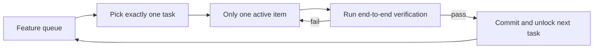
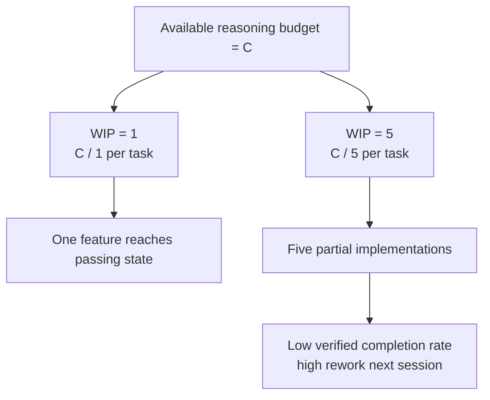

[中文版 →](../../../zh/lectures/lecture-07-why-agents-overreach-and-under-finish/)

> Приклади коду: [code/](https://github.com/walkinglabs/learn-harness-engineering/blob/main/docs/uk/lectures/lecture-07-why-agents-overreach-and-under-finish/code/)
> Практичний проєкт: [Проєкт 04. Використання зворотного зв'язку runtime для коригування поведінки агента](./../../projects/project-04-incremental-indexing/index.md)

# Лекція 07. Встановіть чіткі межі задач для агентів

Ви кажете Claude Code «додай автентифікацію користувачів до цього проєкту», і він починає змінювати схему бази даних, писати маршрути, змінювати компоненти фронтенду і — заодно — рефакторити middleware для обробки помилок. Через дві години перевіряєте: 12 змінених файлів, 800 рядків нового коду, і жодна функція не працює наскрізь.

Агенти від природи схильні «зробити трохи більше» — бачать суміжні речі і просто вирішують їх по дорозі. Проблема в тому, що надто велика кількість одночасних справ майже гарантовано призводить до того, що жодна з них не буде зроблена добре.

В інженерному блозі Anthropic «Effective harnesses for long-running agents» прямо сказано: коли промпти надто широкі, агенти схильні «починати кілька речей одночасно», а не «спочатку завершувати одну». Практики розробки Codex від OpenAI виявили те саме — задачі без явного контролю меж мають різко нижчий відсоток завершення. Це не проблема моделі — це проблема harness. Ви не провели межу.

## Увага — скінченний ресурс

Це не метафора — це математика. Припустимо, ємність контексту агента дорівнює C, і він активує k задач одночасно. Кожна задача отримує в середньому C/k ресурсів міркування. Коли C/k падає нижче мінімального порогу, необхідного для завершення однієї задачі, жодна з них не виконується до кінця.

Реальна поведінка Claude Code показова. Скажіть йому «додай реєстрацію користувачів», і він може:

1. Створити модель User
2. Написати маршрут реєстрації
3. Помітити, що потрібна email-верифікація, і додати поштовий сервіс
4. Побачити, що паролі потребують хешування, і підключити bcrypt
5. Помітити, що обробка помилок непослідовна, і зробити рефакторинг глобального middleware для помилок
6. Побачити, що структура тестових файлів безладна, і переорганізувати директорію

Шість кроків — і кожен наполовину зроблений. Жодної наскрізної верифікації, складне зв'язування між напівготовим кодом, а наступна сесія, що підхопить уламки, буде повністю розгублена.

Експериментальні дані Anthropic це підтверджують безпосередньо: агенти, що використовують стратегію «маленького наступного кроку» (еквівалент WIP=1), показують на 37% вищий відсоток завершення задач, ніж агенти з широкими промптами. Цікавіше те, що кількість рядків коду, згенерованих агентами, слабко негативно корелює з фактичним завершенням функцій — більше написаного коду, менше завершених функцій. Захопити більше, ніж можеш з'їсти, — доведено даними.

## Робочий процес WIP=1





## Ключові поняття

- **Надмірне охоплення (Overreach)**: Агент активує в одній сесії більше задач, ніж оптимально. Це не суб'єктивно — це вимірювано: виконувати 5 функцій з 0 наскрізних перевірок є надмірним охопленням.
- **Незавершення (Under-finish)**: Відношення задач, що пройшли наскрізну верифікацію, до всіх активованих задач падає нижче порогу. Код написаний, але тести не проходять — це незавершення.
- **Ліміт WIP (Work-in-Progress Limit)**: З методології Kanban. Основна ідея: обмежити кількість задач, що виконуються одночасно. Для агентів WIP=1 є найбезпечнішим значенням за замовчуванням — завершіть одне перед початком наступного.
- **Доказ завершення (Completion Evidence)**: Верифікована умова, яку задача має задовольнити, щоб перейти зі стану «в роботі» до «завершено». Без цього агенти замінюють «код виглядає добре» на «поведінка проходить тести».
- **Поверхня меж (Scope Surface)**: Структура DAG, де кожен вузол — одиниця роботи, а ребра — залежності. Допустимі стани: not_started, active, blocked, passing.
- **Тиск завершення (Completion Pressure)**: Обмежувальна сила, яку harness чинить через ліміти WIP та вимоги до доказів завершення, змушуючи агента завершити поточну задачу перед початком нової.

## Надмірне охоплення і незавершення — дві сторони одної монети

Ці дві проблеми не є незалежними — вони підсилюють одна одну. Надмірне охоплення розпорошує увагу, розпорошена увага спричиняє незавершення, а напівготовий код, що залишається, збільшує складність системи, що ще більше провокує надмірне охоплення в наступній задачі. Замкнене коло.

У термінах Kanban: закон Літтла каже нам L = lambda * W. Якщо обсяг незавершеної роботи L зависокий (надто багато справ одночасно), час виконання W кожної задачі неминуче зростає. Для агентів це означає, що кожна функція потребує більше часу від початку до верифікованого завершення, а ймовірність невдачі зростає.

Це давня проблема і в людському світі. Стів МакКоннелл задокументував у «Rapid Development», що повзуча зміна вимог є головною причиною провалу проєктів. Але люди принаймні мають інтуїцію «я зробив достатньо». У агентів її немає. Генерація наступної ідеї коштує моделі майже нічого — написати «дозвольте я заодно виправлю це» ледь потребує додаткових токенів, але кожна додаткова модифікація розпорошує увагу агента.

## Як робити правильно

### 1. Застосовуйте WIP=1

Це найпрямолінійніший і найефективніший метод. У вашому harness явно скажіть агенту: **в будь-який момент лише одна задача може мати статус «активна».** У CLAUDE.md для Claude Code або AGENTS.md для Codex напишіть:

```
## Work Rules
- Work on one feature at a time
- Only start the next feature after the current one passes end-to-end verification
- Don't "also refactor" feature B while implementing feature A
```

### 2. Визначте явний доказ завершення для кожної задачі

Завершено — це не «код написаний», а «верифікація поведінки пройшла». У вашому списку функцій кожен запис потребує команди верифікації:

```
F01: User Registration
  Verification: curl -X POST /api/register -d '{"email":"test@example.com","password":"123456"}' | jq .status == 201
  State: passing
```

### 3. Винесіть поверхню меж назовні

Використовуйте машинозчитуваний файл (JSON або Markdown) для запису всіх станів задач. Будь-яка нова сесія може прочитати цей файл і одразу знати: яка задача активна? Яка поведінка вважається завершеною? Які верифікації пройдено?

### 4. Відстежуйте відсоток верифікованого завершення

Harness має постійно відстежувати VCR (Verified Completion Rate) = верифіковані задачі / активовані задачі. Блокуйте активацію нових задач, коли VCR < 1.0.

## Реальний кейс

Проєкт REST API з 8 функціями, порівняння двох стратегій:

**Режим без обмежень**: Агент активує 5 функцій одночасно в сесії 1. Продукує ~800 рядків у 12 файлах. Відсоток проходження наскрізних тестів: 20% — працює лише реєстрація користувачів. Решта 4 функції: схема бази даних створена, але відсутня логіка валідації; маршрути визначені, але повертають неправильні формати відповідей. До кінця сесії 3 завершено лише 3 з 8 функцій.

**Режим WIP=1**: Агент працює лише над реєстрацією користувачів у сесії 1. Продукує ~200 рядків у 4 файлах. Наскрізні тести: 100% проходять. Фіксує чисту, верифіковану реалізацію. До кінця сесії 4 завершено 7 з 8 функцій (8-а заблокована зовнішньою залежністю).

Підсумок: менше загального коду (800 проти 1200 рядків), але ефективніший. Відсоток завершення: 87,5% проти 37,5%.

## Ключові висновки

- **WIP=1 — це безпечне значення за замовчуванням для harness агентів** — завершіть одне, потім беріться за наступне; не намагайтеся розпаралелювати.
- **Доказ завершення має бути виконуваним** — «код виглядає добре» не рахується; «curl повертає 201» — рахується.
- **Поверхня меж має бути винесена у файл** — не просто згадана в розмові, а зафіксована в машинозчитуваному форматі в репозиторії.
- **Надмірне охоплення і незавершення симбіотичні** — вирішення одного вирішує інше.
- **«Роби менше, але завершуй» завжди перемагає «роби більше, але залишай напівготовим»** — рядки коду агента та відсоток завершення функцій негативно корелюють. Якість завжди перемагає кількість.

## Додаткова література

- [Effective harnesses for long-running agents - Anthropic](https://www.anthropic.com/engineering/effective-harnesses-for-long-running-agents) — інженерний блог Anthropic, детальне обговорення стратегії «маленького наступного кроку»
- [Harness Engineering - OpenAI](https://openai.com/index/harness-engineering/) — повний розгляд harness engineering від OpenAI
- [Kanban: Successful Evolutionary Change - David Anderson](https://www.goodreads.com/book/show/1070822.Kanban) — класичне джерело про ліміти WIP
- [Rapid Development - Steve McConnell](https://www.goodreads.com/book/show/125171.Rapid_Development) — емпіричні дані про повзучу зміну вимог як головну причину провалу проєктів

## Вправи

1. **Атомізація задач**: Візьміть широку вимогу (наприклад, «реалізуй систему управління користувачами») і розбийте її на щонайменше 5 атомарних одиниць роботи. Для кожної одиниці вкажіть: (а) опис однієї поведінки, (б) виконувану команду верифікації, (в) залежності. Перевірте, чи задовольняє розбивка обмеження WIP=1.

2. **Порівняльний експеримент**: Запустіть один і той самий проєкт двічі — без обмежень і з примусовим WIP=1. Порівняйте відсоток верифікованого завершення, загальну кількість рядків коду та частку ефективного коду.

3. **Аудит доказів завершення**: Перегляньте результати нещодавнього запуску агента, класифікуючи кожну зміну коду як «завершена поведінка», «незавершена поведінка» або «каркас». Додайте відсутні команди верифікації для кожної незавершеної поведінки.
