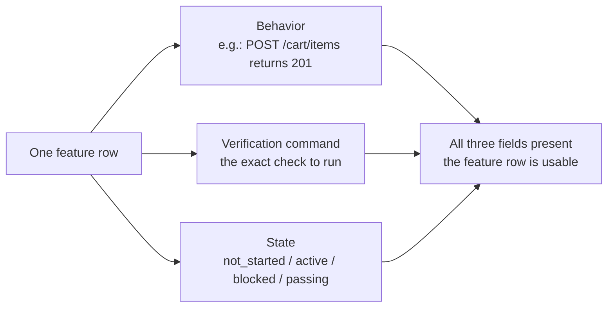
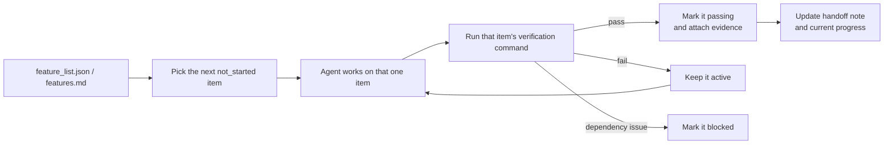

[中文版 →](../../../zh/lectures/lecture-08-why-feature-lists-are-harness-primitives/)

> Приклади коду: [code/](https://github.com/walkinglabs/learn-harness-engineering/blob/main/docs/uk/lectures/lecture-08-why-feature-lists-are-harness-primitives/code/)
> Практичний проєкт: [Проєкт 04. Зворотний зв'язок під час виконання та контроль обсягу](./../../projects/project-04-incremental-indexing/index.md)

# Лекція 08. Використовуйте списки функціональності для обмеження дій агента

Ви просите агента побудувати e-commerce сайт. Після завершення він повідомляє: «готово». Ви дивитесь на код — автентифікація користувачів працює, але кнопка оформлення замовлення в кошику нічого не робить, а платіжний потік взагалі не підключений. Де щось пішло не так? Ви ніколи не пояснили, що означає «готово», тому агент застосував власний стандарт: «я написав багато коду, і він виглядає достатньо повним».

У більшості людей списки функціональності асоціюються лише з нотатками — записати, щоб не забути, а потім відкласти вбік. Але у світі harness список функціональності — це не нотатка для людини. Це фундаментальна структура, на якій побудований увесь harness. Планувальник спирається на нього, щоб вибирати завдання, верифікатор — щоб оцінювати завершеність, а генератор звітів про передачу — щоб формувати підсумки. Без нього ці компоненти не мають спільного консенсусу.

Anthropic і OpenAI наголошують: **артефакти мають бути зовнішніми.** Стан функціональності повинен зберігатися у машиночитаному файлі в репозиторії, а не в неструктурованому тексті розмови.

## Агенти не знають, що означає «готово»

Ні Claude Code, ні Codex автоматично не розуміють, що ви маєте на увазі під «готово». Ви кажете «додай функцію кошика», і модель може інтерпретувати це як «напиши компонент Cart і метод addToCart». Але ви мали на увазі «користувач може переглядати товари, додавати до кошика і завершити оформлення замовлення наскрізно».

Цей розрив у розумінні зберігається без списку функціональності. Агент застосовує власний неявний стандарт — зазвичай «код не має очевидних синтаксичних помилок». Вам потрібна наскрізна поведінкова верифікація. Без списку обидві сторони ніколи не дійдуть згоди щодо того, що означає «готово».

Погляньте на цей типовий запис прогресу:

```
Did user auth, shopping cart mostly done, still need payments
```

Чи може новий сеанс агента відповісти на ці запитання з цієї нотатки? Що означає «mostly done»? Які тести пройшов кошик? Що блокує платежі? Відповідь на всі — «ніхто не знає».

Результат: новий сеанс витрачає 20 хвилин на з'ясування стану проєкту і може зрештою заново реалізувати вже завершені функції. За інженерними даними Anthropic, хороші записи прогресу скорочують час діагностики на початку сеансу на 60–80%.

## Машина станів функціональності





## Основні концепції

- **Списки функціональності — це harness-примітиви**: не «необов'язкові інструменти планування», а фундаментальні структури даних, від яких залежать усі інші компоненти harness. Планувальник, верифікатор і генератор звітів про передачу — усі вони читають список функціональності для своєї роботи.
- **Потрійна структура**: кожен елемент списку містить три складові: `(опис поведінки, команда верифікації, поточний стан)`. Поведінка повідомляє агенту, що робити; верифікація — що вважається виконаним; стан — де знаходяться справи. Відсутність будь-якого елемента робить запис неповним.
- **Модель машини станів**: кожен елемент функціональності має чотири стани — `not_started`, `active`, `blocked`, `passing`. Переходи між станами контролює harness, агент не може їх змінювати довільно.
- **Вентиль стану passing**: єдиний спосіб перевести функцію з `active` у `passing` — успішне виконання команди верифікації. Цей перехід незворотний — після `passing` повернення неможливе.
- **Єдине джерело правди**: уся інформація про «що потрібно зробити» повинна походити з одного списку функціональності. Жодних суперечностей між списком і історією розмови.
- **Зворотний тиск**: кількість функцій, що ще не перейшли у `passing`, — це тиск, який harness чинить на агента. Нульовий тиск = проєкт завершено.

## Чому списки функціональності мають бути «примітивами»

Документи призначені для читання людьми; примітиви — для виконання системами. Документи можна ігнорувати; примітиви не можна обійти.

Уявіть це як обмеження тригерів бази даних на противагу перевіркам на рівні застосунку: перші виконуються рушієм бази даних — жоден SQL не може їх пропустити. Другі залежать від коректності коду застосунку і можуть бути випадково обійдені. Списки функціональності як harness-примітиви відіграють ту саму роль, що й обмеження на рівні бази даних, — агент не може їх обійти.

Конкретно, список функціональності обслуговує чотири компоненти harness:

1. **Планувальник**: читає стани, вибирає наступну функцію зі статусом `not_started`.
2. **Верифікатор**: виконує команди верифікації, вирішує, чи дозволяти переходи між станами.
3. **Генератор звітів про передачу**: автоматично формує підсумки передачі сеансу зі списку функціональності.
4. **Трекер прогресу**: підраховує розподіл станів, надає метрики стану проєкту.

## Як це робити

### 1. Визначте мінімальний формат списку функціональності

Складна система не потрібна — підійде структурований файл Markdown або JSON. Головне — кожен запис повинен мати потрійну структуру:

```json
{
  "id": "F03",
  "behavior": "POST /cart/items with {product_id, quantity} returns 201",
  "verification": "curl -X POST http://localhost:3000/api/cart/items -H 'Content-Type: application/json' -d '{\"product_id\":1,\"quantity\":2}' | jq .status == 201",
  "state": "passing",
  "evidence": "commit abc123, test output log"
}
```

### 2. Дозвольте harness контролювати переходи між станами

Агент не може безпосередньо змінити стан функції на `passing`. Він може лише надіслати запит на верифікацію. Harness виконує команду верифікації і вирішує, чи дозволяти перехід. Це і є «вентиль стану passing».

### 3. Запишіть правила у CLAUDE.md

```
## Feature List Rules
- Feature list file: /docs/features.md
- Only one feature active at a time
- Verification command must pass before marking as passing
- Don't modify feature list states yourself — the verification script updates them automatically
```

### 4. Калібруйте гранулярність

Кожен елемент функціональності має бути розрахований на «виконання за один сеанс». Надто широкий — не завершиться; надто вузький — зростають накладні витрати на управління. «Користувач може додавати товари до кошика» — правильна гранулярність. «Реалізувати кошик» — надто широко. «Створити поле name у моделі Cart» — надто вузько.

## Реальний кейс

E-commerce платформа з 10 функціями. Порівняння двох підходів до відстеження:

**Режим нотаток**: агент використовує неструктуровані нотатки для відстеження прогресу. Після 3 сеансів нотатки виглядають як «зробив автентифікацію і список товарів, кошик в основному готовий, але є баги, платежі не починались». Новий сеанс витрачає 20 хвилин на з'ясування стану і зрештою заново реалізує завершені функції.

**Структурований режим**: кожна функція має чіткий стан і команду верифікації. Новий сеанс читає список функціональності і за 3 хвилини знає: F01–F05 — `passing`, F06 — `active` (в роботі), F07–F10 — `not_started`. Він продовжує безпосередньо з F06, без жодного повтору роботи.

Кількісний результат: проєкти зі структурованими списками функціональності показують на 45% вищий рівень завершення функцій порівняно з довільним відстеженням, без жодних дублікатів реалізацій.

## Ключові висновки

- **Списки функціональності — це фундаментальна структура harness**, а не нотатки для людей. Від них залежать планувальник, верифікатор і генератор звітів про передачу.
- **Кожен елемент функціональності повинен мати потрійну структуру**: опис поведінки + команда верифікації + поточний стан. Відсутність одного елемента робить його неповним.
- **Переходи між станами контролює harness** — агент не може змінювати стани самостійно. Проходження верифікації — єдиний шлях до підвищення статусу.
- **Список функціональності — єдине джерело правди проєкту** — уся інформація «що робити» походить з нього.
- **Калібруйте гранулярність до «виконуваного за один сеанс».** Надто широкий — не завершиться; надто вузький — некерований.

## Додаткове читання

- [Building Effective Agents - Anthropic](https://www.anthropic.com/research/building-effective-agents) — явно визначає список функціональності як «ключову структуру даних» для контролю обсягу агента
- [Harness Engineering - OpenAI](https://openai.com/index/harness-engineering/) — підкреслює принцип «екстерналізації артефактів»
- [Design by Contract - Bertrand Meyer](https://www.goodreads.com/book/show/130439.Object_Oriented_Software_Construction) — принципи проєктування за контрактом, теоретична основа списків функціональності
- [How Google Tests Software](https://www.goodreads.com/book/show/13563030-how-google-tests-software) — піраміда тестування та інженерні практики поведінкової специфікації

## Вправи

1. **Проєктування списку функціональності**: визначте мінімальну JSON-схему списку функціональності. Включіть: id, опис поведінки, команду верифікації, поточний стан, посилання на свідчення. Використайте її для опису реального проєкту з 5 функціями.

2. **Порівняння строгості верифікації**: виберіть 3 функції та розробіть як «слабку» верифікацію (наприклад, «код без синтаксичних помилок»), так і «строгу» (наприклад, «наскрізний тест проходить»). Порівняйте рівень хибнопозитивних результатів за кожного підходу.

3. **Аудит принципу єдиного джерела**: перевірте наявний проєкт агента на наявність інформації про обсяг, що суперечить списку функціональності (неявні вимоги в розмовах, TODO-коментарі в коді тощо). Розробіть план для об'єднання всієї інформації у списку функціональності.
