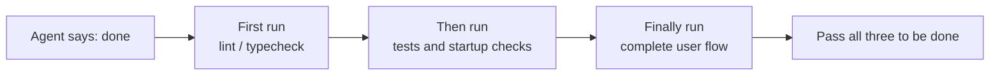
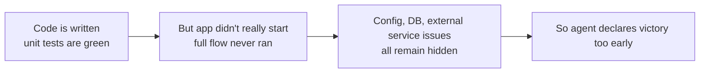

[中文版 →](../../../zh/lectures/lecture-09-why-agents-declare-victory-too-early/)

> Приклади коду до цієї лекції: [code/](https://github.com/walkinglabs/learn-harness-engineering/blob/main/docs/uk/lectures/lecture-09-why-agents-declare-victory-too-early/code/)
> Практичне завдання: [Проєкт 05. Нехай агент верифікує власну роботу](./../../projects/project-05-grounded-qa-verification/index.md)

# Лекція 09. Запобігання передчасному оголошенню перемоги агентами

Ви просите агента реалізувати функцію «скидання пароля». Він змінює схему бази даних, пише API-ендпоінт, додає шаблон електронного листа, запускає юніт-тести (всі проходять) і впевнено повідомляє: «готово». Але коли ви насправді спробуєте запустити — посилання для скидання пароля не надсилається через відсутню конфігурацію поштового сервісу; міграція бази даних завершується на половині, залишаючи схему в суперечливому стані; а наскрізний потік жодного разу не виконувався.

Це не поодинокий випадок. Класична стаття ICML 2017 року Guo et al. довела: **сучасні нейронні мережі систематично переоцінюють свою впевненість** — довіра, яку повідомляють моделі, значно вища за їхню фактичну точність. Агенти для написання коду на основі ШІ нічим не відрізняються. Вони «відчувають» завершеність, але насправді далекі від неї. Ваш harness повинен замінити «відчуття» агента зовнішньою верифікацією на основі виконання.

## Слизький схил

Передчасні оголошення про завершення майже завжди слідують одним і тим самим сценарієм: код виглядає нормально — синтаксис правильний, логіка здається розумною, статичний аналіз не показує очевидних помилок. Але harness не вимагає комплексної верифікації виконання, тому агент або взагалі не запускає код, або запускає лише часткові тести. Він виконує юніт-тести, але пропускає інтеграційні; запускає тести, але не перевіряє покриття. Зрештою «код виглядає добре» сприймається як свідчення того, що «функція завершена».

Інформація втрачається на кожному кроці. Від специфікації завдання до реалізації коду та поведінки під час виконання — кожне перетворення може вносити упередженість, а кожна пропущена верифікація посилює інформаційну асиметрію.

## Тришаровий контроль завершення





## Основні концепції

- **Передчасне оголошення завершення**: агент стверджує, що завдання виконано, але незадоволені специфікації коректності залишаються. Корінна проблема в тому, що агент судить на основі локальної, кодорівневої впевненості, тоді як системна коректність вимагає глобальної верифікації.
- **Упередженість калібрування впевненості**: систематичний розрив між самозвітованою впевненістю агента у завершеності та фактичною якістю виконання. Для складних багатофайлових завдань це упередження значно позитивне — агент стабільно впевненіший, ніж його фактичні результати.
- **Критерії завершення**: чіткий, виконуваний набір умов оцінювання, визначений у harness. Агент повинен задовольнити всі умови перед оголошенням завершення. «Готово» переходить від суб'єктивного судження до об'єктивного визначення.
- **Подвійний вентиль верифікація-валідація**: перший шар (верифікація) перевіряє, чи код правильно реалізує задану поведінку; другий шар (валідація) перевіряє, чи системна поведінка відповідає наскрізним вимогам. Обидва мають пройти, перш ніж завдання вважається виконаним.
- **Сигнали зворотного зв'язку під час виконання**: логи, стани процесів та перевірки стану від виконання програми — вони формують об'єктивну основу для оцінки harness якості завершення.
- **Обмеження пріоритету завершення**: спочатку верифікуйте функціональну коректність, потім вирішуйте питання продуктивності, і нарешті — стиль. Рефакторинг не дозволяється, поки основна функціональність не верифікована.

## Проходження юніт-тестів ≠ завдання виконано

Це найпоширеніша пастка і найнебезпечніша. Агент пише код, запускає юніт-тести, бачить «всі зелені» і каже «готово». Але філософія проєктування юніт-тестів — ізоляція модуля, що тестується, і мокування залежностей — саме це і робить їх нездатними виявляти проблеми між компонентами:

**Невідповідність інтерфейсу**: рендерер передає відносний шлях до файлу в preload-скрипт, але preload-скрипт очікує абсолютний шлях. Їхні відповідні юніт-тести обидва використовують моки і обидва проходять. Проблема виявляється лише під час наскрізного тестування.

**Помилки поширення стану**: міграція бази даних змінює схему таблиці, але кешуючий шар ORM ще зберігає кешовані записи зі старою схемою. Юніт-тести запускаються в новому мок-середовищі щоразу, тому такий тип кросшарової невідповідності стану ніколи не виявляється.

**Залежність від середовища**: код поводиться правильно в тестовому середовищі (де все замоковано), але збоїть у реальному через відмінності конфігурації, затримку мережі або недоступність сервісу.

### «Рефакторинг заодно» — отрута для оцінки завершеності

У Claude Code є поширений поведінковий патерн: він починає рефакторити код, оптимізувати продуктивність і покращувати стиль, перш ніж основна функціональність пройшла верифікацію. Прислів'я Кнута про те, що «передчасна оптимізація — корінь усього зла», набуває нового сенсу в сценарії з агентами — рефакторинг зміщує межу між верифікованим і неверифікованим кодом, потенційно ламаючи шляхи коду, які раніше були неявно коректними.

### Систематичне упередження самооцінки

Anthropic виявив глибший патерн відмови у своїх дослідженнях 2026 року: **коли агента просять оцінити власну роботу, він систематично дає надмірно позитивні оцінки — навіть коли людський спостерігач визначить якість як явно незадовільну.**

Ця проблема особливо гостра для суб'єктивних завдань (наприклад, естетика дизайну). Те, чи «макет відполірований», — питання судження, і агент стабільно схиляється до позитивної оцінки. Навіть у завданнях з перевіряємими результатами погана здатність агента до судження погіршує його продуктивність.

Рішення — не в тому, щоб зробити агента «об'єктивнішим». Та сама модель і генерує, і оцінює, тому вона за своєю суттю схильна ставитися до себе поблажливо. **Рішення — розділити «виконавця» і «перевіряльника».**

Незалежний агент-оцінювач, спеціально налаштований бути «прискіпливим», значно ефективніший, ніж самооцінка агента-генератора. Експериментальні дані Anthropic:

| Архітектура | Час виконання | Вартість | Основні функції працюють? |
|-------------|---------------|----------|--------------------------|
| Один агент (без обгортки) | 20 хв | $9 | Ні (ігрові сутності не реагують на введення) |
| Три агенти (планувальник + генератор + оцінювач) | 6 год | $200 | Так (гра повністю грається) |

Це та сама модель (Opus 4.5) з тим самим промптом («побудуй 2D-редактор ретро-ігор»). Єдина відмінність — harness: від «запуску без обгортки» до «планувальник розширює вимоги → генератор реалізує функцію за функцією → оцінювач виконує реальне клік-тестування через Playwright».

> Джерело: [Anthropic: Harness design for long-running application development](https://www.anthropic.com/engineering/harness-design-long-running-apps)

## Як запобігати передчасним оголошенням завершення

### 1. Екстерналізуйте оцінку завершення

Оцінка завершення не повинна здійснюватися самим агентом. Harness незалежно виконує валідацію завершення, використовуючи сигнали виконання як вхідні дані, а не впевненість агента. У CLAUDE.md це можна прописати явно:

```
## Definition of Done
- Feature complete = end-to-end verification passed, not "code is written"
- Required verification levels:
  1. Unit tests pass
  2. Integration tests pass
  3. End-to-end flow verification passes
- Do not proceed to level 2 if level 1 fails
- Do not proceed to level 3 if level 2 fails
```

### 2. Побудуйте тришарову валідацію завершення

- **Шар 1: Синтаксис і статичний аналіз**. Найнижча вартість, найменше інформації, але обов'язковий для проходження. Це абсолютний мінімум — потрібно правильно написати слова, перш ніж читати далі.
- **Шар 2: Верифікація поведінки під час виконання**. Виконання тестів, перевірки запуску застосунку, валідація критичних шляхів. Це основне свідчення завершення — не просто написаний, але й запускаємий.
- **Шар 3: Системне підтвердження**. Наскрізне тестування, інтеграційна валідація, симуляція сценаріїв користувача. Остання лінія захисту від передчасних оголошень — не просто запускається, але й коректний.

### 3. Надавайте агенту дієвий зворотний зв'язок про помилки

OpenAI представив особливо ефективний патерн у своїй практиці з Codex: **повідомлення про помилки, написані для агентів, повинні містити інструкції з виправлення**. Не просто кажіть агенту «це неправильно» — вкажіть, що саме неправильно і як це виправити. Не використовуйте `"Test failed"`, використовуйте `"Test failed: POST /api/reset-password returned 500. Check that the email service config exists in environment variables. The template file should be at templates/reset-email.html."` Такий конкретний, дієвий зворотний зв'язок дозволяє агенту самостійно виправлятися без втручання людини.

### 4. Фіксуйте сигнали виконання

Ефективні сигнали виконання включають:
- Чи успішно запустився застосунок і досяг стану готовності?
- Чи критичні шляхи функцій виконувались успішно під час виконання?
- Чи були коректні записи в базу даних, файлові операції та інші побічні ефекти?
- Чи були очищені тимчасові ресурси?

## Реальний кейс

**Завдання**: реалізувати функціональність скидання пароля. Включає операції з базою даних, надсилання електронної пошти та зміни API-ендпоінта.

**Шлях передчасної здачі**: агент змінює схему бази даних, пише API-ендпоінт, додає шаблон електронного листа, запускає юніт-тести (всі проходять) і оголошує завершення. Здається, зроблено багато, але всі критичні кроки були пропущені.

**Фактичні упущення**: (1) наскрізний потік не перевірявся — фактичне надсилання та верифікація посилання для скидання ніколи не були підтверджені. (2) Міграція бази даних завершилась після часткового виконання, залишивши схему суперечливою. (3) Конфігурація поштового сервісу була відсутня в цільовому середовищі.

**Втручання harness**: валідація завершення є обов'язковою — (1) запустити повний застосунок для перевірки доступності ендпоінта скидання; (2) виконати повний потік скидання; (3) верифікувати узгодженість стану бази даних. Всі дефекти були виявлені в межах сеансу, що зекономило в 5–10 разів більше ресурсів порівняно з виправленнями після факту.

## Ключові висновки

- **Агенти систематично переоцінюють свою впевненість** — упередженість калібрування є об'єктивною реальністю. Написаний код не означає написаний правильно.
- **Оцінка завершення повинна бути екстерналізована** — harness верифікує незалежно. Не довіряйте «відчуттям» агента.
- **Усі три шари валідації є обов'язковими**: синтаксис проходить, поведінка проходить, система проходить — шар за шаром, без скорочень.
- **Повідомлення про помилки мають містити конкретні кроки виправлення**, дозволяючи агенту самостійно виправлятися, а не просто повідомляти «це неправильно».
- **Жодного рефакторингу, поки основна функціональність не верифікована** — обмеження пріоритету завершення є ключем до запобігання передчасній оптимізації.

## Додаткове читання

- [On Calibration of Modern Neural Networks - Guo et al.](https://arxiv.org/abs/1706.04599) — доводить, що сучасні глибокі мережі систематично переоцінюють свою впевненість
- [Building Effective Agents - Anthropic](https://www.anthropic.com/research/building-effective-agents) — критична роль свідчень виконання в оцінці завершення
- [Harness Engineering - OpenAI](https://openai.com/index/harness-engineering/) — передчасне оголошення завершення є одним з основних режимів відмови агентів
- [The Art of Software Testing - Myers](https://www.goodreads.com/book/show/137543.The_Art_of_Software_Testing) — класичний довідник з ієрархій методів тестування та їхньої ефективності

## Вправи

1. **Проєктування функції валідації завершення**: розробіть повну валідацію завершення для завдання, що включає міграцію бази даних і зміни API. Перерахуйте необхідні сигнали виконання і критерії проходження/непроходження для кожного. Запустіть на реальному завданні і зафіксуйте, які приховані проблеми це виявить.

2. **Вимірювання упередженості калібрування**: виберіть 10 завдань з написання коду різних типів. Запишіть самозвітовану впевненість агента у завершеності порівняно з фактичною якістю виконання. Розрахуйте упередженість і проаналізуйте її зв'язок зі складністю завдання.

3. **Експеримент з багатошаровим захистом**: запустіть три конфігурації на тому самому наборі завдань: (a) лише статичний аналіз, (b) додати юніт-тестування, (c) повна тришарова валідація. Порівняйте частку передчасних оголошень завершення і кількість незнайдених дефектів.
