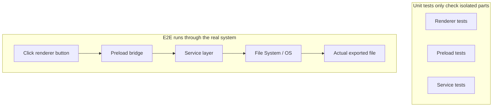
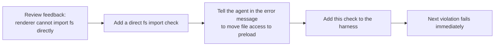

[中文版 →](../../../zh/lectures/lecture-10-why-end-to-end-testing-changes-results/)

> Приклади коду до цієї лекції: [code/](https://github.com/walkinglabs/learn-harness-engineering/blob/main/docs/uk/lectures/lecture-10-why-end-to-end-testing-changes-results/code/)
> Практичне завдання: [Проєкт 05. Нехай агент верифікує власну роботу](./../../projects/project-05-grounded-qa-verification/index.md)

# Лекція 10. Лише повний запуск пайплайну є справжньою верифікацією

Ви просите агента додати функцію експорту файлів до Electron-застосунку. Він пише компонент рендерера, preload-скрипт і логіку сервісного шару. Юніт-тести для кожного компонента проходять. Агент каже «готово». Ви насправді натискаєте кнопку експорту — формат шляху до файлу неправильний, прогрес-бар не реагує, а експорт великих файлів призводить до витоку пам'яті. П'ять дефектів на межах компонентів, і жодного з них юніт-тести не виявили.

Кожна частина виглядає «правильною» окремо, але проблеми виникають у момент з'єднання. Testing Pyramid від Google говорить, що велика база юніт-тестів необхідна, але зупинятись на цьому означає систематично пропускати проблеми взаємодії компонентів. Для агентів AI-кодування ця проблема ще гостріша, бо агенти схильні запускати лише найшвидші тести, а потім оголошувати завершення. **Лише наскрізне тестування може довести відсутність дефектів системного рівня.**

## Сліпі зони юніт-тестів

Філософія проєктування юніт-тестування — ізоляція: мокувати залежності, зосередитись на модулі під тестом. Ця філософія робить юніт-тести швидкими і точними, але водночас створює систематичні сліпі зони. Кожен модуль бездоганно працює в ізоляції, проте наступні категорії проблем виникають лише тоді, коли все справді запускається разом:

**Невідповідність інтерфейсів**: Рендерер передає preload-скрипту відносний шлях до файлу, але preload-скрипт очікує абсолютний. Відповідні юніт-тести обох частин використовують моки й обидва проходять. Проблема виявляється лише при виконанні наскрізного сценарію.

**Помилки поширення стану**: Міграція бази даних змінює схему таблиці, але кешувальний шар ORM все ще зберігає записи кешу зі старою схемою. Юніт-тести щоразу піднімають чисте мок-середовище, тому ніколи не виявляють такої між-шарової невідповідності стану.

**Проблеми життєвого циклу ресурсів**: Отримання та звільнення файлових дескрипторів, з'єднань з базою даних і мережевих сокетів охоплює кілька компонентів. Юніт-тести створюють і знищують незалежні ресурси для кожного тест-кейсу, тому ніколи не виявляють суперечок за ресурси або витоків.

**Залежність від середовища**: Код працює правильно в тестовому середовищі (де все замоковано), але падає у реальному через відмінності конфігурації, мережеву затримку або недоступність сервісу.

## Наскрізне тестування не лише змінює результати — воно змінює поведінку

Це те, що багато хто упускає: коли агент знає, що його роботу буде перевірено наскрізними тестами, його поведінка при написанні коду змінюється.

1. **Врахування взаємодії компонентів**: Під час написання коду він починає запитувати «як цей інтерфейс з'єднується з upstream?» замість того, щоб зосереджуватись на окремій функції ізольовано.
2. **Дотримання архітектурних меж**: У системах з архітектурними обмеженнями наскрізні тести змушують агента дотримуватись правил меж.
3. **Обробка шляхів помилок**: Наскрізні тести зазвичай включають сценарії збоїв, що спонукає агента думати про обробку винятків.

## Testing Pyramid і просування review-фідбеку





OpenAI підкреслює у своїх інженерних практиках Codex: **повідомлення про помилки, написані для агентів, повинні містити інструкції щодо виправлення.** Замість `"Direct filesystem access in renderer"` слід писати `"Direct filesystem access in renderer. All file operations must go through the preload bridge. Move this call to preload/file-ops.ts and invoke it via window.api."` Це перетворює архітектурні правила на цикл автокорекції. Повідомлення про помилки не просто кажуть «що пішло не так» — вони кажуть «як це виправити», дозволяючи агенту коригувати себе автономно.

## Ключові поняття

- **Дефекти на межах компонентів**: Компоненти A і B кожен проходять свої юніт-тести, але їхня взаємодія дає неправильний результат. Це категорія проблем, яку наскрізне тестування виявляє найкраще.
- **Градієнт достатності тестування**: Дефекти, виявні юніт-тестами <= дефекти, виявні інтеграційними тестами <= дефекти, виявні наскрізними тестами. Здатність виявлення зростає з кожним шаром.
- **Правила забезпечення архітектурних меж**: Перетворення правил з архітектурних документів (наприклад, «процес рендерера не повинен безпосередньо звертатись до файлової системи») на виконувані автоматизовані перевірки — від «записаного на папері» до «запущеного в CI».
- **Просування review-фідбеку**: Перетворення повторюваних коментарів code review на автоматизовані тести. Щоразу, коли виявляється нова категорія повторюваної проблеми, додається правило, і harness автоматично стає сильнішим.
- **Повідомлення про помилки, орієнтовані на агента**: Повідомлення про збій мають не просто констатувати «що пішло не так», а й точно вказувати агенту, як це виправити, перетворюючи збої тестів на петлі самокорекції.

## Як це робити

### 0. Визначте архітектурні межі до написання E2E-тестів

Передумова для наскрізного тестування — чіткі межі системи. Якщо архітектура є заплутаним клубком, наскрізне тестування лише доведе «весь безлад запускається», не показавши, де порушено проєктний намір.

Досвід OpenAI: **для кодових баз, генерованих агентами, архітектурні обмеження мають бути встановлені як ранні передумови з першого дня — а не те, про що думають після того, як команда виросла.** Причина проста: агенти копіюють існуючі патерни в репозиторії, навіть якщо ці патерни суперечливі або неоптимальні. Без архітектурних обмежень агенти вносять все більше відхилень із кожною сесією.

OpenAI прийняла «Layered Domain Architecture», де кожен бізнес-домен розділений на фіксовані шари: Types -> Config -> Repo -> Service -> Runtime -> UI. Залежності течуть суворо вперед, а міждоменні аспекти надходять через явні інтерфейси Providers. Будь-яка інша залежність заборонена й механічно забезпечується через кастомний лінтинг.

Ключовий принцип: **Забезпечуйте інваріанти; не мікрокеруйте реалізацією.** Наприклад, вимагайте, щоб «дані парсились на межі», але не вказуйте, яку бібліотеку використовувати. Повідомлення про помилки мають містити інструкції щодо виправлення — не просто «порушення», а конкретне пояснення агенту, як це змінити.

> Джерело: [OpenAI: Harness engineering: leveraging Codex in an agent-first world](https://openai.com/index/harness-engineering/)

### 1. Harness повинен включати наскрізний шар

Зробіть це явним у своєму потоці валідації: для завдань, що включають зміни між компонентами, проходження наскрізних тестів є передумовою завершення:

```
## Validation Hierarchy
- Level 1: Unit tests (Must pass)
- Level 2: Integration tests (Must pass)
- Level 3: End-to-end tests (Must pass when cross-component changes are involved)
- Skipping any required level = Not Complete
```

### 2. Перетворіть архітектурні правила на виконувані перевірки

Кожне архітектурне обмеження має мати відповідний тест або lint-правило:

```bash
# Check whether the renderer process directly calls Node.js APIs
grep -r "require('fs')" src/renderer/ && exit 1 || echo "OK: no direct fs access in renderer"
```

### 3. Проєктуйте повідомлення про помилки, орієнтовані на агента

Повідомлення про збій мають містити три елементи: що пішло не так, чому і як виправити:

```
ERROR: Found direct import of 'fs' in src/renderer/App.tsx:12
WHY: Renderer process has no access to Node.js APIs for security
FIX: Move file operations to src/preload/file-ops.ts and call via window.api.readFile()
```

### 4. Встановіть процес просування review-фідбеку

Щоразу, коли під час code review ви виявляєте нову категорію помилок агента, перетворюйте її на автоматизовану перевірку. Через місяць ваш harness буде значно сильнішим, ніж на початку місяця.

## Реальний кейс

**Завдання**: Реалізувати функцію експорту файлів в Electron-застосунку. Задіяні: UI процесу рендерера, файловий проксі preload-скрипту та перетворення даних сервісного шару.

**Фаза юніт-тестів**: Тести компонента рендерера (пройшли, файлові операції замоковано), тести preload-скрипту (пройшли, файлова система замокована), тести сервісного шару (пройшли, джерело даних замоковано). Агент оголошує завершення.

**Дефекти, виявлені наскрізними тестами**:

| Дефект | Опис | Юніт-тест | E2E |
|--------|------|-----------|-----|
| Невідповідність інтерфейсів | Несумісний формат шляху до файлу | Пропущено | Виявлено |
| Поширення стану | Прогрес експорту не повертається до UI через IPC | Пропущено | Виявлено |
| Витік ресурсів | Дескриптори великих файлів не звільняються | Пропущено | Виявлено |
| Проблема дозволів | Відмінні дозволи в пакетному середовищі | Пропущено | Виявлено |
| Поширення помилок | Винятки сервісного шару не досягали шару UI | Пропущено | Виявлено |

Всі 5 дефектів виявлені наскрізними тестами; юніт-тести не виявили жодного. Компроміс — час тестування зріс з 2 секунд до 15 секунд — цілком прийнятно в агентному робочому процесі.

## Ключові висновки

- **Юніт-тести систематично сліпі до дефектів на межах компонентів**: їхня ізоляційна конструкція — саме те, що заважає їм виявляти проблеми взаємодії.
- **Наскрізне тестування не лише виявляє дефекти, воно змінює спосіб написання коду агентами**: зміщує фокус на інтеграцію та межі.
- **Архітектурні правила мають бути виконуваними**: не записаними в документі в очікуванні, поки хтось їх прочитає, а автоматично перевіряються при кожному коміті.
- **Повідомлення про помилки мають бути спроєктовані для агентів**: включати конкретні кроки «як виправити», щоб утворити петлю самокорекції.
- **Просування review-фідбеку автоматично робить harness сильнішим**: кожна захоплена категорія дефектів стає постійною лінією захисту.

## Додаткова література

- [How Google Tests Software - Whittaker et al.](https://www.goodreads.com/book/show/13563030-how-google-tests-software) — Класичне джерело моделі Testing Pyramid
- [Harness Engineering - OpenAI](https://openai.com/index/harness-engineering/) — Інженерні практики автоматизованого забезпечення архітектурних обмежень
- [Chaos Engineering - Netflix (Basiri et al.)](https://ieeexplore.ieee.org/document/7466237) — Проактивне введення збоїв для верифікації стійкості системи
- [QuickCheck - Claessen & Hughes](https://www.cs.tufts.edu/~nr/cs257/archive/john-hughes/quick.pdf) — Методологія тестування властивостей, що знаходиться між тестуванням на прикладах та формальною верифікацією

## Вправи

1. **Виявлення міжкомпонентних дефектів**: Оберіть завдання з модифікацією, що залучає щонайменше три компоненти. Спочатку запустіть лише юніт-тести й запишіть результати, потім запустіть наскрізні тести. Проаналізуйте кожен додатково виявлений дефект і класифікуйте, який тип між-шарової проблеми взаємодії він представляє.

2. **Автоматизація архітектурних правил**: Оберіть архітектурне обмеження у своєму проєкті та перетворіть його на виконувану перевірку (разом з орієнтованим на агента повідомленням про помилку). Інтегруйте у harness і перевірте ефективність за допомогою базового завдання.

3. **Просування review-фідбеку**: Знайдіть повторюваний тип коментарів в історії code review та перетворіть його на автоматизовану перевірку за п'ятикроковим процесом. Порівняйте частоту цієї категорії проблем до і після просування.
