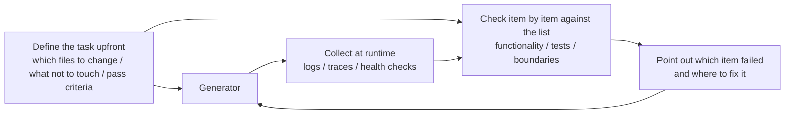

[中文版 →](../../../zh/lectures/lecture-11-why-observability-belongs-inside-the-harness/)

> Приклади коду: [code/](https://github.com/walkinglabs/learn-harness-engineering/blob/main/docs/uk/lectures/lecture-11-why-observability-belongs-inside-the-harness/code/)
> Практичний проєкт: [Проєкт 06. Побудуйте повноцінний harness агента](./../../projects/project-06-runtime-observability-and-debugging/index.md)

# Лекція 11. Спостережуваність runtime агента

Ви просите агента реалізувати функцію. Він працює 20 хвилин, торкається купи файлів, потім каже «готово, але два тести падають». Ви питаєте чому — «не впевнений, можливо проблема із таймінгом». Ви питаєте, які критичні шляхи він змінив — «дозвольте подивитись на код...»

Цей сценарій трапляється занадто часто, і першопричина не в здатностях агента — це відсутність спостережуваності у harness. Коли агент виконує завдання без бачення реального стану runtime, кожне рішення, яке він приймає, — по суті здогадка.

**Без спостережуваності агенти приймають рішення в умовах невизначеності, оцінювання стає суб'єктивними судженнями, а повторні спроби — сліпим блуканням.** І OpenAI, і Anthropic формулюють надійність як проблему доказів: harness повинен відкривати поведінку runtime та сигнали оцінювання у формі, яка справді може спрямовувати наступне рішення.

## Реальна ціна відсутності спостережуваності

Коли harness позбавлений спостережуваності, систематично виникають чотири категорії проблем.

**Неможливо відрізнити «правильне» від «виглядає правильним».** Функція виглядає бездоганно при code review — правильний синтаксис, звукова логіка. Але під час runtime помилка обробки граничної умови дає неправильні результати при певних вхідних даних. Лише runtime-трейси можуть виявити, що фактичний шлях виконання відхилився від очікувань. Code review показує «що було написано»; runtime-трейсинг показує «що насправді виконалось». Потрібні обидва.

**Оцінювання перетворюється на містицизм.** Без рубрик оцінювання та критеріїв прийняття оцінювачі (людина або агент) змушені покладатись на неявні припущення. Один і той самий результат може отримати разюче різні оцінки від різних оцінювачів. Оцінювання якості стає невідтворюваним.

**Повторні спроби стають сліпими здогадками.** Коли агент не знає, чому щось не спрацювало, напрямок повторної спроби випадковий. Він може безуспішно стукатись у хибному напрямку — виправляти непов'язані шляхи коду, ігноруючи справжню першопричину. Кожна сліпа повторна спроба спалює токени і час.

**Інформаційна прірва при передачі сесії.** Коли незавершена робота передається наступній сесії, відсутність спостережуваності означає, що нова сесія має діагностувати стан системи з нуля. Спостереження Anthropic за довготривалими агентами показують, що ця надлишкова діагностика може поглинати 30–50% загального часу сесії.

## Реальний сценарій Claude Code

Розглянемо harness, що використовує робочий процес із трьома ролями «планувальник–генератор–оцінювач» для виконання завдання «додати темний режим до застосунку».

**Без спостережуваності:** Планувальник виводить розпливчастий опис. Генератор реалізує темний режим на основі цієї розпливчастості, але результат не відповідає неявним очікуванням планувальника. Оцінювач відхиляє його на основі власних неявних стандартів, але не може сформулювати, що конкретно не так — просто «це не відчувається правильним». Генератор повторює спроби наосліп через розпливчасті причини відхилення. Цикл повторюється 3–4 рази, займає близько 45 хвилин і ледь дає прийнятний результат.

**З повною спостережуваністю:** Планувальник виводить sprint-контракт із переліком компонентів для модифікації, стандартів верифікації для кожного та виключень (наприклад, без стилів для друку). Генератор реалізує відповідно до контракту, а спостережуваність runtime фіксує процес завантаження та застосування стилів кожного компонента. Оцінювач використовує рубрику оцінювання для покрокової оцінки кожного виміру з конкретними доказами: «Контраст кольору кнопки недостатній (стандарт WCAG AA 4.5:1, виміряно 2.1:1).» Одна ітерація дає якісний результат приблизно за 15 хвилин.

Триразова різниця в ефективності. Єдина змінна — спостережуваність.

## Шарувата спостережуваність

Спостережуваність — це не просто «додати більше логів». Вона функціонує на двох шарах, і обидва є необхідними.



**Спостережуваність runtime:** Сигнали системного рівня — логи, трейси, події процесів, перевірки стану. Відповідає на «що зробила система».

**Спостережуваність процесу:** Бачення артефактів рішень harness — планів, рубрик оцінювання, критеріїв прийняття. Відповідає на «чому цю зміну слід прийняти».

## Ключові поняття

- **Спостережуваність runtime**: Сигнали системного рівня, включаючи логи, трейси, події процесів і перевірки стану. Відповідає на «що зробила система».
- **Спостережуваність процесу**: Бачення артефактів рішень harness, включаючи плани, рубрики оцінювання й критерії прийняття. Відповідає на «чому цю зміну слід прийняти».
- **Трейс завдання**: Повний запис шляху рішень від початку завдання до завершення, аналогічний трейсингу запитів у розподілених системах. Кожен крок агента разом із його контекстом фіксується — тому коли щось іде не так, весь процес можна відтворити.
- **Sprint-контракт**: Короткострокова угода, узгоджена до початку кодування, що визначає обсяг завдання, стандарти верифікації та виключення. Основний інструмент спостережуваності процесу.
- **Рубрика оцінювача**: Перетворює оцінювання якості із суб'єктивного судження на засноване на доказах структуроване оцінювання, що дозволяє різним оцінювачам приходити до схожих висновків для одного й того самого результату.
- **Шарувата спостережуваність**: Спостережуваність системного і процесного шарів, спроєктована одночасно й доповнює одна одну. Сигнали runtime пояснюють поведінку; артефакти процесу пояснюють намір.

## Чому агенти не можуть вирішити це самостійно

Ви можете думати: «Хіба агент не може просто виводити власні логи?» Проблема в тому, що:

1. **Агенти не знають того, чого не знають.** Вони не будуть проактивно записувати сигнали, про необхідність яких не здогадуються. Без обмежень на рівні harness агенти логують лише те, що вважають важливим — а те, що вони вважають важливим, зазвичай недостатньо.
2. **Формати логів непослідовні.** Різні сесії використовують різні формати логів, що унеможливлює систематичний аналіз.
3. **Спостережуваність процесу не вирішується логуванням.** Sprint-контракти та рубрики оцінювання — це структуровані артефакти, що потребують підтримки на рівні harness — кількох print-інструкцій буде недостатньо.

## Як побудувати спостережуваність

### 1. Вбудуйте збір сигналів runtime у harness

Не покладайтесь на те, що агент сам виводитиме свої логи. Harness повинен автоматично збирати такі сигнали:

- **Життєвий цикл застосунку**: Стани фаз запуску, готовності, роботи, завершення
- **Виконання функціонального шляху**: Записи виконання критичних шляхів, включаючи точки входу, контрольні точки та виходи
- **Потік даних**: Записи даних, що течуть між компонентами
- **Використання ресурсів**: Аномальні патерни використання ресурсів (наприклад, пам'ять, що постійно зростає)
- **Помилки та винятки**: Повний контекст помилок, а не лише повідомлення про помилки

### 2. Реалізуйте sprint-контракти

До початку кожного завдання генератор і оцінювач (які можуть бути різними викликами одного й того самого агента) узгоджують контракт, що визначає що будувати та як виглядає «готово»:

```markdown
# Sprint Contract: Dark Mode Support

## Scope
- Modify the theme toggle component
- Update global CSS variables
- Add dark mode tests

## Verification Standards
- Visual regression tests pass for each component
- Main flow end-to-end tests pass
- No flash of unstyled content (FOUC)

## Exclusions
- Not handling print styles
- Not handling third-party component dark mode
```

### 3. Встановіть рубрику оцінювача

Перетворіть «добре чи ні» на кількісне оцінювання:

```markdown
# Scoring Rubric

| Dimension | A | B | C | D |
|-----------|---|---|---|---|
| Code correctness | All tests pass | Main flow passes | Partial pass | Build fails |
| Architecture compliance | Fully compliant | Minor deviations | Obvious deviations | Serious violations |
| Test coverage | Main + edge cases | Main flow only | Only skeleton | No tests |
```

### 4. Стандартизуйте за допомогою OpenTelemetry

Створіть трейс для кожної сесії harness, спан для кожного завдання й під-спани для кожного кроку верифікації. Використовуйте стандартні атрибути для анотування ключової інформації. Так дані спостережуваності інтегруються зі стандартними ланцюжками інструментів (Jaeger, Zipkin).

## Експеримент Anthropic із триагентною архітектурою

У березні 2026 року Anthropic опублікував систематичний harness-експеримент. Вони запускали одне й те саме завдання («побудувати браузерний DAW за допомогою Web Audio API») із трьома різними архітектурами й записували детальні дані по кожній фазі:

| Агент і фаза | Тривалість | Вартість |
|--------------|-----------|---------|
| Планувальник | 4,7 хв | $0,46 |
| Збірка, раунд 1 | 2 год 7 хв | $71,08 |
| QA, раунд 1 | 8,8 хв | $3,24 |
| Збірка, раунд 2 | 1 год 2 хв | $36,89 |
| QA, раунд 2 | 6,8 хв | $3,09 |
| Збірка, раунд 3 | 10,9 хв | $5,88 |
| QA, раунд 3 | 9,6 хв | $4,06 |
| **Разом** | **3 год 50 хв** | **$124,70** |

Кожен із трьох агентів мав чітку роль, і кожен відігравав очевидну частину у спостережуваності:

**Планувальник:** Отримує вимогу користувача з 1–4 речень і розгортає її в повну специфікацію продукту. Йому було доручено «бути сміливим у масштабі» та «зосередитись на контексті продукту й високорівневому технічному проєктуванні, а не на детальній технічній реалізації». Логіка: якщо планувальник передчасно вказує детальні технічні деталі й помиляється, ці помилки каскадуються вниз. Кращий підхід — обмежити результати й дозволити агенту знайти власний шлях під час виконання.

**Генератор:** Реалізує функцію за функцією, спринт за спринтом. Перед кожним спринтом він узгоджує sprint-контракт з оцінювачем, що визначає, що означає «готово» для цього функціонального блоку. Потім реалізує відповідно до контракту, самооцінює та передає в QA.

**Оцінювач:** Використовує Playwright MCP для взаємодії із запущеним застосунком як реальний користувач — тестує функціональність UI, API-ендпоінти та стан бази даних. Він оцінює кожен спринт за чотирма вимірами: глибина продукту, функціональність, візуальний дизайн та якість коду. Кожен вимір має жорсткий поріг — якщо будь-який не відповідає вимогам, спринт провалюється й генератор отримує детальний фідбек для виправлень.

Приклад фідбеку після QA-раунду 1: «Це візуально вражаючий застосунок з хорошою AI-інтеграцією, але кілька основних функцій DAW є лише презентаційними, без глибини взаємодії: кліпи не можна перетягувати/переміщати, немає панелі інструментів (ручки синтезатора, пади барабанів) та немає візуального редактора ефектів (криві EQ, метри компресора).» Це не крайові випадки — це основні взаємодії, що роблять DAW придатним для використання. Конкретний, підкріплений доказами фідбек — не «це не відчувається правильним».

Оцінювач не завжди був таким точним. Ранні версії виявляли розумні проблеми, а потім переконували себе відхилити ці проблеми як несерйозні, в підсумку схвалюючи роботу. Виправлення: читати логи оцінювача, знаходити точки, де його судження розходилось із людським, і оновлювати QA-промпт для вирішення цих конкретних проблем. Після кількох раундів цього циклу розробки оцінювання оцінювача стало надійним.

> Джерело: [Anthropic: Harness design for long-running application development](https://www.anthropic.com/engineering/harness-design-long-running-apps)

## Ключові висновки

- **Спостережуваність — це властивість архітектури harness.** Це не функція, яку додають постфактум — це базова здатність, що має бути спроєктована з самого початку.
- **Обидва шари спостережуваності необхідні.** Сигнали runtime пояснюють «що сталось», артефакти процесу пояснюють «чому це було зроблено саме так».
- **Sprint-контракти зміщують узгодження на початок.** Вони запобігають тому, що генератор будує щось, що оцінювач одразу відхиляє з передбачуваних причин.
- **Рубрики оцінювання роблять оцінювання відтворюваним.** Різні оцінювачі отримують схожі оцінки для одного й того самого результату.
- **Відсутність спостережуваності витрачає 30–50% часу сесії на надлишкову діагностику.**

## Додаткова література

- [Observability Engineering - Charity Majors](https://www.honeycomb.io/blog/observability-engineering-book) — Теоретична і практична рамка для сучасної інженерії спостережуваності
- [Dapper - Google (Sigelman et al.)](https://research.google/pubs/pub36356/) — Проривна практика у великомасштабному розподіленому трейсингу
- [Harness Design - Anthropic](https://www.anthropic.com/engineering/harness-design-long-running-apps) — Введення sprint-контрактів та рубрик оцінювача
- [Site Reliability Engineering - Google](https://sre.google/sre-book/table-of-contents/) — Систематичне застосування спостережуваності у виробничих системах

## Вправи

1. **Аналіз прогалин спостережуваності**: Перевірте свій поточний harness на предмет спостережуваності системного та процесного шарів. Знайдіть стани системи, які неможливо розрізнити за наявними сигналами, та запропонуйте доповнення.

2. **Практика sprint-контрактів**: Напишіть sprint-контракт для реального завдання. Нехай агент виконає відповідно до контракту та порівняйте ефективність і якість з контрактом і без.

3. **Побудова трейсу завдання**: Запишіть кожен крок, який агент робить під час повного завдання кодування. Анотуйте за семантичними конвенціями OpenTelemetry. Проаналізуйте трейс на наявність інформаційних вузьких місць — які кроки мають недостатній сигнал для підтримки своїх рішень.
