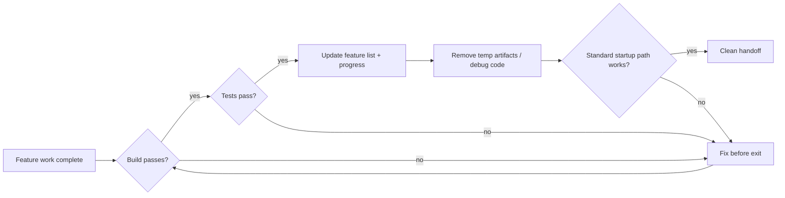
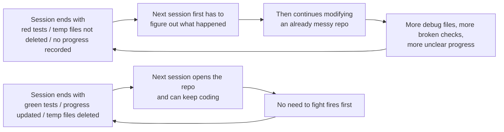

[中文版 →](../../../zh/lectures/lecture-12-why-every-session-must-leave-a-clean-state/)

> Приклади коду: [code/](https://github.com/walkinglabs/learn-harness-engineering/blob/main/docs/uk/lectures/lecture-12-why-every-session-must-leave-a-clean-state/code/)
> Практичний проєкт: [Проєкт 06. Побудова повного робочого простору агента](./../../projects/project-06-runtime-observability-and-debugging/index.md)

# Лекція 12. Залишайте чистий стан наприкінці кожної сесії

Ваш агент працює цілий день, змінює 20 файлів, комітить код, і сесія завершується. Наступна сесія стартує і одразу виявляє: збірка зламана, тести червоні, тимчасові debug-файли розкидані скрізь, список функцій не оновлено, а прогрес повністю непрозорий. Перші 30 хвилин нової сесії витрачаються виключно на те, щоб «з'ясувати, що ж насправді зробила попередня сесія».

Як OpenAI, так і Anthropic чітко стверджують: **довгострокова надійність залежить від операційної дисципліни, а не лише від успіху одного запуску.** Якість стану наприкінці кожної сесії безпосередньо визначає ефективність наступної.

## Зростання ентропії — це стан за замовчуванням

Закони Лемана про еволюцію програмного забезпечення говорять нам, що системи, які безперервно змінюються, неминуче ускладнюватимуться, якщо не керувати ними активно. Це особливо справедливо для агентів AI-кодування. Кожна сесія вносить зміни, і без очищення при виході технічний борг накопичується в геометричній прогресії.

Під час п'яти місяців експериментів із Codex OpenAI помітила дещо разюче: **агенти копіюють патерни, що вже є в репозиторії, навіть коли ці патерни непослідовні або неоптимальні.** З часом таке копіювання неминуче призводить до деградації. Перша людина залишає чашку кави в загальному просторі; друга вирішує «і так уже безлад» та залишає ще одну; через тиждень стіл завалений чашками. З кодовою базою відбувається те саме.

Команда OpenAI спочатку витрачала 20% кожної п'ятниці на ручне прибирання «AI-мотлоху», але такий підхід явно не масштабується. Зрештою вони дійшли до систематичного рішення:

1. **Закодувати «золоті правила» в репозиторій**: правила на кшталт «надавайте перевагу спільному utility-пакету перед написаними нашвидкуруч допоміжними функціями» (тримайте інваріанти централізовано) і «не вгадуйте наосліп структури даних» (валідуйте межі або покладайтеся на типізовані SDK). Ці правила конкретні, механічні та автоматично перевірювані.
2. **Встановити регулярні робочі процеси очищення**: флот фонових завдань Codex, які регулярно сканують відхилення, оновлюють оцінки якості та відкривають цільові PR рефакторингу. Більшість можна переглянути й автоматично злити за хвилину.
3. **Один раз зафіксувати смак людини, застосовувати його постійно**: коментарі до рев'ю, PR рефакторингу та баги, що дійшли до користувачів, — усе це перекладається в оновлення документації або безпосередньо кодується в інструментарії. Коли документації недостатньо, переводьте правило в код.

Технічний борг — це кредит з високими відсотками. Безперервно погашати його невеликими частинами майже завжди краще, ніж дати йому накопичитися до одного масштабного погашення.

> Джерело: [OpenAI: Harness engineering: leveraging Codex in an agent-first world](https://openai.com/index/harness-engineering/)

## Чистий стан: більше ніж «код компілюється»

Чистий стан — це не просто «код компілюється». Збірка без помилок — найбазовіша вимога: наступна сесія не повинна спочатку виправляти помилки збірки. Усі тести теж мають проходити, включно з тими, що існували до сесії; сесія відповідає за те, щоб не зламати наявний функціонал. І це потрібно перевіряти в CI, а не просто «працює у мене».



Але й цього недостатньо. Поточний прогрес має бути зафіксований у машинозчитуваних артефактах: виконані підзавдання з їхніми критеріями проходження, підзавдання в процесі виконання з поточним станом, а також ті, що ще не розпочато. Хороші записи прогресу можуть скоротити час діагностики при запуску сесії на 60–80%. Тимчасові артефакти — debug-логи, тимчасові файли, закоментований код, маркери TODO — також потрібно прибирати, оскільки вони підвищують когнітивне навантаження для наступної сесії. Стандартний шлях запуску теж має залишатися робочим. Чи може наступна сесія приступити до роботи без ручного втручання? Ініціалізація середовища, завантаження кодової бази, отримання контексту, вибір задачі — жоден із цих шляхів не може бути зламаний.



## Основні концепції

- **Чистий стан**: система повинна задовольняти п'ять умов наприкінці сесії — збірка проходить, тести проходять, прогрес зафіксовано, застарілих артефактів немає, шлях запуску доступний. Відсутність будь-якої з умов означає, що сесія не «завершена».
- **Цілісність сесії**: за аналогією з транзакціями бази даних — або повний коміт і чистий стан, або відкат до останнього узгодженого стану. Ніяких проміжних варіантів.
- **Документ якості**: активний артефакт, що безперервно фіксує оцінки якості кожного модуля. Не одноразова оцінка, а трекер, що показує, стає кодова база міцнішою чи слабшою з часом.
- **Цикл очищення**: регулярна сесія технічного обслуговування, спрямована на систематичне зниження ентропії в кодовій базі. Не аварійне виправлення, а рутинні операції.
- **Спрощення harness**: у міру покращення можливостей моделі — періодично видаляти компоненти harness, які більше не потрібні. Обмеження, яке є необхідним сьогодні, може виявитися зайвим накладним витратами через три місяці.
- **Ідемпотентне очищення**: операції очищення дають однаковий результат незалежно від кількості запусків, що гарантує безпечність очищення навіть у сценаріях повторних спроб після збою.

## «Прибрати пізніше» означає ніколи не прибирати

Найпоширеніша ментальна пастка — «у цій сесії часу прибирати немає, зроблю наступного разу». Але наступна сесія агента не знає, що ви залишили — вона бачить хаотичний код і невизначений стан. Вона витратить значний час на те, щоб вивести «яка частина цього коду навмисна, а яка тимчасова».

Гірше того, кожна сесія має власні цільові завдання. Нова сесія існує для нової роботи, а не для прибирання безладу попередньої. Вона проігнорує хаос і почне нову роботу поверх нього, додаючи ще більше хаосу. Це петля позитивного зворотного зв'язку ентропії.

Цифри говорять самі за себе. Проєкт, що розроблявся з агентами 12 тижнів без стратегії очищення:

- Тиждень 1: рівень проходження збірки 100%, рівень проходження тестів 100%, запуск нової сесії 5 хв
- Тиждень 4: збірка 95%, тести 92%, запуск 15 хв
- Тиждень 8: збірка 82%, тести 78%, запуск 35 хв
- Тиждень 12: збірка 68%, тести 61%, запуск 60+ хв

Той самий проєкт зі стратегією очищення:

- Тиждень 1: 100%, 100%, 5 хв
- Тиждень 12: 97%, 95%, 9 хв

Після 12 тижнів: рівень проходження збірки відрізняється на 29 відсоткових пунктів, час запуску нової сесії — на 85%. Це не теорія — це спостережувана різниця.

## Як це зробити

### 1. Чистий стан — необхідна умова завершення

Визначте явно в harness: **завершення сесії = задача проходить верифікацію І перевірка чистого стану проходить.** Відсутність будь-якої з умов означає незавершеність сесії. Запишіть у CLAUDE.md:

```
## Session Exit Checklist
- [ ] Build passes (npm run build)
- [ ] All tests pass (npm test)
- [ ] Feature list updated
- [ ] No debug code remaining (console.log, debugger, TODO)
- [ ] Standard startup path available (npm run dev)
```

### 2. Двохрежимна стратегія очищення

Поєднуйте два режими очищення:

**Негайне очищення (наприкінці кожної сесії)**: прибирайте тимчасові артефакти, створені під час сесії, оновлюйте стан списку функцій, переконуйтесь у проходженні збірки та тестів. Це очищення за принципом «підрахунку посилань» — прибирайте одразу після того, як щось перестало використовуватись.

**Periodичне очищення (щотижня)**: повне сканування системи — обробка накопичених структурних проблем, оновлення документів якості, запуск бенчмаркових тестів для виявлення деградації. Це очищення за принципом «трасування» — комплексний прохід технічного обслуговування з регулярною каденцією.

### 3. Ведіть документ якості

Документ якості — це активний артефакт, що безперервно оцінює кожний модуль:

```markdown
# Quality Document

## User Authentication Module (Quality: A)
- Verification passing: Yes
- Agent understandable: Yes
- Test stability: Stable
- Architecture boundaries: Compliant
- Code conventions: Followed

## Payment Module (Quality: C)
- Verification passing: Partial (payment callback untested)
- Agent understandable: Difficult (logic spread across 3 files)
- Test stability: Unstable (2 flaky tests)
- Architecture boundaries: Violations present
- Code conventions: Partially followed
```

Нові сесії читають цей документ і одразу знають, що пріоритизувати. Виправляйте спочатку модуль із найнижчою оцінкою.

### 4. Periodично спрощуйте harness

Кожен компонент harness існує тому, що модель не могла самостійно надійно виконати щось. Але з покращенням моделей ці припущення застарівають.

Експерименти Anthropic продемонстрували це безпосередньо. Початковий harness включав механізм розбивки на спринти — ділення роботи на невеликі частини для того, щоб Sonnet 4.5 виконував їх по одній. Коли вийшов Opus 4.6, нативні можливості моделі могли самостійно обробляти декомпозицію роботи, що зробило побудову спринтів зайвими накладними витратами. Після видалення цього компонента агент-будівник міг безперервно працювати понад дві години без відхилень — і насправді ставав плавнішим.

Але з евалюатором ситуація була іншою. Навіть із посиленими можливостями Opus 4.6, коли задачі наближалися до межі можливостей моделі, евалюатор усе ще давав реальну цінність — виявляв відсутній функціонал і заглушки в реалізації генератора. Це означає, що евалюатор — не фіксоване рішення «так/ні»; він залежить від того, де складність задачі знаходиться відносно можливостей моделі.

**Рекомендована практика**: щомісяця обирайте один компонент harness, тимчасово вимикайте його та запускайте бенчмаркові задачі. Якщо результати не погіршуються — видаляйте назавжди. Якщо погіршуються — відновлюйте або замінюйте легшою альтернативою.

Більш глибокий принцип: **у міру покращення моделей цікаві комбінації в harness не зменшуються — вони зміщуються.** Проблеми, які раніше вимагали явних рішень, поглинаються можливостями моделі, але нові межі можливостей відкривають простори дизайну harness, які раніше були неможливі. Завдання AI-інженера — безперервно знаходити наступну цінну комбінацію.

### 5. Операції очищення мають бути ідемпотентними

Скрипти очищення повинні бути безпечними для багаторазового запуску — ще один запуск не повинен давати побічних ефектів:

```bash
# Idempotent cleanup operations
rm -f /tmp/debug-*.log  # -f ensures no error when files don't exist
git checkout -- .env.local  # Restore to known state
npm run test  # Verify cleanup didn't break anything
```

### 6. Висока пропускна здатність змінює філософію злиття

Коли вихід агента значно перевищує можливості людини переглядати, традиційна філософія злиття потребує коригування. Досвід команди OpenAI: у середовищі, де агент відкриває 3,5 PR на день (а згодом і більше), мінімізація блокуючих воріт злиття — правильне рішення. PR мають бути короткоживучими; нестабільність тестів зазвичай усувається наступними запусками, а не блокує прогрес безкінечно. У системі, де вартість виправлення низька, а вартість очікування висока, рухатись швидко з швидкими виправленнями — краща стратегія, ніж повільне підтвердження.

**Застереження**: це безвідповідально в середовищі з низькою пропускною здатністю. Але коли вихід агента значно перевищує увагу людини, це часто правильний компроміс. Ключовий критерій: **середня вартість виправлення бага проти середньої вартості очікування, доки людина переглядає PR.** Коли перше нижче другого — швидке злиття є правильним рішенням.

## Реальний кейс

Electron-застосунок, що розроблявся з агентами 12 тижнів, порівняння двох підходів:

**Без стратегії очищення** (контрольна група): тиждень 12, рівень проходження збірки 68%, рівень проходження тестів 61%, запуск нової сесії 60+ хв, 103 застарілих артефакти.

**Зі стратегією очищення** (експериментальна група): повна перевірка чистого стану наприкінці кожної сесії плюс щотижневий цикл очищення. Тиждень 12, рівень проходження збірки 97%, рівень проходження тестів 95%, запуск нової сесії 9 хв, 11 застарілих артефактів.

До тижня 12 рівень проходження збірки в експериментальній групі був вищим на 29 відсоткових пунктів, рівень проходження тестів — на 34 пункти, а час запуску нової сесії — на 85% нижчим. Кожна сесія витрачала додаткові 5 хвилин на очищення, але за 12 тижнів це заощадило десятки годин хаосу.

## Головні висновки

- **Чистий стан — необхідна умова завершення сесії** — не опціональне прибирання, а частина «визначення завершеності».
- **Усі п'ять вимірів є обов'язковими** — збірка, тести, прогрес, артефакти, запуск — кожен має бути явно перевірений.
- **Документи якості роблять здоров'я кодової бази відстежуваним** — ви можете проактивно виправляти лише те, про що знаєте, що деградує.
- **Periodично спрощуйте harness** — у міру покращення можливостей моделі видаляйте обмеження, які більше не потрібні.
- **«Прибрати пізніше» дорівнює «ніколи не прибирати».** Зростання ентропії — стан за замовчуванням; лише активне очищення протидіє йому.

## Додаткова література

- [Clean Code - Robert C. Martin](https://www.goodreads.com/book/show/3735293-clean-code) — Систематичні принципи чистоти коду
- [Harness Engineering - OpenAI](https://openai.com/index/harness-engineering/) — Відтворюваність як основна вимога дизайну harness
- [Effective Harnesses - Anthropic](https://www.anthropic.com/engineering/effective-harnesses-for-long-running-agents) — Критична роль чистих виходів із сесій для довгострокової надійності
- [Programs, Life Cycles, and Laws of Software Evolution - Lehman](https://ieeexplore.ieee.org/document/1702314) — Закони еволюції програмного забезпечення, що доводять неминуче зростання складності системи без активного обслуговування

## Вправи

1. **Чекліст чистого стану**: розробіть чекліст виходу із сесії для вашої кодової бази, що охоплює всі п'ять вимірів. Застосуйте його протягом 5 послідовних сесій і зафіксуйте кількість порушень за кожним виміром.

2. **Порівняння бенчмарків**: використайте фіксований набір задач із двома варіантами harness (з/без вимог чистого стану). Порівняйте рівень завершення, кількість повторних спроб та рівень виходу дефектів.

3. **Практика спрощення harness**: оберіть один компонент harness, тимчасово вимкніть його та запустіть бенчмаркові задачі. Порівняйте результати з ним і без нього. Вирішіть: залишити, видалити або замінити.
