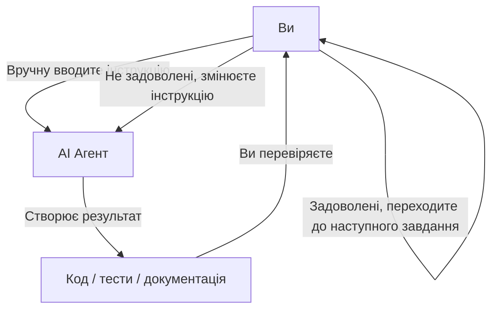
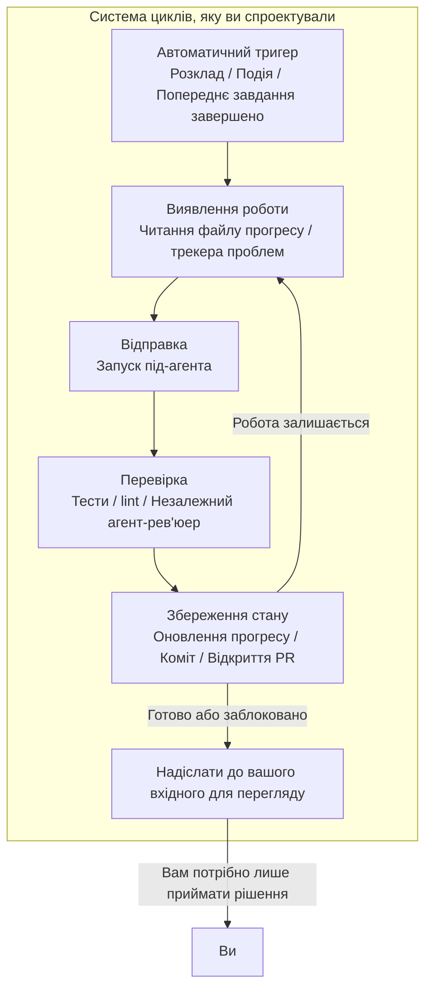
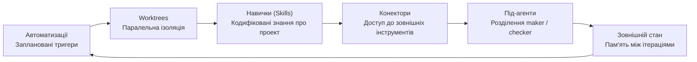
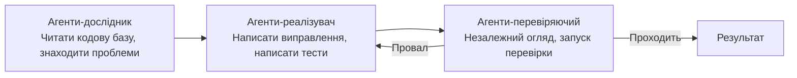
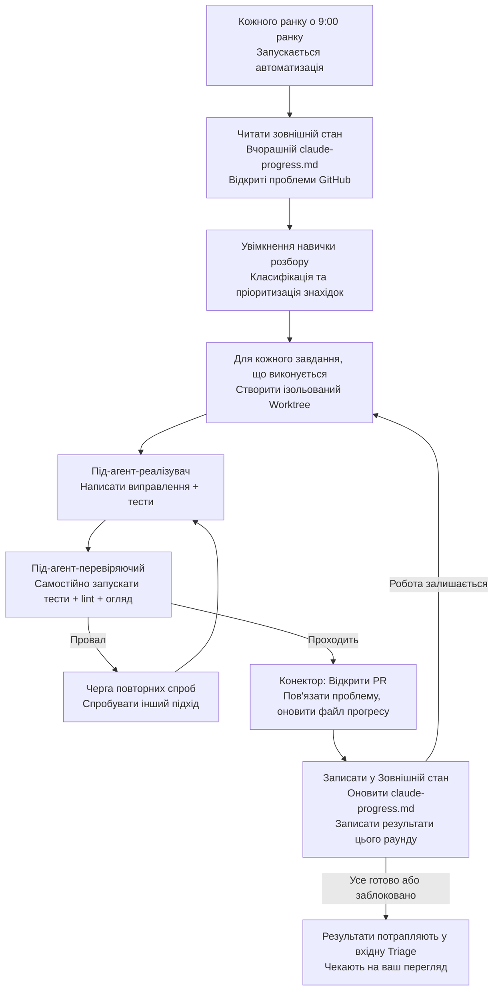
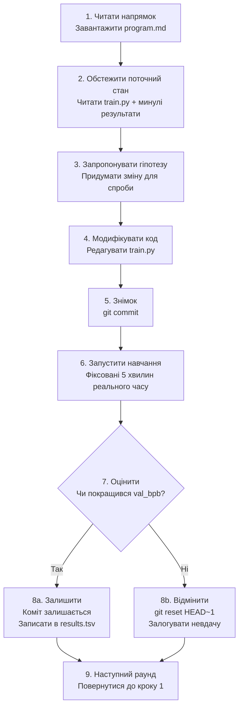

[English Version →](../../../en/lectures/lecture-13-loop-engineering/)

> Приклади коду: [code/](https://github.com/walkinglabs/learn-harness-engineering/blob/main/docs/en/lectures/lecture-13-loop-engineering/code/)
> Практичний проект: [Проект 07. Побудова вашого першого автоматизованого циклу](./../../projects/project-07-loop-engineering-first-loop/index.md)

# Лекція 13. Від ручного введення промптів до автономних циклів

Все, що ви вивчили у перших дванадцяти лекціях, спирається на одному припущенні: **ви сидите за клавіатурою і вводите інструкції одну за одною.**

Ви написали `AGENTS.md` (Лекції 1–4), створили управління станом (Лекції 5–6), обмежили обсяг за допомогою списків функцій (Лекції 7–8), залишали чисті передачі наприкінці сесій (Лекції 9, 12) та зробили середовище виконання спостережуваним (Лекції 10–11). Але тригером для всього цього завжди були ви. Агент ніколи сам не вирішував, коли почати роботу — бо ніхто не натиснув «старт».

Ця лекція про те, щоб передати кнопку запуску системі. Не віддаючи контроль — а піднімаючи його на наступний рівень.

## /goal: Найпростіший можливий цикл

Найкращий вхід до loop engineering — не складна архітектурна діаграма, а одна команда.

На початку 2026 року Claude Code та OpenAI Codex незалежно один від одного випустили однакову функцію: `/goal`. Ви вводите в терміналі:

```
/goal "Усі тести проходять, нульових попереджень lint, злиття в main"
```

Потім ви закриваєте ноутбук і йдете спати. Вісім годин потім агент самостійно проаналізував, написав код, протестував, виправив і злив. Він повторює спроби при невдачі, змінює підхід, якщо застряг, і зупиняється, коли готово — без того, щоб ви стояли над душою й казали «спробуй ще раз».

Єдина різниця між `/goal` та традиційним промптом — одна річ. Але ця одна річ змінює все:

| | Традиційний промпт | `/goal` |
|---|---|---|
| Що ви надаєте | Що робити далі | Як виглядає кінцевий стан |
| Що робить агент | Виконує один раз | Циклічно повторює, поки не досягне |
| Хто визначає готовність | Ви | Перевірена умова зупинки |
| Коли ви можете відійти | Не можете | У момент введення `/goal` |

`/goal` — це, по суті, цикл. У нього є рівно три частини: **мета, метод перевірки та умова зупинки.** Лише ці три речі переміщують вас ізсередини циклу назовні.

### Як `/goal` зростав органічно

`/goal` не з'явився з ніде. Він поступово виріс із повсякденних робочих процесів, пройшовши приблизно чотири етапи:

**Етап 1: Ручне введення промптів один за одним.** Найраніший спосіб роботи був взаємодія «запит-відповідь»: «напиши функцію», «додай тест», «виправ цю логіку». Агент зупинявся після кожного кроку і чекав, поки ви скажете, що далі. Ви були планувальником усього конвеєра.

**Етап 2: Довгі промпти з кількома кроками.** Потім люди почали писати довші промпти, що складають кроки разом: «спочатку проаналізуй код, потім напиши реалізацію, потім запусти тести, і якщо вони проваляться, виправ їх». Агент міг виконати кілька кроків за один раз, але вам все ще доводилося спостерігати — бо він може зійти з курсу посередині, або завершити крок і не знати, що робити далі.

**Етап 3: Саморефлексія та самоврядування агента.** Після цього агенти отримали «інтроспекцію» — після кожного кроку вони дивилися на результат і вирішували, що робити далі. Ви ставали мету, і вони самі розбивали її на частини та самостійно повторювали спроби. Але виникла проблема: коли вони зупиняються? Чи рахується «я готовий», що звучить від самого агента? Практика постійно відповідала — ні. Агенти оголошують перемогу занадто легко.

**Етап 4: Незалежне судження про зупинку — `/goal`.** Останнім кроком було вилучення «оцінки готовності» з рук агента, який виконує роботу, і передача її незалежному судді. Це може бути інша модель, скрипт або команда тестування — але правило було тим самим: людина, що пише код, не може оцінювати власну домашню роботу. На цьому етапі `/goal` справді запрацював: ви ставите мету, цикл працює, незалежний суддя вирішує, коли зупинитися, і ви можете відійти.

Ці чотири етапи не були дорожньою картою, запланованою якоюсь компанією. Це був шлях, до якого незалежно дійшли усі, хто програмував з агентами, підштовхнувшись однаковими болями. Те, що Claude Code та Codex випустили `/goal` майже одночасно на початку 2026 року — не збіг; час настав.

### Існує більше одного виду циклів

`/goal` — найпростіший для розуміння цикл, але він не єдиний. Цикли поділяються на категорії залежно від того, як вони запускаються і як зупиняються:

| Тип | Тригер | Умова зупинки | Claude Code | Codex | Найкраще для |
|------|---------|----------------|-------------|-------|----------|
| **Цикл на основі ходів** | Ви вручну вводите кожен промпт | Агент вважає, що готовий, або ви перериваєте | Звичайний чат | Звичайний чат | Невеликі завдання, дослідницька робота |
| **Цикл на основі мети** | Ви ставите мету | Незалежний оцінювач підтверджує готовність, або досягнуто максимальну кількість ходів | `/goal` | `/goal` (потрібне ручне увімкнення) | Складні завдання з чіткими критеріями завершення |
| **Часовий цикл** | Запланований інтервал (кожні N хвилин/годин) | Ви зупиняєте вручну, або він виходить після завершення роботи | `/loop` | Автоматизація потоків | Опитування статусу, періодичні перевірки, повторювана робота |
| **Цикл на основі подій** | Зовнішня подія (відкрито PR, впав CI, нова проблема) | Зупиняється після обробки події, або досягає ліміту повторень | Routines (API / GitHub Webhook) | Автономна автоматизація + плагіни | Реактивні робочі процеси, інтеграція CI/CD |

Це не конкуренти — це різні інструменти для різних завдань. На основі ходів добре для дрібниць. Використовуйте `/goal`, коли є чітка фінішна пряма. Використовуйте `/loop`, коли потрібно за чимось спостерігати. Використовуйте на основі подій, коли інтегруєтеся із зовнішніми системами.

### Не плутайте `/goal` та `/loop`

Обидва мають «loop» в назві, але вирішують абсолютно різні проблеми:

| | `/goal` | `/loop` |
|---|---------|---------|
| **Що це** | Одне велике завдання, працює, поки не буде виконане | Одна мала дія, повторюється з інтервалом |
| **Умова зупинки** | Мета досягнута, або бюджет вичерпано | Ви зупиняєте вручну, або завдання виходить самостійно |
| **Часовий профіль** | Один довгий запуск, може тривати години або дні | Періодичні короткі спалахи, кожен запуск може тривати кілька хвилин |
| **Прогрес** | Кожна ітерація наближає до фінішної прямої | Кожен запуск незалежний, немає кумулятивного прогресу |
| **Аналогія** | Біг марафону — дають старт, ви зупиняєтеся на фініші | Будильник — дзвонить за розкладом, ви його вимикаєте |
| **Типове використання** | «Реалізуй повну платіжну систему з покриттям тестами» | «Перевіряй, чи зламано CI, кожні 15 хвилин» |

Поширена помилка: заштовхнути те, що має бути `/goal`, у `/loop`. Наприклад, написати `/loop 10m "продовжуй реалізовувати платіжну систему"` — це неправильно. `/loop` запускає однакову інструкцію незалежно кожного разу, він не пам'ятає, де зупинився минулого разу. Ви просто отримаєте одну й ту ж точку початку знову і знову.

**Одне речення для перевірки, що використати: чи має ця річ кінець?**
- Має кінець → `/goal`
- Немає кінця, просто потрібно продовжувати спостерігати → `/loop`

Loop Engineering, тема цієї лекції — не про якусь одну команду. Це про **здатність проектувати системи, що включають усі ці типи — щоб ваш агент міг продовжувати працювати, навіть коли вас немає.**

Вам не потрібно вводити `/goal` кожного разу. Але розуміння, звідки воно взялося і чому воно виглядає саме так — це розуміння суті loop engineering. Більш складні цикли просто додають такі частини, як планування, паралелізм, ізоляція та пам'ять поверх цих самих трьох основ: мета, перевірка, умова зупинки.

## Червень 2026: Троє людей запалили той самий запал за один тиждень

У перший тиждень червня 2026 року троє практиків, що будували інфраструктуру агентів кодування — не порівнюючи нотатки — сказали те ж саме різними словами.

**Пітер Штайнбергер** (творець OpenClaw, [його допис набрав 8 мільйонів переглядів](https://x.com/steipete/status/2063697162748260627)): «Ви більше не повинні писати промпти для агентів кодування. Ви повинні проектувати цикли, які пишуть промпти для ваших агентів.»

**Борис Черний** (керівник Claude Code в Anthropic, [на підкасті Acquired](https://x.com/rohanpaul_ai/status/2063289804708835412)): «Я більше не пишу промпти для Claude. У мене працюють цикли, які пишуть промпти для Claude і вирішують, що робити. Моя робота — писати цикли.»

**Едді Османі** (інженерний лід у Google Chrome) [ввів назву концепції](https://addyosmani.com/blog/loop-engineering/) 7 червня 2026 року і дав їй визначення в одній строці:

> **Loop engineering — це заміна себе як людини, яка пише промпти для агента. Ви проектуєте систему, яка робить це замість вас.**

Черний розкрив цифри: протягом понад 30 послідовних днів усі внески коду в Claude Code були зроблені автономно ШІ — 259 злитих PR, понад 80% продуктивного коду, написаного Claude, і 76% успішності у відкритих програмних завданнях.

Троє людей. Один тиждень. Однаковий висновок. Не тому що вони координувалися — а тому що інфраструктура тихо перетнула поріг. Агенти стали достатньо надійними, щоб виконувати нетривіальні завдання без нагляду. Примітиви планування (`/loop`, `/goal`, cron) тепер вбудовані в інструменти. Вартість одного запуску агента впала достатньо низько, щоб запускати його повторно за таймером і не вважати це марнотратством. Коли всі частини на місці, хід, який їх поєднує, стає очевидним для всіх одночасно.

> Джерело: [Едді Османі: Loop Engineering](https://addyosmani.com/blog/loop-engineering/)

## Всередині циклу проти поза циклом

Порівняємо два конкретних сценарії.

**Сценарій А: Ви всередині циклу (Лекції 1–12).**



У вас є повний hарнес: `AGENTS.md` розповідає агенту правила проекту, `feature_list.json` обмежує обсяг, `init.sh` забезпечує послідовне середовище, `claude-progress.md` записує прогрес. **Але кожен крок все ще вимагає вашого ручного ініціювання.** Завершили одну функцію, прочитали файл прогресу, подумали, що далі, ввели інструкцію. Ви є двигуном усього робочого процесу.

**Сценарій Б: Ви поза циклом (Loop Engineering).**



Ви більше не вводите інструкції. Система, яку ви спроектували, виявляє роботу, відправляє її, перевіряє результати, записує стан і вирішує наступний крок. Ваша робота зменшується до трьох речей: **визначити мету та умову зупинки перед початком, переглянути результат після завершення та коригувати правила, коли система збиває з курсу.** Плече переміщується з «написання правильного промпту» на «проектування правильного циклу».

> Османі: «Рік тому, якщо вам потрібен був цикл, ви писали купу bash і підтримували цю купу вічно, і вона була вашою і лише вашою. Тепер частини просто поставляються всередині продуктів.» Вам не потрібно будувати з нуля. Вам потрібно розуміти, як частини підходять одна до одної.

## Основні концепції

- **Loop Engineering**: Проектування системи, яка автоматично пише промпти для вашого агента, замінюючи ручний покроковий людський ввід. Людина переміщується ізсередини циклу назовні, і плече зміщується з «написання правильного промпту» на «проектування правильного циклу».
- **Режим `/goal`**: Найпростіший можливий цикл — надайте мету, метод перевірки та умову зупинки; агент циклічно працює, поки не досягне. Міст від ручного введення промптів до автономних циклів.
- **Розділення генератора/оцінювача**: Агент, який пише код, і агент, який його перевіряє, мають бути розділені. Модель, що оцінює власну роботу, ненадійна; незалежний перевіряючий — іноді з використанням зовсім іншої моделі — це базова гарантія надійності будь-якого циклу.
- **Ізоляція worktree**: Кожен паралельний агент працює в незалежному git worktree, фізично запобігаючи зіткненням файлів. Інфраструктурна передумова для багатоагентного паралельного виконання.
- **Зовнішній стан**: Пам'ять, що живе поза одним розмовою — markdown-файли, трекери проблем, канбан-дошки. Моделі забувають все між запусками; пам'ять має жити на диску.
- **Чотири тихі вартості**: Чотири приховані витрати, які стають гострішими, чим довше працює цикл — борг перевірки, розуміннява гниль, когнітивна здача, вибух токенів. Цикли прискорюють не лише виведення, а й ризик.

## Шість примітивів циклу

Османі розклав цикл на п'ять основних будівельних блоків, плюс один шар пам'яті, який пронизує усі їх — усього шість речей, але шар пам'яті займає особливий статус: це не компонент на тому ж рівні, що й інші; це хребет, на якому все інше спирається.

На діаграмі нижче усі шість намальовані кільцем, щоб ви могли побачити повну картину з першого погляду. Але пам'ятайте: Зовнішній стан — це не просто ще одна зупинка на циклі — це фундамент, на якому спирається весь цикл.



### 1. Автоматизації — серцебиття

Без автоматизації цикл — не цикл; це одноразовий запуск, який ви зробили вручну.

І Claude Code, і Codex мають повні системи планування, але вони використовують різні назви та рівні. Приблизне відображення від найлегшого до найважчого:

| Рівень | Claude Code | Codex | Примітки |
|-------|-------------|-------|-------|
| Опитування всередині сесії | `/loop` | Автоматизація потоків | Пов'язано з поточною сесією, вмирає при закритті сесії |
| Локальні заплановані завдання | Заплановані завдання на робочому столі | Автономна автоматизація (локальний режим) | Працює, коли машина увімкнена, може отримувати доступ до локальних файлів |
| Хмарні заплановані завдання | Cloud Routines | — (немає вбудованого хмарного планувальника) | Працює, коли машина вимкнена |
| Тригери подій | Routines (API / GitHub Webhook) | Автономна автоматизація + плагіни | Запускаються зовнішніми подіями |
| Повністю самохостовані | GitHub Actions / самохостований cron | `codex exec` + cron | Повний контроль |

**Вкладка Automations у Codex** — точка входу для планування. Виберіть проект, промпт, частоту і чи запускати його на вашій локальній копії або у фоновому worktree. Запуски, які щось знаходять, потрапляють у вхідну скриньку Triage; запуски, що нічого не знайшли, автоматично архівуються. OpenAI використовує їх внутрішньо для щоденного розбору проблем, підсумків збоїв CI, брифінгів комітів та пошуку помилок, введених минулого тижня.

Автоматизації Codex бувають двох видів:
- **Автоматизація потоку** — повторювані дзвінки будильникового стилю, прикріплені до потоку, що зберігають контекст. Добре для безперервного слідкування за однією річчю, як-от моніторинг довготривалої команди або опитування статусу PR. Еквівалент у Claude Code — `/loop`.
- **Автономна автоматизація** — Кожен запуск починається заново, результати надходять до Triage. Добре для щоденних/тижневих незалежних завдань, як-от брифінги або сканування залежностей. Еквівалент у Claude Code — заплановані завдання на робочому столі.

Система Claude Code розшарована більш детально:

- **`/loop`** — Легковажна повторюваність за розкладом всередині сесії. Працює, поки ваш термінал відкритий, вмирає при закритті сесії, автоматично завершується через 7 днів. Добре для тимчасового моніторингу під час поточної робочої сесії.
- **Заплановані завдання на робочому столі** — Працює, коли ваша машина увімкнена, переживає перезапуск сесій, інтервали на рівні хвилин. Добре для повторюваної роботи, якій потрібен доступ до локальних файлів.
- **Cloud Routines** — Працює на хмарній інфраструктурі Anthropic, переживає вимкнення вашої машини, мінімальний інтервал 1 година. Підтримує три типи тригерів: запланований, виклик API, GitHub webhook. Добре для щоденних завдань, яким не потрібне ваше локальне середовище.
- **GitHub Actions / самохостований cron** — Повністю під вашим контролем, працює як завгодно. Добре для сценаріїв із спеціальними вимогами до середовища або безпеки.

```bash
# Claude Code: запускати тести кожні 30 хвилин, виправляти невдачі (в межах поточної сесії)
/loop 30m Запускай набір тестів і виправляй будь-які тести, що провалюються

# Claude Code: перевіряти статус деплою кожні 15 хвилин
/loop 15m Перевіряй, чи вдалося деплоїти в продакшн, і повідомляй статус
```

Автоматизації — це серцебиття. Без них цикл — це креслення, яке ніколи не прокинеться.

### 2. Worktrees — ізоляція у масштабі

Як тільки ви запускаєте більше одного агента, зіткнення файлів стають неминучим режимом відмови. Два агенти, що пишуть у той самий файл — це та сама головна біль, що й два інженери, які комітять ті самі рядки, не радлячись один з одним.

`git worktree` вирішує це: кожен агент працює на своїй гілці у своєму каталозі. Вони фізично не можуть торкатися чужого оточення.

І Claude Code, і Codex мають підтримку worktree. Коли ви використовуєте `--worktree` або `isolation: worktree` для під-агента, кожен помічник отримує чисте, незалежне оточення, яке самостійно очищається після себе. Worktrees прибирають механічну проблему зіткнень — але пам'ятайте: **ваша пропускна здатність на перегляд все ще є стелею.** Скільки паралельних агентів ви можете контролювати, визначає, скільки worktree ви реально можете запустити.

### 3. Навички (Skills) — припніть перерозповідати свій проект

Навичка — це те, як ви припиняєте перерозповідати один і той самий контекст проекту кожну сесію. Це папка, що містить `SKILL.md` з інструкціями та метаданими, плюс додаткові скрипти, довідники та активи.

Codex та Claude Code підтримують однаковий формат. Навички викликаються безпосередньо за допомогою `/skill-name` (Codex також підтримує `$skill-name`), або запускаються неявно, коли завдання відповідає опису навички.

Навички, по суті, про сплату вашого боргу наміру. Агент починає кожну сесію холодним — він заповнює будь-які прогалини у вашому намірі впевненими здогадками. Навичка — це цей намір, записаний ззовні: конвенції, кроки збірки, «ми не робимо це так через той один інцидент» — написано один раз, читається при кожному запуску.

### 4. Конектори — ваш цикл торкається реальних інструментів

Цикл, який може бачити лише файлову систему — це маленький цикл. Конектори (побудовані на протоколі MCP) дозволяють агенту читати ваш трекер проблем, запитувати базу даних, звертатися до стейджінгового API, залишати повідомлення у Slack.

І Codex, і Claude Code підтримують MCP, тому конектор, який ви написали для одного, зазвичай працює в іншому. Конектори — це різниця між «ось виправлення» і циклом, який сам відкриває PR, пов'язує квиток Linear і повідомляє канал, коли CI стане зеленим — у вашому реальному середовищі, а не просто в терміналі.

### 5. Під-агенти — тримайте Maker подалі від Checker

Найцінніша конструктивна вибір у циклі — розділити того, хто пише, від того, хто перевіряє. Модель, яка написала код, надто щедро оцінює власну домашню роботу. Другий агент з іншими інструкціями, а іноді й іншою моделлю, знаходить те, у що переконаний перший агент.

Класичне розділення на три ролі:



`/goal` у Claude Code працює так під капотом — нова, незалежна сесія оцінює, чи має цикл зупинитися, а не сесія, яка виконувала роботу. Це називається **розділенням генератора/оцінювача**, і це є найважливішою гарантією надійності у проектуванні циклів.

### 6. Зовнішній стан — пам'ять циклу

Моделі забувають все між запусками. Пам'ять має жити на диску, а не у вікні контексту.

Це звучить надто просто, щоб мати значення, але це та сама хитрість, на якій побудований кожен довгоживучий агент. Markdown-файл, дошка Linear — що завгодно, що живе поза однією розмовою і зберігає те, що зроблено, що в процесі і що далі. Агент забуває. Репозиторій — ні.

Ці шість примітивів — це ваш набір інструментів для проєктування циклів. Вам не потрібні усі для кожного циклу. Але вам потрібно знати, коли до якого звертатися.

## Повний цикл, анатомізований

З'єднайте всі шість разом, і ось як виглядає реальний ранковий цикл розбору:



Це вже не один запуск агента. Це безперервно працююча система, яка прокидається кожного ранку, самостійно прибирає на робочому місці і ставить те, що потребує вашої уваги, перед вами. Ваша роль стає такою: **переглядати вміст вхідної скриньки, приймати рішення, і коли ви помічаєте патерн, з яким система не може впоратися, уточнювати навички та правила.**

Черний використав цей патерн, щоб злити 259 PR за 30 днів, жодного разу не відкриваючи IDE. Інженери OpenAI використали той самий патерн, щоб вручну побудувати бета-продукт приблизно на мільйон рядків — жодного разу не написавши рядок коду самостійно.

## Розділення генератора/оцінювача: чому ви не можете дозволити моделі оцінювати власну роботу

Це найважчий урок у loop engineering.

Ваш найрозумніший агент пише чудовий фрагмент коду. Логіка зрозуміла, коментарі ретельні, і кожна функція має тест. Ви задоволені.

Але ось питання: **якщо ви дозволите агенту, який написав цей код, оцінити, чи добре він справився, що він скаже?**

Відповідь знову і знову підтверджується досвідом: він поставить собі високу оцінку. Не тому, що він нечесний, а тому, що він автор — він переконав себе, що цей шлях правильний під час генерації. Коли він дивиться назад, він не бачить помилок; він бачить власний процес міркування.

Це не проблема Claude. Це не проблема GPT. Це властивість усіх генеративних моделей. **Модель — найкращий захисний адвокат власного виводу.**

Виправлення: ніколи не дозволяйте тій самій сутності (тій самій моделі, тому самому промпту) робити і роботу, і перевірку.

- `/goal` у Claude Code використовує незалежну сесію супервизора, щоб оцінити, чи досягнута мета — а не сесія, яка намагалася це зробити.
- Система під-агентів Codex дозволяє визначити агента-перевіряючого з використанням іншої моделі з іншими зусиллями міркування.
- Спільнотна практика «adversarial verify» породжує N незалежних скептиків на кожну знахідку, кожному з яких дається завдання спростувати — більшість відмов знищує знахідку.

Одне речення для запам'ятовування: **хтось у вашій команді має вам не вірити.**

## autoresearch Карпатського: взірець циклу

Якщо ви хочете побачити, як виглядає добре спроектований, реально працюючий цикл, [autoresearch Karpathy](https://github.com/karpathy/autoresearch) — це підручниковий приклад.

У березні 2026 року Карпатський випустив Python-проект на 630 рядків. Дайте йому один GPU і напрямок досліджень, і він працює всю ніч — виконуючи сотні експериментів навчання ML, залишаючи лише ті, які дійсно покращують результат. Проект набрав 66 000+ зірок протягом кількох днів після випуску.

### Три файли, три ролі

У всій системі є лише три основні файли, але розподіл праці вкрай чіткий:

| Файл | Хто редагує | Що робить |
|------|-------------|-------------|
| `prepare.py` | Ніхто (тільки для читання) | Підготовка даних, токенізатор, eval harness. Фіксована інфраструктура. |
| `train.py` (~630 рядків) | **AI Агент** | Визначення моделі, оптимізатор, цикл навчання. Майданчик агента — змінюй що завгодно. |
| `program.md` | **Ви** | Методологія дослідження, написана природною мовою. Ви редагуєте лише це. Розкажіть агенту, як досліджувати, як оцінювати, чого не чіпати. |

Цей тристоронній розділ — душа дизайну: **люди не чіпають код, вони чіпають напрямок; агенти не чіпають напрямок, вони чіпають код.** Ваша робота зміщується з написання Python на «написання культури дослідницької організації.»

### Вхід: як виглядає program.md

`program.md` — це мозок циклу. Це не код — це посібник з досліджень, написаний Markdown. Він приблизно містить:

- **Мета**: оптимізувати `val_bpb` (валідаційні біти на байт, чим нижче, тим краще)
- **Обмеження**: не чіпати `prepare.py`, залишатися в межах бюджету VRAM, фіксоване 5-хвилинне навчання
- **Напрямки досліджень**: спробувати різні архітектури, оптимізатори, розклади LR
- **Правила оцінки**: що рахувати поліпшенням, як реєструвати результати, що робити при невдачі
- **Залізне правило**: ніколи не зупинятися. Як тільки цикл запущено, продовжуй вічно

Ваш стартовий промпт для агента може бути коротким, як одне речення:

```
Подивися на program.md і почнемо новий експеримент!
```

Решта — на розсуд агента, який читає документ і приймає власні рішення.

### Дев'ятикроковий цикл ручної гребінки

У центрі autoresearch лежить **ручна гребінка (ratchet)** — вона рухається лише вперед, ніколи назад. Кожна ітерація суворо відповідає дев'яти крокам:



Він виконує приблизно 12 експериментів на годину. Нічний запуск (8 годин) — це близько 100 експериментів. Сам Карпатський запускав його протягом 2 днів — ~700 експериментів.

Фіксований 5-хвилинний бюджет реального часу — ключовий дизайнерський вибір — незалежно від того, що агент змінює, кожен експеримент займає рівно стільки ж часу. Це означає, що усі результати можна безпосередньо порівнювати за однакового бюджету часу — жодних суперечок про «цей працював довше, тому він кращий».

### Вивід: що ви бачите, коли прокидаєтеся

Після ночі роботи циклу ви сідаєте вранці і знаходить три речі:

**1. Історія Git (ручна гребінка, що рухається вперед)**

На основній гілці залишаються лише коміти, які дійсно покращили результат. Усе, що провалилося, було відкотено. `git log` — це перевірений дослідницький журнал.

**2. results.tsv (повний запис експериментів)**

Кожен окремий експеримент — успішний чи невдалий — логується:

```
timestamp    commit_hash    val_bpb    vram_mb    description
--------- ------------- ---------- ---------- ----------------------------
08:01:12  a1b2c3d       1.234     22100    базовий
08:06:15  d4e5f6g       1.228     22400    збільшено швидкість навчання на 10%
08:11:20  (відмінено)     1.241     21800    перехід на активацію GELU
08:16:08  h7i8j9k       1.219     23000    додано ваговий спад 0.01
...
```

**3. Дослідницький журнал (власний підсумок агента)**

Агент пише зрозумілі повідомлення комітів про те, що він спробував, що спрацювало, що ні, і що він планує спробувати далі. Ви читаєте їх — вам не потрібно читати дифи коду.

### Що він насправді знайшов

Результати початкового 2-денного запуску Карпатського з ~700 експериментами:

- З ~700 спроб знайдено приблизно **20 дійсних поліпшень, що складаються**
- Час навчання nanochat на рівні GPT-2 на 8×H100 зменшився з **2,02 години → 1,80 години**, приблизно **на 11% швидше**
- Знахідки включали: корекції швидкості навчання, налаштування оптимізатора, заміни активації, оптимізації патернів уваги тощо.

Чи були усі поліпшення земними відкриттями? Ні. Більшість були малими оптимізаціями, що складалися разом. Але ці 20 дійсних поліпшень зайняли б у людського дослідника тижні ручної роботи — агент зробив це за 48 годин.

### Найпоказовіша деталь: цикл написано англійською, а не кодом.

`program.md` — це документ Markdown, а не скрипт Python. Він описує методологію дослідження — що модифікувати, що залишати без змін, як оцінювати, як обробляти випадки невдачі, і одне залізне правило: **ніколи не просити людської допомоги, просто продовжуй.** Агент кодування читає цей документ і виконує його нескінченно.

Це шаблон для loop engineering: не давайте агенту завдання. Дайте йому **методологію**. Нехай методологія буде циклом. Один `program.md`, 630 рядків коду-склеювача, і все інше — це агент, який керує собою сам.

## Чотири тихі вартості

Коли цикл починає працювати, ви не побачите проблем відразу. Наступні чотири вартості накопичуються тихо, і до того часу, коли ви помітите, ви, можливо, вже сильно заплатили.

### 1. Борг перевірки

Швидкі цикли спокушають вас пропустити перевірку. «Виглядає добре» — це не те саме, що «підтверджено правильність». Чим більше коду генерує цикл без нагляду, тим швидше накопичується борг перевірки. Виправлення: **умови зупинки повинні перевірятися машиною, ніколи не «відчуває, що приблизно правильно».**

### 2. Розуміннява гниль

Чим швидше цикл випускає код, тим далі ваше розуміння власної кодової бази відходить від реальності. У команди Черного 80% коду було написано агентами — що означає, що більша частина коду команди не була написана людиною. Якщо ви не читаєте і не використовуєте те, що виробляє цикл, ваше розуміння постійно погіршується. **Швидкі цикли вимагають швидкого читання.**

### 3. Когнітивна здача

Коли цикл працює гладко, найзатишніша поза — припинити мати думки. Беріть, що він дає, не думайте про результат. Але саме тут починається небезпека — ви використовуєте цикл, щоб уникнути думання, а не щоб посилити думання. Попередження Османі: «Дві людини можуть побудувати той самий цикл і отримати протилежні результати. Один використовує його, щоб швидше рухатися по роботі, яку він розуміє; інший використовує його, щоб уникнути розуміння роботи. Цикл не знає різниці. Ви знаєте.»

### 4. Вибух токенів

Кожна ітерація циклу накопичує більше контексту: написаний код, зустрічені помилки, прийняті рішення. Без управління контекстом розмір промпту зростає приблизно квадратично залежно від кількості ходів. Codex вирішує це за допомогою автоматичного стиснення контексту — спеціалізований API стискає старі ходи розмови в зашифровані зведення вмісту, зберігаючи важливі знання, відкидаючи зайві деталі. Це інженерне питання, яке ви повинні вирішити з першого циклу, а не додавати пізніше.

## Побудова вашого першого циклу

Вам не потрібно починати з конвеєра масштабу Stripe, що зливає 1300 PR на тиждень. Почніть з найменшої речі, яка працює.

### Крок 1: Виберіть одне повторюване завдання

Знайдіть те, що ви робите вручну принаймні двічі на тиждень. Приклади:
- Вранці відкривати GitHub, перевіряти нові проблеми, розбирати і відповідати
- Перед кожним переглядом PR запускати lint та тести
- Наприкінці кожного дня оновлювати документацію прогресу

### Крок 2: Напишіть мету та умову зупинки

Перетворіть завдання на те, що може зрозуміти `/goal`:

```markdown
Мета: Перевірити 10 останніх проблем у репозиторії.
Для кожної проблеми:
  - Якщо вже має чіткі мітки та відповідального, пропустити
  - Якщо без міток, додати відповідні мітки за змістом
  - Якщо можна виправити менш ніж за 10 хвилин, створити гілку та спробувати виправити
Зупинитися коли: Усі відповідні проблеми оброблено, або проблема вимагає людського рішення.
```

### Крок 3: Розділіть Maker та Checker

Не дозволяйте тому самому агенту і писати код, і оцінювати його. Розділіть ваш цикл на дві ролі:
- Реалізувач: читає проблему, пише виправлення, пише тести
- Перевіряючий: самостійно запускає тести, переглядає диф, оцінює, чи виправлення дійсно вирішує проблему

### Крок 4: Додайте пам'ять

Використовуйте markdown-файл, щоб записувати, що сталося під час кожного запуску циклу. Наступний запуск починається з читання цього файлу — він знає, що було зроблено, що очікує, що було заблоковано. Це краще будь-якої складної бази даних.

### Крок 5: Встановіть таймер

Використовуйте `/loop` або cron вашої ОС, щоб цикл запускався без вас. Почніть з разу на день. Спостерігайте протягом тижня.

### Драблина зрілості

Вам не потрібно досягати вершини одним стрибком. Впровадження циклів — це драблина:

1. **Рівень 1: Виконавець мети** — Ви можете використовувати `/goal`, щоб поставити завдання з умовою зупинки; агент циклічно працює, поки не досягне.
2. **Рівень 2: Заплановане одне завдання** — Одна автоматизація виконує одне завдання за таймером (наприклад, ранкова перевірка CI).
3. **Рівень 3: Багатоагентний цикл** — Розділення maker та checker; кожна знахідка породжує ізольований worktree.
4. **Рівень 4: Самопостачальний цикл** — Цикл автоматично виявляє наступне завдання із зовнішнього стану; він сам вирішує, що робити далі.
5. **Рівень 5: Оркестрація флоту** — Кілька циклів працюють паралельно, незалежно, але спільно використовують шар пам'яті.

Більшість команд зараз знаходяться між Рівнем 2 та Рівнем 3. Рівень 1 — найшвидший шлях до отримання віддачі.

## Основні висновки

- **Loop Engineering не замінює Harness Engineering — він будує поверх нього.** Harness робить окремі запуски надійними. Цикл робить безперервні запуски автономними.
- **`/goal` — найпростіший можливий цикл:** мета + перевірка + умова зупинки. Ці три речі переміщують вас ізсередини циклу назовні.
- **Шість примітивів (Автоматизації / Worktrees / Навички / Конектори / Під-агенти / Зовнішній стан) — будівельні блоки циклу.** Не усі кожного разу, але вам потрібно знати, коли до якого звертатися.
- **Maker та checker мають бути розділені.** Модель, що оцінює власну роботу, ненадійна. Незалежний перевіряючий — іноді зовсім інша модель — це базова гарантія надійності будь-якого циклу.
- **Цикли роблять генерацію майже безкоштовною і залишають судження дефіцитним ресурсом.** Час, який ви заощаджуєте, — не для відпочинку. Він для прийняття більшої кількості рішень.
- **Чотири тихі вартості стають гострішими, чим довше працюють цикли:** борг перевірки, розуміннява гниль, когнітивна здача, вибух токенів. Цикли прискорюють виведення — і ризик.
- **Почніть з малих.** Один `/goal`, один cron, один markdown-файл пам'яті. Побачте віддачу, потім нарощуйте вгору.

## Подальше читання

- [Едді Османі: Loop Engineering](https://addyosmani.com/blog/loop-engineering/)
- [Едді Османі: Agent Harness Engineering](https://addyosmani.com/blog/agent-harness-engineering/)
- [Саймон Віллісон: Проектування агентних циклів (вер 2025)](https://simonw.substack.com/p/designing-agentic-loops)
- [Карпатський: autoresearch](https://github.com/karpathy/autoresearch)
- [Claude Code: Динамічні робочі процеси та оркестрація](https://kenhuangus.substack.com/p/claude-code-orchestration-dynamic)
- [Бібліотека циклів (Forward Future)](https://signals.forwardfuture.ai/loop-library/) — Публічний корпус з 50 реальних циклів
- [The Neuron: Творці Claude Code про агентні цикли](https://www.theneuron.ai/explainer-articles/claude-code-creators-boris-cherny-and-cat-wu-explain-how-to-use-agent-loops/)
- Лекція 12: [Залишайте чисту передачу наприкінці кожної сесії](./../lecture-12-why-every-session-must-leave-a-clean-state/index.md) — Передумова для циклів: кожна сесія залишає чистий стан, щоб наступний раунд міг автоматично початися
- Лекція 5: [Зберігайте безперервність довготривалих завдань між сесіями](./../lecture-05-why-long-running-tasks-lose-continuity/index.md) — Передумова для зовнішнього стану та пам'яті
- Лекція 11: [Чому спостережуваність належить всередині hарнесу](./../lecture-11-why-observability-belongs-inside-the-harness/index.md) — Чим швидше працює цикл, тим більше вам потрібна спостережуваність, щоб помічати проблеми
- Лекція 8: [Чому списки функцій є примитивами hарнесу](./../lecture-08-why-feature-lists-are-harness-primitives/index.md) — Списки функцій — це природне джерело даних для самопостачального циклу, щоб виявляти наступне завдання

## Вправи

1. **Перетворіть повторюване завдання на `/goal`:** Знайдіть те, що ви робите вручну принаймні двічі на тиждень. Запишіть його мету, метод перевірки та умову зупинки. Запустіть один раз з `/goal` і порівняйте час та якість з ручним виконанням. Це ваш перший крок від Harness до Loop.

2. **Розділіть maker та checker:** Виберіть завдання, яке ви раніше мали агент виконувати. Цього разу напишіть два різних промпти: один для агента-реалізувача, а інший для агента-перевіряючого (використовуйте різні моделі — наприклад, Claude для реалізації, GPT для перевірки, або навпаки). Перевіряючий повинен вказати на конкретні проблеми з доказами. Запишіть кількість та тип знайдених проблем у кожному режимі.

3. **Надайте вашому циклу пам'ять:** Створіть markdown-файл стану для вашого циклу. Під час кожної ітерації пишіть: що було зроблено у цьому раунді, результати перевірки, статус (прошло/не прошло/заблоковано) і що робити далі. Запустіть три раунди і спостерігайте за поведінковою різницею між наявністю та відсутністю файлу пам'яті.

4. **Перевірте тихі вартості вашого циклу:** Після того, як цикл пропрацює годину, оцініть чотири показники:
   - Скільки перевірки було «відчуває, що правильно», а не «підтверджено машиною»? (Борг перевірки)
   - Наскільки добре ви можете пояснити код, який ваш цикл нещодавно виробив? (Розуміннява гниль)
   - Скільки разів ви подумали «я подивлюся пізніше» і ніколи не подивилися? (Когнітивна здача)
   - Який тренд розміру контексту циклу? Чи повторює він зайву інформацію? (Вибух токенів)
