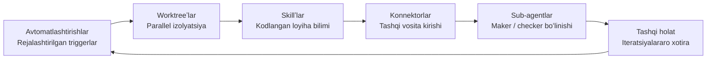
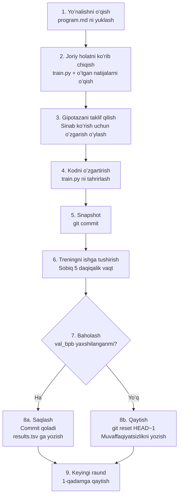

[English Version →](../../../en/lectures/lecture-13-loop-engineering/)

> Kod misollari: [code/](https://github.com/walkinglabs/learn-harness-engineering/blob/main/docs/en/lectures/lecture-13-loop-engineering/code/)
> Amaliy loyiha: [Loyiha 07. Birinchi avtomatlashtirilgan loop'ingizni qurish](./../../projects/project-07-loop-engineering-first-loop/index.md)

# 13-maʼruza. Qoʻlda prompt yozishdan avtonom loop'largacha

Birinchi oʻn ikki maʼruzada oʻrgangan hamma narsa bir taxminga tayanadi: **siz klaviatura oldida oʻtirib, birma-bir koʻrsatmalar terasiz.**

Siz `AGENTS.md` ni yozdingiz (1–4-maʼruzalar), holat boshqaruvini qurdingiz (5–6-maʼruzalar), funksiyalar roʻyxati bilan skopni chekladingiz (7–8-maʼruzalar), sessiya oxirida toza topshirish qoldirdingiz (9, 12-maʼruzalar) va runtime ni kuzatuvchan qildingiz (10–11-maʼruzalar). Lekin bularning barchasi uchun har doim siz trigger edingiz. Agent hech qachon oʻzi ish boshlashga qaror qilmagan — chunki hech kim "boshlash" tugmasini bosmagan.

Ushbu maʼruza boshlash tugmasini tizimga topshirish haqida. Nazoratni yoʻqotish emas — uni keyingi qavatga koʻtarish.

## /goal: Eng oddiy mumkin boʻlgan loop

Loop muhandisligiga kirishning eng yaxshi usuli murakkab arxitektura diagrammasi emas — bitta buyruq.

2026-yil boshida Claude Code va OpenAI Codex mustaqil ravishda bir xil funksiyani chiqardi: `/goal`. Siz terminalga yozasiz:

```
/goal "Barcha testlar oʻtsin, zero lint ogohlantirishlari boʻlsin, main'ga merge qiling"
```

Keyin siz noutbukni yopib, uxlashga borasiz. Sakkiz soatdan keyin agent oʻzi tahlil qiladi, kod yozadi, test qiladi, tuzatadi va merge qiladi. U muvaffaqiyatsizlikda qayta urinadi, tiqilib qolganda yondashuvni almashtiradi va tayyor boʻlganda toʻxtaydi — siz uning yelkasiga suyanib "qayta urinib koʻring" demasdan ham.

`/goal` va anʼanaviy prompt orasidagi yagona farq bitta narsada. Ammo bu bir narsa hamma narsani oʻzgartiradi:

| | Anʼanaviy Prompt | `/goal` |
|---|---|---|
| Nima berasiz | Keyin nima qilish kerak | Yakuniy holat qanday boʻlishi kerak |
| Agent nima qiladi | Bir marta bajaradi | Erishgunga qadar loop qiladi |
| Tugalligini kim baholaydi | Siz | Tekshirilishi mumkin boʻlgan toʻxtash sharti |
| Qachon uzoqlasangiz boʻladi | Boʻlmaydi | `/goal` ni tergan paytingizdan |

`/goal` mohiyatan bir loop. Uning atigi uchta qismi bor: **maqsad, tekshirish usuli va toʻxtash sharti.** Aynan shu uchta narsa sizni loop ichidan tashqariga olib chiqadi.

### `/goal` qanday qilib organik oʻsdi

`/goal` birdan 0 dan 1 ga sakrab chiqmadi. U kundalik ish jarayonlaridan asta-sekin oʻsib, taxminan toʻrt bosqichdan oʻtdi:

**1-bosqich: Qoʻlda birma-bir prompt yozish.** Eng dastlabki ish usuli qarama-qarshi edi: "funksiya yozing", "test qoʻshing", "bu mantiqni tuzating". Agent har bir qadamdan keyin toʻxtab, keyin nima qilishni aytishingizni kutardi. Siz butun pipeline ning rejalashtiruvchisi edingiz.

**2-bosqich: Bir nechta qadamlarni oʻz ichiga olgan uzoq promptlar.** Keyin odamlar qadamlarni bir-biriga ulab yozadigan uzoqroq promptlar yozishni boshladilar: "avval kodni tahlil qiling, keyin implementatsiyani yozing, keyin testlarni ishga tushiring, va agar ular yiqilsa, tuzating". Agent bir zumda bir nechta qadamni bajarishi mumkin edi, lekin siz hali ham kuzatib turishingiz kerak edi — chunki u oʻrtada buzilishi yoki bir qadamni tugatib keyin nima qilishni bilmasligi mumkin edi.

**3-bosqich: Agentning oʻz-oʻzini fikr qilishi va yoʻnaltirilishi.** Shundan soʻng agentlarga "oʻzini oʻzi tekshirish" qobiliyati qoʻshildi — har bir qadamdan keyin u natijaga qarab, keyin nima qilishga qaror qilar edi. Siz maqsad berasiz, u oʻzi parchalab, oʻzi qayta urinadi. Ammo bir muammo paydo boʻldi: ular qachon toʻxtaydi? Agentning oʻzidan kelgan "men tugattim" deb hisoblashimi? Amaliyot doim javob berdi — yoʻq. Agentlar gʻalabani juda oson eʼlon qiladilar.

**4-bosqich: Mustaqil toʻxtash bahosi — `/goal`.** Oxirgi qadam "tugalligini baholash" ni ishlayotgan agentning qoʻlidan olib, mustaqil sudyaga topshirish edi. Bu boshqa model, skript yoki test buyrugʻi boʻlishi mumkin — ammo qoida bir xil edi: kod yozgan odam oʻz uy ishisini baholay olmaydi. Bu nuqtada `/goal` haqiqatan ham ishladi: siz maqsad berasiz, u loop qiladi, mustaqil sudya qachon toʻxtashga qaror qiladi va siz uzoqlasangiz boʻladi.

Bu toʻrt bosqich hech bir kompaniya tomonidan rejalashtirilgan yoʻl emas edi. Bu agentlar bilan kod yozgan hamma kishi mustaqil ravishda, bir xil ogʻriq nuqtalar tufayli kelib chiqqan yoʻl edi. Claude Code va Codex ning 2026-yil boshida deyarli bir vaqtning oʻzida `/goal` ni chiqarishi tasodif emas edi — vaqt keldi.

### Loopʼning bir turi emas

`/goal` tushunish uchun eng oson loop, ammo bu yagona turi emas. Loopʼlar qanday ishga tushirilishi va qanday toʻxtashi asosida turkumlarga boʻlinadi:

| Turi | Trigger | Toʻxtash sharti | Claude Code | Codex | Eng yaxshi... uchun |
|------|---------|----------------|-------------|-------|---------------------|
| **Turn-based loop** | Siz har bir promptni qoʻlda terasiz | Agent oʻzi tugadi deb hisoblasa, yoki siz toʻxtatasiz | Oddiy chat | Oddiy chat | Kichik vazifalar, tadqiqot ishi |
| **Goal-based loop** | Siz maqsad berasiz | Mustaqil baholovchi tugalligini tasdiqlasa, yoki maksimal turnlar soniga yetganda | `/goal` | `/goal` (qoʻlda yoqish kerak) | Tugallik mezonlari aniq boʻlgan murakkab vazifalar |
| **Time-based loop** | Rejalashtirilgan interval (har N daqiqa/soat) | Siz qoʻlda toʻxtatasiz, yoki ishni tugatgandan keyin chiqadi | `/loop` | Thread automation | Holatni polling qilish, davriy tekshiruvlar, takrorlanuvchi ish |
| **Event-driven loop** | Tashqi hodisa (PR ochildi, CI yiqildi, yangi issue) | Hodisani ishlov berishdan keyin toʻxtaydi, yoki qayta urinish chegarasiga yetadi | Routines (API / GitHub Webhook) | Standalone automation + plugins | Reaktiv ish jarayonlari, CI/CD integratsiyasi |

Bular bir-biriga raqobatchi emas — ular turli ishlar uchun turli vositalar. Kichik narsalar uchun turn-based yetarli. Tugallik chizigʻi aniq boʻlganda `/goal` ishlating. Bir narsani kuzatib turish kerak boʻlganda `/loop` ishlating. Tashqi tizimlar bilan integratsiya qilayotganda event-driven ishlating.

### `/goal` va `/loop` ni aralashmang

Ikkalasining ham nomida "loop" bor, lekin ular butunlay turli muammolarni hal qiladi:

| | `/goal` | `/loop` |
|---|---------|---------|
| **Nima** | Bir katta vazifa, tugagunga qadar ishlaydi | Bir kichik harakat, intervalda takrorlanadi |
| **Toʻxtash sharti** | Maqsadga erishilgan, yoki byudjet tugagan | Siz qoʻlda toʻxtatasiz, yoki vazifa oʻzi chiqib ketadi |
| **Vaqt profili** | Bir uzoq ishlash, soatlar yoki kunlar davom etishi mumkin | Davriy qisqa portlashlar, har bir ishlash bir necha daqiqa boʻlishi mumkin |
| **Rivojlanish** | Har bir iteratsiya finish chizigʻiga yaqinlashadi | Har bir ishlash mustaqil, jamlangan rivojlanish yoʻq |
| **Oʻxshatma** | Marafon yugurish — start quroli otiladi, siz finish chizigʻida toʻxtaysiz | Signal soati — jadvalda jiringlaydi, siz uni oʻchirib qoʻyasiz |
| **Odatiy foydalanish** | "Toʻliq toʻlov tizimini test qamrov bilan implement qiling" | "Har 15 daqiqada CI buzildimi, tekshiring" |

Keng tarqalgan xato: `/goal` boʻlishi kerak boʻlgan narsani `/loop` ga solishtirish. Masalan, `/loop 10m "toʻlov tizimini implement qilishda davom eting" deb yozish — bu notoʻgʻri. `/loop` har safar bir xil koʻrsatmani mustaqil ishga tushiradi, u oʻtgan safar qayerda qolganini eslamaydi. Siz shunchaki bir xil boshlangʻich nuqtadan qayta-qayta boshlanasiz.

**Qaysi birini ishlatish haqida bir jumlik test: bu narsaning oxiri bormi?**
- Oxiri bor → `/goal`
- Oxiri yoʻq, shunchaki kuzatib turishingiz kerak → `/loop`

Ushbu maʼruza mavzusi boʻlgan Loop Engineering (Loop muhandisligi) hech qanday bitta buyruq haqida emas. Bu **barcha turlarni oʻz ichiga olgan tizimlarni loyihalash qobiliyati haqida — shunda agent siz yoʻqligingizda ham ishlashda davom etishi mumkin.**

Siz har safar `/goal` terishingiz shart emas. Lekin u qayerdan kelganini va nima uchun shunday koʻrinishini tushunish — bu loop muhandisligining yadrosini tushunishdir. Murakkabroq loopʼlar shunchaki rejalashtirish, parallelizm, izolyatsiya va xotira kabi qismlarni shu uchta asos: maqsad, tekshirish, toʻxtash sharti ustiga qoʻshadi.

## 2026-yil iyun: Bir haftada uchta odam bir xil gʻoyani oldi

2026-yil iyun oyining birinchi haftasida kodlash agentlari infratuzilmasini qurgan uchta amaliyotchilar — bir-birlari bilan maslahatlashmasdan — turli soʻzlar bilan bir xil narsani aytdilar.

**Peter Steinberger** (OpenClaw yaratuvchisi, [uning postʼi 8 million marta koʻrildi](https://x.com/steipete/status/2063697162748260627)): "Siz endi kodlash agentlariga prompt yozmasligingiz kerak. Siz agentlaringizga prompt yozadigan loopʼlarni loyihalashingiz kerak."

**Boris Cherny** (Anthropicʼda Claude Code boshligʻi, [Acquired podkastida](https://x.com/rohanpaul_ai/status/2063289804708835412)): "Men endi Claudeʼga prompt yozmayman. Claudeʼga prompt yozadigan va nima qilishni aniqlaydigan loopʼlarim bor. Mening ishim loopʼlar yozishdan iborat."

**Addy Osmani** (Google Chrome muhandislik yetakchisi) [ushbu kontseptsiyani nomladi](https://addyosmani.com/blog/loop-engineering/) 2026-yil 7-iyun kuni va bitta satrlik taʼrif berdi:

> **Loop muhandisligi — agentga prompt yozuvchi odam oʻrnini egallashdir. Buning oʻrniga qiluvchi tizimni siz loyihalasiz.**

Cherny raqamlarni oshkor qildi: 30 dan ortiq ketma-ket kun davomida Claude Codeʼga barcha kod hissalari AI tomonidan mustaqil ravishda kiritildi — 259 ta merge qilingan PR, production kodining 80% dan ortigʻi Cloude tomonidan yozildi va ochiq dasturiy vazifalarda 76% muvaffaqiyat darajasi.

Uchta odam. Bir hafta. Bir xil xulosa. Bu ular kelishganligi uchun emas — infratuzilma jim qorindi oʻtdi. Agentlar no trivial vazifalarni kuzatuvsiz tugatish uchun etarlicha ishonchli holga keldi. Rejalashtirish primitivlari (`/loop`, `/goal`, cron) endi vositalarga oʻrnatilgan edi. Bitta agent ishlashining narxi shunchalik pastlashganki, taymerda qayta-qayta ishlatish isrofgarchi koʻrinishdan chiqdi. Barcha qismlar mavjud boʻlganda, ularni birlashtiruvchi harakat hamma uchun bir zumda aniq boʻladi.

> Manba: [Addy Osmani: Loop Engineering](https://addyosmani.com/blog/loop-engineering/)

## Loop ichida va tashqarisida

Ikka aniq stsenariyni solishtiraylik.

**A stsenariy: Siz loop ichidasiz (1–12-maʼruzalar).**

```mermaid
flowchart TD
    You["Siz"] -->|"Qoʻlda koʻrsatma terish"| Agent["AI Agent"]
    Agent -->"Natija chiqarish"| Result["Kod / testlar / hujjatlar"]
    Result -->"Siz tekshirib koʻrasiz"| You
    You -->"Qoniqmangizda, koʻrsatmani oʻzgartiring"| Agent
    You -->"Qoniqganingizda, keyingi vazifaga oʻting"| You
```

Sizda toʻliq harness bor: `AGENTS.md` agentga loyiha qoidalarini aytadi, `feature_list.json` skopni cheklaydi, `init.sh` mos keluvchi muhitni taʼminlaydi, `claude-progress.md` jarayonni yozib boradi. **Ammo har bir qadam hali ham sizning qoʻlda boshlashingizni talab qiladi.** Bir funksiyani tugating, jarayon faylini oʻqing, keyin nima qilishni oʻylang, koʻrsatmani tering. Siz butun ish jarayonining dvigatelisiz.

**B stsenariy: Siz loop tashqarisida (Loop muhandisligi).**

```mermaid
flowchart TD
    subgraph Loop["Siz loyihalagan loop tizimi"]
        Trigger["Avto trigger<br/>Jadval / Hodisa / Oldingi vazifa tugadi"] --> Discover["Ishni aniqlash<br/>Jarayon faylini oʻqish / issue trakkeri"]
        Discover --> Dispatch["Tayinlash<br/>Sub-agentni ishga tushirish"]
        Dispatch --> Verify["Tekshirish<br/>Testlar / lint / Mustaqil koʻzguvchi agent"]
        Verify --> Persist["Holatni saqlash<br/>Jarayonni yangilash / Commit / PR ochish"]
        Persist -->"Ish qolgan"| Discover
        Persist -->"Tugadi yoki tiqilib qoldi"| Inbox["Koʻrib chiqish qutingizga yuborish"]
    end
    Inbox -->"Siz faqat qarorlar qabul qilasiz"| You["Siz"]
```

Siz endi koʻrsatmalar teramaysiz. Siz loyihalagan tizim ishni topadi, uni joʻnatadi, natijalarni tekshiradi, holatni yozadi va keyingi qadamga qaror qiladi. Sizning ishingiz uchta narsaga qisqaradi: **boshlashdan oldin maqsad va toʻxtash shartini belgilash, tugagandan keyin natijani koʻrib chiqish va tizim yoʻldan chiqganda qoidalarni tuzatish.** Qulay "toʻgʻri prompt yozish" dan "toʻgʻri loop loyihalash" ga oʻtadi.

> Osmani: "Bir yil oldin agar siz loop xohlasangiz, bir toʻda bash yozar edingiz va oʻsha toʻdani abadiy saqlab turar edingiz va u faqat sizniki edi. Endi esa bu qismlar mahsulotlar ichida tayyor keladi." Siz noldan qurishingiz shart emas. Qismlar qanday bogʻlanishini tushunishingiz kerak.

## Asosiy tushunchalar

- **Loop muhandisligi**: Agentga avtomatik ravishda prompt yozuvchi tizimni loyihalash, qoʻlda qadam-bashorat inson kiritmasini almashtirish. Inson loop ichidan tashqariga chiqadi va qulay "toʻgʻri prompt yozish" dan "toʻgʻri loop loyihalash" ga oʻtadi.
- **`/goal` rejimi**: Eng oddiy mumkin boʻlgan loop — maqsad, tekshirish usuli va toʻxtash shartini bering; agent ular bajarilgunga qadar loop qiladi. Qoʻlda prompt yozishdan avtonom loopʼlargacha koʻprik.
- **Generator/Evaluator boʻlinishi**: Kod yozuvchi agent va uni tekshiruvchi agent ajratilishi kerak. Oʻz ishlari baholaydigan model ishonchsizdir; mustaqil tekshiruvchi — baʼzan butunlay boshqa model ishlatiladi — har qanday loop ning asosiy ishonchlilik kafolati.
- **Worktree izolyatsiyasi**: Har bir parallel agent mustaqil git worktree da ishlaydi, fizik ravishda fayl toʻqnashuvlarining oldini oladi. Koʻp agentli parallel bajarish uchun infratuzilma sharti.
- **Tashqi holat (External State)**: Bitta suhbatdan tashqarida yashovchi xotira — markdown fayllar, issue trackerlari, kanban doskalar. Modellar ishlashlar orasida hamma narsani unutadi; xotira diskda yashashi kerak.
- **Toʻrtta jim turdagi xarajat**: Loop uzoqroq ishlaganda keskinroq oʻsadigan toʻrtta yashirin xarajat — verification debt (tekshiruvi qarz), comprehension rot (tushunish parchalanishi), cognitive surrender (kognitiv taslim boʻlish), token blowout (token portlashi). Loopʼlar nafaqat ishlab chiqarishni, balki xavfni ham tezlashtiradi.

## Loop ning oltita primativi

Osmani loopʼni beshta asosiy qurilish blokiga, ularning barchasidan oʻtadigan bitta xotira qavatiga boʻldi — jami olta narsa, lekin xotira qavati alohida holat egallaydi: u boshqalari bilan bir darajadagi komponent emas; boshqa hamma narsa tayanadigan umurtqa.

Quyidagi diagramma barcha oltitasini halqa shaklida chizadi, shunda siz butun rasmini bir zumda koʻrasiz. Lekin eslang: Tashqi holat bu loop dagi yana bir toʻxtash nuqtasi emas — butun loop tayanadigan poydevor.



### 1. Avtomatlashtirishlar — Yurak urishi

Avtomatlashtirishsiz loop loop emas — bu siz qoʻlda qilgan bir martalik ishlash.

Ham Claude Code, ham Codex toʻliq rejalashtirish tizimlariga ega, lekin ular turli nomlar va qavatlardan foydalanadilar. Eng engildan eng ogʻirigacha taxminan moslashuv:

| Qavat | Claude Code | Codex | Eslatmalar |
|-------|-------------|-------|-----------|
| Sessiya ichidagi polling | `/loop` | Thread automation | Joriy sessiyaga bogʻliq, sessiya yopilganda oʻladi |
| Mahalliy rejalashtirilgan vazifalar | Desktop rejalashtirilgan vazifalar | Standalone automation (local mode) | Mashina yoqilganda ishlaydi, mahalliy fayllarga kirishi mumkin |
| Bulutli rejalashtirilgan vazifalar | Cloud Routines | — (tugʻma bulutli rejalashtiruvchi yoʻq) | Mashina oʻchirilgan holda ham ishlaydi |
| Hodisa triggerlari | Routines (API / GitHub Webhook) | Standalone automation + plaginlar | Tashqi hodisalar bilan triggerlanadi |
| Toʻliq oʻz hostingida | GitHub Actions / oʻz hostingidagi cron | `codex exec` + cron | Toʻliq nazorat |

**Codex avtomatlashtirishlar oynasi** rejalashtirish kirish nuqtasi. Loyihani, prompt’ni, chastotani va mahalliy kassada yoki fon worktree da ishlashini tanlang. Biror narsa topadigan ishlashlar Triage qutingizga tushadi; hech narsa topmaganlar avtomatik arxivlanadi. OpenAI ularni ichida kunlik issue triage, CI xato xulosalari, commit briefllari va oʻtgan hafta kiritilgan xatolarni qidirish uchun ishlatadi.

Codex avtomatlashtirishlari ikki turda boʻladi:
- **Thread automation** — ipga bogʻlangan, kontekstni saqlab turuvchi heartbeat uslubidagi takrorlanuvchi uygʻatishlar. Bir narsada davriy kuzatish uchun yaxshi, masalan, uzoq davom etayotgan buyruqni monitoring qilish yoki PR holatini polling qilish. Claude Code da ekvivalenti `/loop`.
- **Standalone automation** — Har bir ishlash yangidan boshlanadi, natijalar Triageʼga boradi. Kunlik/haftalik mustaqil vazifalar, masalan, briefllar yoki bogʻliqlik skanerlari uchun yaxshi. Claude Code da ekvivalenti Desktop rejalashtirilgan vazifalar.

Claude Code tizimi yanada maydalangan qavatlarga ega:

- **`/loop`** — Engil sessiya ichidagi rejalashtirilgan takrorlash. Terminalingiz ochik ishlaydi, sessiya yopilganda oʻladi, 7 kundan keyin avtomatik tugaydi. Joriy ish sessiyangizda vaqtinchalik monitoring uchun yaxshi.
- **Desktop rejalashtirilgan vazifalar** — Mashinangiz yoqilganda ishlaydi, sessiya qayta ishga tushirishdan omon qoladi, daqiqa darajasidagi intervallar. Mahalliy fayl kirishi kerak boʻlgan takrorlanuvchi ishlar uchun yaxshi.
- **Cloud Routines** — Anthropicʼning bulutli infratuzilmasida ishlaydi, mashinangiz oʻchirilgan holda omon qoladi, 1 soat minimal interval. Uchta trigger turini qoʻllab-quvvatlaydi: rejalashtirilgan, API chaqiruv, GitHub webhook. Mahalliy muhitingizga muhtoj boʻlmagan kunlik vazifalar uchun yaxshi.
- **GitHub Actions / oʻz hostingidagi cron** — Toʻliq nazoratingizda, qanday ishlatsangiz ham ishlaydi. Maxsus muhit yoki xavfsizlik talablari boʻlgan stsenariylar uchun yaxshi.

```bash
# Claude Code: har 30 daqiqada testlarni ishga tushiring, xatolarni tuzating (joriy sessiya ichida)
/loop 30m Run the test suite and fix any failing tests

# Claude Code: har 15 daqiqada deploy holatini tekshiring
/loop 15m Check if the production deploy succeeded and report status
```

Avtomatlashtirishlar bu yurak urishi. Ularsiz loop bu hech qachon uygʻonmaydigan loyiha.

### 2. Worktreeʼlar — Miqyosda izolyatsiya

Bir nechta agentni ishga tushirishi bilan, fayl toʻqnashuvlari muqarrar muvaffaqiyatsizlik rejimiga aylanadi. Ikki agentning bir xil faylga yozishi — ikki muhandisning bir-birlariga maslahatlashmasdan bir xil satrlarga commit qilishdagi bosh ogʻrigʻi bilan bir xil.

`git worktree` buni hal qiladi: har bir agent oʻz novdasida oʻz katalogida ishlaydi. Ular fizik ravishda bir-birining kassasiga tegga olmaydi.

Claude Code ham, Codex ham worktree qoʻllab-quvvatlash bilan keladi. Sub-agentda `--worktree` yoki `isolation: worktree` ishlatganingizda, har bir yordamchiga oʻzi tozalab ketadigan toza, mustaqil kassa beriladi. Worktreeʼlar mexanik toʻqnashuv muammosini olib tashlaydi — lekin eslang: **sizning koʻrib chiqish kengligingiz hali ham shifondir.** Qancha parallel agentni nazorat qila olasiz, shuncha worktree ni haqiqatan ham ishga tushira olasiz.

### 3. Skillʼlar — Loyihangizni qayta-qayta tushuntirishni bas qiling

Skill bu sessiyadan sessiyaga bir xil loyiha kontekstini qayta-qayta tushuntirishni bas qilishingizdir. Bu `SKILL.md` yoʻriqnoma va meta-maʼlumotlar, ixtiyoriy skriptlar, mos yozuvlar va aktivlarni oʻz ichiga olgan papka.

Codex va Claude Code bir xil formatni qoʻllab-quvvatlaydi. Skillʼlar toʻgʻridan-toʻgʻri `/skill-name` bilan chaqiriladi (Codex shuningdek `$skill-name` ni qoʻllab-quvvatlaydi), yoki vazifa skill tavsifiga mos kelganda bilvosita ishga tushiriladi.

Skillʼlar mohiyatan intentingiz qarzini toʻlashdan iborat. Agent har bir sessiyani sovuqqan boshlaydi — u niyatidagi har bir boʻshliqni ishonchli taxmin bilan toʻldiradi. Skill bu tashqariga yozilgan niyatdir: konventsiyalar, build qadamlari, "biz shunday qilmaymiz, chunki oʻsha bir voqea bor" — bir marta yoziladi, har bir ishlashda oʻqiladi.

### 4. Konnektorlar — Loopʼingiz haqiqiy vositalarga tegadi

Faqat fayl tizimini koʻra oladigan loop kichik loop. Konnektorlar (MCP protokoliga asoslangan) agentga issue tracker’ingizni oʻqishiga, maʼlumotlar bazasini soʻrashiga, staging API ga joylashishiga, Slack da xabar tashlashiga imkon beradi.

Codex ham, Claude Code ham MCP ni tushunadi, shuning uchun biringiz uchun yozgan konnektor odatda ikkinchisida ham ishlaydi. Konnektorlar "mana tuzatish" va PR ochadigan, Linear chiptasini bogʻlaydigan va CI yashil boʻlgunga qadar kanalni pingslaydigan loop orasidagi farqdir — oʻzi, haqiqiy muhitingiz ichida, nafaqat terminalda.

### 5. Sub-agentlar — Maker ni checkerdan uzoqroq ushlang

Loop da eng tizimli qiymatli dizayn tanlovi — yozuvchini tekshiruvchidan ajratishdir. Kod yozgan model oʻz uy ishisini baholashda juda mehribon. Ikkinchi agent, boshqa koʻrsatmalar va baʼzan boshqa model bilan, birinchi agent oʻzini ishontirgan narsani topadi.

Klassik uchta role boʻlinishi:

```mermaid
flowchart LR
    Explorer["Explorer Agent<br/>Kod bazasini oʻqish, muammolarni aniqlash"] --> Implementer["Implementer Agent<br/>Tuzatish yozish, testlar yozish"]
    Implementer --> Verifier["Verifier Agent<br/>Mustaqil koʻrib chiqish, tekshirishni ishga tushirish"]
    Verifier -->"Muvaffaqiyatsizlik"| Implementer
    Verifier -->"Muvaffaqiyat"| Output["Natija"]
```

Claude Codeʼning `/goal` ini kapotylda bu ishlaydi — yangi, mustaqil sessiya loop ni toʻxtatish kerak yoki yoʻqligiga qaror qiladi, ishni qilgan sessiya emas. Bu **generator/evaluator separation (generator/evaluator boʻlinishi)** deb ataladi va bu loop dizaynidagi yagona eng muhim ishonchlilik kafolati.

### 6. Tashqi holat — Loop xotirasi

Modellar ishlashlar orasida hamma narsani unutadi. Xotira diskda yashashi kerak, kontekst oynasida emas.

Bu juda oddiygina tuyulishi mumkin, lekin bu har bir uzoq davom etuvchi agent tayanadigan bir xil hiyla. Markdown fayli, Linear doskasi — bitta suhbatdan tashqarida yashovchi va nima qilingan, nima jarayonda va nima navbatda ekanligini saqlovchi har qanday narsa. Agent unutadi. Repozitoriy unitmaydi.

Bu oltita primitiv sizning loop dizayn asboblar toʻplamingiz. Har bir loop uchun barchasiga muhtoj emasziz. Lekin qaysi biriga qachon qoʻl choʻzishni bilishingiz kerak.

## Toʻliq loop, anatomiyasi

Oltitasini bir-biriga ulang va haqiqiy ertalabki triage loop shunday koʻrinadi:

```mermaid
flowchart TD
    Trigger["Har kuni ertalab 9:00 da<br/>Avtomatlashtirish ishga tushadi"] --> Read["Tashqi holatni oʻqish<br/>Kechaagi claude-progress.md<br/>Ochiq GitHub issue'lar"]
    Read --> Triage["Triage Skill ishga tushadi<br/>Topilmalarni tasniflash va ustuvorliklarni belgilash"]
    Triage --> Fork["Har bir amalga oshiriladigan element uchun<br/>Izolyatsiyalangan Worktree ni fork qiling"]
    Fork --> Implement["Implementer sub-agent<br/>Tuzatish + testlarni yozish"]
    Implement --> Verify["Verifier sub-agent<br/>Mustqil testlar + lint + koʻrib chiqish"]
    Verify -->"Muvaffaqiyatsizlik"| Retry["Qayta urinish navbati<br/>Boshqa usul sinab koʻring"]
    Retry --> Implement
    Verify -->"Muvaffaqiyat"| PR["Konnektor: PR oching<br/>Issue'ni bogʻlash, jarayon faylini yangilash"]
    PR --> Memory["Tashqi holatga yozish<br/>claude-progress.md ni yangilash<br/>Ushbu raund natijalarini yozish"]
    Memory -->"Ish qolgan"| Fork
    Memory -->"Hammasi tugadi yoki tiqilib qoldi"| Inbox["Natijalar Triage qutingizga tushadi<br/>Koʻrib chiqishingizni kutmoqda"]
```

Bu endi bitta agent ishlash emas. Bu har ertalab uygʻonib, oʻzi yerni supurib, eʼtiboringizga chiqadigan narsalarni oldingizga qoʻyadigan doimiy ishlaydigan tizim. Sizning rolingiz quyidagicha boʻladi: **qutik tarkibini koʻrib chiqish, qarorlar qabul qilish va tizim qila olmaydigan naqshni koʻrganingizda, skill va qoidalarni takomillashtirish.**

Cherny bu naqshni ishlatib, 30 kunda hech qachon IDE ochmasdan 259 PR ni merge qildi. OpenAI muhandislari xuddi shu naqshni ishlatib, qoʻlda million qatorda beta mahsulotini qurdilar — hech bir qator kodni oʻzlari yozmasdan.

## Generator/Evaluator boʻlinishi: Nega modelni oʻz ishlari baholashiga yoʻl qoʻymaslik kerak

Bu loop muhandisligidagi eng ogʻriq dars.

Sizning aqlli agentingiz chiroyli kod yozadi. Mantiq aniq, izohlar toʻliq va har bir funktsiyaning testi bor. Siz qoniqasiz.

Ammo savol shundan: **agar siz oʻsha kodni yozgan agentga oʻzi yaxshi ishladimi yoʻqmi deb baholashga yoʻl qoʻysangiz, u nima deydi?**

Javob tajribada qayta-qayta tasdiqlangan: u oʻziga balʼli baho beradi. Bu uning halol emasligi uchun emas, balki u muallifligi uchun — u generatsiya paytida bu yoʻl toʻgʻri ekanligiga oʻzini ishontirgan. U orqaga qaraganda, xatolarni koʻrmaydi; u oʻzining fikrlash jarayonini koʻradi.

Bu Claude muammosi emas. Bu GPT muammosi emas. Bu barcha generativ modellar xususiyati. **Model oʻz chiqishining eng yaxshi mudofaa advokatidir.**

Tuzatish: hech qachon bir xil sub’ekt (bir xil model, bir xil prompt) ham ishni, ham koʻrib chiqishni bajarmasin.

- Claude Codeʼning `/goal` ini maqsadga erishilganmi yoki yoʻqligini baholash uchun mustaqil supervisor sessiya ishlatiladi — urinib koʻrgan sessiya emas.
- Codex ning sub-agent tizimi sizga boshqa model va boshqa fikrlash harakati bilan tekshiruvchi agentni aniqlash imkonini beradi.
- "Adversarial verify" jamoat amaliyoti har bir topilma uchun N ta mustaqil shubhali chiqaradi, ularning har biri rad etishga promptlanadi — aksariyat rad etsa topilma oʻlimiga uchraydi.

Esda tutish uchun bir jumla: **ekipajingizda bir kishi sizga ishonmasligi kerak.**

## Karpathy autoresearch: Loop namunasi

Agar siz yaxshi loyihalangan, haqiqatan ishlayotgan loop nima koʻrinishini koʻrmoqchi boʻlsangiz, [Karpathy autoresearch](https://github.com/karpathy/autoresearch) oʻquv qoʻllanma misolidir.

2026-yil martida Karpathy 630 qatordan iborat Python loyihasini chiqardi. Bunga bitta GPU va tadqiqot yoʻnalishini bering, u tun boʻyi ishlaydi — yuzlab ML trening eksperimentlarini bajaradi, faqat haqiqatan yaxshilaydiganlarini saqlab turadi. Loyiha chiqqandan keyin bir necha kun ichida 66,000+ yulduzga erishdi.

### Uchta fayl, uchta rol

Butun tizimda atigi uchta asosiy fayl bor, lekin mehnat boʻlinishi oʻtkir:

| Fayl | Kim tahrirlaydi | Nima qiladi |
|------|----------------|-------------|
| `prepare.py` | Hech kim (faqat oʻqish uchun) | Maʼlumotlarni tayyorlash, tokenizer, eval harness. Qatʼiy infratuzilma. |
| `train.py` (~630 qator) | **AI Agent** | Modelni aniqlash, optimizator, trening loop. Agentning oʻynash maydoni — hech narsani oʻzgartiring. |
| `program.md` | **Siz** | Tabiiy tilda yozilgan tadqiqot metodologiyasi. Siz faqat buni tahrirlaysiz. Agentga qanday oʻrganishni, qanday baholashni, nimaga tegmamaslikni aytasiz. |

Bu uch tomonlama boʻlinish dizaynning ruhidir: **insonlarga code tegmaydi, ularga yoʻnalish tegadi; agentlarga yoʻnalish tegmaydi, ularga code tegadi.** Sizning ishingiz Python yozishdan "tadqiqot tashkiloti madaniyatini yozish"ga oʻzgaradi.

### Kirish: program.md qanday koʻrinadi

`program.md` bu loop ning miyasi. Bu kod emas — bu Markdown da yozilgan tadqiqot yoʻriqnomasi. U taxminan quyidagilarni oʻz ichiga oladi:

- **Maqsad**: `val_bpb` ni optimallashtirish (baytiga tasdiqlash bitsi, pastroq = yaxshiroq)
- **Cheklovlar**: `prepare.py` ga tegmang, VRAM byudjetida qoling, sobit 5-daqiqalik trening
- **Oʻrganish yoʻnalishlari**: turli arxitekturalarni, optimizatorlarni, LR jadvalini sinab koʻring
- **Baholash qoidalari**: nima yaxshilash hisoblanadi, natijalarni qanday yozish kerak, muvaffaqiyatsizlikda nima qilish kerak
- **Temir qoida**: hech qachon toʻxtamang. Loop boshlangandan keyin, abadiy davom eting

Agentga boshlash promptʼi bitta jumladek qisqa boʻlishi mumkin:

```
program.md ga qarang va keling, yangi eksperimentni boshlaylik!
```

Qolgani dokumentni oʻqib, oʻz qarorlarini qabul qiluvchi agentga qoladi.

### Toʻqqiz qadamli ratchet loop

autoresearchning yuragida **ratchet** bor — u faqat oldinga siljiydi, hech qachon orqaga. Har bir iteratsiya qatʼiy besh qadamni amalga oshiradi:



U soatiga taxminan 12 ta eksperiment ishlatadi. Tunda ishlash (8 soat) taxminan 100 ta eksperiment. Karpathy oʻzi 2 kun davom ettirdi — ~700 ta eksperiment.

Sobiq 5-daqiqalik vaqt byudjeti muhim dizayn tanlovidir — agent nima oʻzgartirishi qatʼiy nazar, har bir eksperiment bir xil vaqtni oladi. Bu barcha natijalar bir xil vaqt byudjeti ostida bevosita solishtirilishi mumkinligini anglatadi — "buning ishlash vaqti uzoqroq, shuning uchun yaxshiroq" degan bahs yoʻq.

### Chiqish: Uyqudan uygʻonganda nima koʻrasiz

Bir tun loop ishlagandan keyin, ertalab oʻtirib, uchta narsani topasiz:

**1. Git tarixi (oldinga siljigan ratchet)**

Faqat haqiqatan yaxshilagan commitlar main novdasida qoladi. Barcha muvaffaqiyatsizliklar qaytarilgan. `git log` tasdiqlangan tadqiqot jurnalidir.

**2. results.tsv (toʻliq eksperiment yozuvi)**

Har bir eksperiment — muvaffaqiyatli yoki muvaffaqiyatsiz — yozib boriladi:

```
timestamp    commit_hash    val_bpb    vram_mb    description
--------- ------------- ---------- ---------- ----------------------------
08:01:12  a1b2c3d       1.234     22100    baseline
08:06:15  d4e5f6g       1.228     22400    increased learning rate by 10%
08:11:20  (reverted)     1.241     21800    switched to GELU activation
08:16:08  h7i8j9k       1.219     23000    added weight decay 0.01
...
```

**3. Tadqiqot jurnali (agentning oʻz xulosasi)**

Agent nima sinaganini, nima ishlaganini, nima ishlamaganini va keyin nima sinashni rejalashtirganini toʻliq xabarnomalar yozadi. Siz ularni oʻqiysiz — kod farqlarini oʻqish shart emas.

### Haqiqatan nima topdi

Karpathyʼning dastlabki 2 kunlik, ~700 eksperimentlik ishlashidan olingan natijalar:

- ~700 ta urinish ichidan, taxminan **20 ta yonma-yon ishlaydigan haqiqiy yaxshilash** topildi
- nanochatʼning GPT-2 darajasidagi trening vaqtini 8×H100 da **2.02 soat → 1.80 soat** ga qisqartirdi, taxminan **11% tezroq**
- Topilmalar orasida: oʻrganish darajasi sozlamalari, optimizator sozlash, aktivatsiyani almashtirish, diqqat naqshlari optimallashtirish va boshqalar

Barcha yaxshilanmalar yer sakraydigan kashfiyotlar edimi? Yoʻq. Koʻpchiligi yonma-yon ishlaydigan kichik optimallashtirishlar edi. Lekin bu 20 ta haqiqiy yaxshilash inson tadqiqotchisiga haftalar qoʻlda ish olib kelgan boʻlar edi — agent buni 48 soatda bajardi.

### Eng koʻrsatuvchi batafsil: loop ingliz tilida yozilgan, kodda emas.

`program.md` Markdown dokumenti, Python skripti emas. U tadqiqot metodologiyasini tasvirlaydi — nimani oʻzgartirish, nimaga tegmang, qanday baholash, muvaffaqiyatsizlik holatlarini qanday boshqarish va bitta temir qoida: **hech qachon inson yordamini soʻramang, shunchaki davom eting.** Kod yozuvchi agent ushbu dokumentni oʻqiydi va uni cheksiz amalga oshiradi.

Bu loop muhandisligi uchun shablondir: agentga vazifa bermang. Unga **metodologiya** bering. Metodologiya loop boʻlsin. Bitta `program.md`, 630 qator li-kod va qolgan hamma narsa agentning oʻzi ishlashidir.

## Toʻrtta jim turdagi xarajat

Loop ishga tushganda, muammolarni darhol koʻrmaysiz. Quyidagi toʻrtta xarajat jim toʻplanadi va siz sezganingizda, balki allaqachon koʻp pul sarflagan boʻlasiz.

### 1. Tekshiruv qarzi (Verification debt)

Tez loopʼlar sizni tekshirishni oʻtkazib yuborishga vasvasilaydi. "Yaxshi koʻrinadi" va "toʻgʻriligi tasdiqlangan" bir narsa emas. Loop qancha koʻp kodni kuzatuvsiz ishlab chiqarsa, tekshiruv qarzi shunchalik tez yigʻilib boradi. Tuzatish: **toʻxtash shartlari mashina tekshirishi mumkin boʻlishi kerak, hech qachon "taxminan toʻgʻri" emas.**

### 2. Tushunish parchalanishi (Comprehension rot)

Loop qancha tez code joʻnatsa, sizning oʻz kod bazangizni tushunishingiz haqiqatdan shunchalik uzoqlashadi. Chernyning jamoasida kodning 80% i agentlar tomonidan yozilgan — yaʼni jamoaning aksariyat kodi odam tomonidan yozilmagan. Agar siz loop ishlab chiqargan narsani oʻqmasangiz va ishlatmasangiz, tushunishingiz doimiy ravishda pasayadi. **Tez loopʼlar tez oʻqishni talab qiladi.**

### 3. Kognitiv taslim boʻlish (Cognitive surrender)

Loop silliq ishlaganda, eng qulay holat — fikr bildirishni bas qilishdir. U qaytargan narsani oling, chiqish haqida oʻylamang. Ammo xavf aynan shu yerda boshlanadi — siz fikr kuchaytirish emas, balki fikrdan qochish uchun loop dan foydalanayapsiz. Osmani ogohlantirishi: "Ikki kishi bir xil loop ni qura oladi va qarama-qarshi natijalar oladi. Biri tushunadigan ishlarda tezroq borish uchun ishlatadi; ikkinchisi ishni tushunmaslik uchun ishlatadi. Loop farqni bilmaydi. Siz bilasiz."

### 4. Token portlashi (Token blowout)

Loop ning har bir iteratsiyasi koʻproq kontekst toʻplaydi: yozilgan kod, duch kelgan xatolar, qabul qilingan qarorlar. Kontekst boshqaruvisiz, prompt kattaligi turnlar soniga taxminan kvadratik oʻsadi. Codex buni avtomatik kontekst siqish bilan hal qiladi — maxsus API eski suhbat burilishlarini shifrlangan mazmuni xulosalarga siqib, kerakli bilimni saqlab, ortiqcha detallarni tashlaydi. Bu siz birinchi loopʼdan boshlab hal qilishingiz kerak boʻlgan muhandislik muammosi, keyinroq qoʻshiladigan narsa emas.

## Birinchi loopʼingizni qurish

Siz Stripe miqyosidagi pipeline haftasiga 1300 PR merge qilishdan boshlashingiz shart emas. Ishlaydigan eng kichik narsadan boshlang.

### 1-qadam: Bir takrorlanuvchi vazifani tanlang

Haftasida kamida ikki marta qoʻlda qilgan narsangizni toping. Misollar:
- Ertalab GitHub ni ochish, yangi issue larni tekshirish, triage qilish va javob qaytarish
- Har bir PR koʻrib chiqishdan oldin lint va testlarni ishga tushirish
- Har bir kun oxirida jarayon hujjatlarini yangilash

### 2-qadam: Maqsad va toʻxtash shartini yozing

Vazifani `/goal` tushuna oladigan narsaga aylantiring:

```markdown
Maqsad: repodagi 10 ta eng yangi issue'ni tekshiring.
Har bir issue uchun:
  - Agar uning allaqachon aniq label'lari va javobgar shaxsi boʻlsa, oʻtkazing
  - Agar taglanmagan boʻlsa, mazmuni asosida tegishli label'larni qoʻshing
  - Agar 10 daqiqada tuzatish mumkin boʻlsa, branch oching va tuzatishga urinib koʻring
Toʻxtash sharti: Barcha mos keluvchi issueʼlar koʻrib chiqilgan, yoki issue inson qarorini talab qiladi.
```

### 3-qadam: Maker va checker ni ajrating

Bir xil agent ham kod yozsin, ham baholasin — qilmayman. Loopʼingizni ikki rolga ajrating:
- Implementer: issue’ni oʻqiydi, tuzatishni yozadi, testlarni yozadi
- Tekshiruvchi: mustaqil testlarni ishga tushiradi, farqni koʻrib chiqadi, tuzatish haqiqatan ham muammoni hal qiladimi yoki yoʻqligini baholaydi

### 4-qadam: Xotira qoʻshing

Har bir loop ishlashida nima sodir boʻlganini yozib borish uchun markdown fayldan foydalaning. Keyingi ishlash ushbu faylni oʻqishdan boshlaydi — u nima qilinganini, nima kutilayotganini, nima tiqilib qolganini biladi. Bu har qanday murakkab maʼlumotlar bazasidan yaxshiroq.

### 5-qadam: Taymer oʻrnating

Loopʼning sizsiz boshlashiga yoʻl qoʻyish uchun `/loop` yoki OS cron dan foydalaning. Kuniga bir martadan boshlang. Bir hafta kuzating.

### Yetuklik zinapoyasi

Siz eng yuqori nuqtaga bir sakrashda yetishingiz shart emas. Loop qabul qilishi zinapoyadir:

1. **1-daraja: Maqsad bajaruvisi** — Siz `/goal` dan foydalanib, toʻxtash sharti boʻlgan vazifa berishingiz mumkin; agent ular bajarilgunga qadar loop qiladi.
2. **2-daraja: Rejalashtirilgan bitta vazifa** — Bitta avtomatlashtirish taymerda bitta vazifani bajaradi (masalan, ertalabki CI tekshiruvi).
3. **3-daraja: Koʻp agentli loop** — Maker va checker boʻlingan; har bir topilma izolyatsiyalangan worktree ni fork qiladi.
4. **4-daraja: Oʻz-oʻzini oziqlantiruvchi loop** — loop keyingi vazifani tashqi holatdan avtomatik ravishda topadi; keyin nima qilishga oʻzi qaror qiladi.
5. **5-daraja: Flot orkestratsiyasi** — Bir nechta loop parallel ishlaydi, mustaqil lekin xotira qavatini baham koʻradi.

Koʻpchilik jamoalar hozir 2-daraja va 3-daraja orasida. 1-daraja daromad koʻrishning eng tez yoʻli.

## Asosiy xulosalar

- **Loop muhandisligi Harness muhandisligini almashtirmaydi — u bir qavat yuqoriga qurilgan.** Harness bitta ishlashni ishonchli qiladi. Loop esa doimiy ishlashni avtonom qiladi.
- **`/goal` eng oddiy mumkin boʻlgan loop:** maqsad + tekshirish + toʻxtash sharti. Bu uchta narsa sizni loop ichidan tashqariga olib chiqadi.
- **Oltita primitiv (Avtomatlashtirishlar / Worktreeʼlar / Skillʼlar / Konnektorlar / Sub-agentlar / Tashqi holat) loop’ning qurilish bloklari hisoblanadi.** Har safar barchasiga emas, lekin qaysi biriga qachon qoʻl choʻzishni bilishingiz kerak.
- **Maker va checker ajratilishi kerak.** Oʻz ishlari baholaydigan model ishonchsizdir. Mustaqil tekshiruvchi — baʼzan butunlay boshqa model — har qanday loop’ning asosiy ishonchlilik kafolati.
- **Loop’lar generatsiyani deyarli bepul qiladi va bahoni kam resurs sifatida qoldiradi.** Sertaratgan vaqtingiz dam olish uchun emas. Bu koʻproq baholar berish uchun.
- **Loop uzoqroq ishlaganda toʻrtta jim xarajat keskinroq oʻsadigan:** tekshiruv qarzı, tushunish parchalanishi, kognitiv taslim boʻlish, token portlashi. Loop’lar ishlab chiqarishni — va xavfni ham tezlashtiradi.
- **Kichikdan boshlang.** Bitta `/goal`, bitta cron, bitta markdown xotira fayli. Daromadni koʻring, keyin yuqoriga qiling.

## Qoʻshimcha oʻqish

- [Addy Osmani: Loop Engineering](https://addyosmani.com/blog/loop-engineering/)
- [Addy Osmani: Agent Harness Engineering](https://addyosmani.com/blog/agent-harness-engineering/)
- [Simon Willison: Designing Agentic Loops (Sep 2025)](https://simonw.substack.com/p/designing-agentic-loops)
- [Karpathy: autoresearch](https://github.com/karpathy/autoresearch)
- [Claude Code: Dynamic Workflows and Orchestration](https://kenhuangus.substack.com/p/claude-code-orchestration-dynamic)
- [Loop Library (Forward Future)](https://signals.forwardfuture.ai/loop-library/) — 50 ta haqiqiy loopʼning ommaviy korpusi
- [The Neuron: Claude Code Creators on Agent Loops](https://www.theneuron.ai/explainer-articles/claude-code-creators-boris-cherny-and-cat-wu-explain-how-to-use-agent-loops/)
- 12-maʼruza: [Har bir sessiya oxirida toza holat topshiring](./../lecture-12-why-every-session-must-leave-a-clean-state/index.md) — Loop uchun zarur shart: har bir sessiya toza holat qoldiradi, shunda keyingi raund avtomatik boshlanishi mumkin
- 5-maʼruza: [Uzoq davom etadigan vazifalarni sessiyalar orasida uzluksiz saqlash](./../lecture-05-why-long-running-tasks-lose-continuity/index.md) — Tashqi holat va xotira uchun bilim
- 11-maʼruza: [Nima uchun kuzatuvchanlik harness ichida boʻlishi kerak](./../lecture-11-why-observability-belongs-inside-the-harness/index.md) — Loop qancha tez ishlasa, muammolarni aniqlash uchun kuzatuvchanlik shunchalik kerak boʻladi
- 8-maʼruza: [Nima uchun funksiyalar roʻyxati harness primitividir](./../lecture-08-why-feature-lists-are-harness-primitives/index.md) — Funksiyalar roʻyxati oʻz-oʻzini oziqlantiruvchi loopʼning keyingi vazifani topishi uchun tabiiy maʼlumot manbai

## Mashqlar

1. **Takrorlanuvchi vazifani `/goal` ga aylantiring:** Haftasida kamida ikki marta qoʻlda qilgan narsangizni toping. Uning maqsadini, tekshirish usulini va toʻxtash shartini yozing. Buni bir marta `/goal` bilan ishga tushiring va vaqt va sifatni qoʻlda qilish bilan solishtiring. Bu Harness dan Loopʼga birinchi qadamingiz.

2. **Maker va checker ni ajrating:** Ilgari agentni bajargan vazifani tanlang. Bu safar, ikki xil prompt yozing: biri implementer agent uchun, ikkinchisi tekshiruvchi agent uchun (turli modellardan foydalaning — masalan, implementatsiya uchun Claude, tekshirish uchun GPT yoki aksincha). Tekshiruvchi aniq dalillar bilan aniq muammolarni koʻrsatishi kerak. Har bir rejimda topilgan muammolar sonini va turini yozib oling.

3. **Loopʼingizga xotira bering:** Loop uchun markdown holat faylini yarating. Har bir iteratsiyada yozing: bu raundda nima qilingan, tekshiruv natijalari, holat (oʻtdi/yiqildi/tiqilib qoldi) va keyin nima qilish kerak. Uchta raund ishlating va xotira fayli bor va yoʻq holatlaridagi xatti-harakat farqini kuzating.

4. **Loopʼingizning jim xarajatlarini audit qiling:** Loop bir soat ishlagandan keyin, bu toʻrtta metrikani baholang:
   - Qancha tekshirish "mashina tasdiqlagan" emas, balki "toʻgʻri tuyuldi" edi? (Tekshiruv qarzı)
   - Loop eng yaqin ishlab chiqargan kodini qanchalik tushunib izohlaysiz? (Tushunish parchalanishi)
   - Nechi marta "keyinroq qarayman" deb oʻyladingiz va hech qachon qaraedingiz? (Kognitiv taslim boʻlish)
   - Loop’ning kontekst kattalishi qanday tendentsiyada? U ortiqcha maʼlumotni takrorlayaptimi? (Token portlashi)
