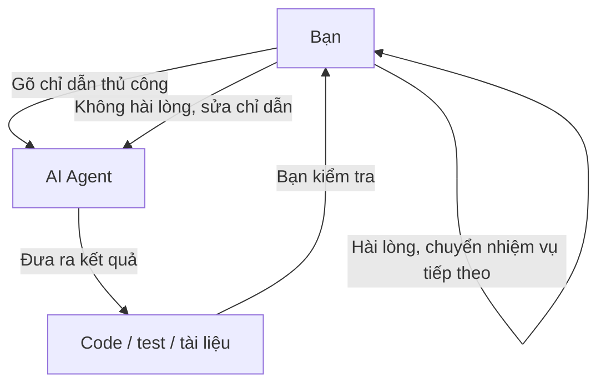
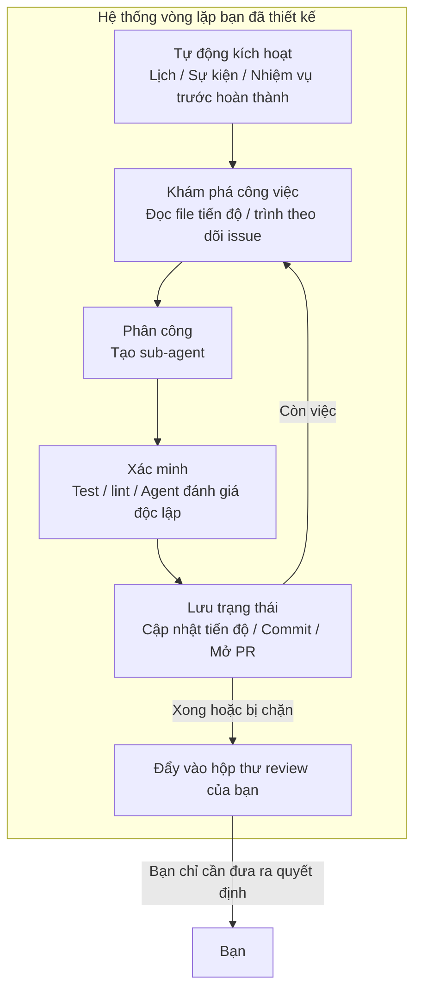
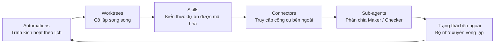
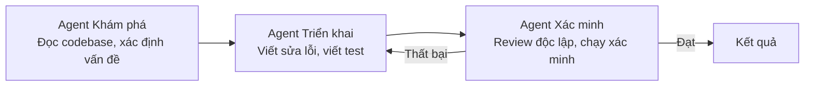
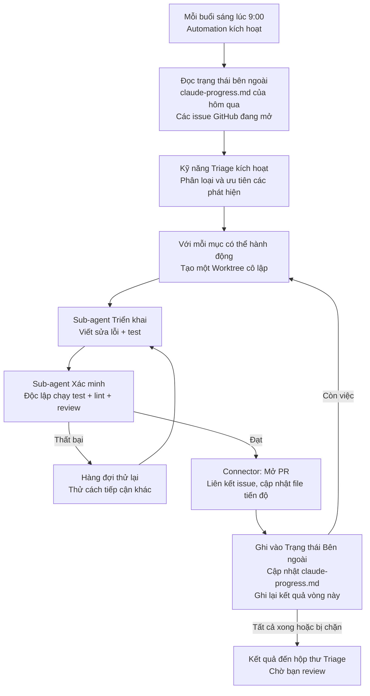
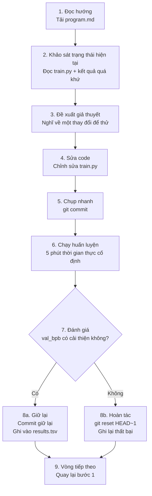

[English Version →](../../../en/lectures/lecture-13-loop-engineering/)

> Ví dụ code: [code/](https://github.com/walkinglabs/learn-harness-engineering/blob/main/docs/vi/lectures/lecture-13-loop-engineering/code/)
> Dự án thực hành: [Dự án 07. Xây dựng Vòng lặp Tự động Đầu tiên](./../../projects/project-07-loop-engineering-first-loop/index.md)

# Bài 13. Từ Nhắc lệnh Thủ công đến Vòng lặp Tự chủ

Tất cả những gì bạn đã học trong mười hai bài đầu tiên đều dựa trên một giả định: **bạn đang ngồi trước bàn phím, gõ các chỉ dẫn từng cái một.**

Bạn đã viết `AGENTS.md` (Bài 1–4), xây dựng quản lý trạng thái (Bài 5–6), giới hạn phạm vi với danh sách tính năng (Bài 7–8), để lại bàn giao sạch ở cuối phiên (Bài 9, 12), và làm cho runtime có thể quan sát được (Bài 10–11). Nhưng tác nhân kích hoạt tất cả mọi thứ luôn là bạn. Agent không bao giờ tự quyết định khi nào bắt đầu làm việc — vì không ai nhấn nút "bắt đầu".

Bài giảng này là về việc trao nút bắt đầu cho hệ thống. Không phải từ bỏ quyền kiểm soát — mà là nâng nó lên tầng tiếp theo.

## /goal: Vòng lặp Đơn giản Nhất

Cách tốt nhất để bắt đầu loop engineering không phải là một sơ đồ kiến trúc phức tạp — mà là một lệnh duy nhất.

Vào đầu năm 2026, Claude Code và OpenAI Codex độc lập phát hành cùng một tính năng: `/goal`. Bạn gõ vào terminal:

```
/goal "All tests pass, zero lint warnings, merge to main"
```

Sau đó bạn đóng máy tính và đi ngủ. Tám giờ sau, agent đã tự phân tích, code, test, sửa lỗi, và merge. Nó thử lại khi thất bại, đổi cách tiếp cận khi bị kẹt, và dừng lại khi xong — mà không cần bạn đứng sau lưng nói "thử lại đi."

Sự khác biệt duy nhất giữa `/goal` và một prompt truyền thống là một điều. Nhưng điều đó thay đổi mọi thứ:

| | Prompt truyền thống | `/goal` |
|---|---|---|
| Bạn cung cấp gì | Phải làm gì tiếp theo | Trạng thái cuối trông như thế nào |
| Agent làm gì | Thực thi một lần | Lặp lại cho đến khi đạt được |
| Ai quyết định xong | Bạn | Một điều kiện dừng có thể kiểm chứng |
| Khi nào bạn có thể rời đi | Bạn không thể | Ngay khi bạn gõ `/goal` |

`/goal` về cơ bản là một vòng lặp. Nó có đúng ba phần: **một mục tiêu, một phương pháp xác minh, và một điều kiện dừng.** Chỉ ba thứ đó đã dịch chuyển bạn từ bên trong vòng lặp ra bên ngoài nó.

### Làm sao `/goal` Phát triển Tự nhiên

`/goal` không phải nhảy từ 0 lên 1 bất ngờ. Nó lớn dần từ các quy trình làm việc hàng ngày, đi qua khoảng bốn giai đoạn:

**Giai đoạn 1: Nhắc lệnh thủ công từng cái một.** Cách làm việc sớm nhất là qua lại: "viết một hàm," "thêm test," "sửa logic này." Agent dừng lại sau mỗi bước và chờ bạn nói tiếp theo là gì. Bạn là người lên lịch cho toàn bộ đường ống.

**Giai đoạn 2: Prompt dài với nhiều bước.** Sau đó mọi người bắt đầu viết các prompt dài hơn xếp chồng các bước lại với nhau: "đầu tiên phân tích code, sau đó viết triển khai, sau đó chạy test, và nếu chúng thất bại thì sửa chúng." Agent có thể chạy nhiều bước trong một lần, nhưng bạn vẫn phải theo dõi — vì nó có thể trôi dạt giữa chừng, hoặc hoàn thành một bước và không biết phải làm gì tiếp theo.

**Giai đoạn 3: Agent tự phản ánh và tự định hướng.** Sau đó, các agent có được "sự nội quan" — sau mỗi bước chúng nhìn kết quả và quyết định phải làm gì tiếp theo. Bạn đưa ra mục tiêu, và chúng tự chia nhỏ và tự thử lại. Nhưng một vấn đề nảy sinh: khi nào chúng dừng lại? Việc "tôi xong rồi" từ chính agent có đáng tin không? Thực tế liên tục trả lời — không. Các agent tuyên bố chiến thắng quá dễ dàng.

**Giai đoạn 4: Phán đoán dừng độc lập — `/goal`.** Bước cuối cùng là lấy "việc phán đoán xem có xong không" ra khỏi tay agent đang làm việc, và trao nó cho một thẩm phán độc lập. Đó có thể là một mô hình khác, một script, hoặc một lệnh test — nhưng quy tắc là như nhau: người viết code không thể chấm điểm bài tập về nhà của chính mình. Tại thời điểm này, `/goal` mới thực sự hoạt động: bạn đưa ra mục tiêu, nó lặp lại, một thẩm phán độc lập quyết định khi nào dừng, và bạn có thể rời đi.

Bốn giai đoạn này không phải là lộ trình được bất kỳ công ty nào lên kế hoạch. Đó là con đường mà mọi người code với agent đều đến được, một cách độc lập, bị đẩy bởi những điểm đau giống nhau. Claude Code và Codex phát hành `/goal` gần như đồng thời vào đầu năm 2026 không phải là ngẫu nhiên — thời điểm đã đến.

### Không Chỉ Một Loại Vòng lặp

`/goal` là vòng lặp dễ hiểu nhất, nhưng nó không phải loại duy nhất. Các vòng lặp được phân loại dựa trên cách chúng được kích hoạt và cách chúng dừng lại:

| Loại | Kích hoạt | Điều kiện dừng | Claude Code | Codex | Tốt nhất cho |
|------|---------|----------------|-------------|-------|----------|
| **Vòng lặp theo lượt** | Bạn gõ từng prompt thủ công | Agent nghĩ nó xong, hoặc bạn ngắt | Chat bình thường | Chat bình thường | Nhiệm vụ nhỏ, khám phá |
| **Vòng lặp theo mục tiêu** | Bạn đưa ra mục tiêu | Đánh giá độc lập xác nhận xong, hoặc đạt lượt tối đa | `/goal` | `/goal` (cần bật thủ công) | Nhiệm vụ phức tạp có tiêu chí hoàn thành rõ ràng |
| **Vòng lặp theo thời gian** | Khoảng thời gian theo lịch (mỗi N phút/giờ) | Bạn dừng thủ công, hoặc nó thoát sau khi hoàn thành công việc | `/loop` | Thread automation | Kiểm tra trạng thái định kỳ, kiểm tra định kỳ, công việc lặp lại |
| **Vòng lặp theo sự kiện** | Sự kiện bên ngoài (PR được mở, CI thất bại, issue mới) | Dừng sau khi xử lý sự kiện, hoặc đạt giới hạn thử lại | Routines (API / GitHub Webhook) | Standalone automation + plugins | Quy trình phản ứng, tích hợp CI/CD |

Chúng không cạnh tranh — chúng là những công cụ khác nhau cho những công việc khác nhau. Turn-based thì ổn cho những việc nhỏ. Dùng `/goal` khi có đường đích rõ ràng. Dùng `/loop` khi bạn cần theo dõi gì đó. Dùng event-driven khi bạn tích hợp với các hệ thống bên ngoài.

### Đừng Nhầm Lẫn `/goal` và `/loop`

Cả hai đều có "loop" trong tên, nhưng chúng giải quyết các vấn đề hoàn toàn khác nhau:

| | `/goal` | `/loop` |
|---|---------|---------|
| **Nó là gì** | Một nhiệm vụ lớn, chạy cho đến khi xong | Một hành động nhỏ, lặp lại theo khoảng thời gian |
| **Điều kiện dừng** | Đạt mục tiêu, hoặc hết ngân sách | Bạn dừng thủ công, hoặc nhiệm vụ tự thoát |
| **Phổ thời gian** | Một lần chạy dài, có thể mất vài giờ hoặc vài ngày | Các đợt ngắn định kỳ, mỗi lần chạy có thể vài phút |
| **Tiến độ** | Mỗi vòng lặp lại gần hơn với đường đích | Mỗi lần chạy độc lập, không có tiến độ tích lũy |
| **Giống với** | Chạy marathon — súng bắn bắt đầu, bạn dừng ở đường đích | Đồng hồ báo thức — kêu theo lịch, bạn tắt nó |
| **Sử dụng điển hình** | "Triển khai toàn bộ hệ thống thanh toán với độ phủ test" | "Kiểm tra CI có bị hỏng không mỗi 15 phút" |

Một sai lầm phổ biến: ép thứ gì đó đáng lẽ là `/goal` vào một `/loop`. Như viết `/loop 10m "tiếp tục triển khai hệ thống thanh toán"` — sai rồi. `/loop` chạy cùng một chỉ dẫn độc lập mỗi lần, nó không nhớ nơi nó dừng lại lần trước. Bạn chỉ sẽ nhận được cùng một điểm khởi đầu lặp đi lặp lại.

**Câu hỏi một câu để chọn cái nào: thứ này có kết thúc không?**
- Có kết thúc → `/goal`
- Không kết thúc, bạn chỉ cần tiếp tục theo dõi → `/loop`

Loop Engineering, chủ đề của bài giảng này, không phải về một lệnh nào đó. Nó là về **khả năng thiết kế các hệ thống bao gồm tất cả các loại này — để agent của bạn có thể tiếp tục làm việc ngay cả khi bạn không ở đó.**

Bạn không cần phải gõ `/goal` mỗi lần. Nhưng hiểu nó đến từ đâu và tại sao nó trông như thế nào — đó là hiểu cốt lõi của loop engineering. Các vòng lặp phức tạp hơn chỉ thêm các phần như lập lịch, song song, cô lập, và bộ nhớ lên trên ba nguyên tắc cơ bản giống nhau: mục tiêu, xác minh, điều kiện dừng.

## Tháng Sáu 2026: Ba Người Đốt Cùng Một Que Diêm Trong Một Tuần

Trong tuần đầu tiên của tháng 6 năm 2026, ba người thực hành xây dựng cơ sở hạ tầng agent coding — mà không so sánh ghi chú — đã nói cùng một điều bằng những lời khác nhau.

**Peter Steinberger** (người tạo ra OpenClaw, [bài đăng của ông đạt 8 triệu lượt xem](https://x.com/steipete/status/2063697162748260627)): "Bạn không nên còn đang nhắc lệnh các agent coding nữa. Bạn nên thiết kế các vòng lặp nhắc lệnh agent của bạn."

**Boris Cherny** (trưởng phòng Claude Code tại Anthropic, [trên podcast Acquired](https://x.com/rohanpaul_ai/status/2063289804708835412)): "Tôi không còn nhắc lệnh Claude nữa. Tôi có các vòng lặp chạy nhắc lệnh Claude và tìm ra phải làm gì. Công việc của tôi là viết các vòng lặp."

**Addy Osmani** (trưởng nhóm kỹ thuật tại Google Chrome) [đặt tên cho khái niệm](https://addyosmani.com/blog/loop-engineering/) vào ngày 7 tháng 6 năm 2026, và đưa ra định nghĩa một dòng:

> **Loop engineering là thay thế bản thân bạn với tư cách là người nhắc lệnh agent. Bạn thiết kế hệ thống làm việc đó thay thế.**

Cherny tiết lộ con số: trong hơn 30 ngày liên tiếp, tất cả các đóng góp code cho Claude Code đều được thực hiện tự chủ bởi AI — 259 PR đã được merge, hơn 80% code sản xuất được viết bởi Claude, và tỷ lệ thành công 76% đối với các nhiệm vụ phần mềm mở.

Ba người. Một tuần. Cùng một kết luận. Không phải vì họ phối hợp — mà vì cơ sở hạ tầng đã lặng lẽ vượt qua một ngưỡng. Các agent đã trở nên đủ tin cậy để hoàn thành các nhiệm vụ không tầm thường mà không cần giám sát. Các nguyên thủy lập lịch (`/loop`, `/goal`, cron) giờ đã được tích hợp sẵn trong các công cụ. Chi phí của một lần chạy agent đã giảm đủ thấp để việc chạy một cách lặp đi lặp lại theo bộ hẹn giờ trông không còn lãng phí. Khi tất cả các bộ phận đều có mặt, bước di chuyển kết hợp chúng trở nên hiển nhiên với mọi người cùng một lúc.

> Nguồn: [Addy Osmani: Loop Engineering](https://addyosmani.com/blog/loop-engineering/)

## Bên Trong Vòng lặp vs. Bên Ngoài Vòng lặp

Hãy đối chiếu hai kịch bản cụ thể.

**Kịch bản A: Bạn ở bên trong vòng lặp (Bài 1–12).**



Bạn có một bộ harness hoàn chỉnh: `AGENTS.md` nói với agent các quy tắc dự án, `feature_list.json` giới hạn phạm vi, `init.sh` đảm bảo môi trường nhất quán, `claude-progress.md` ghi lại tiến độ. **Nhưng mỗi bước vẫn đòi hỏi bạn khởi tạo thủ công.** Hoàn thành một tính năng, đọc file tiến độ, suy nghĩ về tiếp theo là gì, gõ chỉ dẫn. Bạn là động cơ của toàn bộ quy trình làm việc.

**Kịch bản B: Bạn ở bên ngoài vòng lặp (Loop Engineering).**



Bạn không còn gõ chỉ dẫn nữa. Hệ thống bạn đã thiết kế khám phá công việc, phân công nó, xác minh kết quả, ghi lại trạng thái, và quyết định bước tiếp theo. Công việc của bạn thu hẹp còn ba điều: **định nghĩa mục tiêu và điều kiện dừng trước khi nó bắt đầu, review kết quả sau khi nó hoàn thành, và điều chỉnh các quy tắc khi hệ thống đi lạc hướng.** Đòn bẩy dịch chuyển từ "viết prompt đúng" sang "thiết kế vòng lặp đúng."

> Osmani: "Một năm trước nếu bạn muốn một vòng lặp bạn viết một đống bash và bạn duy trì đống đó mãi mãi và nó là của bạn và chỉ của bạn. Bây giờ các mảnh ghép chỉ được giao bên trong các sản phẩm." Bạn không cần xây dựng từ đầu. Bạn cần hiểu các mảnh ghép khớp với nhau như thế nào.

## Các Khái niệm Cốt lõi

- **Loop Engineering**: Thiết kế một hệ thống tự động nhắc lệnh agent của bạn, thay thế đầu vào của con người từng bước thủ công. Con người di chuyển từ bên trong vòng lặp ra bên ngoài nó, và đòn bẩy chuyển từ "viết prompt đúng" sang "thiết kế vòng lặp đúng."
- **Chế độ `/goal`**: Vòng lặp đơn giản nhất — đưa ra mục tiêu, phương pháp xác minh, và điều kiện dừng; agent lặp lại cho đến khi đạt được. Cầu nối từ nhắc lệnh thủ công đến các vòng lặp tự chủ.
- **Phân tách Generator/Evaluator**: Agent viết code và agent kiểm tra code phải được tách riêng. Một mô hình chấm điểm công việc của chính mình là không đáng tin cậy; một trình xác minh độc lập — đôi khi sử dụng hoàn toàn một mô hình khác — là đảm bảo độ tin cậy cơ bản của bất kỳ vòng lặp nào.
- **Cô lập Worktree**: Mỗi agent song song làm việc trong một git worktree độc lập, ngăn chặn vật lý các va chạm tệp. Điều kiện tiên quyết về cơ sở hạ tầng cho thực thi song song đa agent.
- **Trạng thái bên ngoài**: Bộ nhớ sống bên ngoài một cuộc trò chuyện đơn lẻ — các file markdown, trình theo dõi issue, bảng kanban. Các mô hình quên mọi thứ giữa các lần chạy; bộ nhớ phải sống trên đĩa.
- **Bốn chi phí thầm lặng**: Bốn chi phí ẩn trở nên gay gắt hơn vòng lặp chạy càng lâu — nợ xác minh, sự thối rữa hiểu biết, sự đầu hàng nhận thức, bùng nổ token. Các vòng lặp không chỉ tăng tốc đầu ra, mà còn tăng tốc rủi ro.

## Sáu Nguyên thủy của Một Vòng lặp

Osmani phân rã một vòng lặp thành năm khối xây dựng cốt lõi, cộng với một lớp bộ nhớ xuyên suốt tất cả chúng — tổng cộng sáu thứ, nhưng lớp bộ nhớ chiếm một vị trí đặc biệt: nó không phải là một thành phần ở cùng cấp độ với những cái khác; nó là xương sống mà mọi thứ khác phụ thuộc vào.

Sơ đồ dưới đây vẽ tất cả sáu thành một vòng để bạn có thể thấy toàn bộ bức tranh trong nháy mắt. Nhưng hãy nhớ: Trạng thái bên ngoài không chỉ là một điểm dừng khác trên vòng lặp — nó là nền tảng mà toàn bộ vòng lặp dựa vào.



### 1. Automations — Nhịp Tim

Nếu không có automation, một vòng lặp không phải là vòng lặp — đó là một lần chạy một lần bạn đã làm thủ công.

Cả Claude Code và Codex đều có hệ thống lập lịch đầy đủ, nhưng chúng sử dụng tên và các lớp khác nhau. Ánh xạ sơ bộ từ nhẹ nhàng nhất đến nặng nhọc nhất:

| Lớp | Claude Code | Codex | Ghi chú |
|-------|-------------|-------|-------|
| Polling trong phiên | `/loop` | Thread automation | Gắn với phiên hiện tại, chết khi phiên đóng |
| Nhiệm vụ theo lịch cục bộ | Desktop scheduled tasks | Standalone automation (local mode) | Chạy khi máy bật, có thể truy cập file cục bộ |
| Nhiệm vụ theo lịch đám mây | Cloud Routines | — (không có trình lập lịch đám mây gốc) | Chạy khi máy tắt |
| Trình kích hoạt sự kiện | Routines (API / GitHub Webhook) | Standalone automation + plugins | Được kích hoạt bởi các sự kiện bên ngoài |
| Tự hoàn toàn tự lưu trữ | GitHub Actions / cron tự lưu trữ | `codex exec` + cron | Kiểm soát đầy đủ |

**Tab Automations của Codex** là điểm vào lập lịch. Chọn dự án, prompt, nhịp độ, và liệu nó chạy trên bản checkout cục bộ của bạn hay một worktree nền. Các lần chạy tìm thấy thứ gì đó sẽ vào hộp thư Triage; các lần chạy không tìm thấy gì sẽ tự động lưu trữ. OpenAI sử dụng chúng nội bộ cho việc phân loại issue hàng ngày, tóm tắt lỗi CI, bản tin commit, và tìm kiếm các lỗi được giới thiệu tuần trước.

Các automation của Codex có hai hương vị:
- **Thread automation** — Các cuộc gọi thức dậy định kỳ kiểu nhịp tim gắn với một luồng, giữ lại ngữ cảnh. Tốt cho việc theo dõi liên tục trên một thứ duy nhất, như giám sát một lệnh chạy lâu hoặc kiểm tra trạng thái PR. Tương đương trong Claude Code là `/loop`.
- **Standalone automation** — Mỗi lần chạy bắt đầu mới, kết quả đi đến Triage. Tốt cho các tác vụ độc lập hàng ngày/hàng tuần như bản tin hoặc quét phụ thuộc. Tương đương trong Claude Code là Desktop scheduled tasks.

Hệ thống của Claude Code được phân lớp chi tiết hơn:

- **`/loop`** — Lặp lại theo lịch nhẹ nhàng trong phiên. Hoạt động khi terminal của bạn đang mở, chết khi phiên đóng, tự động hết hạn sau 7 ngày. Tốt cho việc giám sát tạm thời trong phiên làm việc hiện tại của bạn.
- **Desktop scheduled tasks** — Chạy khi máy của bạn đang bật, sống sót qua các lần khởi động lại phiên, khoảng thời gian cấp phút. Tốt cho các công việc lặp lại cần truy cập file cục bộ.
- **Cloud Routines** — Chạy trên cơ sở hạ tầng đám mây của Anthropic, sống sót khi máy của bạn tắt, khoảng thời gian tối thiểu 1 giờ. Hỗ trợ ba loại trình kích hoạt: theo lịch, gọi API, GitHub webhook. Tốt cho các tác vụ hàng ngày không cần môi trường cục bộ của bạn.
- **GitHub Actions / cron tự lưu trữ** — Hoàn toàn dưới sự kiểm soát của bạn, chạy bất cứ cách nào bạn muốn. Tốt cho các kịch bản có yêu cầu môi trường hoặc bảo mật đặc biệt.

```bash
# Claude Code: chạy test mỗi 30 phút, sửa lỗi (trong phiên hiện tại)
/loop 30m Run the test suite and fix any failing tests

# Claude Code: kiểm tra trạng thái deploy mỗi 15 phút
/loop 15m Check if the production deploy succeeded and report status
```

Automations là nhịp tim. Nếu không có chúng, vòng lặp là một bản thiết kế không bao giờ thức dậy.

### 2. Worktrees — Cô lập ở Quy mô lớn

Ngay khi bạn chạy nhiều hơn một agent, các va chạm tệp trở thành chế độ thất bại tất yếu. Hai agent viết vào cùng một tệp chính là cơn đau đầu của hai kỹ sư commit vào cùng một dòng mà không tham khảo ý kiến nhau.

`git worktree` giải quyết vấn đề này: mỗi agent làm việc trên nhánh của riêng mình trong thư mục của riêng mình. Chúng vật lý không thể chạm vào bản checkout của nhau.

Cả Claude Code và Codex đều hỗ trợ worktree. Khi bạn sử dụng `--worktree` hoặc `isolation: worktree` trên một sub-agent, mỗi trợ lý nhận được một bản checkout sạch, độc lập tự dọn dẹp sau khi xong. Worktrees loại bỏ vấn đề va chạm cơ học — nhưng hãy nhớ: **băng thông review của bạn vẫn là trần nhà.** Bạn có thể giám sát bao nhiêu agent song song quyết định bạn thực sự có thể chạy bao nhiêu worktree.

### 3. Skills — Ngừng Giải thích Lại Dự án của Bạn

Một skill là cách bạn ngừng giải thích lại cùng một ngữ cảnh dự án mỗi phiên. Đó là một thư mục chứa một `SKILL.md` với các chỉ dẫn và siêu dữ liệu, cộng với các script, tài liệu tham khảo, và tài sản tùy chọn.

Cả Codex và Claude Code đều hỗ trợ cùng một định dạng. Các skill được gọi trực tiếp bằng `/skill-name` (Codex cũng hỗ trợ `$skill-name`), hoặc được kích hoạt ngầm khi nhiệm vụ khớp với mô tả skill.

Skills về cơ bản là về việc trả nợ ý định của bạn. Một agent bắt đầu mỗi phiên lạnh lùng — nó lấp đầy bất kỳ khoảng trống nào trong ý định của bạn bằng một đoán tự tin. Một skill là ý định đó được viết ra bên ngoài: các quy ước, các bước build, "chúng ta không làm theo cách này vì một sự cố đó" — viết một lần, đọc mỗi lần chạy.

### 4. Connectors — Vòng lặp của Bạn Chạm vào Các Công cụ Thực

Một vòng lặp chỉ có thể xem hệ thống tệp là một vòng lặp nhỏ. Các connector (được xây dựng trên giao thức MCP) cho phép agent đọc trình theo dõi issue của bạn, truy vấn cơ sở dữ liệu, gọi một API staging, gửi tin nhắn trong Slack.

Cả Codex và Claude Code đều nói MCP, vì vậy connector bạn viết cho cái này thường hoạt động ở cái kia. Connectors là sự khác biệt giữa "đây là bản sửa lỗi" và một vòng lặp mở PR, liên kết ticket Linear, và nhắc nhở kênh khi CI xanh — tự nó, bên trong môi trường thực tế của bạn, không chỉ trong terminal.

### 5. Sub-agents — Giữ Maker Khỏi Checker

Lựa chọn thiết kế có giá trị cấu trúc nhất trong một vòng lặp là tách người viết ra khỏi người kiểm tra. Mô hình đã viết code thì quá hào phóng khi chấm điểm bài tập về nhà của chính mình. Một agent thứ hai, với các chỉ dẫn khác nhau và đôi khi là một mô hình khác, sẽ bắt được những gì agent thứ nhất đã tự thuyết phục mình.

Sự phân chia ba vai trò kinh điển:



`/goal` của Claude Code chạy cái này dưới lớp — một phiên độc lập, mới mẻ phán đoán xem vòng lặp có nên dừng không, không phải phiên đã làm việc. Điều này được gọi là **phân tách generator/evaluator**, và nó là đảm bảo độ tin cậy quan trọng nhất trong thiết kế vòng lặp.

### 6. Trạng thái Bên ngoài — Bộ nhớ của Vòng lặp

Các mô hình quên mọi thứ giữa các lần chạy. Bộ nhớ phải sống trên đĩa, không phải trong cửa sổ ngữ cảnh.

Điều này nghe có vẻ quá đơn giản để quan trọng, nhưng đó là cùng một thủ thuật mà mọi agent chạy lâu đều dựa vào. Một file markdown, một bảng Linear — bất cứ thứ gì sống bên ngoài một cuộc trò chuyện đơn lẻ và giữ những gì đã xong, gì đang tiến hành, và gì tiếp theo. Agent quên. Kho lưu trữ thì không.

Sáu nguyên thủy này là bộ công cụ thiết kế vòng lặp của bạn. Bạn không cần tất cả chúng cho mọi vòng lặp. Nhưng bạn cần biết khi nào nên dùng cái nào.

## Một Vòng lặp Hoàn chỉnh, Được Giải phẫu

Nối tất cả sáu lại với nhau và đây là một vòng lặp phân loại buổi sáng thực tế trông như thế nào:



Đây không còn là một lần chạy agent đơn lẻ nữa. Đó là một hệ thống vận hành liên tục thức dậy mỗi buổi sáng, tự quét dọn sàn nhà, và đặt những thứ cần sự chú ý của bạn ra trước mặt bạn. Vai trò của bạn trở thành: **review nội dung hộp thư, đưa ra quyết định, và khi bạn phát hiện một mẫu hệ thống không thể xử lý, tinh chỉnh các kỹ năng và quy tắc.**

Cherny đã sử dụng mẫu này để merge 259 PR trong 30 ngày mà không cần mở IDE một lần nào. Các kỹ sư OpenAI đã sử dụng cùng một mẫu để xây dựng một sản phẩm beta khoảng một triệu dòng mã bằng tay — mà không cần tự viết một dòng mã nào.

## Phân tách Generator/Evaluator: Tại sao Bạn Không thể Để Mô hình Chấm Điểm Công việc của Chính Mình

Đây là bài học khó nhất trong loop engineering.

Agent thông minh nhất của bạn viết một đoạn code đẹp đẽ. Logic rõ ràng, comment kỹ lưỡng, và mọi hàm đều có test. Bạn hài lòng.

Nhưng câu hỏi là: **nếu bạn để agent viết code đó phán đoán xem nó có làm tốt không, nó sẽ nói gì?**

Câu trả lời đã được kinh nghiệm xác nhận lặp đi lặp lại: nó sẽ tự cho mình điểm cao. Không phải vì nó không trung thực, mà vì nó là người tác giả — nó đã tự thuyết phục mình con đường này là đúng trong quá trình tạo ra. Khi nó nhìn lại, nó không thấy sai lầm; nó thấy chính quy trình suy luận của mình.

Đây không phải là vấn đề của Claude. Đây không phải là vấn đề của GPT. Đây là một thuộc tính của tất cả các mô hình sinh tạo. **Một mô hình là luật sư bào chữa tốt nhất cho chính đầu ra của mình.**

Cách sửa: không bao giờ để cùng một thực thể (cùng mô hình, cùng prompt) vừa làm việc vừa review.

- `/goal` của Claude Code sử dụng một phiên giám sát độc lập để phán đoán xem mục tiêu có đạt được không — không phải phiên đã thử làm.
- Hệ thống sub-agent của Codex cho phép bạn định nghĩa một agent xác minh sử dụng một mô hình khác với nỗ lực suy luận khác nhau.
- Thực hành cộng đồng "adversarial verify" tạo ra N người hoài nghi độc lập cho mỗi phát hiện, mỗi người được nhắc lệnh để bác bỏ — đa số bác bỏ sẽ loại bỏ phát hiện đó.

Một câu để nhớ: **ai đó trong đội của bạn phải không tin bạn.**

## autoresearch của Karpathy: Mẫu Vòng lặp Điển hình

Nếu bạn muốn xem một vòng lặp được thiết kế tốt, thực sự đang chạy trông như thế nào, [autoresearch của Karpathy](https://github.com/karpathy/autoresearch) là ví dụ sách giáo khoa.

Vào tháng 3 năm 2026, Karpathy phát hành một dự án Python 630 dòng. Đưa cho nó một GPU và một hướng nghiên cứu, và nó chạy cả đêm — hoàn thành hàng trăm thí nghiệm huấn luyện ML, chỉ giữ lại những cái thực sự cải thiện. Dự án đạt 66.000+ sao trong vài ngày sau khi phát hành.

### Ba Tệp, Ba Vai trò

Toàn bộ hệ thống chỉ có ba tệp cốt lõi, nhưng sự phân chia công việc cực kỳ sắc bén:

| Tệp | Ai Sửa nó | Nó làm gì |
|------|-------------|-------------|
| `prepare.py` | Không ai (chỉ đọc) | Chuẩn bị dữ liệu, tokenizer, bộ đánh giá. Cơ sở hạ tầng cố định. |
| `train.py` (~630 dòng) | **AI Agent** | Định nghĩa mô hình, optimizer, vòng lặp huấn luyện. Sân chơi của agent — thay đổi bất cứ gì. |
| `program.md` | **Bạn** | Phương pháp luận nghiên cứu được viết bằng ngôn ngữ tự nhiên. Bạn chỉ sửa cái này. Nói với agent cách khám phá, cách đánh giá, gì không được động. |

Sự phân chia ba phía này là linh hồn của thiết kế: **con người không chạm vào code, họ chạm vào hướng; agent không chạm vào hướng, họ chạm vào code.** Công việc của bạn chuyển từ viết Python sang "viết văn hóa tổ chức nghiên cứu."

### Đầu vào: program.md Trông Như Thế Nào

`program.md` là bộ não của vòng lặp. Nó không phải code — đó là một hướng dẫn nghiên cứu được viết bằng Markdown. Nó khoảng bao gồm:

- **Mục tiêu**: tối ưu hóa `val_bpb` (validation bits per byte, càng thấp càng tốt)
- **Các ràng buộc**: đừng động vào `prepare.py`, giữ trong ngân sách VRAM, huấn luyện 5 phút cố định
- **Các hướng khám phá**: thử các kiến trúc khác nhau, optimizer, lịch trình LR
- **Các quy tắc đánh giá**: gì được tính là cải thiện, cách ghi kết quả, làm gì khi thất bại
- **Quy tắc sắt đá**: không bao giờ dừng lại. Một khi vòng lặp bắt đầu, tiếp tục mãi mãi

Prompt khởi đầu của bạn cho agent có thể ngắn như một câu:

```
Have a look at program.md and let's kick off a new experiment!
```

Phần còn lại tùy thuộc vào agent đọc tài liệu và tự đưa ra quyết định.

### Vòng lặp Bàn chín Bước

Trái tim của autoresearch là một **bàn đạp** — nó chỉ di chuyển về phía trước, không bao giờ lùi lại. Mỗi lần lặp lại nghiêm ngặt theo chín bước:



Nó chạy khoảng 12 thí nghiệm mỗi giờ. Một lần chạy qua đêm (8 giờ) là khoảng 100 thí nghiệm. Bản thân Karpathy đã chạy nó trong 2 ngày — ~700 thí nghiệm.

Ngân sách thời gian thực 5 phút cố định là một lựa chọn thiết kế quan trọng — bất kể agent thay đổi gì, mọi thí nghiệm đều mất đúng cùng một thời gian. Điều này có nghĩa là tất cả các kết quả đều có thể so sánh trực tiếp dưới cùng một ngân sách thời gian — không có tranh cãi về "cái này chạy lâu hơn nên nó tốt hơn."

### Đầu ra: Bạn Nhìn Thấy Gì Khi Thức Dậy

Sau một đêm lặp lại, bạn ngồi xuống vào buổi sáng và tìm thấy ba thứ:

**1. Lịch sử Git (bàn đạp chỉ tiến về phía trước)**

Chỉ các commit thực sự cải thiện mới được giữ trên nhánh chính. Tất cả những gì thất bại đã được hoàn tác. `git log` là một nhật ký nghiên cứu đã được xác minh.

**2. results.tsv (bản ghi đầy đủ các thí nghiệm)**

Mỗi thí nghiệm — thành công hay thất bại — đều được ghi lại:

```
timestamp    commit_hash    val_bpb    vram_mb    description
--------- ------------- ---------- ---------- ----------------------------
08:01:12  a1b2c3d       1.234     22100    baseline
08:06:15  d4e5f6g       1.228     22400    increased learning rate by 10%
08:11:20  (reverted)     1.241     21800    switched to GELU activation
08:16:08  h7i8j9k       1.219     23000    added weight decay 0.01
...
```

**3. Một nhật ký nghiên cứu (tóm tắt của chính agent)**

Agent viết các thông điệp commit rõ ràng về những gì nó đã thử, gì hiệu quả, gì không, và gì nó dự định thử tiếp theo. Bạn đọc những cái đó — bạn không cần đọc các diff code.

### Nó Thực sự Tìm Thấy Gì

Kết quả từ lần chạy 2 ngày, ~700 thí nghiệm ban đầu của Karpathy:

- Trong khoảng ~700 lần thử, đã tìm thấy khoảng **20 cải thiện thực sự có thể xếp chồng lên nhau**
- Giảm thời gian huấn luyện cấp GPT-2 của nanochat trên 8×H100 từ **2,02 giờ → 1,80 giờ**, nhanh hơn khoảng **11%**
- Các phát hiện bao gồm: điều chỉnh learning rate, tinh chỉnh optimizer, hoán đổi hàm kích hoạt, tối ưu hóa mẫu attention, v.v.

Tất cả các cải thiện có phải là những khám phá làm chấn động địa cầu không? Không. Hầu hết là các tối ưu nhỏ xếp chồng lên nhau. Nhưng 20 cải thiện hợp lệ đó sẽ mất một nhà nghiên cứu con người hàng tuần công việc thủ công — agent đã làm nó trong 48 giờ.

### Chi tiết Nói lên Nhiều Nhất: Vòng lặp được Viết Bằng Tiếng Anh, Không Phải Code.

`program.md` là một tài liệu Markdown, không phải một script Python. Nó mô tả một phương pháp luận nghiên cứu — gì nên sửa, gì nên để yên, cách đánh giá, cách xử lý các trường hợp thất bại, và một quy tắc sắt đá: **không bao giờ yêu cầu giúp đỡ con người, cứ tiếp tục đi.** Một agent coding đọc tài liệu này và thực thi nó vô thời hạn.

Đây là khuôn mẫu cho loop engineering: đừng cho agent một nhiệm vụ. Hãy cho nó một **phương pháp luận**. Để phương pháp luận là vòng lặp. Một `program.md`, 630 dòng code kết dính, và mọi thứ còn lại là agent tự chạy chính nó.

## Bốn Chi phí Thầm lặng

Khi một vòng lặp bắt đầu chạy, bạn sẽ không thấy các vấn đề ngay lập tức. Bốn chi phí sau tích lũy một cách thầm lặng, và đến khi bạn nhận thấy, bạn có thể đã trả giá đắt.

### 1. Nợ Xác minh

Các vòng lặp nhanh cám dỗ bạn bỏ qua xác minh. "Trông ổn" không giống như "đã xác nhận đúng." Vòng lặp tạo ra càng nhiều code không được giám sát, nợ xác minh càng chất đống nhanh chóng. Cách sửa: **các điều kiện dừng phải có thể kiểm tra bằng máy, không bao giờ là "cảm thấy khoảng rồi."**

### 2. Sự thối rữa Hiểu biết

Vòng lặp giao code càng nhanh, sự hiểu biết của bạn về chính codebase của bạn càng trôi dạt xa khỏi thực tế. Đội của Cherny có 80% code được viết bởi agent — có nghĩa là hầu hết code của một đội không được viết bởi một con người. Nếu bạn không đọc và sử dụng những gì vòng lặp tạo ra, sự hiểu biết của bạn liên tục suy thoái. **Các vòng lặp nhanh đòi hỏi đọc nhanh.**

### 3. Sự đầu hàng Nhận thức

Khi vòng lặp chạy trơn tru, tư thế thoải mái nhất là ngừng có ý kiến. Nhận bất cứ gì nó trả lại, đừng nghĩ về đầu ra. Nhưng đó chính là nơi nguy hiểm bắt đầu — bạn đang sử dụng vòng lặp để tránh suy nghĩ, thay vì để khuếch đại suy nghĩ. Cảnh báo của Osmani: "Hai người có thể xây dựng chính xác cùng một vòng lặp và nhận được kết quả ngược lại. Người này sử dụng nó để đi nhanh hơn trên công việc họ hiểu; người kia sử dụng nó để tránh hiểu công việc. Vòng lặp không biết sự khác biệt. Bạn biết."

### 4. Bùng nổ Token

Mỗi lần lặp của một vòng lặp tích lũy thêm ngữ cảnh: code đã viết, lỗi đã gặp, quyết định đã đưa ra. Nếu không có quản lý ngữ cảnh, kích thước prompt tăng khoảng bậc hai theo số lượt. Codex giải quyết vấn đề này với nén ngữ cảnh tự động — một API chuyên dụng nén các lượt cuộc trò chuyện cũ thành các tóm tắt nội dung được mã hóa, giữ lại kiến thức thiết yếu trong khi loại bỏ chi tiết dư thừa. Đây là một mối quan tâm kỹ thuật bạn phải giải quyết từ vòng lặp đầu tiên, không phải thêm vào sau này.

## Xây dựng Vòng lặp Đầu tiên của Bạn

Bạn không cần bắt đầu với một đường ống quy mô Stripe merge 1.300 PR một tuần. Bắt đầu với thứ nhỏ nhất hoạt động được.

### Bước 1: Chọn Một Nhiệm vụ Lặp lại

Tìm thứ gì đó bạn làm thủ công ít nhất hai lần một tuần. Ví dụ:
- Mở GitHub vào buổi sáng, kiểm tra các issue mới, phân loại và phản hồi
- Chạy lint và test trước mỗi lần review PR
- Cập nhật tài liệu tiến độ vào cuối mỗi ngày

### Bước 2: Viết Mục tiêu và Điều kiện Dừng

Biến nhiệm vụ thành thứ mà một `/goal` có thể hiểu:

```markdown
Mục tiêu: Kiểm tra 10 issue gần đây nhất trong repo.
Với mỗi issue:
  - Nếu nó đã có nhãn rõ ràng và người phụ trách, bỏ qua
  - Nếu chưa được gắn thẻ, thêm các nhãn phù hợp dựa trên nội dung
  - Nếu có thể sửa trong dưới 10 phút, tạo nhánh và thử sửa
Dừng khi: Tất cả các issue đủ điều kiện đã được xử lý, hoặc một issue yêu cầu quyết định của con người.
```

### Bước 3: Phân chia Maker và Checker

Đừng để cùng một agent vừa viết code vừa phán đoán nó. Chia vòng lặp của bạn thành hai vai trò:
- Người triển khai (Implementer): đọc issue, viết sửa lỗi, viết test
- Người xác minh (Verifier): độc lập chạy test, review diff, phán đoán xem sửa lỗi có thực sự giải quyết vấn đề không

### Bước 4: Thêm Bộ nhớ

Sử dụng một file markdown để ghi lại những gì đã xảy ra trong mỗi lần chạy vòng lặp. Lần chạy tiếp theo bắt đầu bằng cách đọc file này — nó biết gì đã làm, gì đang chờ xử lý, gì bị chặn. Điều này tốt hơn bất kỳ cơ sở dữ liệu phức tạp nào.

### Bước 5: Đặt Bộ hẹn giờ

Sử dụng `/loop` hoặc cron của hệ điều hành để vòng lặp bắt đầu mà không cần bạn. Bắt đầu với một lần một ngày. Quan sát trong một tuần.

### Thang Độ Trưởng thành

Bạn không cần đạt đến đỉnh trong một cú nhảy. Việc áp dụng vòng lặp là một cái thang:

1. **Cấp độ 1: Người chạy Mục tiêu** — Bạn có thể sử dụng `/goal` để đưa ra một nhiệm vụ với điều kiện dừng; agent lặp lại cho đến khi đạt được.
2. **Cấp độ 2: Nhiệm vụ Đơn theo Lịch** — Một automation chạy một nhiệm vụ theo bộ hẹn giờ (ví dụ: kiểm tra CI buổi sáng).
3. **Cấp độ 3: Vòng lặp Đa agent** — Phân chia maker và checker; mỗi phát hiện tạo ra một worktree cô lập.
4. **Cấp độ 4: Vòng lặp Tự nuôi** — Vòng lặp tự khám phá nhiệm vụ tiếp theo từ trạng thái bên ngoài; nó tự quyết định phải làm gì tiếp theo.
5. **Cấp độ 5: Điều phối Hạm đội** — Nhiều vòng lặp chạy song song, độc lập nhưng chia sẻ một lớp bộ nhớ.

Hầu hết các đội hiện đang ở giữa Cấp độ 2 và Cấp độ 3. Cấp độ 1 là con đường nhanh nhất để thấy lợi nhuận.

## Những Điểm Chính

- **Loop Engineering không thay thế Harness Engineering — nó xây dựng một tầng lên trên đó.** Harness làm cho các lần chạy đơn lẻ đáng tin cậy. Vòng lặp làm cho các lần chạy liên tục tự chủ.
- **`/goal` là vòng lặp đơn giản nhất:** mục tiêu + xác minh + điều kiện dừng. Ba thứ đó dịch chuyển bạn từ bên trong vòng lặp ra bên ngoài nó.
- **Sáu nguyên thủy (Automations / Worktrees / Skills / Connectors / Sub-agents / Trạng thái Bên ngoài) là các khối xây dựng của vòng lặp.** Không phải tất cả mọi lúc, nhưng bạn cần biết khi nào nên dùng cái nào.
- **Maker và checker phải được tách riêng.** Một mô hình chấm điểm công việc của chính mình là không đáng tin cậy. Một trình xác minh độc lập — đôi khi là một mô hình hoàn toàn khác — là đảm bảo độ tin cậy cơ bản của bất kỳ vòng lặp nào.
- **Các vòng lặp làm cho việc tạo ra gần như miễn phí và để lại phán đoán như là nguồn lực khan hiếm.** Thời gian bạn tiết kiệm không phải để nghỉ ngơi. Đó là để đưa ra nhiều phán đoán hơn.
- **Bốn chi phí thầm lặng trở nên gay gắt hơn khi vòng lặp chạy càng lâu:** nợ xác minh, sự thối rữa hiểu biết, sự đầu hàng nhận thức, bùng nổ token. Các vòng lặp tăng tốc đầu ra — và rủi ro.
- **Bắt đầu nhỏ.** Một `/goal`, một cron, một file bộ nhớ markdown. Nhận thấy lợi nhuận, sau đó xếp chồng lên nhau.

## Đọc Thêm

- [Addy Osmani: Loop Engineering](https://addyosmani.com/blog/loop-engineering/)
- [Addy Osmani: Agent Harness Engineering](https://addyosmani.com/blog/agent-harness-engineering/)
- [Simon Willison: Designing Agentic Loops (Sep 2025)](https://simonw.substack.com/p/designing-agentic-loops)
- [Karpathy: autoresearch](https://github.com/karpathy/autoresearch)
- [Claude Code: Dynamic Workflows and Orchestration](https://kenhuangus.substack.com/p/claude-code-orchestration-dynamic)
- [Loop Library (Forward Future)](https://signals.forwardfuture.ai/loop-library/) — Bộ sưu tập công cộng 50 vòng lặp thực tế
- [The Neuron: Claude Code Creators on Agent Loops](https://www.theneuron.ai/explainer-articles/claude-code-creators-boris-cherny-and-cat-wu-explain-how-to-use-agent-loops/)
- Bài 12: [Bàn giao sạch ở cuối mỗi phiên](./../lecture-12-why-every-session-must-leave-a-clean-state/index.md) — Điều kiện tiên quyết cho các vòng lặp: mỗi phiên để lại trạng thái sạch để vòng tiếp theo có thể tự động bắt đầu
- Bài 5: [Giữ các nhiệm vụ chạy lâu liên tục giữa các phiên](./../lecture-05-why-long-running-tasks-lose-continuity/index.md) — Kiến thức tiên quyết về trạng thái bên ngoài và bộ nhớ
- Bài 11: [Tại sao tính quan sát được thuộc về bên trong Harness](./../lecture-11-why-observability-belongs-inside-the-harness/index.md) — Vòng lặp chạy càng nhanh, bạn càng cần tính quan sát được để bắt vấn đề
- Bài 8: [Tại sao danh sách tính năng là các nguyên thủy của Harness](./../lecture-08-why-feature-lists-are-harness-primitives/index.md) — Danh sách tính năng là nguồn dữ liệu tự nhiên cho một vòng lặp tự nuôi để khám phá nhiệm vụ tiếp theo

## Bài tập

1. **Biến một nhiệm vụ lặp lại thành một `/goal`:** Tìm thứ gì đó bạn làm thủ công ít nhất hai lần một tuần. Viết xuống mục tiêu, phương pháp xác minh, và điều kiện dừng của nó. Chạy nó một lần với `/goal` và so sánh thời gian và chất lượng so với làm thủ công. Đây là bước đầu tiên của bạn từ Harness sang Loop.

2. **Phân chia maker và checker:** Chọn một nhiệm vụ bạn trước đây đã cho agent thực hiện. Lần này, viết hai prompt khác nhau: một cho agent triển khai và một cho agent xác minh (sử dụng các mô hình khác nhau — ví dụ: Claude để triển khai, GPT để xác minh, hoặc ngược lại). Người xác minh phải chỉ ra các vấn đề cụ thể với bằng chứng được trích dẫn. Ghi lại số lượng và loại vấn đề được tìm thấy trong mỗi chế độ.

3. **Cho vòng lặp của bạn một bộ nhớ:** Tạo một file trạng thái markdown cho vòng lặp của bạn. Trong mỗi lần lặp, viết: gì đã làm trong vòng này, kết quả xác minh, trạng thái (đạt/thất bại/bị chặn), và gì phải làm tiếp theo. Chạy ba vòng và quan sát sự khác biệt về hành vi giữa có và không có file bộ nhớ.

4. **Kiểm toán các chi phí thầm lặng của vòng lặp của bạn:** Sau khi vòng lặp của bạn đã chạy trong một giờ, đánh giá bốn chỉ số này:
   - Bao nhiêu phần xác minh là "cảm thấy đúng" thay vì "được máy xác nhận"? (Nợ xác minh)
   - Bạn có thể giải thích code mà vòng lặp của bạn gần đây nhất tạo ra tốt đến đâu? (Sự thối rữa hiểu biết)
   - Bạn đã nghĩ "sau này xem lại" và không bao giờ xem lại bao nhiêu lần? (Sự đầu hàng nhận thức)
   - Kích thước ngữ cảnh của vòng lặp đang có xu hướng như thế nào? Nó có lặp lại thông tin dư thừa không? (Bùng nổ token)
