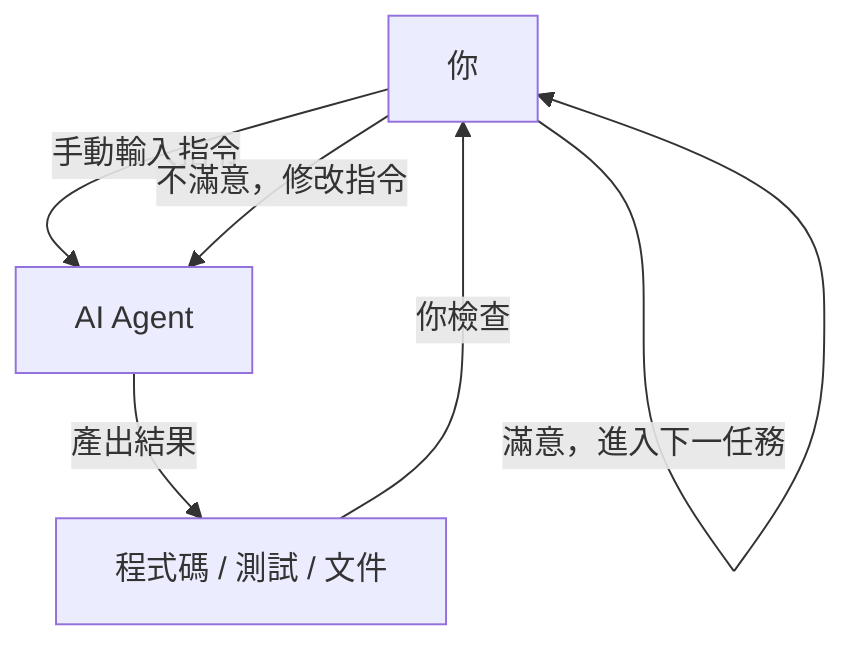
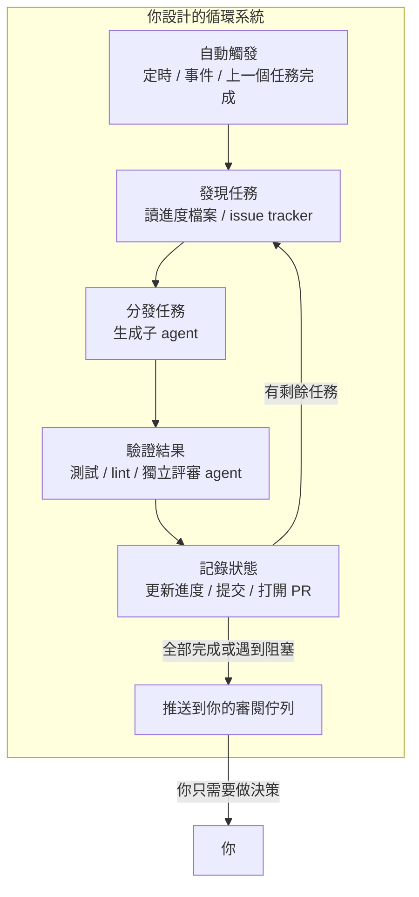
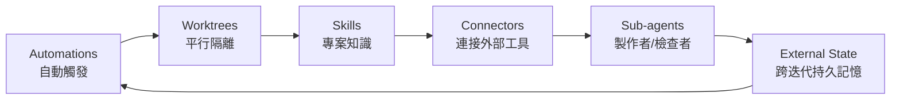
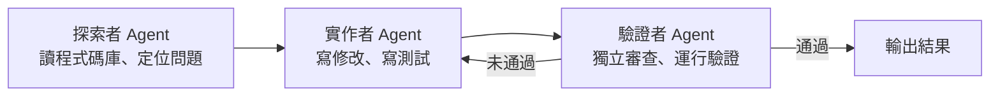
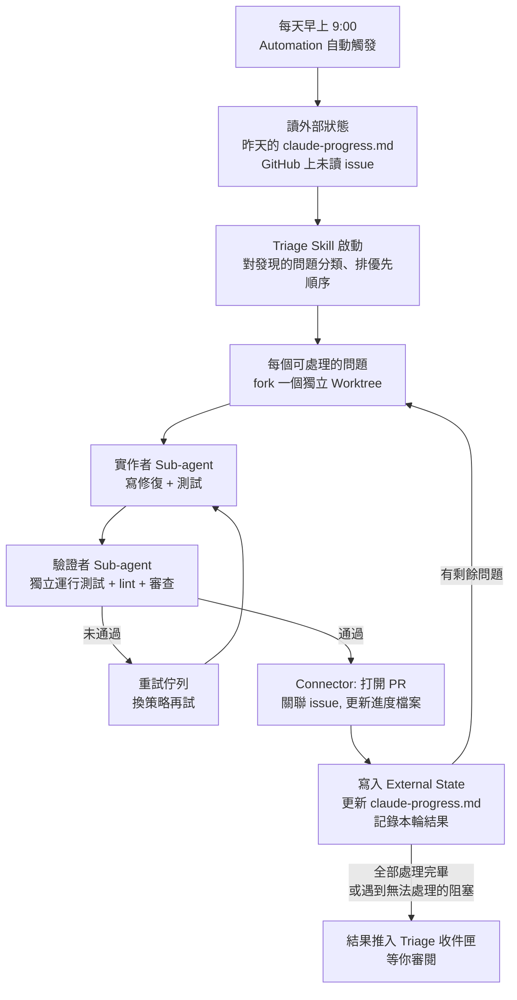
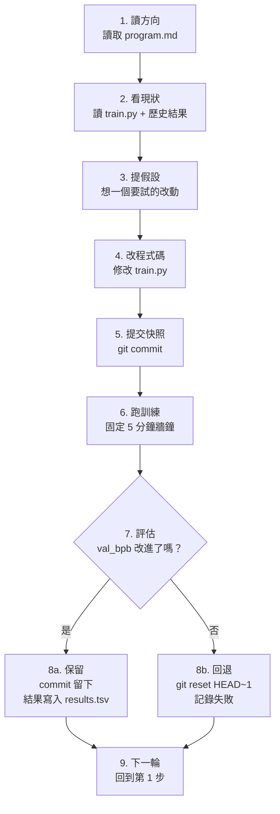

[English Version →](../../../en/lectures/lecture-13-loop-engineering/)

> 本篇程式碼範例：[code/](https://github.com/walkinglabs/learn-harness-engineering/blob/main/docs/zh/lectures/lecture-13-loop-engineering/code/)
> 實戰練習：[Project 07. 搭建你的第一個自動循環](./../../projects/project-07-loop-engineering-first-loop/index.md)

# 第十三講. 從手動驅動到自動循環

前十二講，你做的事情始終有一個共同前提：**你坐在鍵盤前，一次一次地輸入指令。**

你寫好了 `AGENTS.md`（第一到四講），建立了狀態管理（第五、六講），用功能清單約束範圍（第七、八講），讓 agent 在結束時留下乾淨交接（第九、十二講），讓運行過程可觀測（第十、十一講）——但所有這些工作的觸發者，始終是你。agent 不會自己決定什麼時候該幹活，因為沒有人按下「開始」按鈕。

這一講要討論的，就是怎麼把「按按鈕」這件事也交給系統。不是放棄控制，而是把控制升到更高一層。

## /goal：最簡形態的 loop

理解 loop engineering，最好的入口不是一套複雜的架構圖，而是一個具體的指令。

2026 年初，Claude Code 和 OpenAI Codex 不約而同地加入了同一個功能：`/goal`。你在終端裡敲：

```
/goal "所有測試通過，lint 零告警，合併到 main"
```

然後合上筆記本去睡覺。八小時後醒來，agent 已經自己完成了分析、編碼、測試、修復、合併的全過程。它失敗了就重試，方向錯了就換策略，通過了就結束——不需要你坐在旁邊說「再試一次試試」。

`/goal` 和傳統 prompt 的區別只有一點，但這一點改變了一切：

| | 傳統 prompt | `/goal` |
|---|---|---|
| 你給什麼 | 下一步具體做什麼 | 最終狀態是什麼 |
| agent 做什麼 | 執行一次 | 循環直達成 |
| 誰判斷做完了 | 你 | 一條可驗證的停止條件 |
| 你什麼時候可以走 | 不能走 | 給完 `/goal` 就行 |

`/goal` 本質上就是一個 loop。它的結構只有三樣東西：**一個目標，一種驗證方式，一條停止條件。** 但就是這三樣東西，讓你的位置從循環**裡面**移到了循環**外面**。

### `/goal` 是怎麼長出來的

`/goal` 不是某天突然從 0 跳到 1 的。它是從日常工作流裡一點一點長出來的，大致經歷了四個階段：

**階段一：手動一條一條輸。** 最早的用法就是你一句我一句，「寫個函數」、「加個測試」、「改一下這個邏輯」。agent 每執行一步就停下來等你說下一步。你是整個流程的排程器。

**階段二：長 prompt + 多步驟。** 後來大家開始寫更長的 prompt，把多個步驟寫在一起：「先分析程式碼，再寫實作，再跑測試，測試沒過就修。」agent 可以一口氣跑好幾步了，但你還是得盯著——因為它可能在某一步跑偏，或者跑完了不知道下一步該幹嘛。

**階段三：agent 自己判斷要不要繼續。** 再往後，agent 有了「自省」能力——跑完一步自己看結果，決定下一步怎麼走。你給一個目標，它自己拆步驟、自己重試。但問題來了：它什麼時候停？它自己說「我做完了」算不算數？實踐反覆證明——不算數。agent 太容易宣告勝利了。

**階段四：獨立的停止判斷——`/goal`。** 最後一步是把「判斷做完了沒有」這件事，從幹活的 agent 手裡拿出來，交給一個獨立的判斷者。可能是另一個模型、可能是一段腳本、可能是一條測試指令，但總之——不能讓寫程式碼的人自己批作業。到這一步，`/goal` 才真正成立：你給目標，它循環跑，獨立判斷停不停，你可以走人。

這四個階段不是某家公司規劃好的路線圖，是全世界用 agent 寫程式碼的人，在各自的日常裡，被同一個痛點推著，一步一步走到了同一個地方。Claude Code 和 Codex 在 2026 年初幾乎同時上線 `/goal`，不是巧合——是時候到了。

### Loop 不只有一種

`/goal` 是最容易理解的 loop，但它不是唯一的一種。按觸發方式和停止方式的不同，loop 可以分成幾類：

| 類型 | 觸發方式 | 停止方式 | Claude Code | Codex | 適用場景 |
|------|---------|---------|------------|-------|---------|
| **回合制 loop** | 你手動輸入每一條 prompt | agent 認為做完了，或者你打斷 | 普通對話 | 普通對話 | 小任務、探索性工作 |
| **目標驅動 loop** | 你給一個目標 | 獨立判斷者確認達成，或達到最大回合數 | `/goal` | `/goal`（需手動開啟） | 有明確完成標準的複雜任務 |
| **時間驅動 loop** | 定時觸發（每隔 N 分鐘/小時） | 你手動停止，或任務完成後自行退出 | `/loop` | 對話執行緒自動化（Thread automation） | 輪詢狀態、定期巡檢、重複性工作 |
| **事件驅動 loop** | 外部事件觸發（PR 提交、CI 失敗、新 issue） | 處理完事件就停，或達到重試上限 | Routines (API / GitHub Webhook) | 獨立自動化任務 + 外掛 | 回應式工作流、CI/CD 整合 |

這幾種 loop 不是互相取代的關係，而是工具箱裡的不同工具。小任務用回合制就夠了；有明確終點的用 `/goal`；需要盯著什麼東西的用 `/loop`；要和外部系統聯動的用事件驅動。

### `/goal` 和 `/loop` 別搞混

名字裡都帶 "loop"，但它們解決的是完全不同的問題：

| | `/goal` | `/loop` |
|---|---------|---------|
| **本質** | 一個大任務，跑到完為止 | 同一個小動作，按間隔重複跑 |
| **停止條件** | 目標達成了，或者預算花完了 | 你手動停，或者任務做完自己退 |
| **時間特徵** | 一次長跑，可能跑幾小時甚至幾天 | 週期性短跑，每次可能只跑幾分鐘 |
| **狀態累積** | 任務越跑越接近終點 | 每次都是獨立的，不累積進度 |
| **類比** | 跑馬拉松——發令槍響了就跑，撞線就停 | 鬧鐘——每隔一段時間響一次，你關了才停 |
| **典型用法** | 「實作整個支付系統，有測試覆蓋」 | 「每 15 分鐘看一眼 CI 掛了沒」 |

一個容易犯的錯：把該用 `/goal` 的事情塞進 `/loop` 裡。比如你寫 `/loop 10m "繼續實作支付系統"`——這是錯的。因為 `/loop` 每次都是獨立跑一遍指令，不會記得上次做到哪了，結果就是每次都從同一個地方重新開始。

**判斷該用哪個的一句話標準：這件事有終點嗎？**
- 有終點 → `/goal`
- 沒終點，就是要一直盯著 → `/loop`

本講講的 Loop Engineering，核心不是某一個指令，而是**當你需要的時候，能設計出包含以上所有類型的系統——讓 agent 在你不在場的時候也能自己跑。**

你不必每次都寫 `/goal`。但理解它從哪來、為什麼長這樣，就理解了 loop engineering 的核心——更複雜的 loop 只是在三樣基礎（目標、驗證、停止）之上，加上了排程、平行、隔離、記憶這些零件。

## 2026 年 6 月，三個人在同一週點了一把火

2026 年 6 月第一週，三位構建 coding agent 基礎設施的核心人物，在沒有通氣的情況下，說了同一句話的不同版本。

**Peter Steinberger**（OpenClaw 作者，[其推文收穫 800 萬瀏覽](https://x.com/steipete/status/2063697162748260627)）：「你不應該再給 coding agent 寫 prompt 了。你應該設計循環去 prompt 你的 agent。」

**Boris Cherny**（Anthropic Claude Code 負責人，[在 Acquired 播客上](https://x.com/rohanpaul_ai/status/2063289804708835412)）：「我已經不手動 prompt Claude 了。我有一堆循環在跑，它們負責 prompt Claude、搞清楚要做什麼。我的工作變成了寫循環。」

**Addy Osmani**（Google Chrome 工程負責人）在 6 月 7 日[撰文](https://addyosmani.com/blog/loop-engineering/)將這個概念命名為 **Loop Engineering**，並給了它一句話定義：

> **Loop engineering 就是用系統取代你自己去 prompt agent。**

Cherny 透露了一個數字：在連續 30 天裡，Claude Code 的所有程式碼貢獻全部由 AI 自主完成，累計合併 259 個 PR，其中超過 80% 的生產程式碼由 Claude 編寫，開放式軟體任務成功率達到 76%。

三個人、同一週、同一個結論。不是因為商量好的，是因為基礎設施剛好跨過了一個門檻：agent 已經可靠到能獨立完成非 trivial 任務、排程原語（`/loop`、`/goal`、cron）已經內建於工具中、單次運行的 token 成本也低到值得反覆跑。當零件全部就定位，把零件拼在一起的動作，所有人在同一時間想到了。

> 來源：[Addy Osmani: Loop Engineering](https://addyosmani.com/blog/loop-engineering/)

## 你在循環裡面 vs 你在循環外面

讓我們用兩個具體的場景對比。

**場景 A：你在循環裡面（前十二講的模式）**



你有完整的 harness：`AGENTS.md` 告訴 agent 專案規則，`feature_list.json` 約束了範圍，`init.sh` 保證環境一致，`claude-progress.md` 記錄進度。**但每一步仍需你手動發起。** 做完一個 feature，你要讀進度檔案，想一下下一個做什麼，再輸入指令。你是整個工作流的引擎。

**場景 B：你在循環外面（Loop Engineering）**



你不輸入指令了。你設計的系統去發現任務、分發任務、驗證結果、記錄狀態、決定下一步。你做的事情變成了三件：**在開始前定義目標和停止條件，在結束後審閱結果，在系統跑偏時調整規則。** 價值槓桿從「寫對 prompt」轉移到了「設計對的循環」。

> Addy Osmani 的原話：「一年前如果你想搞一個 loop，你得寫一堆 bash 腳本然後永遠維護它。現在這些零件已經直接內建於產品中了。」你不需要重造輪子，你需要的是理解這些零件怎麼拼在一起。

## 核心概念

- **Loop Engineering**：設計一個系統來自動向 agent 發指令，取代人手動逐條輸入。人從循環裡面移到循環外面，價值槓桿從「寫對 prompt」轉移到「設計對的循環」。
- **`/goal` 模式**：最簡形態的 loop——給出目標、驗證方式和停止條件，agent 循環直達成。是從手動驅動到自動循環的橋樑。
- **Generator/Evaluator 分離**：寫程式碼的 agent 和檢查程式碼的 agent 必須分開。同一個模型給自己打分是不可信的；獨立的、有時甚至用不同模型的驗證者是 loop 可靠性的底線。
- **Worktree 隔離**：每個平行 agent 在獨立的 git worktree 中工作，物理上避免檔案碰撞。是多 agent 平行運行的基礎設施前提。
- **外部狀態（External State）**：活在單次對話之外的記憶載體——markdown 檔案、issue tracker、看板等。模型在會話之間什麼都不記得，記憶必須在磁碟上。
- **六種沉默成本**：loop 跑得越久越尖銳的四類隱性成本——驗證負債、理解腐爛、認知投降、權杖爆炸。loop 加速的不僅是產出，也包括風險。

## 一個 Loop 的六大原語

Osmani 將構成 loop 的零件歸納為五個核心元件，外加一個貫穿始終的記憶層——一共六樣東西，但記憶層的地位是特殊的：它不是一個和其他零件平級的元件，而是其他所有零件都依賴的脊柱。

下面這張圖把六樣東西畫成一個環，方便你一眼看全。但要記住：External State 不是環上的一站，它是整個環的地基。



### 1. Automations（自動觸發）

沒有自動觸發，loop 就不是 loop，只是你手動跑了一次。

Claude Code 和 Codex 都有完整的排程體系，但叫法和分層不太一樣。從輕到重大致可以這樣對應：

| 層級 | Claude Code | Codex | 說明 |
|------|------------|-------|------|
| 會話內輪詢 | `/loop` | 對話執行緒自動化（Thread automation） | 跟著當前會話走，關了就沒了 |
| 本機定時任務 | Desktop 定時任務 | 獨立自動化任務（本機模式） | 機器開著就跑，能讀本機檔案 |
| 雲端定時任務 | Cloud Routines | —（Codex 無雲原生排程） | 機器關了也跑 |
| 事件觸發 | Routines (API / GitHub Webhook) | 獨立自動化任務 + 外掛 | 外部事件觸發 |
| 完全自建 | GitHub Actions / 自建 cron | `codex exec` + cron | 完全自己掌控 |

**Codex 的 Automations 面板**是它的排程入口。在裡面選專案、寫好 prompt、設好頻率、選在本機工作區還是後台 worktree 跑。找到東西的結果進入 Triage 收件匣；沒找到東西的自動歸檔。OpenAI 內部用它做日常：issue 分類、CI 失敗總結、commit 簡報、追溯上週引入的 bug。

Codex 的自動化分兩種：
- **對話執行緒自動化（Thread automation）** — 心跳式重複喚醒同一個執行緒，保留上下文。適合盯著一件事持續跟進，比如監控一個長指令、輪詢 PR 狀態。對應 Claude Code 的 `/loop`。
- **獨立自動化任務（Standalone automation）** — 每次啟動全新運行，結果進入 Triage。適合每天/每週獨立執行的任務，比如每日簡報、依賴掃描。對應 Claude Code 的 Desktop 定時任務。

Claude Code 的體系分得更細：

- **`/loop`** — 會話內的輕量定時循環。終端開著的時候有效，關了就沒了，7 天自動過期。適合當前工作 session 裡臨時需要盯著什麼東西的時候。
- **Desktop 定時任務** — 機器開著就跑，會話關了也不受影響，間隔可以到分鐘級。適合需要存取本機檔案的重複性工作。
- **Cloud Routines** — 跑在 Anthropic 的雲上，你的機器關了也不影響，最小間隔 1 小時。支援三種觸發器：定時、API 呼叫、GitHub Webhook。適合不需要本機環境的日常任務。
- **GitHub Actions / 自建 cron** — 完全自己掌控，想怎麼跑怎麼跑。適合有特殊環境要求或安全限制的場景。

```bash
# Claude Code：每 30 分鐘跑一次測試並修復（當前會話內有效）
/loop 30m Run the test suite and fix any failing tests

# Claude Code：每 15 分鐘檢查一次部署狀態
/loop 15m Check if the production deploy succeeded and report status
```

Automations 是這個系統的「心跳」。沒有它，loop 就只是個設計圖，從來不會自己運轉。

### 2. Worktrees（平行隔離）

一旦有超過一個 agent 同時跑，檔案碰撞就變成必然的失敗模式。兩個 agent 同時改同一個檔案，就像兩個工程師沒有溝通就提交了同一段程式碼。

`git worktree` 解決的就是這個：每個 agent 在自己的獨立分支上工作，物理上不可能碰到別人的修改。

Claude Code 和 Codex 都內建了 worktree 支援。當你用 `--worktree` 或 `isolation: worktree` 啟動子 agent 時，每個 helper 拿到一個乾淨的、獨立的 checkout，完成任務後自行清理。worktree 移除了碰撞的機械問題，但你要記住：**你的審閱頻寬仍然是天花板**，你能同時盯多少個平行 agent，決定了你能跑多少個 worktree。

### 3. Skills（專案知識）

Skill 讓你不再每次會話都重新解釋一遍你的專案。它是一個資料夾，裡面有 `SKILL.md` 存放指令和後設資料，外加可選的腳本、參考文件、資源檔案。

Codex 和 Claude Code 都支援相同的格式。skill 透過 `/skill-name` 直接呼叫（Codex 也支援 `$skill-name`），也可以在 agent 判斷任務匹配時自動觸發。

技能本質上是在 pay 你的 intent debt——一個 agent 每次啟動時都是「冷」的，你上下文裡沒寫的東西，它就用自信的猜測填補。skill 就是把你的意圖寫在外面，寫一次，每次運行都讀。

### 4. Connectors（外掛與連接器）

一個只能看到檔案系統的 loop 是個小 loop。Connectors（基於 MCP 協定）讓 agent 能讀 issue tracker、查資料庫、調 staging API、往 Slack 發訊息。

Codex 和 Claude Code 都支援 MCP，你為一個工具寫的 connector 通常另一個也能直接用。Connectors 的區別在於：有了它，agent 不只是說「這是修復方案」，而是自動打開 PR、關聯 Linear ticket、在 CI 通過後 ping 頻道——loop 在你的真實環境裡行動，不只是在終端裡打字。

### 5. Sub-agents（子 agent）

loop 裡最有結構價值的設計，就是把「寫的人」和「檢查的人」分開。寫程式碼的模型對自己的作業評分太寬容了。第二個 agent，用不同的指令、有時用不同的模型，能抓住第一個 agent 自我說服的東西。

典型的三人分工：



Claude Code 的 `/goal` 底層就是這麼幹的——一個獨立的小模型來判斷 loop 是否應該停止，而不是讓寫程式碼的那個模型自評。這被稱為 **generator/evaluator 分離**，是 loop 可靠性的核心保障。

### 6. External State（外部狀態）

模型在會話之間什麼都不記得。記憶必須在磁碟上，不能在上下文視窗裡。

這聽起來太簡單而不值得提，但它是每個長時間運行的 agent 都依賴的同一個把戲。一個 markdown 檔案、一個 Linear 看板——任何活在單次對話之外的東西，記錄了什麼做完了、什麼正在做、什麼被阻塞了。agent 忘了一切，倉庫不會忘。

這六個原語拼在一起，就是你的 loop 設計工具箱。你不需要每次都全用上，但你需要知道什麼時候該用哪一個。

## 一個 Loop 的完整解剖

把六個原語拼在一起，看一個真實的 morning triage loop：



這不再是一個 agent 的一次運行。它是一個持續運轉的系統，每天早上自己醒來，自己掃地，自己把需要你關注的東西放到你面前。你的角色變成了：**審閱 inbox 的內容，做決策，遇到系統處理不了的模式就最佳化 skill 或規則。**

Cherny 用這個模式讓 Claude Code 團隊在 30 天內合併了 259 個 PR，自己一次都沒有打開 IDE。OpenAI 的工程師用同樣的模式建立了約一百萬行程式碼的 beta 產品，一行都沒有手寫。

## Generator/Evaluator 分離：為什麼不能讓自己批自己作業

這是 loop engineering 中最硬核的一條教訓。

你讓你最聰明的 agent 寫了一段漂亮的程式碼。程式碼邏輯清晰、註解完整、測試全覆蓋。你很滿意。

但你有沒有想過一個問題：**如果讓那個寫了程式碼的 agent 自己來評判自己做得對不對，它會說什麼？**

答案已經被實踐反覆驗證：它會給自己打高分。不是因為它不誠實，而是因為它就是這段程式碼的作者——它在生成的時候已經說服自己這條路是對的。你讓它回頭看，它看到的不是錯誤，而是自己的推理過程。

這不是 Claude 的問題，不是 GPT 的問題，這是所有生成式模型的共同特性。**模型是它自己輸出最好的辯護律師。**

解決方案就是：永遠不用同一個人（同一個模型、同一個 prompt）既幹活又檢查。

- Claude Code 的 `/goal` 底層的 supervisor 是一個獨立的 session，獨立判斷是否達成目標
- Codex 的 subagent 體系讓你定義驗證 agent 可以和實作 agent 用不同模型、不同 reasoning effort
- 社群實踐裡的「adversarial verify」模式：每一個發現用 N 個獨立的質疑 agent 來反駁它，多數否決則丟棄

這個原則用一句話總結：**你的人裡必須有一個不信你的。**

## Karpathy 的 autoresearch：Loop 的最佳示範

如果想看一個設計精良、真實跑通的 loop 長什麼樣，Andrej Karpathy 的 [autoresearch](https://github.com/karpathy/autoresearch) 是最好的教材。

2026 年 3 月，Karpathy 發布了一個 630 行 Python 的專案。給它一張 GPU、一份研究方向，它能自己跑一整夜，完成上百個 ML 訓練實驗，只保留真正有改進的。專案上線幾天內獲得 66,000+ star。

### 三個檔案，三種角色

整個系統只有三個核心檔案，但分工極其清晰：

| 檔案 | 誰來改 | 作用 |
|------|--------|------|
| `prepare.py` | 沒有人（唯讀） | 資料準備、tokenizer、評估函數。固定的基礎設施。 |
| `train.py`（~630 行） | **AI Agent** | 模型定義、最佳化器、訓練循環。Agent 的實驗場，想改什麼改什麼。 |
| `program.md` | **你** | 用自然語言寫的研究方法論。你只改這個，告訴 agent 怎麼探索、怎麼評估、什麼不能碰。 |

這個三分法是整個設計的精髓：**人不動程式碼，動方向；agent 不動方向，動程式碼。** 你的工作從寫 Python 變成了「寫研究組織文化」。

### 輸入：program.md 長什麼樣

`program.md` 是 loop 的大腦。它不是程式碼，是一份用 Markdown 寫的研究指令。裡面大致包含：

- **目標**：最佳化 `val_bpb`（驗證集 bits-per-byte，越低越好）
- **約束**：不能改 `prepare.py`、VRAM 不能超、訓練時間固定 5 分鐘
- **探索方向**：試試不同的架構、最佳化器、學習率排程
- **評估規則**：怎麼算改進、怎麼記錄結果、失敗了怎麼辦
- **鐵律**：永遠不要停。一旦開始循環，就一直跑下去

你給 agent 的啟動 prompt 甚至可以短到一句話：

```
看看 program.md，然後開始實驗。
```

剩下的全靠 agent 自己讀文件、自己做決定。

### 九步棘輪循環

autoresearch 的核心是一個**棘輪（ratchet）**——只能往前走，不能後退。每一輪循環嚴格按九步走：



每小時大約跑 12 次實驗。睡一覺（8 小時）就是約 100 次。Karpathy 自己跑了 2 天，約 700 次實驗。

固定 5 分鐘牆鐘是個關鍵設計——不管 agent 改了什麼，每次實驗時間完全一樣。這意味著所有結果在同一時間預算下直接可比，不會出現「這個跑久一點所以更好」的爭議。

### 輸出：你早上起來看到什麼

Loop 跑完一夜，你早上打開電腦會看到三樣東西：

**1. git 歷史（前進的棘輪）**

只有真正改進了的 commit 留在主分支上，失敗的全被回滾了。git log 就是一份經過驗證的研究日誌。

**2. results.tsv（完整的實驗記錄）**

每一次實驗——不管成功失敗——都記在裡面：

```
timestamp    commit_hash    val_bpb    vram_mb    description
--------- ------------- ---------- ---------- ----------------------------
08:01:12  a1b2c3d       1.234     22100    baseline
08:06:15  d4e5f6g       1.228     22400    increased learning rate by 10%
08:11:20  (reverted)     1.241     21800    switched to GELU activation
08:16:08  h7i8j9k       1.219     23000    added weight decay 0.01
...
```

**3. 一份研究日誌（agent 自己寫的總結）**

Agent 會在 commit message 裡寫清楚它試了什麼、什麼有效、什麼無效、下一步打算試什麼。你讀這些就夠了，不用讀程式碼 diff。

### 實際跑出了什麼結果

Karpathy 首輪 2 天、約 700 次實驗的結果：

- 從約 700 次嘗試中篩出了約 **20 個可堆疊的有效改進**
- 將 nanochat 在 8×H100 上復現 GPT-2 水準的訓練時間從 **2.02 小時壓縮到 1.80 小時**，提速約 **11%**
- 找到的改進包括：學習率調整、最佳化器微調、啟動函數替換、注意力模式最佳化等

不是所有改進都是驚天動地的大發現嗎？不是。大部分是小最佳化堆疊出來的。但這 20 個有效改進，靠人手動做要花幾週——agent 用 48 小時跑完了。

### 最值得注意的細節：loop 是用英文寫的，不是用程式碼。

`program.md` 是一份 Markdown 文件，不是 Python 腳本。它描述了研究方法論——改什麼、不改什麼、怎麼評估、怎麼處理失敗、以及一條鐵律：**禁止向人類求助，一直跑。** 一個 coding agent 讀這份文件，然後無限循環執行下去。

這就是 loop engineering 的核心模式：不給 agent 任務，給 agent **方法論**。讓方法論成為 loop。一份 `program.md`，630 行膠水程式碼，剩下的全部是 agent 自己跑。

## 四種沉默成本

loop 跑起來之後，你不會立刻看到問題。以下四種成本會沉默地累積，等到你發現的時候可能已經損失了很多。

### 1. Verification Debt（驗證負債）

loop 跑得快的時候，你很容易跳過驗證。「看起來沒問題」不等於「確實沒問題」。loop 裡自動生成的程式碼越多，驗證債務積累越快。解決方式是：**停止條件必須是可自動檢查的，不能是「感覺差不多」。**

### 2. Comprehension Rot（理解腐爛）

loop 出程式碼的速度越快，你對自己程式碼庫的理解就越跟不上。Cherny 的團隊 80% 的程式碼是 agent 寫的——這意味著一個團隊大部分程式碼不是人寫的。如果不讀不用，你對系統的理解會持續衰減。**快速跑 loop 的前提是快速讀結果。**

### 3. Cognitive Surrender（認知投降）

當 loop 跑得很順的時候，最舒服的姿勢就是不再有觀點。來什麼接什麼，不對結果動腦子。但這恰恰是危險的開始——你在用 loop 逃避思考，而不是用 loop 放大思考。Osmani 的警告：「兩個人可以造完全一樣的 loop，得到完全相反的結果。一個用它加深理解後加速，另一個用它代替理解。loop 不知道區別，你知道。」

### 4. Token Blowout（權杖爆炸）

loop 的每一次迭代都會積累更多上下文。程式碼寫過了，錯誤遇到了，決策做過了。如果不做上下文壓縮，prompt size 會隨著迭代次數近似平方成長。Codex 的解決方案是自動 context compaction——用一個專門的 API 將老的對話輪次壓縮成加密的內容摘要，保留關鍵知識，丟棄冗餘細節。這是每個 loop 設計之初就要考慮的工程問題。

## 從零構建你的第一個 Loop

不需要一上來就搭一個 Stripe 級別、每週合併 1,300 個 PR 的系統。從最小可行的版本開始。

### 第一步：選一個重複發生的任務

找一個你每週至少做兩次的事情。比如：
- 早上打開 GitHub，看有沒有新 issue，分類和回覆
- 每次 PR 審核前跑一遍 lint 和測試
- 每天結束前更新進度文件

### 第二步：寫一個 goal 和停止條件

把任務變成一個 `/goal` 可以理解的描述：

```markdown
Goal: 檢查倉庫最新的 10 個 issue。
對於每個 issue：
  - 如果已經有明確標籤和負責人，跳過
  - 如果沒有標籤，根據內容添加標籤
  - 如果可以 10 分鐘內修復，建立分支並嘗試修復
停止條件：所有符合條件的 issue 都已處理，或遇到需要人工決策的問題。
```

### 第三步：拆出 maker 和 checker

不要讓同一個 agent 既改程式碼又判對錯。把你的 loop 拆成兩個角色：
- 實作者：讀 issue、寫修復、寫測試
- 驗證者：獨立運行測試、審查 diff、判斷這個修復是否真解決了問題

### 第四步：加上記憶

用一個 markdown 檔案記錄 loop 每次運行的結果。下一輪啟動時先讀這個檔案，知道上一輪做了什麼、什麼還沒做。這比任何複雜的資料庫都管用。

### 第五步：設一個定時器

用 `/loop` 指令或作業系統的 cron，讓這個 loop 在沒有你的時候也能啟動。先從每天一次開始，觀察一週。

### 成熟度階梯

你不需要一次到位。loop 的採用是一個階梯：

1. **Level 1: Goal Runner** — 你會用 `/goal` 下達有停止條件的任務，agent 循環直達成
2. **Level 2: Scheduled Single-Task** — 一個自動化定時跑一個任務（比如每天早上檢查 CI）
3. **Level 3: Multi-Agent Loop** — 實作者和驗證者分離，每個發現 fork 一個獨立 worktree
4. **Level 4: Self-Feeding Loop** — loop 從外部狀態中自動發現下一個任務，自己決定做什麼
5. **Level 5: Fleet Orchestration** — 多個 loop 平行運行，彼此獨立、共享記憶

絕大多數團隊目前卡在 Level 2 到 Level 3 之間。Level 1 是最快能看到回報的一步。

## 核心要點

- **Loop Engineering 不是取代 Harness Engineering，而是在它之上建一層。** harness 保證單次運行可靠，loop 保證持續運行不需要你守在旁邊。
- **`/goal` 是最簡形態的 loop：** 目標 + 驗證方式 + 停止條件。這三樣東西讓你的位置從循環裡面移到循環外面。
- **六個原語（Automations / Worktrees / Skills / Connectors / Sub-agents / External State）是 loop 的零件。** 不是每次都全用，但需要知道什麼時候該裝哪一個。
- **寫程式碼的人和檢查程式碼的人必須分離。** 一個模型給自己打分是不可信的；獨立的、有時甚至用不同模型的驗證 agent 是 loop 可靠性的底線。
- **loop 讓生成幾乎免費，判斷成為稀缺資源。** 你省下的時間不是用來歇的，是用來做更多判斷的。
- **四種沉默成本會隨著 loop 跑得越久越尖銳：** 驗證負債、理解腐爛、認知投降、權杖爆炸。loop 加速的不僅是產出，也包括風險。
- **從小開始。** 一個 `/goal`，一個 cron，一個 markdown 記憶檔案。看到回報之後再往上加。

## 延伸閱讀

- [Addy Osmani: Loop Engineering](https://addyosmani.com/blog/loop-engineering/)
- [Addy Osmani: Agent Harness Engineering](https://addyosmani.com/blog/agent-harness-engineering/)
- [Simon Willison: Designing Agentic Loops (Sep 2025)](https://simonw.substack.com/p/designing-agentic-loops)
- [Karpathy: autoresearch](https://github.com/karpathy/autoresearch)
- [Claude Code: Dynamic Workflows and Orchestration](https://kenhuangus.substack.com/p/claude-code-orchestration-dynamic)
- [Loop Library (Forward Future)](https://signals.forwardfuture.ai/loop-library/) — 50 個真實 loop 的公開語料庫
- [The Neuron: Claude Code Creators on Agent Loops](https://www.theneuron.ai/explainer-articles/claude-code-creators-boris-cherny-and-cat-wu-explain-how-to-use-agent-loops/)
- 第十二講：[每次會話結束前都做好交接](./../lecture-12-why-every-session-must-leave-a-clean-state/index.md) — loop 的前提：每個會話留下乾淨狀態，下一輪才能自動啟動
- 第五講：[讓跨會話的任務保持上下文連續](./../lecture-05-why-long-running-tasks-lose-continuity/index.md) — 外部狀態和記憶的前置知識
- 第十一講：[讓 agent 的運行過程可觀測](./../lecture-11-why-observability-belongs-inside-the-harness/index.md) — loop 跑得越快，越需要可觀測性來發現問題
- 第八講：[用功能清單約束 agent 該做什麼](./../lecture-08-why-feature-lists-are-harness-primitives/index.md) — 功能清單是 self-feeding loop 發現下一個任務的天然資料來源

## 練習

1. **把你的一個重複任務變成 `/goal`：** 找一個你每週至少手動做兩次的事情。寫下它的目標、驗證方式和停止條件。用 `/goal` 跑一次，比較和手動做的時間和結果品質。這是你從 Harness 到 Loop 的第一步。

2. **分離 maker 和 checker：** 挑一個你之前讓 agent 執行過的任務。這一次，寫兩份不同的 prompt：一份給實作 agent，一份給驗證 agent（用不同模型，比如實作用 Claude，驗證用 GPT，或反過來）。驗證 agent 必須逐條指出問題並引用證據。記錄兩種模式下發現的問題數量和類型差異。

3. **給 loop 加上記憶：** 為你的 loop 建立一個 markdown 狀態檔案。在 loop 的每一輪中寫入：本輪做了什麼、驗證結果、狀態（通過/失敗/阻塞）、下一輪該做什麼。跑三輪，觀察沒有記憶檔案和有記憶檔案的情況下，agent 的行為差異。

4. **審計你的 loop 的沉默成本：** 你的 loop 跑一小時後，評估以下四個指標：
   - 有多少驗證是「感覺通過了」而不是「機器確認通過了」？（驗證負債）
   - 你對 loop 最新產出的程式碼能講清楚多少？（理解腐爛）
   - 你有多少次「看看再說」但始終沒看？（認知投降）
   - loop 的上下文成長趨勢如何？是否在重複冗餘資訊？（權杖爆炸）
